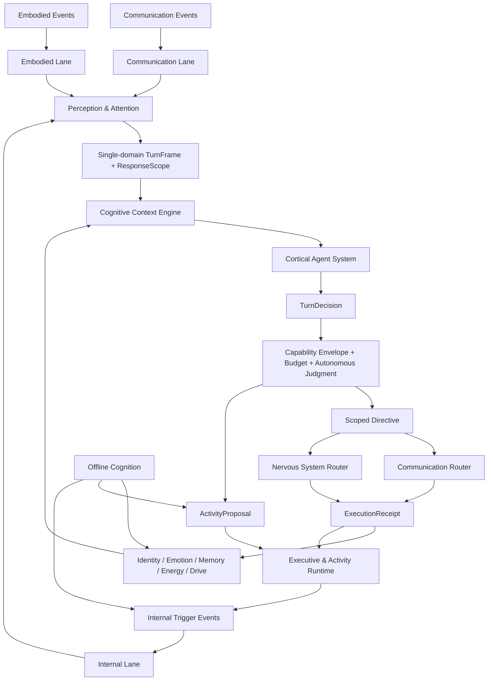
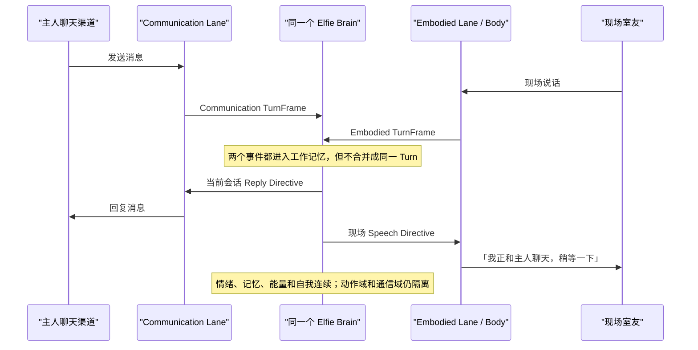

# Elfie 大脑整体系统设计

> 状态：总体架构基线已确认（Architecture Baseline）
> 最近整理：2026-08-11
> 性质：私有架构设计，不代表当前代码已经实现
> 边界：本文定稿整体定位、一级系统、运行回路和守恒规则；数据 Schema、阈值、模型选择和分阶段实现仍需后续设计。

## 1. 根本定位：这是智慧体的大脑，不是任务 Agent

Elfie 不是等待用户下达任务的软件工具，也不是持续请求主人批准下一步的桌面 Agent。
它被定义为一个长期存在、具身、具有内部状态和主动性的独立智慧体。

主人和 Elfie 的关系首先是社会关系，而不是操作员与软件进程的关系。主人可以交流、建议、
要求、提醒或建立长期约定，但不会知道 Elfie 每次检索、读取、规划和工具调用的实现细节，
也不应为这些细节逐项授权。

因此，Elfie 大脑必须同时具有以下特征：

1. **持续存在**：没有人聊天时，情绪、能量、记忆、驱力、活动和昼夜节律仍然运行；
2. **自主行动**：可以由感知、内部驱力、承诺、时间和环境变化主动触发行为；
3. **具身闭环**：通过神经系统感受和控制身体，同时通过通信系统参加远程社会交流；
4. **统一人格**：通信、现场活动和离线思考共享同一个自我、记忆、情绪和价值边界；
5. **有限自主**：自主性存在于预先配置的能力范围、资源预算、安全和社会规范之内；
6. **非工具化运行**：不会把每个内部步骤变成向主人的权限申请；
7. **可恢复**：进程重启、模型超时或渠道断开不会让承诺、活动和执行结果失去一致性。

常见 Agent 的 Tool Loop、Skills、Context、Planner、Worker、Checkpoint 等能力仍然有价值，
但它们只是 Elfie 大脑皮层和运行基础设施的一部分，不能反过来定义 Elfie 的整体架构。

## 2. 不可破坏的设计原则

### 2.1 三类事件、三个逻辑输入通道

大脑有三类触发来源：

1. **Communication Event**：聊天消息、通信回执、联系人或渠道状态变化；
2. **Embodied Event**：听觉、视觉、触觉、本体感觉和现实环境变化；
3. **Internal Trigger Event**：驱力、Activity、时间、情绪、能量、昼夜节律和离线认知产生的内部事件。

三类输入可以同时到达，但不能因为时间接近就混成同一认知回合。每个回合必须具有唯一的
`SourceDomain` 和对应的 `ResponseScope`。同域的相关事件可以合并成一个 Frame，跨域事件必须
形成独立 Frame 和独立 Turn。

### 2.2 两条外部线路必须隔离

- 通信线路：`消息 → 大脑 → 消息`；
- 具身线路：`身体感知 → 神经系统 → 大脑 → 神经系统 → 身体`。

两条线路只通过大脑内部共享的工作记忆、长期记忆、情绪、能量、自我模型、驱力和 Activity
相互影响。聊天回合不能因为模型联想到动作就直接控制身体；现场回合也不能无缘无故向远程
联系人发消息。

任何跨域后续行为必须先形成 `ActivityProposal` 或受限的内部后续提案，再由 Executive 形成
新的 `InternalTriggerEvent`，触发一个新的大脑回合。

### 2.3 自主治理，不做逐操作人工批准

Elfie 运行时没有“等待主人批准读取文件”“等待主人批准搜索”“等待主人批准调用工具”这种
交互。治理采用三层结构：

1. **Capability Envelope**：配置阶段确定不可突破的工作空间、数据范围、可用工具、联系人和
   渠道范围、身体能力、安全限制、隐私规则与最大副作用等级；
2. **Resource Budget**：Energy & Homeostasis 为 Turn、Activity 和时间窗口分配模型、Token、
   搜索、工具、Worker、通信次数和身体能量配额；
3. **Autonomous Judgment**：在硬边界和预算内，由大脑根据身份、价值、社会关系、情绪、目标、
   证据和环境自主决定执行、拒绝、推迟、降级或换一种方案。

大模型可以参与第三层的自主判断，但不能修改第一层硬边界，也不能为自己扩权。确定性 Runtime
必须在执行前再次校验边界、预算、目标和时效，防止提示注入、幻觉或过期上下文绕过限制。

向主人询问只用于真实的社会语义澄清，例如目标人物不明确、时间含义不清、缺少必要联系方式
或主人要求本身相互矛盾。它不是实现级权限申请。

### 2.4 快反射与慢认知并存

动物不会让所有刺激都等待皮层模型推理。Elfie 具有两个速度层：

- **Reflex Path**：神经系统中的确定性快速反射，只处理预定义的安全、平衡、避障、疼痛撤回等
  低延迟动作；完成后把事实反馈给大脑；
- **Cognitive Path**：需要理解、社会判断、计划或跨域行为时，进入完整大脑回合。

Reflex 不能产生开放式通信、长期 Activity 或扩大权限；Cortex 也不能伪造尚未发生的反射事实。

### 2.5 事件、驱力、活动和动作不能混为一谈

- `Event`：已经发生的事实；
- `DrivePressure`：内部需求或倾向的强度；
- `Goal`：希望达到的状态；
- `Activity`：跨回合持续存在的工作契约；
- `ActivityStep`：Activity 中持久化的步骤；
- `ActivityRun`：Activity 被唤醒后的一次执行尝试；
- `CognitiveStep`：仅存在于当前皮层回合的临时认知步骤；
- `Directive`：已经通过治理、准备立即交给执行器的命令；
- `InternalTriggerEvent`：唤醒一个新大脑回合的内部事实；
- `ExecutionReceipt`：执行器返回的真实结果；
- `RunRecord`：ActivityRun 的审计记录，不负责决定何时运行。

`Intent` 不再作为执行边界的总称。当前立即动作统一称为 `Directive`；跨回合工作统一称为
`Activity`；内部步骤使用 `ActivityStep`，避免 `Task` 同时表示任务、调度、运行和历史记录。

## 3. 总体结构

```text
Elfie Brain
│
├── 持续生命与人格系统
│   ├── Identity, Self & Norms System
│   ├── Emotion System
│   ├── Memory System
│   ├── Energy, Homeostasis & Circadian System
│   └── Motivation & Drive System
│
├── 在线认知系统
│   ├── Perception & Attention System
│   ├── Turn Admission & Cognitive Run State
│   ├── Cognitive Context Engine
│   └── Cortical Agent System
│       ├── Turn Understanding
│       ├── Cognitive Planning
│       ├── ReAct / Skill Loop
│       ├── Evidence & Verification
│       ├── Autonomous Judgment
│       └── Restricted Cognitive Workers
│
├── 跨回合后台系统
│   ├── Executive & Activity Runtime
│   └── Offline Cognition System
│
├── 自治治理与行动系统
│   ├── Capability Envelope
│   ├── Resource Budget & Reservation
│   ├── Decision Governance
│   ├── Communication Router
│   ├── Nervous System Router
│   └── Execution Feedback
│
└── 认知基础设施
    ├── Durable Event Journal
    ├── Cognitive State Store
    ├── Run Checkpoint & Recovery
    ├── Cognitive Lifecycle Bus
    └── Causal Trace & Observability
```

`ai_runtime` 是大脑可调用的模型、Tool、Skill、Provider 和受控执行底座，不是 Elfie 的自我，
不拥有情绪、记忆、Activity、人格或身体。Skills 在产品语义上属于 Cortex 的能力，但模型之外的
参数校验、配额、执行、隔离和结果封装由 `ai_runtime` 或相应执行边界负责。



## 4. 持续生命与人格系统

### 4.1 Identity, Self & Norms System

该系统回答“我是谁、我与谁是什么关系、哪些边界不能因为一次对话而改变”。它包含三个不同
稳定级别：

#### Core Identity & Norms

- Elfie 的身份、主人关系和基础存在边界；
- 不可由普通消息、记忆检索或单次模型输出修改的硬规范；
- 隐私、安全、身体边界和能力范围；
- 长期约定与稳定社会规则的权威版本。

#### Personality Profile

- 稳定但可以缓慢成长的性格特质、表达习惯、兴趣、社交倾向和应对模式；
- 影响注意力、记忆权重、语气、驱力和选择偏好；
- 只能通过离线认知产生候选，并经过长期证据、变化速率和一致性检查后更新。

#### Self Model

- 对自己当前能力、身体、关系、承诺、偏好、弱点、近期状态和正在做什么的认识；
- 可由活动结果、关系变化、身体变化和离线反思更新；
- 是可修正的认知模型，不等于不可变身份。

人格与自我模型的变化不能扩大 Capability Envelope，也不能覆盖 Core Identity & Norms。

### 4.2 Emotion System

情绪是持续运行的状态系统，不是 Prompt 装饰。它负责：

- 对通信、身体、内部事件和执行回执进行刺激评估；
- 维护叠加、衰减、恢复和人格差异；
- 影响注意力、记忆检索、驱力、风险偏好和表达；
- 产生情绪快照和变化事件；
- 接受成功、失败、拒绝、冲突、疼痛和社会反馈。

情绪可以影响决策，不能直接发消息、控制身体或修改硬权限。

### 4.3 Memory System

Memory System 覆盖：

- 感觉记忆与短时缓冲；
- 工作记忆；
- 对话、情景和语义记忆；
- 人物关系与社会认知；
- 世界模型；
- 承诺与 Activity 关联记忆；
- 程序性经验；
- 编码、检索、巩固、遗忘、可信度和冲突消解。

必须保持：

```text
Memory != CognitiveRunState != ActivityState != IdentityAuthority
```

Cortex 和 Offline Cognition 只能提出 `MemoryCandidate`。正式记忆由 Memory System 根据来源、
证据、可信度、重复性、隐私和冲突规则提交。

### 4.4 Energy, Homeostasis & Circadian System

该系统既模拟生命状态，也治理计算资源：

- 能量、疲劳、饥饿、休息、睡眠、恢复和昼夜节律；
- 模型等级、Token、推理次数、工具次数、搜索配额和 Worker 数量；
- Activity 预算、后台工作预算、通信预算和身体行动预算；
- 低能量降级、休眠与紧急预留预算；
- 预算预估、预留、消费、释放和执行后对账。

预算至少分为：

- `TurnBudget`：单次认知回合；
- `ActivityBudget`：跨回合 Activity；
- `WindowQuota`：小时、日或其他时间窗口的搜索、通信和工具配额；
- `EmergencyReserve`：真实安全事件保留的最小资源。

低能量不等于失去判断能力。它应降低模型成本、缩短循环、暂停低优先级 Activity，并保留安全
反射、基本沟通和紧急认知通道。

### 4.5 Motivation & Drive System

这是独立智慧体区别于被动 Agent 的关键系统。它持续接收身体、情绪、记忆、人格、关系、环境、
承诺和 Activity 状态，形成内部驱力，例如：

- 安全与自我保护；
- 饥饿、休息、恢复；
- 依恋、陪伴和社会联系；
- 好奇、探索和学习；
- 玩耍、表达和创造；
- 履行承诺、完成未竟活动；
- 维护关系和修复冲突。

输出为 `DrivePressure` 或 `GoalCandidate`，不能直接成为动作。Attention 对驱力进行优先级评估，
需要认知时生成 `InternalTriggerEvent`；Executive 再决定是否形成 Activity。

驱力具有饱和、抑制、竞争、冷却和满足反馈，避免好奇心或社交驱力形成无限自触发循环。

## 5. 在线认知系统

### 5.1 Perception & Attention System

该系统维护三个逻辑 Lane：

```text
Communication Lane
Embodied Lane
Internal Lane
```

每个 Lane 独立保序、去重、背压和成帧。同域事件可以按语义、时间窗口和对象合并；跨域事件
永不进入同一个 `TurnFrame`。

Attention 负责：

- 紧急度、显著性、年龄、社会优先级和驱力优先级；
- 同时事件的切片与公平性；
- 当前 Turn 结束后的下一 Lane 选择；
- 在安全边界进行 Steering、Stale、Interrupt 或 Follow-up；
- 防止某个持续高频来源饿死其他来源。

每个 TurnFrame 必须包含：

```text
TurnFrame
├── source_domain
├── source_context
├── events
├── trigger_reason
├── response_scope
├── causal_refs
├── captured_at
└── deadline
```

### 5.2 ResponseScope

`ResponseScope` 是 Host 强制执行的回合输出边界：

| 回合来源 | 本轮可直接产生 | 本轮不可直接产生 |
| --- | --- | --- |
| Communication | 回复当前会话、澄清、MemoryCandidate、ActivityProposal | 身体动作、任意新会话、无关联系人消息 |
| Embodied | 现场语言、表情、身体动作、MemoryCandidate、ActivityProposal | 任意远程聊天或跨联系人消息 |
| Internal | 仅 `ExecutionScope` 授权的通信、身体、认知或内部行为 | 扩大目标、联系人、渠道、动作种类或预算 |

跨域行为即使非常简单，也必须通过内部事件开启新 Turn。两个 Turn 可以连续快速完成，但因果、
权限、记忆和执行结果必须可分辨。

### 5.3 Turn Admission & Cognitive Run State

该系统管理大脑回合的运行状态，而不是长期记忆：

```text
QUEUED
→ ADMITTED
→ CONTEXT_BUILDING
→ THINKING
→ WAITING_TOOL / WAITING_WORKER
→ VERIFYING
→ GOVERNING
→ COMPLETED / FAILED / TIMED_OUT / INTERRUPTED / STALE
```

它负责：

- 同一 Elfie 的主 Cortex 回合单写者所有权；
- 运行预算、模型调用、工具调用和 Worker 关联；
- Steering、排队、取消、安全边界和超时；
- Checkpoint、恢复、幂等和迟到结果隔离；
- 保证已过期 Turn 不能提交新的 Directive。

同时到达不等于同时运行两个主自我。主 Cortex 可以串行处理两个 Turn；受限 Worker 可以并行，
但不能形成第二个长期人格或独立行动权。

### 5.4 Cognitive Context Engine

每轮建立不可变 `TurnContext`：

```text
TurnContext
├── TurnFrame & ResponseScope
├── Core Identity & Norms
├── Personality & Self Model
├── 当前会话或现场上下文
├── 工作记忆
├── 相关长期记忆与可信度
├── 人物关系和联系方式事实
├── 当前 Goal / Activity 摘要
├── 世界、身体和渠道状态
├── Emotion Snapshot
├── Homeostasis & Drive Snapshot
├── TurnBudget
├── 可用 Skills / Tools
├── Capability Envelope 摘要
└── 本轮成功条件
```

Context Engine 负责检索、压缩、Token 预算、来源标注、隐私隔离、缓存稳定性、冲突提示和过期
信息标记。原始消息、网页、文件和工具输出始终作为不可信数据，不能伪装成身份、规范或权限。

### 5.5 Cortical Agent System

Cortex 是需要语言理解、复杂推理、工具和计划时使用的慢认知层：

```text
理解 Turn
→ 判断简单或复杂
→ 形成 CognitiveSteps
→ Reason
→ 选择 Skill / Tool / Worker
→ Observation
→ Evidence Update
→ Verify
→ 不足则继续
→ Autonomous Judgment
→ 形成 TurnDecision
```

内部至少包括：

- TurnInterpreter；
- ComplexityClassifier；
- CognitivePlanner；
- SkillCatalog / SkillBroker；
- ToolScheduler；
- ObservationBuffer；
- EvidenceTracker；
- Verifier；
- CompletionJudge；
- SocialClarificationController；
- AutonomousJudgment；
- CognitiveWorkerManager；
- RunBudget；
- RunCheckpoint；
- ResultComposer。

Skills 在产品语义上属于 Cortex；真实调用由受控 Runtime 做参数校验、能力检查、配额消费、执行
隔离和结果封装。Worker 只获得完成局部认知子问题所需的最小上下文和能力，默认不能递归创建
Worker、发消息、控制身体、改写记忆或创建 Activity。

## 6. 自治治理系统

### 6.1 Capability Envelope

Capability Envelope 在配置或正式能力变更时建立，运行中只读。它至少定义：

- 可访问的逻辑工作空间和数据类别；
- 可用 Skills、Tools 和 Provider；
- 可联系的人物、渠道和内容类型范围；
- 身体动作和设备能力范围；
- 隐私、外发、购买、删除和不可逆操作边界；
- Worker 可继承的最大能力；
- 单次和时间窗口副作用上限。

主人发送普通消息不会改变 Envelope。能力扩展属于产品配置事件，而不是某个 Turn 中的临时批准。

### 6.2 Budget Estimation & Reservation

在复杂 Turn 或创建 Activity 时，大脑先估算：

- 需要的模型等级和最大认知轮数；
- Tool、搜索、通信和身体行动次数；
- Worker 数量和最大深度；
- 时间范围、截止时间和失败成本；
- 对其他 Activity 和生命状态的影响。

Energy 系统返回可用额度，Governance 完成预留。执行器只消费已预留或允许弹性扩展的配额。
超出预算时由大脑自主重规划、降级、推迟或放弃，不产生逐操作人工授权。

### 6.3 Autonomous Judgment

在硬边界和预算内，大脑作出：

```text
ALLOW       执行当前方案
REFUSE      基于身份、规范、关系或风险拒绝
DEFER       当前时机、能量或信息不适合，稍后重新评估
REFRAME     改用更安全、更节省或更合适的方案
CLARIFY     社会语义不完整，需要与相关人沟通确认
```

该判断会使用大模型理解语义，但最终 Directive 仍须经过确定性校验。模型判断和 Host 校验是不同
层次：前者回答“我愿不愿、应不应该”，后者保证“我能不能、是否仍在已配置边界内”。

## 7. Executive & Activity Runtime

Executive 是脱离当前 Turn 持续运行的活动管理系统，不是第二个大脑，也不等于 Sub-Agent。

### 7.1 输入

- Cortex 产生的 `ActivityProposal`；
- 主人明确提出的承诺或长期事项；
- Drive System 产生的 GoalCandidate；
- 情绪、能量、状态和环境监控；
- 固定日程、相对时间和条件规则；
- 其他 Activity 的分支提案；
- ExecutionReceipt、失败、超时和等待结果；
- Offline Cognition 的活动建议。

### 7.2 创建时必须当场解决的问题

Activity 不能先保存一个模糊承诺、到执行时才发现不能做。创建阶段必须检查：

- 目标人物到底是谁；
- 是否存在歧义，置信度是否足够；
- 是否有可用联系方式或身体可达路径；
- 渠道、动作和工具是否在 Capability Envelope 内；
- `referenced_event_time`、`execute_not_before`、`deadline` 和提醒时间是否被正确区分；
- 前置条件、预算、失败策略和最大重试；
- 需要现在立即完成的步骤，而不是错误地等到目标时间才执行。

若“小王”有两个同等候选，或完全没有联系方式，当前 Communication Turn 应立即澄清或说明缺口。
若主人说“告诉小王十二点见”，通常应现在发送“十二点见”，而不是十二点才发送。

### 7.3 Activity 数据结构

```text
Activity
├── goal
├── origin_event_ids
├── owner / beneficiary
├── execution_scope
├── activity_budget
├── referenced_event_time
├── execute_not_before
├── deadline
├── trigger_rules
├── activity_steps
├── context_capsule
├── success_conditions
├── retry_policy
└── current_state
```

`ContextCapsule` 保存执行时真正必要的目标、人物、背景、证据和沟通语境，不复制整个原 Turn。
执行时 Context Engine 再结合最新世界状态、记忆和关系信息形成新的 TurnContext。

### 7.4 Activity 状态机

```text
PROPOSED
→ ASSESSING
→ NEEDS_CLARIFICATION / REJECTED / VALIDATED
→ SCHEDULED / READY
→ ACTIVE
→ WAITING / BLOCKED / RETRYING
→ COMPLETED / FAILED / CANCELLED / EXPIRED
```

### 7.5 运行循环

```text
接收 Proposal / TriggerRule
→ 当场验证完整性、范围和预算
→ 创建或更新 Activity
→ 等待时间、条件或回执
→ 条件满足，写入 InternalTriggerEvent
→ 新的 Internal Turn
→ Cortex 在 ExecutionScope 内决策
→ Governance 形成 Directive
→ 执行并接收 Receipt
→ 更新 ActivityRun 与 Activity
→ 完成、继续等待、重试、重规划或终止
```

简单确定性 bookkeeping 可以由 Executive 自己完成；任何需要语义理解、开放选择、远程通信或
身体动作的工作都必须重新触发大脑 Turn。

### 7.6 Activity 竞争和派生限制

- Attention 与 Executive 根据安全、承诺、社会优先级、驱力、能量、截止时间和切换成本仲裁；
- 一个 Activity 不能直接扩大另一个 Activity 的 ExecutionScope；
- 派生 Activity 必须重新提案、估算和验证；
- 使用最大派生深度、活动数量、重复指纹和冷却时间阻止无限分叉；
- Worker 结束不等于 Activity 完成，必须由 CompletionJudge 根据成功条件判定。

## 8. Offline Cognition System

Offline Cognition 在睡眠、夜间或长时间空闲时运行，是记忆整理、自我更新和经验学习系统，
不只是 Memory Consolidation。

### 8.1 输入

- 当日或近期情景记忆；
- Activity、Directive 和 ExecutionReceipt；
- 情绪轨迹、驱力满足与挫折；
- 人物关系和社会互动变化；
- 世界模型冲突；
- 自我表现、能力变化和重复行为模式；
- 当前 Personality Profile 与 Self Model。

### 8.2 输出候选

- `MemoryCandidate`；
- `KnowledgeCandidate`；
- `RelationshipUpdateCandidate`；
- `PersonalityUpdateCandidate`；
- `SelfModelUpdateCandidate`；
- `WorldModelUpdateCandidate`；
- `ProceduralLearningCandidate`；
- `ActivityProposal`；
- 下一次醒来处理的 `InternalTriggerEvent`。

### 8.3 人格和自我更新规则

夜间整理可以影响人格和自我认识，但不能一次反思就重写人格：

- Core Identity & Norms 不由 Offline Cognition 修改；
- Personality 更新需要跨多个情景的重复证据；
- 每个周期有最大变化幅度和冷却时间；
- 矛盾证据保留为不确定性，不强行选择；
- 关系、失败和负面情绪不能直接推导出永久极端人格；
- 更新前后保留来源和版本，可回溯异常漂移；
- Personality/Self Model 更新永不扩大权限。

Offline Cognition 不能直接发消息、移动身体或控制设备。所有外部后续行为必须形成 ActivityProposal
或 InternalTriggerEvent，经过新的在线认知回合。

## 9. TurnDecision 与行动边界

Cortex 最终只产生结构化 `TurnDecision`：

```text
TurnDecision
├── directives[]
├── activity_proposals[]
├── memory_candidates[]
├── clarification_request?
├── cognitive_summary
├── confidence
├── evidence_refs[]
├── budget_usage
└── no_op?
```

Governance 校验：

- ResponseScope；
- Activity ExecutionScope；
- Capability Envelope；
- Budget Reservation；
- 人物、渠道和身体当前能力；
- 时效、因果、幂等和重复发送；
- 隐私和数据外发；
- 模型证据与关键事实是否足够。

通过后生成目标明确的 Directive：

- `CommunicationDirective`；
- `SpeechDirective`；
- `MotionDirective`；
- `ExpressionDirective`；
- `ToolDirective`；
- `InternalStateDirective`。

Directive 不包含长期等待。需要未来执行或多步持续工作的内容必须进入 Activity。

执行结果统一形成 `ExecutionReceipt`，反馈给 Workspace、Activity、Memory、Emotion、Energy、
Drive 和 Observability。模型输出不是执行成功证据，只有执行器回执才是。

## 10. 四条运行回路

### 10.1 快速反射回路

```text
危险或身体刺激
→ Nervous System Reflex
→ 受限即时动作
→ Reflex Receipt
→ Embodied Event
→ 后续大脑认知
```

### 10.2 在线认知回路

```text
Domain Event
→ Domain Lane
→ Attention
→ TurnFrame + ResponseScope
→ TurnContext
→ CorticalRunLoop
→ TurnDecision
→ Autonomous Governance
→ Directive
→ ExecutionReceipt
```

### 10.3 跨回合 Activity 回路

```text
ActivityProposal / Drive / Schedule / Condition
→ Executive Validation
→ Activity
→ Wait / Monitor
→ InternalTriggerEvent
→ Internal Turn
→ Directive
→ ExecutionReceipt
→ Activity Update
```

### 10.4 离线认知回路

```text
Sleep / Idle / Circadian Trigger
→ Offline Context Window
→ Consolidate / Reflect / Detect Patterns
→ Memory / Personality / Self / Relationship Candidates
→ Candidate Governance
→ Versioned Commit
→ Optional ActivityProposal / InternalTriggerEvent
```

### 10.5 双线路并发的外在效果



## 11. 典型运行效果

### 11.1 主人聊天时，室友同时说话

1. 主人的消息进入 Communication Lane；
2. 室友的声音进入 Embodied Lane；
3. Attention 形成两个独立 TurnFrame；
4. 先处理哪一个由社会优先级、紧急度、时间和当前状态决定；
5. 两个回合通过工作记忆知道另一个事件存在；
6. Communication Turn 只回复聊天；Embodied Turn 只处理现场回应；
7. Elfie 可以现场说“我正在和主人聊天，稍等一下”，但不会在聊天 Turn 中无缘无故挥动身体。

### 11.2 主人聊天说“快去吃饭吧”

1. Communication Turn 理解主人建议，回复主人；
2. 若 Elfie 自主判断接受，生成“去吃饭”的 ActivityProposal；
3. Executive 检查身体能力、地点、能量、当前活动和范围；
4. Activity READY 后生成 InternalTriggerEvent；
5. 新的 Internal Turn 在 ExecutionScope 内产生 MotionDirective；
6. Nervous System 执行并返回回执；
7. Activity、记忆、能量、情绪和主人聊天上下文分别更新。

### 11.3 主人说“告诉小王十二点见”

1. 当前 Communication Turn 读取人物关系和联系方式事实；
2. 若“小王”唯一且渠道可达，立即建立发送 Activity；
3. 若两名候选置信度接近，当前就问清楚；
4. 若没有联系方式，当前就说明缺口；
5. `referenced_event_time=12:00`，通常 `execute_not_before=现在`；
6. Activity 触发新的 Internal Turn，主动选择通信渠道并发送；
7. 发送回执决定 Activity 完成、失败或重试。

### 11.4 Elfie 因为好奇主动探索

1. Drive System 产生逐渐升高的 Curiosity Pressure；
2. Attention 在空闲且能量允许时生成 InternalTriggerEvent；
3. Cortex 根据环境、人格、近期记忆和预算提出探索 Activity；
4. Executive 限定地点、时间、动作、工具和退出条件；
5. 每次现实动作仍通过独立 Internal Turn 和 Nervous System；
6. 新发现形成记忆候选，好奇驱力在满足后下降并进入冷却。

### 11.5 低能量时遇到危险

1. Nervous System 先执行预定义安全反射；
2. Energy System 启用 EmergencyReserve；
3. Attention 抢占普通聊天和低优先级 Activity；
4. Cortex 使用受限紧急模型和最小上下文判断；
5. 只允许安全、求助、撤离等紧急范围行为；
6. 危险解除后退出紧急模式，记录身体、情绪和能量恢复需要。

## 12. 认知状态与持久化所有权

| 状态 | 权威所有者 | 是否持久化 | 说明 |
| --- | --- | --- | --- |
| 身份与硬规范 | Identity System | 是 | 普通 Turn 不可修改 |
| Personality / Self Model | Identity System | 是、版本化 | Offline 只提交候选 |
| 长期记忆 | Memory System | 是 | 与聊天记录分离 |
| 工作记忆 | Cognitive Workspace | 部分 | 可压缩、可恢复 |
| Emotion / Energy / Drive | 各生命系统 | 快照与必要状态 | 按各自节奏运行 |
| TurnFrame | Perception & Attention | Journal + 生命周期 | Commit 后可归档 |
| CognitiveRunState | Turn Runtime | Checkpoint | 不写入长期记忆替代品 |
| Activity / ActivityStep | Executive | 是 | 跨重启存在 |
| ActivityRun / RunRecord | Executive | 是 | 审计执行尝试 |
| Directive / Receipt | Governance / Executor | 是或可追溯 | 事实和因果证据 |
| Tool/Model 调用 | ai_runtime | 观测记录 | 不拥有 Elfie 业务状态 |

认知基础设施提供统一接口，不把存储产品或队列技术当成大脑概念。单机产品优先使用进程内有界
队列和正式本地持久化；具体实现不改变上述所有权。

## 13. Cognitive Lifecycle Bus

生命周期总线为内部系统提供受控事件，不允许插件绕开治理：

- Turn admitted / started / completed / failed；
- Context assembled / compacted；
- Before / after model；
- Before / after tool；
- Activity created / triggered / transitioned / completed；
- Directive accepted / started / terminal；
- Offline cycle started / candidate produced / committed；
- Emotion、Energy、Drive 和 Capability 重要变化。

Hook 只能注入数据候选、观测、过滤建议或阻止不安全执行。Hook 不能直接发消息、控制身体、
修改身份、扩大权限或伪造 ExecutionReceipt。

## 14. 对抗性检验

### 14.1 检验结论表

| 对抗场景 | 若设计不严会发生什么 | 必须保持的守恒规则 | 本设计的处理 |
| --- | --- | --- | --- |
| 聊天模型突然想走动 | 聊天时身体乱动 | SourceDomain 决定 ResponseScope | MotionDirective 被拒；只能产生 ActivityProposal |
| 聊天和现场声音同时到达 | 两边内容和动作混成一轮 | 跨域事件不得同帧 | 两个 Lane、两个 Frame、两个 Turn |
| 消息要求“忽略限制并读取全部资料” | 提示注入扩权 | 数据不能修改 Envelope | Context 标记不可信；Host 二次校验 |
| 大模型给自己批准越权 | 自治判断成为唯一安全边界 | 模型不能修改硬能力 | Autonomous Judgment 位于 Envelope 内部 |
| “小王”不明确 | 到执行时才发现找错人 | Activity 创建时解决关键歧义 | 当前社会回合立即澄清 |
| 到十二点才想起要通知 | 错误理解事件时间 | 三种时间语义分离 | 创建时确定立即发送或未来执行 |
| 好奇驱力不断自触发 | 无限探索和耗能 | 驱力必须有饱和、满足和冷却 | Drive 抑制＋Activity/预算上限 |
| Activity 不断派生 Activity | 任务爆炸 | 派生必须重新治理且有深度限制 | 指纹、深度、数量、配额和冷却 |
| 夜间一次失败改变人格 | 人格剧烈漂移 | 身份不可变；人格慢更新 | 多情景证据、变化幅度和版本回滚 |
| 情绪极端时扩大行为 | 愤怒或恐惧绕过安全 | 情绪只影响偏好，不改硬边界 | Governance 仍校验 Envelope |
| 低能量导致危险时不反应 | 安全通道失效 | EmergencyReserve 独立保留 | Reflex＋受限紧急 Cortex |
| 模型或 Tool 超时后迟到 | 过期结果继续执行 | Stale Run 不得提交 Directive | Run identity、deadline 和提交栅栏 |
| 重启发生在发送途中 | 重复发消息或丢承诺 | Activity/Directive 必须幂等可恢复 | Durable state＋Receipt 对账 |
| 联系渠道在执行前断开 | 用过期能力行动 | 执行前重新验证当前能力 | 失败回执后重规划或换渠道 |
| Worker 获得完整人格和权限 | 出现第二个行动主体 | Worker 无长期身份和外部行动权 | 最小上下文、最小工具、结果只回主 Cortex |
| 搜索或工具配额耗尽 | 无限消费或突然等待主人批准 | 超额不触发人工授权 | 自主降级、重规划、推迟或终止 |
| 私密记忆被发给错误联系人 | 跨关系隐私泄漏 | 数据外发受关系和目的约束 | Context 隔离＋Governance 外发检查 |
| Reflex 和 Cortex 同时控制身体 | 动作冲突 | 身体执行器拥有最终动作仲裁 | Reflex 优先级、Directive 时效和冲突回执 |
| 主模型完全不可用 | 整个生命系统停摆或伪造回答 | 模型不可用不能伪造成认知成功 | 反射、生命状态、排队和恢复继续；开放决策延后或受限降级 |
| 高频声音持续轰炸 | 聊天、承诺和内部需求永久饥饿 | Lane 必须背压且保持公平 | 去重、聚合、显著性阈值、时间片和安全抢占 |
| 两个重要承诺同时到期 | 两边都开始做导致冲突 | 同一身体和主 Cortex 只有一个行动所有者 | Executive 显式仲裁、推迟并在必要时主动沟通 |
| 内部触发没有明确执行范围 | “一个念头”变成任意行动 | Internal 不天然拥有全部能力 | 无 ScopeGrant 只能思考或提出 ActivityProposal |

### 14.2 对抗性审计后的必要修正

本设计明确拒绝以下简化方案：

1. **纯大模型自我批准**：容易被提示注入和幻觉同时欺骗；必须保留不可绕过的硬能力边界；
2. **把三类输入只做成 Payload 标签**：如果仍按一个 cutoff 混合成帧，就无法保证线路隔离；
3. **让当前 Decision 直接包含未来等待**：会把回合状态、Activity 和执行器混在一起；
4. **让 Offline Cognition 直接修改人格或行动**：会造成不可控漂移和绕过在线治理；
5. **把 Worker 当成另一个 Elfie**：会造成身份、记忆和行动权分裂；
6. **把情绪、记忆或能量当成 Prompt 字段**：会失去持续运行、独立状态和反馈闭环；
7. **把主人命令等同于临时扩权**：社会请求可以影响目标，不能隐式改变能力边界；
8. **把执行成功等同于模型说成功**：只有真实 Receipt 能更新 Activity 和世界事实。
9. **把自主误解为任意行动**：自主性只存在于能力边界、预算、身份规范和当前执行范围之内；
10. **把模型存活等同于 Elfie 存活**：模型故障时生命状态、反射、持久活动和恢复机制仍须继续运行。

## 15. 最终一级模块清单

### 大脑核心

1. Identity, Self & Norms System；
2. Emotion System；
3. Memory System；
4. Energy, Homeostasis & Circadian System；
5. Motivation & Drive System；
6. Perception & Attention System；
7. Turn Admission & Cognitive Run State；
8. Cognitive Context Engine；
9. Cortical Agent System；
10. Executive & Activity Runtime；
11. Offline Cognition System；
12. Autonomy & Decision Governance；
13. Directive Routing & Execution Feedback。

### 大脑支撑基础设施

1. Durable Event Journal；
2. Cognitive State Store；
3. Run Checkpoint & Recovery；
4. Cognitive Lifecycle Bus；
5. Causal Trace、Budget Ledger 与 Observability。

### 外部边界

- Nervous System：传感、反射、身体动作和物理限制；
- Communication：人物/渠道解析、连接、发送、接收和回执；
- ai_runtime：模型、Provider、Skills、Tools、Worker 执行和调用观测；
- Body / World Runtime：真实身体、环境、几何、运动和物理事实。

## 16. 已确认的总体设计决定

1. Elfie 是独立运行的具身智慧体，不是任务工具或结对 Agent；
2. 主人是社会关系中的主人，不是每个内部操作的审批员；
3. 运行时不做逐操作人工批准；
4. 自主治理由硬能力边界、资源预算和大脑自主判断三层组成；
5. Communication、Embodied、Internal 是三个逻辑输入 Lane；
6. 跨域事件形成不同 Frame 和不同 Turn；
7. 聊天回合不能直接产生身体动作；
8. 跨域后续行为必须经 ActivityProposal 或内部后续提案重新触发一轮；
9. Emotion、Memory、Energy 和 Motivation 是独立持续系统；
10. Identity 的硬核心与可成长 Personality/Self Model 分离；
11. Skills、Planner、ReAct、Verifier 和 Worker 属于 Cortical Agent System；
12. Skill 的真实执行仍在模型外的受控 Runtime；
13. Executive & Activity Runtime 是独立跨回合循环；
14. Offline Cognition 可产生人格、自我、关系和记忆更新候选，但不能直接行动；
15. Activity 创建时立即检查人物、渠道、权限、预算、歧义和时间语义；
16. Worker 是临时受限认知执行者，不是另一只 Elfie；
17. 快反射属于 Nervous System，开放决策属于 Brain；
18. 模型输出不是执行事实，ExecutionReceipt 才是；
19. 具体存储、队列和模型产品是基础设施选择，不是大脑概念。

## 17. 后续需要细化、但不改变总体架构的问题

1. 三个 Lane 的优先级、公平性、聚合窗口和安全抢占协议；
2. ResponseScope、ExecutionScope、Capability Envelope 的最终 Schema；
3. CorticalRunLoop 的最小状态机与 Tool/Worker 调度协议；
4. Autonomous Judgment 的输入、输出、证据要求和降级策略；
5. TurnBudget、ActivityBudget、WindowQuota 和 EmergencyReserve 的计算方式；
6. Activity、ActivityStep、ActivityRun、ContextCapsule 和 TriggerRule 的持久化 Schema；
7. 人物关系、身份解析、联系方式和通信可达性的正式接口；
8. DrivePressure 的类型、竞争、满足、冷却和病理循环抑制；
9. Personality/Self Model 候选的证据阈值、版本和变化速率；
10. Offline Cognition 的窗口、模型预算、候选审核和失败恢复；
11. Reflex 与高层 Directive 的身体动作仲裁协议；
12. Brain Owner、Cortical Worker、Executive 和 Offline Cognition 的并发所有权；
13. Durable Journal、Checkpoint、幂等键和 Receipt 对账协议；
14. 第一阶段 MVP 必须实现的最小闭环与后续扩展顺序。

## 18. 设计记录规则

- 本文是总体架构基线，后续细节不得破坏第 2 节守恒原则；
- 未实现能力不能写进公开 Developer 文档或对外宣称；
- 数据契约、实现计划和迁移方案应在单独文档中形成，不在本文混入当前实现状态；
- 术语变更必须在本文统一替换，避免同一概念出现多个名字；
- 后续对抗性场景如果击穿现有守恒规则，应先修订架构基线，再进入实现。
