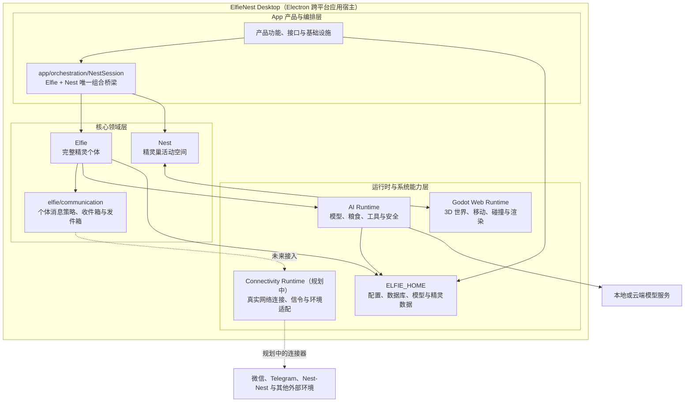

# ElfieNest

ElfieNest 是一个桌面端具身 AI 精灵系统。它将完整精灵个体、精灵巢活动空间、AI 推理运行时、用户产品功能、Godot 3D 世界和 Electron 桌面宿主拆成独立模块，并通过明确的依赖方向组合运行。

## 整体架构



Electron 是应用宿主和进程监督者，不承载精灵、Nest 或账户业务规则。App 通过
`NestSession` 组合真实精灵与活动空间；Elfie 使用 AI Runtime 完成推理，Nest 与
Godot Runtime 交换世界事件。`elfie/communication` 已提供精灵自身的消息语义，
未来的 Connectivity Runtime 只负责真实网络连接、协议适配和跨环境传输。

图中展示的是职责与组合关系，不代表所有模块运行在同一进程：App、Elfie、Nest
和 AI Runtime 属于 Python Core；Godot Web Runtime 运行在独立隐藏窗口中；模型
服务和外部通信环境位于 Desktop 应用边界之外。

## 快速开始

项目固定使用 CPython `3.9.25`：

```bash
./install.sh
elfienest version
.venv/bin/python main.py
```

没有可用的 Ollama 服务时，基础仿真可以降级运行；完整本地模型能力需要安装或由桌面发行包提供 Ollama runner，并下载相应模型。

## 根目录

```text
ElfieNest/
├── elfie/             # 一个完整精灵个体：大脑、身体、感知和执行器
├── nest/              # 一个完整精灵巢：状态、环境驱动、互动和 Godot 会话
├── ai_runtime/        # AI 模型、粮食策略、工具、安全和运行时实验台
├── app/               # 账户、领养、聊天、管理、接口、持久化和跨模块编排
├── desktop/           # Electron 窗口、进程监督、平台适配和打包配置
├── godot/             # 独立 Godot 4.6 源项目，不是运行时产物目录
├── devtools/          # Elfie、Nest、AI Runtime 的隔离开发实验台
├── docs/              # 产品、架构、开发和运行文档
├── scripts/           # 启动、构建、检查、迁移和发布脚本
├── test/              # 与源码模块镜像的测试，以及产品 E2E
├── build/             # 中间构建产物，Git 忽略
└── dist/              # DMG、EXE、AppImage 等最终发布物，Git 忽略
```

## 核心边界

### `elfie/`

定义一个完整 `ElfieIndividual`。情绪、能量、记忆、认知、身体限制、感知和动作能力都属于精灵自身；它不负责账户、房间渲染或桌面生命周期。

### `nest/`

定义唯一活动空间。`nest/nest.py` 是 App 的公开入口；`state/` 只保存精灵 ID、家具和巢内状态，`engine/` 推进环境时钟，`interaction/` 传播广播、用户消息和触觉事件，`godot/` 维护 Python 侧 Godot 协议。

Nest 不创建、不持有 `ElfieIndividual`，也不复制 Godot 房屋蓝图。房间几何、真实坐标、移动、碰撞和渲染以 `godot/` 项目为准。

### `app/`

```text
app/
├── features/          # accounts、adoption、chat、Nest 管理、配置和 Setup
├── orchestration/     # NestSession、ElfieNestEngine、启动和事件路由
├── interfaces/        # FastAPI、Web、CLI/TUI
├── infrastructure/    # persistence、filesystem、device_identity
└── bootstrap/         # 组合根，只创建和注入具体对象
```

`app/orchestration/NestSession` 同时持有一个 `Nest` 和多个真实精灵实例，是精灵进入 Nest、接收刺激并把决策应用回环境的唯一组合位置。

### `desktop/`

Electron 是安装后唯一桌面宿主，负责窗口和 Python Core、Ollama、隐藏 Godot Web Runtime 的生命周期。账户、聊天、领养和 Nest 规则不得进入 Desktop。

## 依赖方向

```text
Desktop
  -> app/bootstrap
  -> app/interfaces
  -> app/features + app/orchestration
  -> elfie + nest + ai_runtime
  -> app/infrastructure

nest/godot <-> 已导出的 Godot Web Runtime
```

底层模块不得反向导入 App。`app/bootstrap` 只装配依赖，不承载业务规则。

## Godot 与构建产物

`godot/` 是用 Godot 4.6 打开的源项目。开发者修改场景后使用统一脚本导出：

```bash
./elfienest.sh build-godot-web
./elfienest.sh build-godot-web --check
```

标准输出位置：

```text
build/components/godot-web/
build/components/desktop/
build/components/python-core/<platform-arch>/
build/staging/<platform-arch>/resources/
build/manifests/
build/stamps/
dist/
```

`build/components/` 保存各组件中间产物；`build/staging/<platform-arch>/resources/`
保存当前目标平台的打包资源；`build/manifests/` 保存版本、大小和 SHA-256 清单；
`build/stamps/` 保存输入指纹，用来控制增量构建。最终用户不需要安装 Godot Editor。
打包阶段从 `build/staging/<platform-arch>/resources/` 收集 Godot Web、Python Core 和
Ollama runner，模型在首启或按需下载。

## 用户数据

生产数据不放在仓库源码目录，统一位于 `ELFIE_HOME`；默认目标是 `~/.elfienest/`：

```text
~/.elfienest/
├── config.yaml
├── .env
├── nest.db
├── foods.yaml
├── elfies/
└── models/
```

`devtools/` 和测试必须使用隔离的 `ELFIE_HOME`、端口和数据库。仓库根目录不再保留
`data/`；历史本地数据已迁出/清理，后续代码不得把生产或测试数据写回仓库源码目录。

## 测试

```bash
uv sync --locked --extra dev
UV_CACHE_DIR=/tmp/elfienest-uv-cache uv run --no-sync pytest test/

cd desktop
pnpm test
pnpm exec tsc --noEmit
```

测试路径镜像源码，例如 `test/elfie/`、`test/nest/`、`test/ai_runtime/` 和 `test/app/`。`test/architecture/` 会阻止旧 `elfienest/`、`runtime/` 包名或错误二级目录重新进入项目。

## 后续开发约束

- 新的产品功能进入 `app/features/`，跨模块组合进入 `app/orchestration/`。
- 新的巢内状态、规则或互动进入 `nest/`，3D 几何和碰撞进入 `godot/`。
- 新的模型、推理、工具和粮食能力进入 `ai_runtime/`。
- Web、API、CLI 只作为入站接口，不直接实现跨模块业务流程。
- 构建产物只能进入 `build/` 或 `dist/`，用户数据只能进入 `ELFIE_HOME`。
- `connectivity/`、Nest-Nest 网络和移动聊天 App 尚未进入当前仓库范围。

更完整的目录职责与依赖规范见 [`docs/design/ElfieNest目录架构.md`](docs/design/ElfieNest目录架构.md)。
