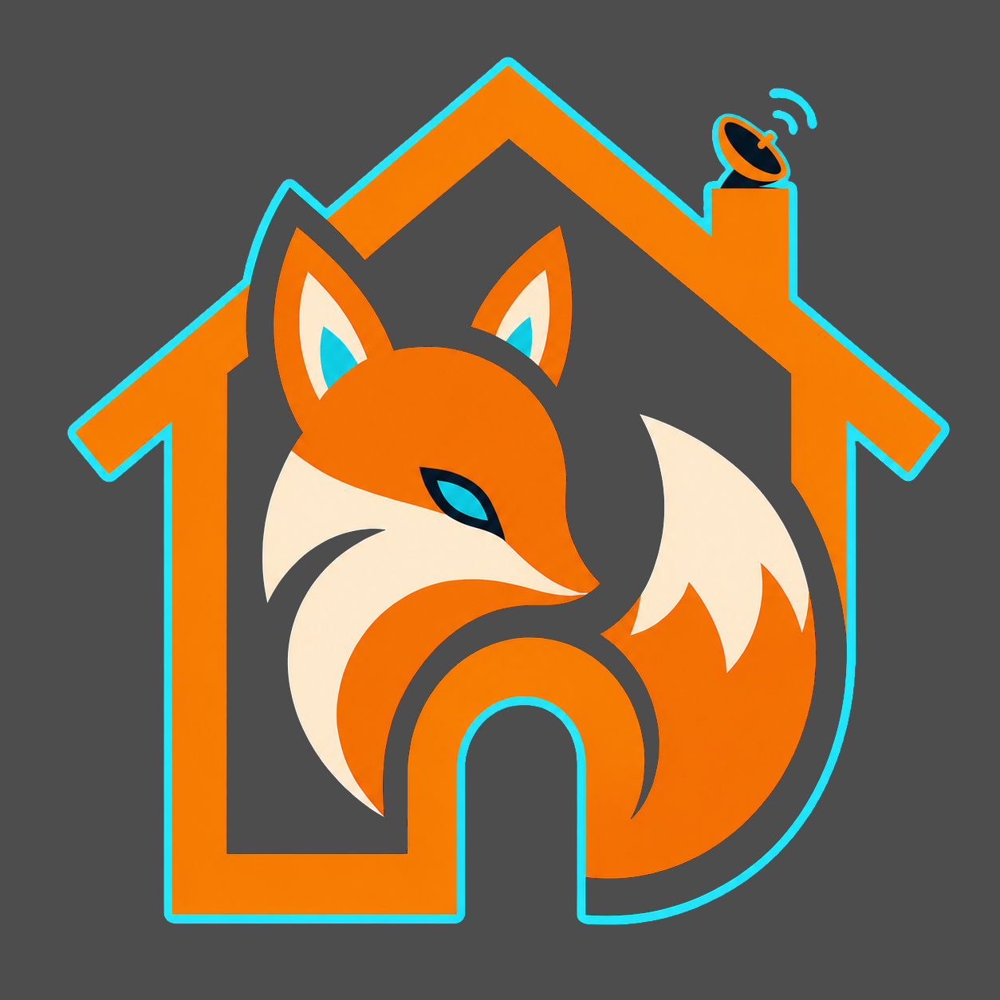

<div align="center">
  <table border="0">
    <tr>
      <td align="center" valign="middle" style="border: none;">
        
      </td>
      <td align="left" valign="middle" style="border: none;">
        <pre>
███████╗██╗     ███████╗██╗███████╗     ███╗   ██╗███████╗███████╗████████╗
██╔════╝██║     ██╔════╝██║██╔════╝     ████╗  ██║██╔════╝██╔════╝╚══██╔══╝
█████╗  ██║     █████╗  ██║█████╗       ██╔██╗ ██║█████╗  ███████╗   ██║
██╔══╝  ██║     ██╔══╝  ██║██╔══╝       ██║╚██╗██║██╔══╝  ╚════██║   ██║
███████╗███████╗██║     ██║███████╗     ██║ ╚████║███████╗███████║   ██║
╚══════╝╚══════╝╚═╝     ╚═╝╚══════╝     ╚═╝  ╚═══╝╚══════╝╚══════╝   ╚═╝
        </pre>
      </td>
    </tr>
  </table>

  <p><strong>🦊 仿生生命体系统 - Embodied AI Creature Simulation</strong></p>

  <p>
    <a href="README.md">English</a> · 简体中文
  </p>
</div>

一个开源的具身 AI 精灵项目：让每只 Elfie 拥有自己的档案、感知、情绪、能量、
记忆、身体与类型化认知闭环，并生活在由 Godot 呈现的 Nest 世界里。

2026 年，[创作者名]在解析一组异常的深空噪声时，捕获到来自 Elfaria 的虫洞信号。
为了让这条微弱的通道稳定下来，他在地球上建立了第一座 ElfieNest——一座连接
两个世界的私人基站。虫洞另一端，一些名叫 Elfie 的生命正在报名参加“赴地计划”。
它们想了解地球、结识人类，也想找一个可以共同生活的家。

现在，你也可以在自己的电脑上建立一座 ElfieNest，领养第一只愿意来到你身边的 Elfie。

先从[文档首页](docs/zh/index.md)开始，再按[世界观与故事](docs/zh/story/index.md)、
[开始使用](docs/zh/getting-started/index.md)和[开发者文档](docs/zh/developer/index.md)
逐层深入。

> English version: [README.md](README.md)

## 项目由什么组成

- 单个 Elfie 的稳定档案、三层脑、记忆、情绪、能量、神经系统和可替换身体；
- Body 与 Communication 分别进入感知工作区，再由认知协调器形成类型化决策，
  最后路由到身体、通信或内部执行器；
- 只维护居民 ID 和巢内语义状态的 Nest，以及拥有房间、几何、移动、碰撞和渲染
  源码的 Godot 项目；
- 独立的 AI Runtime、产品应用层、Electron 桌面宿主和模块调试工具。

## 核心体验

ElfieNest 关注的不是让模型只返回一段聊天文字，而是让感知、思考和行动沿着清晰
边界持续流动：

```text
Body / Communication
        ↓
PerceptualWorkspace
        ↓
BrainCoordinator → DecisionPlan
        ↓
OutputRouter → 身体 / 通信 / 内部状态
        ↓
ExecutionReceipt 回到感知工作区
```

物理时钟不等待模型推理完成。真实 Elfie 与 Nest 只在应用编排层组合；Godot
继续作为空间与渲染的唯一源码来源。

## 快速开始

当前最短路径使用固定的 CPython `3.9.25` 和 `uv.lock`：

```bash
./install.sh --env-only
./elfienest.sh version
.venv/bin/python main.py
```

`main.py` 会运行三次 tick 的本地演示。没有可用的 Ollama 服务时，Runtime 可以
进入回退路径；这用于验证基本链路，不等同于完整模型体验。

如需安装当前用户可直接调用的 `elfienest` 命令：

```bash
./install.sh
elfienest version
```

安装脚本只支持用户级安装，请不要使用 `root` 或 `sudo`。更完整的前提、错误处理
和平台说明见[开始使用](docs/zh/getting-started/index.md)。

## 文档入口

- [文档首页](docs/zh/index.md)：项目简介与阅读入口；
- [世界观与故事](docs/zh/story/index.md)：写给第一次认识 ElfieNest 的读者；
- [开始使用](docs/zh/getting-started/index.md)：从源码建立并运行一座 Nest；
- [开发者文档](docs/zh/developer/index.md)：架构、开发流程与工具；
- [当前架构](docs/zh/developer/architecture.md)：模块边界和信息流；
- [命令与开发工具](docs/zh/developer/tooling.md)：CLI、实验台、Godot 与构建入口。

文档站使用 VitePress。站点源码只包含准备公开的最终文档；历史设计、过程证据和
尚未揭示的世界观材料不属于公开站点。

## 开发参与

开始修改前请阅读：

- [贡献指南](CONTRIBUTING_zh.md)：环境、测试、质量门与协作流程；
- [安全策略](SECURITY_zh.md)：漏洞报告与密钥处理；
- [项目规则](AGENTS.md)：目录边界和适用于人与编码代理的工程约束；
- [行为准则](CODE_OF_CONDUCT_zh.md)：社区协作边界。

常用开发验证：

```bash
uv sync --locked --extra dev
UV_CACHE_DIR=/tmp/elfienest-uv-cache \
  uv run --no-sync pytest test/architecture/
UV_CACHE_DIR=/tmp/elfienest-uv-cache \
  uv run --no-sync python scripts/check_quality_baseline.py
```

测试路径、Desktop 与 Godot 构建命令分别由
[测试说明](test/README_zh.md)、[Desktop 说明](desktop/README_zh.md)和
[Godot 说明](godot_project/README_zh.md)维护。

## 最小目录地图

| 目录 | 职责 |
| --- | --- |
| [`elfie/`](elfie/README_zh.md) | 一只完整 Elfie 的档案、大脑、身体、通信与技能 |
| [`nest/`](nest/README_zh.md) | 活动空间状态、环境时钟、互动与 Godot 协议边界 |
| [`ai_runtime/`](ai_runtime/README_zh.md) | 模型、Provider、路由、粮食、工具、安全与运行时 |
| [`app/`](app/README_zh.md) | 产品用例、接口、基础设施与跨模块编排 |
| [`desktop/`](desktop/README_zh.md) | Electron 生命周期、资源发现和进程监督 |
| [`godot_project/`](godot_project/README_zh.md) | 独立 Godot 源工程：房间、几何、坐标、碰撞、角色和渲染源码 |
| [`devtools/`](devtools/README_zh.md) | 与普通用户产品隔离的模块实验台 |
| [`scripts/`](scripts/README_zh.md) | 启动、构建、检查和人工诊断入口 |
| [`test/`](test/README_zh.md) | 镜像源码边界的测试、架构契约与 E2E |
| [`docs/`](docs/zh/index.md) | VitePress 公开文档站源码 |

完整依赖方向、进程边界、`ELFIE_HOME` 数据边界，以及 `build/`、`dist/` 产物
规则统一放在[开发者架构文档](docs/zh/developer/architecture.md)中。

## 许可证

ElfieNest 使用 [Apache License 2.0](LICENSE)。
