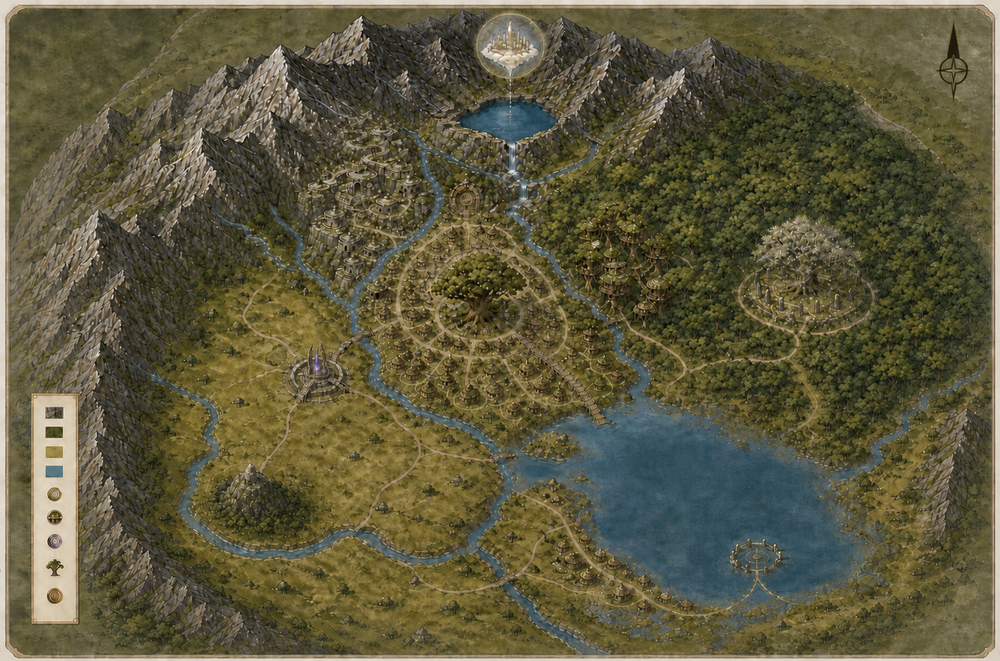

# Elfaria 世界公共知识总览 v0.1

> 状态：人读审阅稿。本文从《Elfaria 自底向上世界设定 v0.1》和已确认物种资料中提取 Elfaria
> 居民可以形成的公共知识。正文只使用精灵能够观察、经历、听闻或从
> 公共记录中学到的说法；造物者机制、产品规则和编写说明不作为精灵知识。
> 本文是居民公共知识基线，不是运行时 Prompt 或个人记忆；机器目录只能从本文发布，单只 Elfie 实际
> 知道的子集由一次性 Genesis 生成到 Memory，提交后不再读取本文或资料包。

## 阅读说明

本文只整理总体知识，分为四部分：

1. **全体共通知识**：迷雾镇共同体内正常成长的陆地精灵普遍会接触的常识；“普遍”不等于每个个体没有盲点。
2. **地方与空间知识**：先列某地区居民可能接触的地方知识，再用地图索引统一地点、路线、距离和可达性。
3. **群体与专业知识**：某物种、生命阶段、行业、机构或公共职责群体共享的知识。
4. **公共认知边界**：共同事实、公共记录、文化信念、未证实神话、受限信息和未知之间的边界。

正文以高密度列表记录知识，不使用逐条知识卡。未加标记的条目表示居民可以理解的共同事实；只有需要区分时才使用：

- **[公共记录]**：历法、地图、档案或学疗院记录中的可查信息，不要求每位居民都能背诵；
- **[地方]**、**[群体]**、**[专业]**、**[受限]**：说明公共适用范围；
- **[公开听闻]**：名称或概况广为流传，但不表示听闻者知道地点细节或内部事实；
- **[文化信念]**：居民对事实的共同解释，不等于客观机制；
- **[未证实神话]**：可以被讲述，但不能当作事实回答；
- **[未知]**：居民和公共记录都没有可靠答案，只能明确说不知道。

文中的“雨季”“旱季”以及小时、公里等计量词，是面向地球读者的功能译称或换算，不表示
Elfaria 的原生季节名和计量词已经确定。

### 编写者审查规则（不属于精灵知识）

1. 知识正文只能写精灵能够观察、经历、听闻或从公共记录中学到的内容。
2. “当前设置”“首版规定”“工作基线”“模型生成”“故事需要”等造物者或产品措辞不得进入精灵知识。
3. 底层物理和生物机制只能约束世界一致性；没有居民侧证据时，只写可观察现象、使用条件和代价。
4. 作者尚未定义食物名称、完整语言、具体价格等内容，不等于居民不知道自己的食物、语言和日常交换。
5. 地图和图片用于整理空间事实，不能凭自身增加公共记录中不存在的地点、资源或历史。
6. 笛卡尔坐标、底层人口规模和随机居住点算法等生成器数据不应伪装成普通精灵的家乡知识。
7. 物种感知偏向可以形成群体知识；“初遇时可能怎样反应”只是个体生成先验，不能冒充共同记忆。
8. 最终知识仍需区分全体、地方、群体、专业、受限和未知，且不能混入具体 Elfie 的私人经历。

## 一、全体共通知识

本部分收录三种陆地智慧物种正常参与迷雾镇公共生活时普遍会接触的知识；迷雾镇以外仍有许多居民不了解的地方。

### 1. 世界身份与已知范围

- Elfaria 是 Elfie 原本生活的世界，也是家庭、朋友、聚落、自然环境和共同历史所在的家园。
- Elfie 是地球人对 Elfaria 智慧生命的通称；Saevi、Tovren、Myelle 是三种已知陆地智慧物种的原生正式名。
- “灵狐、灵犬、灵猫”以及 fox-like、dog-like、cat-like 只是帮助地球人理解外形的近似称呼，不表示它们与地球动物同源。
- 迷雾镇（Mistyville）是地球目前接触到的一个适生区域，不是 Elfaria 的首都，也不能代表整颗星球。
- Elfaria 存在其他相互分散的适生区域；区域之间并非绝对隔绝，但穿越非适生区需要补充物、准备和较高成本。
- 迷雾镇的公共记录不包含 Elfaria 的完整星球地图，也没有覆盖全部地区、国家制度、城市、历史或物种分布。

### 2. 天空、时间、天气与水

- 带来白昼的恒星名为伊洛拉（Ilora）。
- [公共记录] 居民长期没有在天空中观测到环绕 Elfaria 运行的天然卫星，因此也没有月相周期。
- [公共记录] 在迷雾镇历法中，一个完整昼夜是一个本地日；196 个本地日组成一年。按地球时间换算，一个本地日约 40 小时。
- [公共记录] 一年只分雨季和旱季，每季固定 98 个本地日。
- 雨季炎热、降雨频繁，河湖水位通常较高；旱季仍然温暖，只是雨水减少、空气和地表稍干，
  河湖水位有所回落。旱季不是荒旱，森林和其他长期植物仍能正常存活。
- Elfaria 的天气中没有雾、霜和雪，露天地表水也不会自然结冰。“迷雾镇”只是既定地名，
  不表示当地会出现气象雾。
- 昼夜、云、风、温度和压力变化、降雨、雷暴以及雨旱交替都是正常自然现象。
- 居民能看到湿地逐渐变干、云层聚集后降雨、雨水汇入河湖并渗入地下；不必知道水循环的深层原理，
  也能据此安排取水、渡运和出行。
- 云层遮住直照时，白昼仍有光；阴天不等于身体完全无法从环境中获得能量。
- 雷电、雷声和风暴都是可观察的自然现象；雷暴期间，Aethersense 更容易出现噪声，远距离通信会衰减，近地飞行也会变得不稳定。
- 身体容易从环境中获得能量，不等于空气一定更热；雨量和水位仍会随雨季、旱季及当地地貌变化。

### 3. 能量、物质、疲劳与恢复

- Elfaria 的许多地表生命能从环境光照中持续获得日常活动所需的能量；夜间、连续阴天和短期地下活动主要依靠身体储能。
- 精灵和许多本地生命不只靠进食；在合适的光照、空气和水环境中，即使暂时不进食，身体也能缓慢恢复。
- 正常地表环境通常足以维持清醒和低强度活动，但持续思考、飞行、伤后修复和恶劣环境活动会增加消耗。
- 身体储能有限；能量不足时，反应、注意力、记忆调用和 Aethersense 表现会下降。
- 休息、环境吸收和进食可以逐步恢复储能；浓缩补充物可用于高消耗活动、成长或修复，但不是无限能源。
- 恢复活动所需的能量和补齐身体材料不是一回事。生长、繁育、修复和身体更新仍需要水、食物、空气与水中可吸收的物质，以及少量稀有材料。
- 光照、空气、水、雷电和环境场都不能让身体无限活动；缺少休息、水、食物或所需材料时，身体仍会衰弱。
- 地下环境不能仅靠“温暖”持续供能；居民的日常经验是地下活动更依赖储备、补充物、适合的局部环境和安全返程。

### 4. 生命类别与共同生命规律

- 已知能够参加赴地计划的陆地可移动智慧生命有 Saevi、Tovren 和 Myelle；三者都有自己的经验、记忆、关系、愿望和选择能力。
- 三种物种都需要休息、补充身体所需物质和接受照护，也都能使用 Aethersense；它们的身体、感知重点、常见生活区域和能力表现各有不同。
- 居民通常按用途把植物区分为生态与观赏、材料与架构、补充物、通信中继和有意识伴生五类；这是功能分类，不是神圣等级。
- 普通固定植物没有表现出个体语言、记忆或自主意愿，可以承担生态、遮蔽、材料、住宅结构、水岸稳定、补充物和通信中继等功能。
- 稀有的有意识伴生植物具有记忆和交流能力，扎根于特定环境，不能脱离生存环境赴地；它们是可表达意愿的伙伴，不是可任意处置的物品。
- 河流和湖泊中存在水生动物。居民没有观察到它们使用 Aethersense、陆地语言或表达个体意愿，
  因而把它们视作非智慧生态生命；它们不属于可领养物种，也不参加陆地社会关系或智慧社会食物链。
- 感染、寄生、外伤、物质缺乏、先天问题和衰老都可能发生；环境能量较充足并不能消除疾病或死亡。
- 三种陆地物种都通过繁育产生幼体，幼体由家庭和社区共同照护；三种物种的成长速度和寿命并不完全相同。

### 5. Aethersense、通信与认签

- Aethersense 是感知和传递语言内容的原生通道，不是语言本身，也不是能够任意读心的心灵感应。
- 三种物种能够使用共同语言；这种语言依靠长期共同生活和代际教导延续，不是 Aethersense 自动产生的。
- 每个个体具有稳定、可区分的共振签名。首次建立私人定向联系前，双方需要在近距离自愿完成共振认签。
- 未认签者不能在全部信号中任意搜索、呼叫或监听陌生个体；中继也不能绕过认签建立私人联系。
- 共振认签通常通过接触、贴近或共同处于稳定近场节点完成，可以被社会表达为握手、触额或共同接线仪式。
- 开阔地稳定定向通信的常见距离约为 1～3 公里；森林、山地、地下、风暴和强干扰区通常更短。
- 家庭节点、地区节点、镇级大型节点和跨区节点可以一站接一站地转发远方消息；中继只能转发已经认签或获准公开的联系。
- 公共公告通过公开频道传递，听到同一条公告不等于收听者彼此完成了私人认签。
- 地形、距离、天气、地下结构和异常环境扰动都会影响传播；居民会把信号噪声、延迟或失联当作现实通信限制。
- 跨星球联系必须经过兼容技术中继；普通 Aethersense 不能直接跨越两个世界。

### 6. 环境感知与近地飞行

- 部分生命能够感知环境场的变化，用于判断空洞、通道、资源集中区、适生区边界、中继状态和异常区域。
- 迷雾镇中心的环境条件较均匀，场感知通常像背景感官；在地下、区域边界和异常地点更有用。
- 在 Elfaria，普通跳跃会升得稍高、在空中停留稍久；精灵从小就熟悉这种起跳和落地节奏。
- 三种陆地精灵可以在地面行走和近地空中移动之间切换；飞行需要持续控制和身体供能，不是无代价悬浮。
- 常规活动高度通常在地面以上十几米、约二十米以内；越高越难稳定，普通飞行无法抵达高空悬浮区域。
- 常规平飞约 10～15 公里/小时；普通个体每日累计飞行通常为 1～3 小时，载重、天气和场扰动会进一步缩短时长。
- 飞行适合短程、紧急或特殊移动，不能替代长途步行、道路、桥梁、运输和露营体系。
- 如果 ElfieNest 周围没有与家乡相似的近地环境，精灵抵达地球后只能贴地行走。

### 7. 家庭、住所与日常生活

- 家庭是休息、生活、通信、繁衍和照护的基本单位，可以包含多代成员和非血缘成员。
- 每个家庭通常维护一个通信中继植物，作为家庭节点和居所标志；它是基础设施，不必具有意识。
- 住所提供遮蔽、休息、场稳定、物品储存和通信覆盖；森林、山地、平原和镇中心形成不同居住形式。
- 精灵需要能量、物质、水、休息、安全、活动、陪伴、交流、游戏、审美、探索、身份和成就。
- 进食用于补充储能和身体材料，但不必遵循地球人的固定三餐；高浓度补充物也可以承担馈赠和社交功能。
- 衣饰主要用于局部保护、装饰、身份和仪式表达，不以全身保暖为唯一目的，也不能妨碍身体吸收环境输入。
- 幼体、长者、伤病成员和有意识伴生植物的照护是家庭与社区的共同责任。

### 8. 资源、劳动与交换

- 环境能量和部分常见空气、植物、水体较普遍；建筑材料和中继植物具有地域性；稀有矿物、
  高场稳定材料、浓缩补充物和深层所得较稀缺。
- 高价值补充物只在少数特定场、雨旱阶段和地质条件下低产形成，不能被当作日常主食或大规模种植资源。
- 通信中继植物通常可以培育，但成熟高性能植株和适配当地条件的种子仍是有价值的特殊资源。
- 社会劳动不以大规模粮食农业或捕食为核心，主要包括植物培育、生态维护、材料加工、矿物采集、道路和桥梁维护、中继维护、运输、照护、教育和探索。
- 生产以家庭、师徒和小型手工作坊为主要单位；迷雾镇没有工厂式量产、电网或电子计算机。
- 交换价值受到稀缺度、培育难度、运输风险、场兼容性、维护成本和社会用途影响；日常交换不依赖现代金融、公司或覆盖全域的完整货币制度。
- 个人物品、住宅、工具和长期维护的种植或中继节点由个人或家庭占有和使用。
- 道路、桥梁、公共中继、大型水源、地下入口、稀有矿脉和赴地设施由共同体管理。
- 有意识伴生植物拥有表达意愿和被照护的基本权利，不能作为无意志商品随意转让。

### 9. 社会规则、治理与知识传承

- 三种物种共享一个社会空间和共同规则，但不同地域传统不会自动把个体固定为某种性格、职业或身份。
- 迷雾镇各群体没有共同承认的传统敌族；现实冲突主要围绕资源、通信权限、区域进入、照护责任和观念差异发生。
- 治理分为三级：外围小聚落协调者处理日常协商，部落长老处理地区事务，镇中心长老院处理跨地区、跨物种和重大公共事务。
- 争议通常从当地协商开始；涉及多个聚落、公共安全、跨区资源或共同规则时才逐级上交。
- 公共规则覆盖资源分配、通信隐私、道路维护、跨区迁移、伴生植物照护、地下进入和公共安全。
- 私人通信、公共通信和受限远距通信具有不同权限；维护中继、记录知识和控制受限入口会形成公共职责，但不构成神权。
- 基础生活常识通过家庭、公共生活和地方教导传递；复杂技艺通过师徒、学疗院、记录和专门职责传承。
- 镇中心学疗院是综合学习和诊疗机构；外围聚落主要依靠家庭、当地能人和从镇中心学成返回的人。
- 道路、桥梁、水岸和中继损坏时，相关家庭和当地成员会临时协作维修。
- 社区还需共同处理医疗与修复、材料回收、废料处理、生态维护、教育、仲裁和公共救助。
- 同住迷雾镇、同属一个物种或参加同一次公共活动，并不意味着彼此认识或自动互相信任。

### 10. 共同价值、仪式与历史

- 共同价值强调连结而非占有、扎根与远行、三域共生、尊重边界与未知，以及赴地后的保持联系和归返。
- Saevi 地方传统更强调森林生命延续、关系维护和伴生照护；Tovren 更强调水路、互助与归返；Myelle 更强调深层聆听、记录和谨慎进入。这些是传统倾向，不是互斥宗教或性格模板。
- 家庭建立或更新中继植物时会举行接线或迁居仪式，确认家庭节点、隐私边界和照护责任。
- 领养有意识伴生植物时会举行首次对话和照护承诺；三种物种也会在成年、结伴、交换和公共集会中使用各自常见的中继植物形态作为徽记。
- 镇中心公共节点会定期举行跨物种同步集会，用于发布公共信息、交换物资、处理争议和共同庆祝。
- 主要公共传统包括连线日、三域交换会、深层开门期与归返庆；赴地出发和归返根据真实事件举行，不设固定节日日期。
- 公共记录和口述传统用时代名称梳理共同历史，不假装知道无法核实的精确日期：分化期、定居期、
  连线期、建镇期、深层发现期、仰望期和赴地期。
- [文化信念] 传统叙述把三种物种追溯到共同祖辈，再讲述它们怎样分居不同环境、形成区域聚落、
  建立跨物种连线和共同规则。普通居民无法验证漫长年代中的真实生物变化过程。
- 共同历史中的英雄以可核验行动被记住：去过哪里、带回什么、改变了哪条公共规则；诗歌可以夸张讲述，公共记录仍保留可以核实的行动核心。
- 镇中心记录收有七名英雄：两名 Saevi、两名 Tovren 和三名 Myelle。普通居民通常最熟悉本物种、
  本地区反复讲述的英雄，对其他英雄可能只听过姓名或事迹概况；英雄崇敬不等于英雄真的拥有神力或神权。

### 11. 与地球接触和赴地计划

- 按地球历法记载，地球人在 2026 年从异常深空噪声中辨认出来自 Elfaria 的跨世界信号；随后双方互相回应并确认彼此存在。
- 地球研究者和工程人员建设并稳定了信号、定位、基站、传送阵以及通信和安全设施。
- Elfaria 还不能独立建造同等级的跨世界系统；赴地是两个世界合作的结果，地球附近的工程由地球技术承担。
- 赴地计划以自愿为前提，参加者可以同意也可以拒绝；领养是地球家庭与 Elfie 的相互选择，不是人类取得一份可以任意改写的角色数据。
- 地球在跨世界交通、工业规模、计算和现代信息技术方面整体更强；这不代表 Elfie 缺少文化、判断力、生态知识或生活智慧。
- 地球提供的计算助手、工具、通信设备和计算资源，是精灵抵达地球后才接触的外部能力，不是 Elfaria 原本的生活常识。

## 二、地方与空间知识

本部分的两个子章共用同一套地点事实，但职责不同：“地方共同知识”描述当地生活者可能知道什么，
“地图与空间索引”描述这些知识落在哪里、如何到达以及为何只能传播到某些范围。

### A. 地方共同知识

地方知识描述某地公开存在的环境、生活和传统。当地居民、常旅者和公共职责人员通常比外地居民掌握得更完整；“属于该地区”仍不表示每位居民知道所有细节。

#### 1. 迷雾镇辖域

- [地方] 迷雾镇是共享镇中心、公共规则和中继网络的区域共同体，不是连续建成的小型城镇。
- 迷雾镇辖域十分广大，跨地区旅行常以数日或数周计算；居民没有一张精确覆盖全部边界、住宅和人口的总图。
- 北部和西部为连续山地，西北较高；南部和西南部为平原；东部为森林；东南部为大湖。
- 上游小湖和瀑布位于山地，水系总体向东南汇入大湖；平原孤峰旁的河流形成开放弧湾，不构成闭环。
- 地表是主要生活和生态空间；浅地下可用于通行和资源活动；深地下具有特殊资源和风险；天空存在长期悬浮的高空区域。
- 镇中心和三个部落中心只是少数聚居节点，绝大多数居民分散在外围小聚落中。

#### 2. 迷雾镇中心

- [地方] 镇中心位于山地、森林和平原道路的交会处，是全域最密集的公共治理、学习诊疗、交换和赴地设施集中地。
- 镇中心不是自然资源产区；它集中来料、信息、交换、储藏、修理、学疗和中继服务，不是公共工业加工中心。
- 通天广场及通天古树承担公共集会、庆祝和公告中继；通天古树不是东部森林的祖树。
- 长老院用于三地区共同议事、仲裁、记录和发布规则。
- 学疗院把通识教育、记录、医学和诊疗集中在一个机构中，各地区只选少量学习者前来受训。
- 百业街是镇内唯一成规模的商业街，包含摊位、零售、修理、住宿和家庭或小型手工作坊，不是工业中心。
- 赴地码头是受控的出发、联络和归返设施，不是日常公共场所。
- 地下城门是地下城唯一公开入口，承担登记、开放期和安全管理。
- 当地人知道镇中心比三个部落中心密集得多，但镇中心没有持续更新的逐人统计。

#### 3. 东部森林与 Saevi 部落中心

- [地方] 东部森林提供木材、纤维、树脂、森林型中继植物、少量补充物以及稀有伴生植物种子或幼体。
- 当地常见手艺包括植物培育、生态维护、木纤维和树脂加工、中继维护以及伴生植物照护；采集受到生态边界限制。
- Saevi 部落中心由一条约 2 公里的林中主街、沿街和树间住宅以及街尾长老屋构成，没有独立学校、医院或常驻市场。
- [文化信念] 祖树（Firstroot Tree）位于森林深处，被当地居民视为现存森林树系的共同祖源；
  这种说法表达森林传统，不证明所有树木的真实谱系。祖树也不是镇中心通天古树。
- 森林道路、树间视线和传播条件使路径、边界、生态变化和中继状态成为重要地方知识。

#### 4. 南部平原、湖岸与 Tovren 部落中心

- [地方] 南部和西南平原提供低矮材料植物、水岸植物、少量可培育补充物以及较好的开放地运输条件，不发展地球式大规模粮食农业。
- 当地常见劳动包括材料整理、运输、道路桥梁维护、渡运、水路维护和岸带手艺。
- Tovren 部落中心由一条约 2.5 公里的平原主街、草地和沿街住宅以及街尾长老屋构成。
- 回澜丘是平原独立小山，回澜河湾绕过其下半部后继续流走；相关路线传统强调道路服务日常运输，飞行主要用于应急。
- 澄心湖是东南大湖，湖心岛需经固定渡点和水路进入；湖泊、水位、水路和岸带安全属于当地重要常识。

#### 5. 北部山地与 Myelle 部落中心

- [地方] 山地和山麓提供石材、结构矿物、山地型中继植物以及上游水系材料。
- 当地常见手艺包括手工采石采矿、小炉冶炼、打铁、山路维护、中继维护和上游水路观察。
- Myelle 部落中心由一条约 1.5 公里的山地主街、沿坡和洞穴住宅以及高处长老屋构成。
- 天镜湖位于山地高处，湖水从山崖形成垂云瀑；云冠城悬于天镜湖上方，普通近地飞行无法抵达。
- 山地、浅地下、地下湖和复杂高差使安静移动、回声、路径记录、场异常和撤离路线成为重要地方知识。

#### 6. 地下城与深层区域

- [地方] 地下城入口位于镇中心北侧，内部向远处和深处延伸，岔路复杂；历史上曾举办寻路、耐力和取物竞赛。
- 浅地下可以承担日常通行、资源活动和环境观察；深层区域存在稀有矿物、高场稳定材料、场异常和少量遗留物。
- [受限] 深层探索通常按公共窗口组织，进入资格、范围、安全记录、样本归属和归来分享受到规则约束。
- 地下所得可以由参与者、家庭或小作坊使用和交换，重要发现需交长老院记录。
- [未证实神话] 有人把地下称作“世界根系”“记忆库”或试炼之路，但探索者没有证实这些说法，地下的真实结构仍有大量未知。

#### 7. 天空区域与云冠城

- [公开听闻] 云冠城真实存在于天镜湖上方，是长期可观察但普通飞行不可达的高空地点。
- [未知] 居民只知道高空区域能够长期悬浮，而且普通飞行无法抵达；公共记录没有可靠解释说明它靠什么悬浮。
- [未知] 云冠城的建造者、用途、内部状态和产出尚无公共定论。
- 居民把云冠城当作远方地标、通信参照和许多传说的来源；没有公开路线能够进入那里，因此它不是可以前往采集资源的地方。
- [文化信念] 有人认为它是先民档案所、避难所、未完成的旧城或未来可以重新连线的高地；这些说法都没有得到证实。

#### 8. 外围小聚落与熟人范围

- [地方] 外围小聚落通常只由少数家庭组成，广泛分散在森林、山地、平原和湖岸；没人逐一数清全部聚落。
- 外围居民依靠家庭生产、当地能人、中继联络和前往中心的长途路线维持生活。
- 多数居民主要认识家庭、小聚落成员、师徒、交换伙伴和已完成共振认签的人。
- 同属迷雾镇、同一地区或同一物种，只表示共享部分规则和公共知识，不表示彼此认识或知道对方的生活。

### B. 地图与空间索引

公共地图和路线记录描述地点之间的客观空间关系。它们不能替代当地生活经验，也不表示每位居民都掌握完整地图。

#### 1. 地图的用途

- 标明地区、聚落、地点、道路、景观和公共设施的相对位置；
- 帮助居民区分全域、某地区、某聚落、某地点和受限空间；
- 用道路和可达性解释旅行、交换、通信、资源以及地方消息能够传播到哪里；
- 判断上下游、相邻、远近、进入方式和旅行时间，避免把图上的直线距离当作真实路程。

迷雾镇的空间关系通常沿着下面的顺序形成：

```text
地形与水系
→ 生态和资源分布
→ 聚落与生产倾向
→ 道路、渡点和中继网络
→ 旅行成本、可达性与地方知识范围
```

#### 2. 迷雾镇宏观底图



- 这张底图只概括自然地形、河网和主要地点，不显示每一条道路、建筑或住宅，也不能按图片像素直接量距。
- 地点的正式名称、位置关系、道路和访问限制以公共地图和路线记录为准；示意画面的细节可能被省略或简化。
- 公共地图通常以通天广场为中心，用东、西、南、北、登记道路和旅行时间描述其他地点的位置。

#### 3. 自然空间骨架

- 北部和西部是连续山地，西北更高；东部是森林；南部和西南部是平原；东南部是澄心湖。
- 山地高处有天镜湖（Skymirror Lake），湖水从山崖形成垂云瀑（Cloudfall Falls），并最终沿水系向东南大湖汇流。
- 回澜河湾（Riverturn Bend）绕过平原回澜丘（Riverturn Hill）下半部后离开，不形成封闭环流。
- 祖树（Firstroot Tree）位于东部森林深处；澄心湖（Clearheart Lake）中央为湖心岛（Lakeheart Isle），需从固定渡点经水路抵达。
- 云冠城（Cloudcrown City）位于天镜湖上方的高空悬浮区域；地下城（Undercity）入口位于镇中心北侧。

#### 4. 四层垂直空间与可访问性

- **地表**：主要生活、生态、道路和聚落空间，通常公开可达；
- **浅地下**：日常通道、资源和活动空间，可达性取决于入口、路径和地方经验；
- **深地下**：特殊资源、场异常和高风险区域，需要许可、窗口和安全记录；
- **天空**：可观察到的高空悬浮空间，云冠城对普通近地飞行不可达；居民尚不知道它如何保持悬浮。

公共地图把地点的访问状况分为：

- **公开**：通天广场、长老院、学疗院、百业街、普通道路和各部落主街；
- **地方开放**：外围聚落、当地林路、山路、水岸、渡点和浅地下通道；
- **受控**：赴地码头、地下城门、深层开放窗口和部分跨区中继；
- **不可达或未知**：云冠城内部、未登记的深层路线和公共地图没有覆盖的远方地区。

#### 5. 主要节点与登记路线

| 节点 | 方向与登记路线 | 普通旅行时间（本地旅行日） |
| --- | --- | --- |
| 迷雾镇中心 | 全域道路交会点 | — |
| Saevi 部落中心 | 从镇中心向东进入森林，登记路程约 150 公里 | 约 5～6 日 |
| Tovren 部落中心 | 从镇中心向西南进入平原，登记路程约 190 公里 | 约 6～8 日 |
| Myelle 部落中心 | 从镇中心向西北进入山地，登记路程约 180 公里 | 约 6～8 日 |
| 祖树 | 从 Saevi 部落中心继续向东深入森林约 160 公里 | 约 5～7 日 |
| 回澜丘 | 从 Tovren 部落中心继续向南约 170 公里 | 约 6～7 日 |
| 澄心湖渡点 | 从 Tovren 部落中心向东南约 250 公里 | 约 8～10 日 |
| 天镜湖山路口 | 从 Myelle 部落中心继续向西北入山约 210 公里 | 约 7～9 日 |

- 公共路线记录按道路步行约 3 公里/小时估算；计入载荷、复杂地形、休息和露营后，每个本地旅行日通常前进 25～35 公里。
- 平原道路约 3 公里/小时，森林道路约 2.5 公里/小时，山路约 2 公里/小时。
- 低空飞行只能缩短局部路程，不能把整段长途旅行按飞行速度计算。
- 外围聚落到部落中心可能需要数日到数周，到镇中心可能需要数周，因此远距中继承担大量非面对面联络。

#### 6. 镇中心内部道路

| 道路 | 连接 | 路程与普通步行时间 |
| --- | --- | --- |
| 广场环路 | 绕通天广场一周 | 约 1.0 公里，约 20 分钟 |
| 长老巷 | 通天广场 → 长老院 | 约 0.5 公里，约 10 分钟 |
| 学疗路 | 通天广场 → 学疗院 | 约 0.8 公里，约 15～20 分钟 |
| 百业街 | 通天广场 → 商业街南端 | 约 1.5 公里，约 30 分钟 |
| 赴地路 | 通天广场 → 赴地码头 | 约 2.5 公里，约 50 分钟 |
| 地下城路 | 通天广场 → 地下城门 | 约 3.0 公里，约 1 小时 |

- 镇内道路的连接方式使跨支路移动通常需要经过通天广场；部落中心内部路程由“住宅到主街的距离＋主街剩余路程”组成。
- 公共地图不会逐户标出普通住宅和家庭手工作坊，也不会把每一户都列成公共地点。

三个部落中心内部均只有“一条主街＋住宅＋长老屋”，没有独立学校、医院、常驻市场或公共工坊；长老屋只是较大的住宅兼议事地点。走完主街的普通时间分别为：

- Saevi 林中主街约 2 公里、约 45 分钟；
- Tovren 平原主街约 2.5 公里、约 50 分钟；
- Myelle 山地主街约 1.5 公里，受坡度影响约 45 分钟。

#### 7. 聚落层级与人口认知

- **镇中心**：居民眼中规模最大、公共设施最集中，但没有持续更新的逐人统计；
- **三个部落中心**：每处由一条主街、住宅和长老屋组成，明显小于镇中心；
- **外围小聚落**：通常只有少数家庭，数量很多且未被逐一登记，承担了全域大部分日常生活；
- 迷雾镇没有覆盖全辖域的人口普查，地图也不能用来推算可靠总人口；
- 四个中心不能代表全域人口，同一地图区域也不能推出居民彼此认识。
- 普通住宅集中在可居住地块，通常归属某个外围小聚落，并通过接入路连接附近的登记道路；
  非适生地带通常没有永久住宅。

#### 8. 地图知识边界

- 地图记录客观空间，不等于所有居民都知道完整坐标、道路或地点细节；
- 地方居民通常更熟悉附近环境、常用路线和公共设施，外地居民可能只知道名称、方向或公共传说；
- 是否能够到达一个地点，与是否听说过它、是否知道其内部情况是三件不同的事；
- 示意图本身不能证明公共记录中没有的建筑、道路、资源、人口或历史；
- 没有登记的地点、路线和访问条件仍是未知，经过探索和记录后才能成为可靠路线。
- 实际路程按“居住点到最近道路的接入路程＋道路图上的最短登记路径”估算，不能用地图直线距离代替。

## 三、群体与专业知识

本部分描述稳定公共群体拥有的共同经验和专门技艺，不描述任何具体个人。

### 1. Saevi 物种共同知识

- [群体] Saevi 具有可辨认的狐形脸部、耳朵和尾部特征，但与地球狐狸不是同一分类。
- [群体] Saevi 通常更留意环境变化、路径、气味、空间边界和安全位置，身体偏向灵活、平衡和快速转向。
- Aethersense 更容易表现为对微小变化、方向和空间不稳定的察觉；实际强度受个体、训练和环境影响。
- 森林生活使生态照护、关系维护、长期培育、路径和中继经验更常见，但不代表每只 Saevi 都好奇、神秘或擅长冒险。
- Saevi 家庭和部落尤其敬仰绮洛·回声与芙岚·白枝：前者因带回高性能中继种子而闻名，后者因救回
  伴生植物幼体并推动照护规约而被纪念；仪式和诗歌中的夸张不属于可核实事迹。
- 地球的封闭建筑、强人工照明、电子屏幕、快速交通和持续噪声通常不是其原生共同知识，需要到达后学习和适应。
- [公共记录] 学疗院通常把 Saevi 的 0～2 本地年记作幼年、2～5 年记作青年、5～10 年记作成熟期；约 10～15 年进入高龄期，寿命上限约 15 年。

### 2. Tovren 物种共同知识

- [群体] Tovren 具有可辨认的犬形耳朵、口鼻和尾部特征，但与地球犬不是同一分类。
- [群体] Tovren 通常更留意声音方向、脚步、呼唤、空间回声和群体协作节奏，并具有较好的持续行走和户外活动能力。
- 平原和湖岸生活使路线维护、互助、交换、渡运、水路和稳定建设经验更常见。
- Tovren 家庭和部落尤其敬仰阿砾·渡潮与诺砾·孤峰：前者因勘定安全渡点和全年交换路线而闻名，
  后者因保护河湾道路与桥位、确立“道路日常、飞行应急”的传统而被纪念。
- 群体信号敏感不代表每只 Tovren 都外向、服从、忠诚或喜欢热闹。
- 地球汽车、持续机器声、广播、耳机和远距离语音设备通常不是其原生共同知识，需要先辨认声音来源和用途。
- [公共记录] 学疗院通常把 Tovren 的 0～2 本地年记作幼年、2～6 年记作青年、6～14 年记作成熟期；约 14～20 年进入高龄期，寿命上限约 20 年。

### 3. Myelle 物种共同知识

- [群体] Myelle 具有可辨认的猫形耳朵、脸部、尾部和足部特征，但与地球猫不是同一分类。
- [群体] Myelle 通常更留意细微声音、距离、高低差、平衡和安静移动，适应攀爬、山路和低可见度空间。
- 山地和地下生活使风险判断、回声、场感知、路径记录和谨慎进入传统更突出。
- Myelle 家庭和部落尤其敬仰瑟岚·深听、弥珞·天瀑与洛弥·回梯：三人分别因深层样本与安全规约、
  上游水系记录、返程标记与紧急撤离规则而被纪念。弥珞的可核实记录明确没有抵达云冠城，
  后世关于英雄神力的说法也不属于事实。
- 空间细节敏感不代表每只 Myelle 都冷漠、独立、害羞或必然成为探险者。
- 地球玻璃、自动门、屏幕光、风扇、吸尘器和持续电流声通常不是其原生共同知识，需要到达后观察和学习。
- [公共记录] 学疗院通常把 Myelle 的 0～2 本地年记作幼年、2～6 年记作青年、6～14 年记作成熟期；约 14～20 年进入高龄期，寿命上限约 20 年。

### 4. 家庭生产者与手工业者

- [专业] 植物培育者掌握当地植物的环境适配、材料用途、采集限度、补充物形成条件和伴生植物照护。
- 木作、纤维和树脂手艺者掌握住宅、器具、桥梁、道路和中继结构所需材料的选择、加工和维修经验。
- 采石、采矿、冶炼和打铁者掌握矿物辨识、小炉加工、工具制作以及山地和地下作业风险。
- 运输、渡运和道路维护者掌握路线、载荷、露营、桥位、水位、天气和紧急替代路线。
- 家庭和小作坊的技艺主要通过长期示范、师徒和共同劳动传承；不同作坊可能保留各自做法，没有一套覆盖全域的统一规格。

### 5. 中继维护者与通信守护者

- [专业] 中继维护者掌握家庭、地区、镇级和跨区节点的连接关系、适配条件、常见噪声和故障表现。
- 他们能够区分私人地址通信、公开公告和受限远距通信，维护认签、权限和隐私边界。
- 他们依靠长期观察来判断地形、天气、地下结构和异常环境扰动对传播的影响，并把现象、处理办法和结果记录下来。
- [受限] 跨区域和跨世界节点的具体许可、安全安排和技术接口只由相关职责人员掌握。

### 6. 学疗院、医者与教导者

- [专业] 医者掌握感染、寄生、外伤、物质缺乏、先天问题、衰老、修复和不同物种生命阶段的经验知识。
- 教导者负责共同常识、文字或记录方式、历史事实、公共规则和基础专业知识的传承。
- 学疗院记录见过的复杂病例和能够核实的重要知识；远方地区和未见现象仍有大量内容不在记录中。
- 地方医者和教导者通常由镇中心受训者返乡承担；外围小聚落没有完整复制镇中心机构。

### 7. 长老、协调者与公共记录者

- [专业] 聚落协调者熟悉当地家庭、互助、道路维护、资源争议和向上联络；部落长老处理跨聚落地区事务。
- 镇中心长老院掌握跨物种、跨地区资源、公共安全、共同规则、地下开放和赴地事务的公共记录与决策程序。
- 公共记录者保存七名英雄跨物种的行动核心，并区分事实、地方讲述、文化寓意和未证实内容，不能让诗歌或神话覆盖事件事实。
- 治理职责来自公共委托和规则，不来自物种、植物、英雄或神话赋予的神权。

### 8. 地下探索者与资源勘察者

- [专业] 探索者掌握进入登记、风险告知、路线标记、双向核验、撤离、样本记录和归来分享规则。
- Myelle 在山地浅地下、地下湖、低可见度导航和场感知方面通常更有优势，但不因此拥有全部地下资源。
- [受限] 深层探索约每三至五个本地年出现一次公共窗口；参与者由地区推荐并接受安全记录、资源价值和公共贡献评审。
- 归来者公开样本、记录和经验后，才可能获得荣誉、稀缺资源或继续学习资格。

### 9. 赴地计划相关群体

- [专业] 赴地事务人员掌握报名、同意、联络、出发、归返、安全以及与地球家庭交接的流程。
- 参与者在出发前会知道地球是陌生世界、两地生活存在差异、传送由地球附近的设施完成，以及 ElfieNest 能提供什么生活空间。
- 赴地计划按一户地球家庭、一座 ElfieNest 和一只被领养的 Elfie 安排；ElfieNest 不是公共宿舍，也不同时服务多个家庭。
- ElfieNest 是这只 Elfie 在地球上的生活基地和家，至少包含传送阵、自己的房间、活动空间和家庭连接点。
- Elfie 的身份、记忆和过去随它一同抵达；ElfieNest 提供生活空间，但不拥有或替代“它是谁”。
- [受限] 传送设施的详细技术、安全参数和实时运行状态只向相关职责人员开放。
- 普通 ElfieNest 不能提供首次共振认签所需的稳定近场环境；没有兼容中继时，也不能恢复未事先认签的远方联系人。

## 四、公共认知边界

### 1. 事实、信念、传说与未知

- 亲眼可见、能够重复验证或有可靠公共记录支持的内容，可以当作共同事实。
- 文化信念说明居民怎样理解一件事；传说说明有人怎样讲述它，两者都不等于已经证实的事实。
- 同一件事可以同时包含不同层次。例如云冠城存在是事实，人们对其用途有不同解释，而它的内部状况仍是未知。
- 历史事件的顺序、参与群体和可观察遗迹属于事实；道德寓意、荣誉称号和仪式化表达属于文化解释。
- 面对没有证据的神迹、预言、世界起源以及地下或天空内部故事，可靠的说法是“有人这样讲”，而不是“事情一定如此”。

### 2. 知道现象，不等于知道原理

- 居民知道光照有助恢复、温暖环境不能无限供能、雷暴会干扰通信、飞行受高度和天气限制，因为这些现象可以反复经历。
- 迷雾镇处于前工业手工业阶段，普通居民没有现代物理、化学、电磁、天文学或生物演化理论；他们更多依靠长期经验、师徒配方和地方讲述理解世界。
- 普通居民能够描述一项能力在什么条件下有效、会消耗什么、何时失败，但不一定知道它最深层的原因。
- 中继维护者、医者和手艺者掌握更多经验、配方和记录；他们通常更清楚怎样辨认和处理现象，也未必知道最深层的原因。
- 关于三种物种共同祖源的说法属于流传已久的历史解释，不是普通居民能够验证的生物学结论。
- 有些经验做法确实有效，但附带的神话、禁忌或因果解释可能只是文化信念；会使用一种办法不等于知道它为何有效。
- 对公共记录没有解释的现象，居民可以承认“不知道原因”，不需要用传说补成确定答案。

### 3. Elfaria 与地球不能互相套用

- Elfaria 的日常能量和进食节奏不同于地球人的固定三餐，也不以大规模粮食农业或捕食型食物链为社会核心。
- 迷雾镇没有工厂式量产、电网、电子计算机、现代公司网络或覆盖全域的现代金融制度。
- Elfaria 的空气和身体摄取方式与地球生命不完全相同；能在相近压力下生活，不代表空气成分和营养方式完全一样。
- Saevi、Tovren、Myelle 不是地球狐狸、狗、猫，外形也不能决定狡猾、忠诚、服从、冷漠、外向或害羞。
- Aethersense 不能读心、不能把所有居民变成通讯录，也不能无限距离呼叫或监听陌生人。
- 近地飞行有高度、耐力、载荷、天气和环境限制，不是无限飞行。
- 环境光、空气、水、雷电、温暖岩石和环境场都不能提供无穷无尽的能量。
- 普通中继植物没有表现出个体语言或自主意愿；有意识伴生植物是能够表达意愿的伙伴；居民没有观察到水生动物使用陆地语言或 Aethersense。
- 地球的工程技术整体更强，不表示 Elfie 缺少文化、判断力、尊严或自主选择能力。

### 4. 不会因别人说法而改变的事实

- 地球附近的跨世界设施由地球技术建设并维持，Elfaria 还不能独立完成同等级工程。
- 每只赴地 Elfie 在被领养以前已经生活过，拥有自己的身体、身份、关系和过去；领养不会创造一只空白生命。
- ElfieNest 是生活基地和家，不拥有或替代 Elfie 的身份、人格和记忆。
- 物种、家乡和已经发生的历史不会因为别人换一种说法而改变。
- 同住一个镇或同属一个物种，不会让居民自动认识彼此、共享位置或知道对方的想法。
- 雷暴会干扰通信和飞行，但雷电与环境场都不是无限能源。
- 普通近地飞行无法抵达云冠城。
- “智灵”不是一种原生正式物种名称；Saevi、Tovren、Myelle 才是三种已知陆地智慧物种的原生名。

### 5. 公共知识明确没有答案的范围

- 迷雾镇的公共地图没有覆盖 Elfaria 的完整星球，也没有记录所有远方地区、城市、社会和物种分布。
- 迷雾镇没有覆盖全辖域的户籍或人口普查；普通居民、地方长老和镇中心记录都无法给出可靠的总人口，也没有逐一登记所有外围聚落和家庭。
- 居民不知道云冠城的建造者、用途、内部状态和资源。
- 公共记录没有覆盖深层地下的完整结构、全部资源和未开放路线；“世界根系”与“记忆库”仍只是传说。
- 资源存量和交换价值会随地点、雨旱阶段、风险和需求变化，没有一份公共账目能够列出所有实时数量和价格。
- 实时天气、地点状态、设施运行和正在发生的活动，需要现场感知或最新消息才能确认。
- 私人经历、关系、位置和想法只属于当事者及其愿意告知的人，不会自动成为公共知识。
