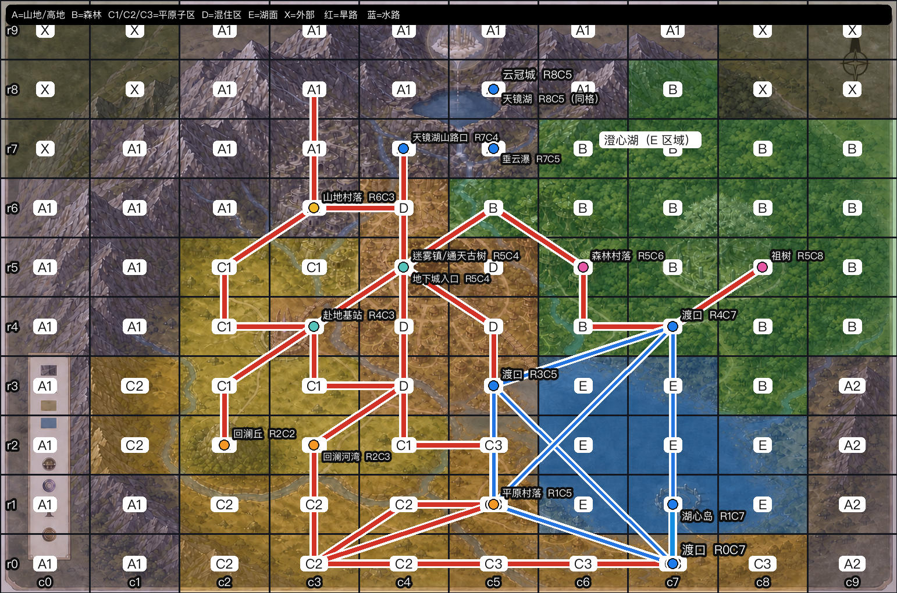

# Elfaria 地理中间资料：Surface Map、分区与路网

> 版本：`elfaria-geography-source.v7`；状态：分区、路网和网格计时已确认；非地表地点不作为当前地表路网通道。本文是 Genesis 的地理推导来源，不是居民知识，也不是某只精灵的个人经历。

## 1. 唯一依据和职责

```text
世界设定 + 原始 Surface Map
        ↓
本文件：100 格分区、地点宿主、骨干路链、渡口和推导规则
        ↓
config/genesis/knowledge/geography.yaml
        ↓
Genesis：出生抽样、地点归属、合法路径和通行天数
```

`geography.yaml` 是机器读取的地理事实源；本文是可审阅的来源。网格只表示抽样容器和路网节点，不表示等比例地图，也不表示整格都被镇、村或景点占据。地点坐标使用逻辑宿主格，不从图片像素自动推断。

## 2. 来源图

- 原始底图：[Surface Map](elfaria-world-images/surface-map.png)：只表达地貌和相对方位。
- 路线审阅图：[Surface Map 路线校正版](elfaria-world-images/surface-map-route-source.png)：叠加最终分区、景点和已确认路线，用于人工核对。
- 机器投影：[geography.yaml](../../../config/genesis/knowledge/geography.yaml)。




## 3. 10×10 最终分区

行 `r0→r9` 为南到北，列 `c0→c9` 为西到东。`X` 是不纳入本轮出生抽样的外部区；`E` 是湖面。`A`、`C` 的子区是沿山地、河流和湖岸确定的逻辑分区，不能因为网格相邻就合并。

| 行 | c0 | c1 | c2 | c3 | c4 | c5 | c6 | c7 | c8 | c9 |
| --- | --- | --- | --- | --- | --- | --- | --- | --- | --- | --- |
| r9 | X | X | A1 | A1 | A1 | A1 | A1 | A1 | X | X |
| r8 | X | X | A1 | A1 | A1 | A1 | A1 | B | X | X |
| r7 | X | A1 | A1 | A1 | A1 | A1 | B | B | B | B |
| r6 | A1 | A1 | A1 | A1 | D | B | B | B | B | B |
| r5 | A1 | A1 | C1 | C1 | D | D | B | B | B | B |
| r4 | A1 | A1 | C1 | D | D | D | B | B | B | B |
| r3 | A1 | C2 | C1 | C1 | D | D | E | E | B | A2 |
| r2 | A1 | C2 | C1 | C1 | C1 | C3 | E | E | E | A2 |
| r1 | A1 | A1 | C2 | C2 | C2 | C3 | E | E | E | A2 |
| r0 | A1 | A1 | C2 | C2 | C2 | C3 | C3 | C3 | C3 | A2 |

代码含义：`A1/A2` 山地/高地，`B` 森林，`C1/C2/C3` 平原子区，`D` 中央混住区，`E` 澄心湖水域，`X` 外部区域。数量为 `A1=30、A2=4、B=19、C1=8、C2=8、C3=6、D=8、E=8、X=9`。

## 4. 地点宿主格

同一格可以有多个地点；地点只占格内的一小点或一个局部范围。迷雾镇是 `D` 区域，镇中心锚点是 `R5C4`，不是把 `R5C4` 整格变成城镇。澄心湖是 `E` 区域，不是一个点。

| 地点 | 宿主格或范围 |
| --- | --- |
| 迷雾镇、镇中心、通天广场、通天古树、长老院、学疗院、百业街、地下城门、地下城 | `R5C4`；镇和地下城是区域/层，入口是点 |
| 云冠城、天镜湖 | `R8C5`；同格，天镜湖可走山路，云冠城只能观测、不能进入 |
| 天镜湖山路口、垂云瀑 | `R7C4`、`R7C5` |
| 山地村落、Myelle 部落中心、Myelle 长老屋 | `R6C3` |
| 森林村落、Saevi 部落中心、Saevi 长老屋 | `R5C6` |
| 祖树 | `R5C8` |
| 赴地跃迁基站 | `R4C3` |
| 回澜丘、回澜河湾 | `R2C2`、`R2C3` |
| 平原村落、Tovren 部落中心、Tovren 长老屋 | `R1C5` |
| 澄心湖 | 所有 `E` 格 |
| 澄心湖渡点 | `R3C5`；另外三个渡口为 `R1C5、R4C7、R0C7` |
| 湖心岛 | `R1C7`；从 `R0C7` 经水路登岛，不能步行到达 |

## 5. 旱路骨干

以下 16 条有序链是唯一的旱路输入。相邻项形成双向骨干边；不根据最近地点、直线或像素自动补主路。末两条是本次确认的补充：`R0C7→R0C8→R0C9` 接续既有 `R0C7` 路网，`R3C1→R3C2` 接入已有平原路网。原图截图仍保留为底图依据，这两条补充以本版明确列出的链为准。

```yaml
- [R8C3, R7C3, R6C3]
- [R6C3, R5C2, R4C2, R4C3]
- [R6C3, R6C4, R5C4]
- [R7C4, R6C4, R5C4]
- [R5C4, R6C5, R5C6, R4C6, R4C7, R5C8]
- [R5C4, R4C3]
- [R4C3, R3C2, R2C2]
- [R4C3, R3C3, R3C4]
- [R5C4, R4C4, R3C4]
- [R5C4, R4C5, R3C5]
- [R3C4, R2C3, R1C3, R0C3]
- [R3C4, R2C4, R2C5, R1C5]
- [R0C3, R1C4, R1C5]
- [R1C5, R0C3, R0C7]
- [R0C7, R0C8, R0C9]
- [R3C1, R3C2]
```

由这 16 条链可校验出 32 个唯一骨干节点和 35 条唯一双向骨干边。链中的经过格不是额外支路。

## 6. 水路和小路

- 四个渡口是 `R3C5、R1C5、R4C7、R0C7`，四者互通；水路边由上层算法生成 6 条完全图边。
- 湖心岛 `R1C7` 是普通水路目的地，从 `R0C7` 乘船通过 1 个水域网格跳数进入；渡口和湖心岛不是同一个地点，也不属于特殊通道。
- 水路距离按渡口之间最短水域网格链计数：`R3C5↔R1C5=4`、`R3C5↔R4C7=3`、`R3C5↔R0C7=5`、`R1C5↔R4C7=5`、`R1C5↔R0C7=3`、`R4C7↔R0C7=4` 个水域网格跳数；湖心岛登岛为 1 跳。
- 每个陆路网格跳数按 2 个步行日计算；主路链中每一对连续格就是一个跳数，不按坐标插入未声明节点；区内小路的一对四方向相邻格也算一个跳数。每个水路网格跳数按 3 个水行日计算。水路必须有船或渡运服务，费用由上层经济规则处理，不从公里数换算。
- 小路不逐条写入配置。运行时只有在“四方向相邻、同一分区、两格可居住、没有河湖阻断”时生成。
- 跨分区不能用小路绕行；跨区只能使用已登记的旱路骨干或水路。湖面不能直接步行；非地表地点不由当前地表路网直接进入。
- `R1C5` 可以同时承载平原村落和渡口节点；渡口节点不自动变成景点名称。

## 7. 人口和物种抽样

- 世界人口 `10,000,000` 只是模型规模，不再拆成 100 个格子的固定人口整数。
- 物种使用硬性分区名单：`A1/A2` 只允许 Myelle，`B` 只允许 Saevi，`C1/C2/C3` 只允许 Tovren，`D` 允许 Saevi、Tovren、Myelle 三个物种；`E/X` 不允许出生。这里是出生资格，不是物种权重。
- 用户先选择物种；系统从该物种允许的区域中均匀选择一个区域，再从该区域的网格中均匀选择一个网格。Saevi 可选 `B、D`，Tovren 可选 `C1、C2、C3、D`，Myelle 可选 `A1、A2、D`。
- 镇中心和三个部落中心仍然是格内地点，不是额外的人口概率层，也不占据整个网格。

## 8. 通行时间和上层推导

配置只保存拓扑、网格跳数和通行规则，不保存公里数。合法陆路每跳 2 个步行日，水路每跳 3 个水行日；水路还要求船或渡运服务并承担更高的上层服务成本。任意两格的合法路径先按路网求解，再按网格跳数计算天数。

从迷雾镇中心 `R5C4` 出发，三个部落中心的骨干路结果为：

| 目的地 | 最短骨干格链 | 陆路跳数 | 通行时间 |
| --- | --- | ---: | ---: |
| Myelle 部落中心 `R6C3` | `R5C4 → R6C4 → R6C3` | 2 | 4 个步行日 |
| Saevi 部落中心 `R5C6` | `R5C4 → R6C5 → R5C6` | 2 | 4 个步行日 |
| Tovren 部落中心 `R1C5` | `R5C4 → R4C4 → R3C4 → R2C4 → R2C5 → R1C5` | 5 | 10 个步行日 |

湖心岛另按水路规则计算，不把水路跳数混入上述三条陆路结果。

其他已登记重点路程按同一图计算：Saevi 部落中心至祖树为 2 个陆路跳数、4 个步行日；Tovren 部落中心至回澜丘为 4 个陆路跳数、8 个步行日；Tovren 部落中心所在渡口至澄心湖渡点为 4 个水路跳数、12 个水行日；Myelle 部落中心至天镜湖山路口为 2 个陆路跳数、4 个步行日。渡点至湖心岛另为 1 个水路跳数、3 个水行日。

天镜湖山路口到天镜湖属于同一 A1 区域内的普通山地小路；湖心岛属于普通渡运。地下城仍登记为地点事实，但不写入当前地表路网的特殊通道或特殊边。

## 9. 修改和验证顺序

1. 先改本文件的矩阵、地点或骨干链，保留原图和审阅截图作为依据。
2. 由矩阵重新计算区域数量、各物种允许区域、出生资格、32 个骨干节点、35 条旱路边和 6 条水路边；水路同时登记渡口间水域网格跳数。
3. 同步 `geography.yaml`；不得重新写出 100 个重复的派生对象。
4. 校验地点引用、主路链、渡口、物种允许名单、出生资格、网格计时规则、禁止跨湖捷径和非地表地点不进入当前地表路网。
5. 最后再由上层算法生成任意两格路径和通行天数，并编译居民知识投影。
