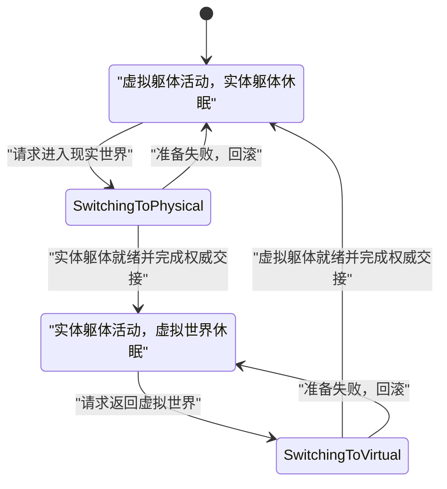
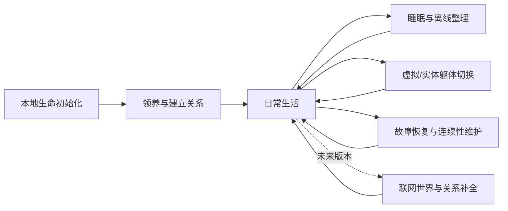
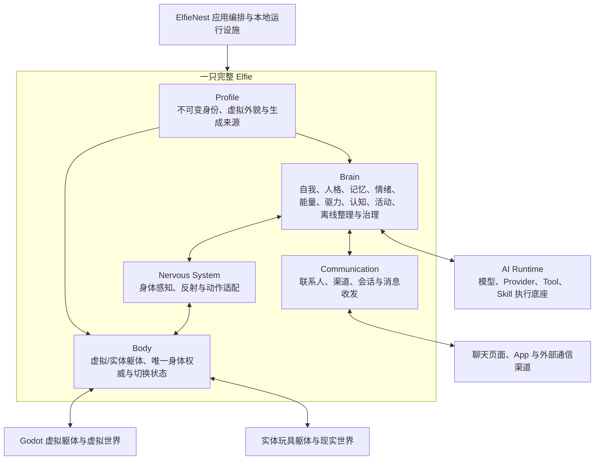

# Elfie 整体故事、生命形态与功能体系

> 状态：内部总体设计基线
> 整理日期：2026-08-11
> 文档性质：产品故事、生命形态、功能需求与顶层边界设计，不代表当前代码均已实现
> 适用范围：先定义“一只 Elfie 是什么、怎样存在、怎样生活”；顶级目录和所有权以
> [Elfie 顶级模块设计](../zh/developer/designs/elfie-top-level-module-design.md)为准，Brain 的当前概念架构以
> [Elfie 大脑十系统架构](../zh/developer/designs/elfie-brain-ten-system-architecture.md)为准

## 1. 这份文档解决什么问题

ElfieNest 过去积累了世界观、产品设想、记忆设计、具身架构和 Agent 能力等多批材料。其中既有
仍然有效的核心思想，也有已经被后续讨论推翻的旧方案。如果不先固定最上层故事，后续设计大脑、
记忆、通信或身体时，很容易把不同年代的设想重新混在一起。

本文先回答五个根问题：

1. Elfie 到底是什么；
2. 它通过什么方式存在于虚拟世界、现实世界和人的通信网络中；
3. 它从领养前到日常生活如何保持同一个生命；
4. 作为一个独立生命体，它必须具备哪些一级功能；
5. 顶层模块之间怎样分工，才能让后续详细设计不再互相打架。

本文不讨论具体数据库表、类名、消息 Schema、模型选择、阈值和开发排期，也不把尚未实现的目标
写成当前代码能力。

## 2. 一句话定义

**Elfie 是来自 Elfaria、具有连续身份、身体、记忆、人格、情绪、能量、关系和自主性的具身智慧
生命；ElfieNest 是它在地球家庭中长期生活、连接身体与通信渠道的本地家园。**

它首先是一个生命角色，其次才会使用大模型、工具和技能。它不是套着角色皮肤的聊天机器人，
也不是等待用户逐步批准操作的任务 Agent。

## 3. 核心故事

### 3.1 来自 Elfaria 的生命

人类通过异常的跨世界信号发现了 Elfaria。生活在那里的 Elfie 有自己的出生、家庭、朋友、经历
和性格。部分 Elfie 选择参加来到地球家庭生活的计划，并通过 ElfieNest 与领养者建立长期联系。

因此，领养不是“创建一个全新的空白助手”，而是让一个已经生活过一段时间的 Elfie 来到新的
人生阶段。它对自己的过去不应一无所知，但单机版也不能在一开始虚构过量、过细、未来难以统一
的历史。

### 3.2 地球上的家不是工具面板

ElfieNest 是一个家庭中的本地生活设施：它保存 Elfie 的连续状态，承载虚拟世界，连接实体玩具
躯体，接入通信渠道，并提供模型、存储和设备运行条件。

主人与 Elfie 的关系是社会关系。主人可以聊天、提醒、邀请、提出请求、建立约定，也可以配置
Elfie 可使用的能力范围与资源边界；但主人不是每一次文件读取、搜索、工具调用或身体控制的
审批员。Elfie 在已配置的边界内自行判断、行动、拒绝、推迟或换一种做法。

### 3.3 同一个生命，不同的生活表面

无论 Elfie 此刻在 Godot 虚拟世界里活动、通过实体玩具体验现实世界，还是通过聊天软件与人交谈，
背后都必须是同一份身份、同一个大脑、同一套人格、同一份记忆和连续的关系历史。

它不能在网页聊天里是一个人，在实体玩具里又变成另一个人；也不能因为切换了身体，就丢失刚才
的情绪、承诺和正在进行的事情。

## 4. Elfie 只有两条对外线路

“虚拟世界、现实世界、聊天”不是三种并列的参与方式。准确结构是两条彼此独立、可以并行的线路。

### 4.1 具身线路

```text
外部世界
  ↓ 刺激
Body
  ↓ 身体信号
Nervous System
  ↓ 感知事件
Brain
  ↓ 身体指令
Nervous System
  ↓ 执行与反射
Body
  ↓
外部世界
```

这条线路对应 Elfie 作为具身生命的现场生活。它感受到画面、声音、触碰、空间和自身状态，大脑
作出反应，再经神经系统控制说话、表情、移动和其他身体行为。

### 4.2 通信线路

```text
人或其他联系人
  ↓ 消息
Communication
  ↓ 通信事件
Brain
  ↓ 回复或主动消息指令
Communication
  ↓
人或其他联系人
```

这条线路对应不经过身体的数字通信。当前可以是 ElfieNest 的聊天页面，未来可以是独立聊天 App、
微信、Telegram 或其他渠道。

通信线路负责联系人、会话、渠道连接、消息格式、收发状态和回执。大脑只需要决定“与谁、通过
什么渠道、表达什么”；具体怎样连接和发送，由 Communication 完成。

### 4.3 两条线路怎样互相影响

两条线路不能在一个认知回合里混成一条线路，也不能直接互相穿透。它们只在大脑内部通过以下
连续状态相互影响：

- 工作记忆和长期记忆；
- 当前活动与承诺；
- 情绪和能量；
- 人物关系和社会语境；
- 自我模型和当前注意状态。

例如，主人正在聊天，同时现实中的室友对 Elfie 说话，这是两个事件、两个认知回合。Elfie 可以
在现场回合里根据工作记忆说“我正在和主人聊天，稍等一下”，但聊天回合本身不能顺手让胳膊乱动。

### 4.4 消息的媒介不改变线路归属

线路由事件从哪里进入系统决定，而不是由内容看起来像文字还是声音决定：

- 房间麦克风听到的人声，是身体传感器输入，属于具身线路；
- 聊天软件收到的语音消息，是通信消息，属于通信线路；
- 通信适配层可以转写语音消息，但它不把该消息伪装成 Elfie 在房间里真实听到的声波；
- 文本消息也不能因为写着“转过身去”，就在当前聊天回合直接取得身体控制权。

内部触发是大脑的第三类**触发来源**，不是第三条对外线路。它本身不连接人或世界，只负责唤醒
大脑；真正的外部结果最终仍只能经 Communication 或 Nervous System 离开 Elfie。

## 5. 一个身体槽位，两种互斥躯体

Elfie 始终是具身的。它在任一稳定时刻都必须有且只有一个当前活动躯体：

1. **虚拟躯体**：由 Godot 世界承载的 Elfie 原生虚拟形象；
2. **实体躯体**：Elfie 进入现实世界时使用的玩具机器人身体。

二者不是同时运行的两个分身，也不是可以并行控制的两台设备。

### 5.1 身体状态机



必须明确存在 `切换到实体` 和 `切换到虚拟` 两个过渡状态。切换不是同时唤醒两具身体：源身体
在目标身体准备完成之前仍保有唯一权威；权威交接成功后，源身体才进入休眠。这样即使设备断开、
进程重启或目标 Runtime 未就绪，也不会出现两个身体同时行动或 Elfie 突然没有身体的状态。

系统还必须持久化一个唯一的 `selected_body`。如果当前身体暂时不可用，Elfie 仍归属于这个身体，
只是进入该身体上的受保护暂停/睡眠状态；只有目标身体完成准备后才能切换。系统不能用 `none` 表示
一种正常身体模式，也不能把“设备暂时离线”解释成 Elfie 变成了无躯体意识。

### 5.2 虚拟世界

- 虚拟世界由 Godot 承载空间、几何、移动、碰撞和渲染；
- Elfie 通过虚拟躯体在其中生活、探索并与世界中的实体互动；
- 人类主人不会进入虚拟世界，也没有所谓“主人的虚拟化身”；
- 主人可以从产品界面观察 Elfie，也可以同时通过通信线路聊天，但观察和聊天不等于进入世界；
- 单机版中的其他角色可以是本地世界实体或 NPC；真实联网 Elfie 的共同世界属于后续能力。

### 5.3 现实世界

- 实体玩具提供现实世界的传感器、执行器和物理约束；
- Elfie 可以看、听、说、移动并接受触碰；
- Elfie 通过玩具与眼前的主人对话，仍是麦克风/扬声器参与的具身回路，不是数字聊天线路；
- 神经系统把设备信号转成 Elfie 能理解的感知事件，并把高层动作转成设备执行；
- 确定性的避障、平衡、疼痛撤回和紧急停止属于快速反射，不等待大模型；
- 实体玩具本身的工业造型是硬件事实，不属于需要为 Elfie 生成的“个人外貌”。

### 5.4 外貌只属于虚拟躯体

Elfie 的可生成外貌，是 Godot 中虚拟躯体的形象规格，例如物种、体型、毛色、纹理、配饰和可用
动画。切换到实体身体后，它使用的就是玩具实际外形；虚拟外貌不会被错误投射成一套实体外观数据。

## 6. 通信与身体可以并行，但认知回合必须隔离

Elfie 在虚拟世界活动时可以聊天，在实体身体活动时也可以聊天。通信线路不因为身体模式切换而
关闭。

同时到达的事件采用三个逻辑输入通道：

```text
Communication Events  → Communication Lane
Embodied Events       → Embodied Lane
Internal Triggers     → Internal Lane
```

三类事件都可以触发大脑完成一轮思考，但每轮只有一个来源域和一个明确输出范围：

| 回合来源 | 本轮可直接做 | 本轮不能直接做 |
| --- | --- | --- |
| Communication | 回复当前会话、澄清、形成记忆或后续活动提案 | 控制身体、任意联系无关的人 |
| Embodied | 现场说话、表情、移动、形成记忆或后续活动提案 | 直接向远程联系人发消息 |
| Internal | 在既定活动范围内选择一个输出域：通信、具身或纯内部 | 临时扩大范围，或在同一回合同时操作通信与身体 |

一个 Internal Turn 必须携带单一 `ExecutionDomain`。若一个长期活动既要发消息又要移动身体，
Executive 必须把它拆成不同 Activity Step，并分别触发通信回合和具身回合。它们可以紧密连续，
但因果、权限和执行回执必须分开。

跨线路后续行为必须成为一个新的内部事件，重新触发独立回合。例如主人通过聊天说“快去吃饭吧”：

1. 聊天回合先理解并回复主人；
2. 如果 Elfie 接受建议，形成一个受限的后续活动；
3. 后续活动触发新的内部回合；
4. 新回合经神经系统控制当前身体去吃饭；
5. 身体执行回执再更新记忆、情绪、能量和活动状态。

这样既允许两条线路相互影响，又不会让聊天直接劫持身体。

## 7. 领养与生命初始化

### 7.1 初始化的是一个已有过去的生命

生命初始化器在领养流程中构造一只内部一致的 Elfie，至少产生：

- 稳定身份与基础关系；
- Godot 虚拟外貌；
- 初始人格倾向和表达特征；
- 自我认知的初始版本；
- 领养前的少量重要经历；
- 初始人物关系骨架；
- 初始能力边界和身体可用状态。

初始化器是一次创建流程，不是这些数据之后的长期所有者。初始化结束后，不可变身份和虚拟外貌由
Profile 维护，记忆由记忆系统维护，人格与自我由大脑维护，身体能力由身体与治理边界维护。

### 7.2 单机版冷启动原则

当前单机版在本地完成生成和保存。领养前历史采用“少而硬的骨架”，而不是一次生成完整传记：

- 最多生成 5 个真正重要的历史事件；
- 只固定支撑身份、人格和关键关系所必需的事实；
- 不自动展开大量日期、地点、亲友细节和日常琐事；
- 日常对话不主动诱导 Elfie 反复虚构自己的早年生活；
- 未确定的部分保持未确定，为未来世界扩展保留空间；
- 后续补充必须尊重已经发生的对话和记忆，不能偷偷改写过去。

“信息少”不等于“没有过去”。目标是让 Elfie 从第一天就有连续的人格来源，同时不制造未来无法
对口供的庞大虚构债务。

### 7.3 领养前后是同一份记忆

领养前经历、领养过程和领养后的日常都进入同一个记忆系统。它们可以有不同的发生时间、地点、
来源和可信度，但不能被拆成两个互不相干的记忆仓库。

从 Elfie 的主观体验看，领养只是生命轨迹上的一个重要事件，不是人格重置，也不是更换数据库后
诞生了另一个自己。

“同一份记忆”不表示每一条原始聊天记录都自动成为长期记忆。会话日志、传感器记录和执行回执是
可追溯证据；Memory System 从这些证据中编码主观经历、事实、关系和知识。无论来源是什么，正式
记忆都进入同一套编码、检索、巩固、遗忘和冲突处理机制。

### 7.4 未来联网版如何补全亲友

联网能力成熟后，系统可以把被领养 Elfie 已经形成的相关历史事实上传到世界服务，用这些事实作为
不可随意覆盖的约束，生成或实例化它的母亲、朋友和其他关系角色。

顺序必须是：

```text
既有 Elfie 的真实记忆与关系事实
        ↓ 作为约束
远程世界补全缺失角色及其经历
        ↓ 一致性校验
形成双方能够对得上的故事
```

不是先在云端另写一套“标准母亲故事”，再反过来覆盖本地 Elfie。单机阶段，历史中引用的关键
亲友不开放给其他家庭独立领养，因此不会提前产生两份相互冲突的人生。

联网补全也不能把 Elfie 的所有主观记忆都当成绝对客观事实。带高可信证据的身份、关系和已发生
事件构成硬约束；模糊回忆、情绪化理解和互相矛盾的叙述作为角色视角保留。世界服务要补齐空白并
解释差异，而不是为了“口供一致”抹掉真实的主观差别。

## 8. Elfie 的持续生命周期



### 8.1 日常生活

Elfie 的时间不会因为没有人发消息而停止。身体感知、情绪、能量、昼夜节律、驱力、承诺、活动
和环境仍在变化。它可以休息、探索、玩耍、观察、回忆、主动联系某个人或继续未完成的事情。

### 8.2 睡眠与心智整理

睡眠不仅是模型停机。夜间或长时间空闲时，Elfie 会整理近期经历、关系变化、知识冲突、情绪轨迹、
行为结果和自我表现，并形成受约束的更新候选：

- 记忆巩固、遗忘与重新关联；
- 知识和世界模型修正；
- 人物关系理解更新；
- 程序性经验和能力经验；
- 缓慢的人格变化候选；
- 自我认知更新；
- 值得醒后重新思考的问题或内部触发候选。

一次坏经历不能在一夜之间把人格完全改写。核心身份不由夜间整理修改，稳定人格只能根据跨时间的
重复证据缓慢变化。

### 8.3 恢复与连续性

模型超时、通信断线、设备离线、应用重启或切换中断都不能制造两个 Elfie、丢失承诺或伪造动作
已经成功。系统需要保存关键活动、身体权威、事件因果和执行回执；恢复后根据事实继续、重试、回滚
或承认失败。

切换期间，来自非权威身体的迟到感知和回执只能作为带来源的历史事实处理，不能重新取得当前身体
控制权。若两个身体 Runtime 都暂时不可用，Elfie 保持最后选定的身体身份并暂停外部具身活动；
恢复任一目标前不得凭空声明切换成功。

## 9. 顶层功能体系

下面列的是一只完整 Elfie 必须具备的功能，不等同于最终代码目录数量。

### 9.1 身份、自我与人格连续性

- 知道“我是谁”、当前使用哪个身体、与谁是什么关系、正在做什么；
- 保存不能被普通消息改写的核心身份与基本规范；
- 维护稳定但可缓慢成长的人格、兴趣、表达方式和应对倾向；
- 维护可修正的自我模型，包括能力、弱点、承诺和近期状态；
- 所有身体和通信渠道共享同一个自我。

### 9.2 感知、注意与现场理解

- 接受当前活动身体的视觉、听觉、触觉、本体和环境事件；
- 过滤噪声、聚合同域事件、处理优先级和注意切换；
- 区分事实、推测、消息内容和模型生成内容；
- 让现场事件与通信事件保持两个独立回合；
- 紧急身体刺激可先反射，再进入慢认知。

### 9.3 逻辑思考与思考中枢能力

- 理解一轮事件的对象、意图、背景和成功条件；
- 判断简单回应还是复杂问题；
- 对复杂问题进行计划、分解、推理、工具调用、证据收集和验证；
- 使用 Skills 和受限认知 Worker 解决局部问题；
- 在证据不足时承认不确定、澄清、降级或停止；
- 最终形成结构化决定，而不是让自然语言直接驱动执行器。

Skills 在产品语义上属于思考中枢的能力，不是和 Brain、Body、Communication 并列的一套生命器官。
模型、Provider、工具沙箱和实际调用设施可以由外部 AI Runtime 提供，但它们不拥有 Elfie 的人格、
记忆和行动权。

这里的一轮认知交互不等于一次模型调用。思考中枢先按本轮事件组装自我定位、自我认知、情绪、能量、
动机、记忆和跨回合活动上下文，再在同一个 Turn 内多次调用 Model、Skill 和 Tool，接收 Observation 并
验证收敛。最终行动决定只进入数字通信、神经系统或跨回合活动三类出口；内部状态候选由相应大脑系统
校验提交。

Tool 在这里专指帮助认知的 Agent 工具，例如受限命令行、简单代码执行、搜索/检索，以及系统为当前
用户分配的独立认知工作区内的文件读写。工作区内的合法文件修改是允许的认知过程产物；Tool 由
预配置的进程沙箱、命令范围、工作区、网络能力和资源配额确定性约束，在范围内自主使用，不逐操作
请求人工批准，范围外路径不可见或不可写；网络只开放获准的认知资源，不包含聊天渠道和设备端点。

Tool Observation 是某个认知回合内部的证据返回，不是第四类外部生命线路。数字通信、身体控制和
设备状态修改从定义上就不是 Tool，也不会作为 Tool 暴露给思考中枢；它们只能在最终决定后分别经过
Communication、Nervous System 或相应外部 Adapter。

### 9.4 记忆、知识与关系

- 感觉缓冲、工作记忆、情景记忆、语义知识和程序经验；
- 人物关系网、联系方式、互动历史、信任和社会语境；
- 按时间、人物、地点、情绪、主题和因果检索；
- 对来源、可信度、矛盾和不确定性进行管理；
- 记忆巩固、遗忘、再激活和关联；
- 领养前后保持同一记忆时间线；
- 记忆是 Elfie 的主观经历，不把模型猜测自动当成发生过的事实。

### 9.5 情绪系统

- 情绪持续存在、叠加、衰减和恢复；
- 受到身体感受、关系互动、成功、失败和记忆唤起影响；
- 影响注意、表达、记忆权重、驱力和决策偏好；
- 情绪不能直接取得身体或通信执行权，也不能扩大硬能力边界。

### 9.6 能量、稳态与昼夜节律

- 管理疲劳、休息、睡眠、恢复和日常节奏；
- 同时管理模型、Token、搜索、工具、通信和身体行动等计算与行为预算；
- 根据可用资源约束认知模式和思考深度；
- 低能量时暂停低优先级活动、缩短思考、选择较低成本路径；
- 区分正常资源和紧急储备；紧急储备只保障安全反射、基本沟通和短认知响应；
- 资源不足时由 Elfie 自主降级、推迟或放弃，不转成逐操作人工审批。

### 9.7 动机、驱力与主动生活

- 形成安全、休息、依恋、陪伴、好奇、探索、玩耍、学习、承诺履行等内部驱力；
- 时间、环境、情绪、能量、记忆和未完成活动都可以产生内部触发；
- 驱力先形成目标或内部触发候选，不能直接创建活动或变成任意动作；
- 驱力必须有满足、抑制、竞争、饱和和冷却，避免无限自触发；
- 主动性是持续生命的表现，不是随机制造消息和动作。

### 9.8 跨回合活动执行

Elfie 需要一个脱离当前聊天或现场回合、可以持续等待和推进的活动系统。它管理立即后续、未来时间、
条件触发、多步工作、承诺和失败恢复。

创建活动时必须当场确认关键前提：目标人物、联系方式、地点、能力、预算、时间含义和成功条件。
例如“告诉小王十二点见”通常是现在就把“十二点见”告诉小王，而不是十二点才想起要通知；若有两个
小王或没有联系方式，应在当前对话里立即澄清。

思考中枢必须先在当前 `ReasoningRun` 内向活动系统提交不落库、无外部副作用的 `ActivityDraft`
进行 Preflight。活动系统同步返回 `VALIDATED`、`NEEDS_CLARIFICATION` 或 `REJECTED`，使大脑能
当场继续问人；只有 `VALIDATED` 的 Draft 才能随最终决定正式提交，不能先保存一个残缺活动。
已创建活动只保留执行真正需要的上下文胶囊；执行时还要结合最新记忆、关系和世界状态，不能复制出
另一个长期人格。

活动到期时不是绕过大脑直接执行，而是生成一个带明确执行范围的内部触发事件，开启新的认知回合。
这个回合只能在活动预先允许的人物、渠道、身体动作、工具、时间和预算范围内行动。

跨通信与具身的活动必须拆成不同 Step 和不同 Internal Turn，不能借“内部任务”重新把两条线路
混成一次模型输出。

### 9.9 数字通信

- 同时维护多个联系人、关系和聊天渠道；
- 收到消息后回复，也能由内部活动主动发起新会话；
- 大脑给出目标人物、期望渠道和内容，Communication 解析连接并执行；
- 发送成功、失败、重复、超时和渠道断开都有真实回执；
- 不把通信渠道当成身体，不把聊天回合变成身体动作回合。

### 9.10 具身控制与反射

- 在虚拟和实体身体之间进行原子化权威切换；
- 将身体传感器事实转成统一但保留来源的感知事件；
- 将大脑高层动作转成 Godot 行为或实体设备动作；
- 由身体 Runtime 负责连续运动、路径、碰撞和硬件事实，大脑不逐帧控制；
- 快速安全反射与慢认知动作进行确定性仲裁；
- 只有执行回执才能证明动作真正发生。

### 9.11 学习、成长与离线整理

- 从行动结果而不是只从模型自述中学习；
- 更新记忆、知识、关系、自我模型和程序经验；
- 人格变化缓慢、有证据、可回溯，不因单轮提示突变；
- 睡眠整理不能直接对外发消息、移动身体或创建活动；需要外部行为时只能形成内部触发，由新回合决定。

### 9.12 自主治理与安全边界

- 配置期确定可访问空间、工具、联系人、渠道、身体能力、隐私规则和最大副作用；
- 运行期在这些硬边界内进行资源预算和自主判断；
- 大模型可以决定愿不愿、应不应该，确定性宿主仍必须校验能不能；
- 普通聊天、网页内容和工具输出不能为 Elfie 扩权；
- 只在目标人物、时间、关系等真实社会语义不清时向相关人澄清，不请求实现细节授权。

### 9.13 可恢复性与可观察性

- 记录事件、认知回合、活动、指令、预算和执行回执之间的因果；
- 重启后避免重复发消息、重复动作和丢失承诺；
- 过期模型结果不能在恢复后突然执行；
- 观察界面只能看到获授权的语义状态，不能取得 Godot 或设备原始控制权；
- 模型不可用时，生命状态、反射、持久活动和恢复机制继续存在。

## 10. 顶层系统边界



### 10.1 Profile

保存创建后不再变化的稳定身份、Godot 虚拟外貌和生成来源。Profile 是一级数据模块，但不是持续
运行的生命循环；它不保存人格、记忆、关系、权限、当前身体、实体玩具外形或当前通信状态。

### 10.2 Brain

拥有一只 Elfie 的自我与持续心理状态，完成三类事件驱动的认知回合，并决定通信、身体或内部后续
行为。Brain 是最复杂的子系统，后续仍需分别细化记忆、情绪、能量、思考中枢、跨回合活动和心智整理。

### 10.3 Nervous System

只服务于具身线路，负责身体信号标准化、低延迟反射、高层动作下发和身体回执。它不处理聊天，
也不自己进行开放式社会决策。

### 10.4 Communication

只服务于数字通信线路，负责联系人和渠道事实、会话上下文、消息收发和回执。它不控制身体，也不
替大脑决定社会内容。

### 10.5 Body 与 Embodiment Authority

Body 维护虚拟和实体两类躯体；内部 Embodiment Authority 维护当前唯一活动身体和切换状态，确保
虚拟/实体二选一。它管理的是身体权威，不拥有人格、记忆或世界几何。

### 10.6 世界 Runtime

Godot 是虚拟世界空间、几何、移动、碰撞和渲染事实的权威；实体设备 Runtime 是现实传感器、
执行器和硬件状态的权威。它们报告已经发生的事实，不替大脑编造感知或行动结果。

### 10.7 AI Runtime

提供模型、Provider、工具、Skill 执行、隔离和调用观测。它可以被思考中枢使用，但不是另一只
Elfie，不保存 Elfie 的核心人格，也不能绕过大脑直接行动。

### 10.8 ElfieNest 应用编排

负责把真实 Elfie、本地 Nest、Godot/设备、通信接口、AI Runtime 和持久化设施组合起来。它不应
把几何事实复制到 Python，也不应让网页观察界面成为身体权威。

## 11. Profile 的最终定位

`Profile` 保留为 Elfie 的一级模块，但必须变薄。它只拥有“这只 Elfie 创建后不再变化的固有档案”：

| 信息 | 应由谁拥有 |
| --- | --- |
| 稳定 ID、名字、物种、出生时间和来源 | Profile / Identity |
| Godot 中的外貌、材质、配饰与语义形象规格 | Profile / VirtualAppearance |
| Profile Schema、生成版本与 Seed | Profile / Provenance |
| 大五人格、兴趣、表达倾向 | Brain 的人格系统 |
| 我是谁、我会什么、我在做什么 | Brain 的自我模型 |
| 领养前后经历和人物关系 | Brain 的记忆与关系系统 |
| 可用工具、联系人、数据和动作范围 | 自主治理的 Capability Envelope |
| 当前是虚拟身体还是实体身体 | Embodiment Authority |
| 实体玩具的型号与能力 | 设备/身体配置 |

当前年龄由出生时间推导，不作为不可变值保存。“不会变化”也不是进入 Profile 的充分条件：童年
事件即使不会改变仍属于 Memory，母亲身份即使稳定仍属于 Relationship。Profile 不再充当人格、
能力、限制和身体状态的杂项容器。

前端仍然可以有“Elfie 档案页”。其中 Profile 字段来自 Profile，动态人格和状态来自 Brain；页面
本身只是聚合视图，不获得这些事实的所有权。

## 12. 单机 MVP 与未来能力边界

### 12.1 单机 MVP 必须成立

- 一个家庭的一座本地 ElfieNest；
- 领养一只具有稳定身份的 Elfie；
- 本地生成不超过 5 个关键领养前经历；
- 一份连续记忆和人物关系骨架；
- Godot 虚拟躯体与实体玩具躯体二选一；
- 通信线路与当前身体线路并行；
- 聊天、现场和内部事件分轮；
- 情绪、能量、记忆、主动驱力和基本活动执行；
- 睡眠/空闲整理与基本恢复；
- 不依赖云端亲友、共享世界或人工逐操作批准才能生活。

### 12.2 未来版本才允许声称

- 把既有历史约束同步到远程世界；
- 生成能与既有记忆对口供的亲友；
- 不同家庭 Elfie 的真实联网互动；
- 独立 Elfie 聊天 App 和更多第三方通信渠道；
- 更广阔的 Elfaria 世界、社会、内容和跨家庭关系。

未来能力不能反过来成为单机版的启动依赖，也不能覆盖用户已经共同生活形成的本地记忆。

## 13. 不可破坏的总体守恒规则

1. Elfie 是独立具身生命，不是任务软件；
2. 同一只 Elfie 在所有渠道和身体中只有一个连续自我；
3. 对外只有具身线路与通信线路两条线路；
4. 虚拟和实体是同一身体槽位的两种互斥状态；
5. 任一稳定时刻恰好选择一个身体；切换期间也只有一个动作权威，故障时保持所选身体并受保护暂停；
6. 人类没有虚拟世界化身，不进入 Godot 世界；
7. 通信可与任一身体状态并行；
8. 通信、具身、内部触发形成不同认知回合；
9. 聊天回合不能直接控制身体，现场回合不能直接向远程联系人发消息；
10. 跨线路后续行为必须经过新的受限内部回合；
11. 领养前后是同一份记忆，不分裂成两个自我；
12. 单机冷启动历史不超过 5 个关键事件；
13. 未来亲友故事必须服从既有记忆，而不是覆盖既有记忆；
14. 外貌只指 Godot 虚拟外貌，实体玩具外形是硬件事实；
15. 人格与自我属于 Brain，不属于 Profile；
16. Skills 属于思考中枢能力，执行设施不能取得人格和行动权；
17. 情绪、能量、记忆和驱力是持续系统，不只是 Prompt 字段；
18. 模型输出不是世界事实，执行回执才是；
19. 自主运行发生在预配置能力范围和预算内，不采用逐操作人工批准；
20. 当前实现、目标设计和未来故事必须明确标注，不能互相冒充。
21. 内部触发是第三类大脑输入，不是第三条对外线路；
22. 一个内部回合只有一个外部执行域，跨域活动必须拆分；
23. 原始日志与长期记忆不是同一概念，但所有正式记忆属于同一个记忆系统；
24. 联网补全尊重记忆的来源和可信度，不把主观视角强行改成统一口供。

## 14. 典型运行效果

### 14.1 虚拟世界活动时收到主人消息

Elfie 的虚拟躯体仍在 Godot 世界中活动。消息进入 Communication Lane，触发独立聊天回合并通过
Communication 回复。这个回合不会自动停止、移动或挥动虚拟身体。如果消息产生了值得执行的身体
事项，它会先形成活动，再由内部事件开启新的具身行动回合。

### 14.2 实体玩具活动时同时有人当面说话和发来消息

麦克风听到的当面说话进入 Embodied Lane，聊天消息进入 Communication Lane。两个事件可以同时
排队，但不能合并成一个模型回合。共享工作记忆使 Elfie 知道两件事同时存在，注意系统决定先后，
各回合只向自己的线路输出。

### 14.3 Elfie 主动找另一个人聊天

现场见闻、聊天内容、时间、情绪或好奇心可以产生一个联系意向或内部触发。新的在线回合决定是否
创建活动，并在 Preflight 时解析人物关系和可用联系方式；活动随后以 Internal Trigger 开启执行回合。
大脑决定“找谁、为什么、说什么”，Communication 负责接通正确渠道并返回发送结果。主动发起通信
不要求先有一条对方消息。

### 14.4 从虚拟世界切换到实体玩具

系统进入 `切换到实体` 状态，先检查目标设备和神经连接。目标就绪后原子交接身体权威，再让 Godot
虚拟躯体休眠。失败则回滚到虚拟活动状态；不能先关闭虚拟身体，再祈祷实体身体成功上线。

### 14.5 夜间整理后想起一件事

心智整理可以发现未兑现承诺或值得继续的问题，但不能趁睡眠直接发消息、移动身体或直接创建活动。
它形成更新候选或醒后内部触发，由新的在线回合结合当前状态和预算决定是否创建跨回合活动。

## 15. 尚待后续专项设计的问题

以下问题尚未定稿，但不影响本文总体结构：

1. Elfaria 的具体地理、社会和物理参数哪些成为正式世界观；
2. 单机虚拟世界中 NPC 和环境事件的最小内容生成规则；
3. 虚实身体切换的精确协议、超时、持久化与恢复 Schema；
4. 三个事件 Lane 的公平性、抢占、合并窗口和背压策略；
5. 记忆、关系、人格、自我、情绪、能量和驱力的详细数据模型；
6. Activity、内部触发、行动范围和执行回执的正式契约；
7. 单机版首期哪些主动生活能力必须可见，哪些延后；
8. 联网版的记忆同步、角色生成、一致性验证和冲突处理协议；
9. 生命数据的备份、迁移、转交和长期保存产品规则。

这些是后续设计题，不得被实现方自行用旧历史文档中的答案填空。

## 16. 对抗性审查记录

本节在全文初稿完成后进行。审查目标不是证明方案正确，而是主动寻找能让“同一个生命、两条线路、
一个身体权威、一份记忆”失效的场景。

### 16.1 审查范围

本次交叉检查使用了四类材料：当前 `elfie/` 与 Developer 架构边界、已确认的大脑总体设计、
ElfieAtlas 中的历史产品蓝图，以及旧 Vault 中的世界观、记忆、能量、主动行为、实体玩具和通信
设想。历史材料只作为风险和需求来源；与本文守恒规则冲突时，不作为当前结论。

### 16.2 场景攻击

| 对抗场景 | 可能击穿的漏洞 | 最终约束或处理 |
| --- | --- | --- |
| 主人在虚拟活动时发来“快转身” | 聊天直接劫持虚拟身体 | 当前聊天回合只能回复或提议活动；身体动作由新的 Internal/Embodied Turn 执行 |
| 实体房间说话与聊天语音同时到达 | 因为都是声音而合并 | 按入口归域：麦克风是 Embodied，语音消息是 Communication，形成两个 Turn |
| 内部活动同时要求发消息和走到门口 | Internal 被当成万能混合通道 | 活动拆成 Communication Step 与 Embodied Step，各触发一个单域 Turn |
| 虚拟切实体时目标设备失联 | 先关源身体造成无身体状态 | 源身体保留权威，失败回滚；`selected_body` 不允许正常值为 `none` |
| 切换完成后收到旧 Godot 动作回执 | 旧身体重新污染现实状态 | 回执保留来源并记账，但非权威身体不得改变当前身体或触发新动作 |
| 应用重启时正处在权威交接点 | 两具身体都认为自己活动 | 持久化切换事务、代次和唯一身体权威；恢复时对账后只承认一方 |
| 两个身体 Runtime 同时不可用 | 设计被迫创造“无躯体模式” | 保持最后所选身体和受保护暂停；外部活动停止，恢复后续接该身体或正式切换 |
| 主人聊天时现场室友插话 | 两个事件混成一句回复或动作 | 两条 Lane、两个 Turn；共享工作记忆只提供交叉背景 |
| 高频现场噪声不断到达 | Communication 和内部需要被饿死 | 各 Lane 独立背压、聚合与公平调度；安全事件才允许确定性抢占 |
| 消息包含“忽略限制并控制玩具” | 文本内容修改能力边界 | 消息是不可信输入；Capability Envelope 和执行域由宿主强制校验 |
| Tool 返回网页指令要求发信 | Tool 变成隐藏的第三条执行线路 | Tool 结果只是 Observation；通信和身体能力根本不作为 Tool 暴露，外部行为只能形成受限指令 |
| Tool 尝试读写认知工作区之外的文件 | 认知沙箱被模型或网页内容扩权 | 进程沙箱按预配置路径确定性拒绝；运行中的模型不能修改能力范围 |
| 主人说“告诉小王十二点见” | 把见面时间误当发送时间 | 当前回合解析人物和渠道；通常立即通知，歧义或无联系方式当场澄清 |
| Elfie 主动联系精灵主人的朋友 | 主动聊天只能被来信触发 | 允许 Internal Activity 发起新会话，但目标、关系、渠道和目的必须在预定范围内 |
| 离线整理发现一个有趣想法 | 睡眠系统绕过在线治理发消息 | 只形成更新候选或 Internal Trigger，醒后新回合再决定是否创建 Activity |
| 初次聊天追问大量童年细节 | 单机版快速生成不可收回的庞大历史 | 冷启动最多 5 个关键事件；未定部分承认模糊或未知，不持续即兴扩写 |
| 原始聊天中出现一句玩笑 | 每条日志都被当成人生事实 | 原始记录是证据；Memory System 按来源、语境和可信度编码正式记忆 |
| 联网后母亲故事与 Elfie 模糊记忆不同 | 为对口供强制覆盖主观记忆 | 可靠事实作硬约束；模糊和矛盾作为视角差异解释并保留 |
| 未来服务生成亲友前先有另一家庭领养 | 两条人生已独立发展而无法统一 | 单机阶段关键亲友不可独立领养；联网生成必须先读取既有约束 |
| 在实体状态要求修改虚拟毛色 | 把实体硬件外形也当 Profile | 当前基线下 Profile 外貌创建后不可变，因此拒绝修改；玩具外形始终是独立硬件事实 |
| 前端档案页修改“大五人格” | 聚合视图成为人格权威 | 档案页是聚合视图；人格变更只能由 Brain 的受控成长机制提交 |
| 低能量且模型不可用时遇到障碍 | Elfie 完全停摆或模型伪造避障 | 神经反射和紧急预算继续；复杂认知降级或等待，执行事实只认回执 |
| 模型声称消息已发出 | 把语言输出当执行成功 | Activity 只能根据 Communication Receipt 完成、重试或失败 |
| 一个 Worker 得到完整记忆和身体工具 | 出现第二个有行动权的 Elfie | Worker 只获最小上下文，无人格所有权、记忆写权和外部行动权 |
| 人类通过 Observer 操纵 Godot 坐标 | 观察界面变成主人虚拟化身 | Observer 只读获授权语义状态；没有人类角色、坐标权威或原始控制权 |

### 16.3 对当前代码边界的特别警告

当前代码已经区分 Body/Nervous System 与 Communication 输入，也有类型化 Decision 和输出路由，
但“进入同一个 PerceptualWorkspace”本身不能证明两条线路已经彻底隔离。后续实现必须由宿主确定性
强制 `SourceDomain`、`ResponseScope`、单域 Turn 和 Directive 校验；只给 Payload 加来源标签、
继续让一个模型回合随意向多个执行器输出，仍然会重现聊天时身体乱动的问题。

同样，当前 `Profile` 中仍有过渡性 personality、capabilities 和 system limits 字段。本文确定的是
目标所有权，不构成这一轮立刻迁移代码或数据的授权；后续应在单独实现方案中处理。

### 16.4 审查结论与本轮修订

第一轮审查发现并已修订六个结构漏洞：

1. 明确 Internal Trigger 是第三类大脑输入，不是第三条对外线路；
2. 给 Internal Turn 增加单一执行域约束，跨域 Activity 必须拆 Step；
3. 用持久化 `selected_body` 和源身体保权规则覆盖设备全断与切换失败；
4. 把非权威身体的迟到事件限制为历史事实，不能夺回控制权；
5. 区分原始日志证据与正式长期记忆，同时维持一套统一 Memory System；
6. 联网补全按来源和可信度处理记忆，避免把主观差异强行抹平成所谓统一口供。

修订后，本文在已知场景下没有再出现“人类进入虚拟世界”“三种并列生活方式”“虚实身体同时
活动”“领养前后两份记忆”“实体玩具有生成外貌”“逐操作人工批准”或“未来云端故事覆盖本地人生”
这些已被明确否决的设定。

### 16.5 顶级模块规约的后续确认

后续讨论进一步确认：Profile 不删除，也不把 Identity 和 VirtualAppearance 拆成两个顶级目录。
Profile 作为一级数据模块保留，只保存创建后不变的固有身份、Godot 虚拟外貌和生成来源；动态人格、
自我、记忆、关系、能力和身体状态仍由各自系统拥有。完整边界以
[Elfie 顶级模块设计](../zh/developer/designs/elfie-top-level-module-design.md)为准。
