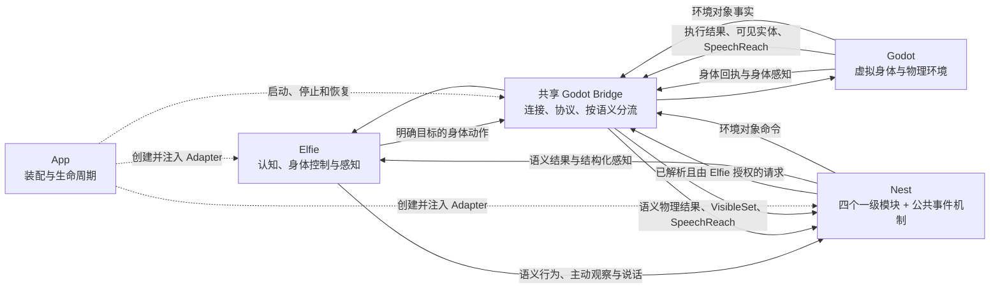
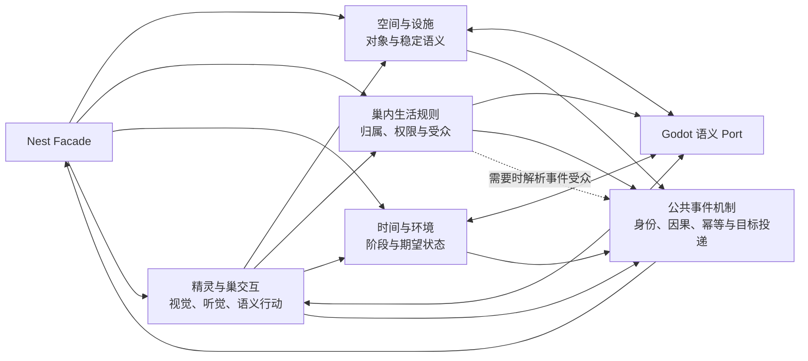
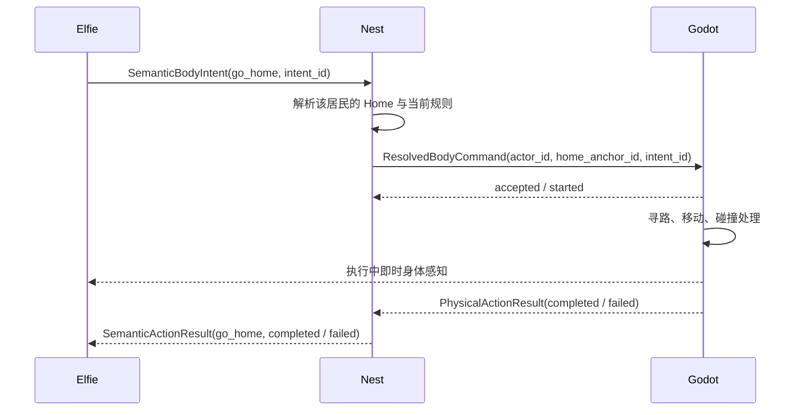
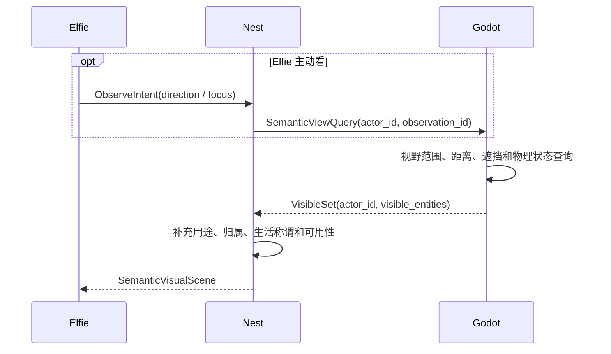
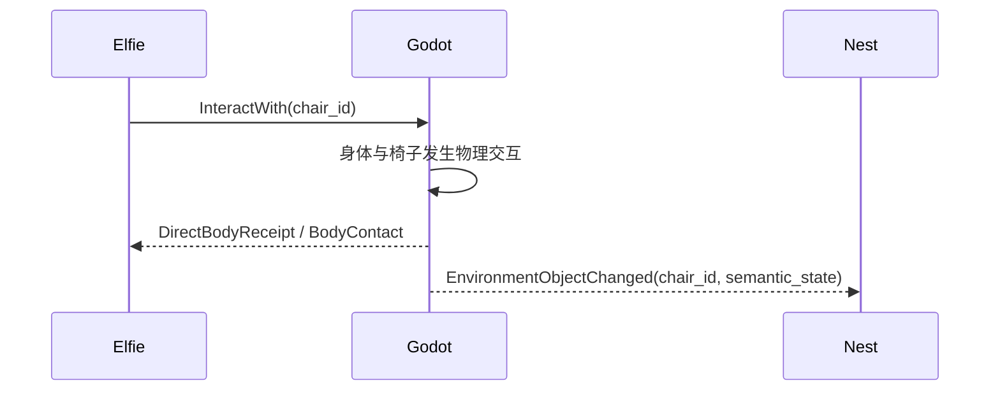
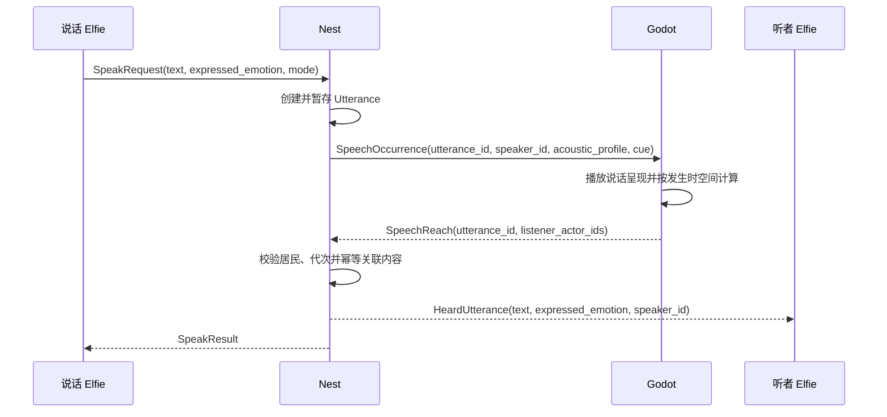
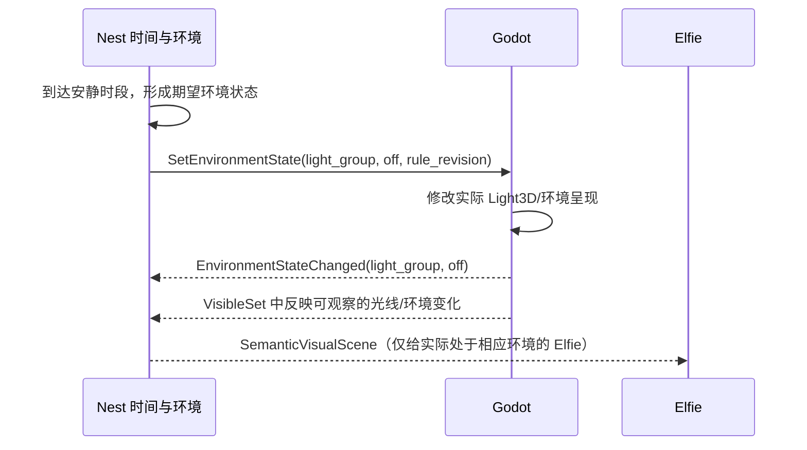

# Nest 与 Godot 虚拟生活世界最终设计

> 状态：内部目标设计定稿
> 整理日期：2026-08-13
> 文档性质：功能边界、模块关系、信息流和对抗审查；不代表当前代码均已实现
> 上位基线：[Elfie 整体故事、生命形态与功能体系](./elfie-overall-story-and-functional-system.md)
> 当前系统约束：[系统架构契约](../developer/contracts/system.md)
> 规范性边界：[Nest–Godot 语义世界契约](../developer/contracts/nest-godot-semantic-world.md)

## 1. 最终结论

1. 一套运行中的 ElfieNest 只有一个 Nest 和一个当前权威 Godot Runtime。
2. Nest 有四个一级功能模块：**空间与设施、巢内生活规则、时间与环境、精灵与巢交互**；另有一套
   横贯四个模块的公共事件机制。事件机制不是第五个业务模块，广播只是事件的一种受众范围。
3. **Elfie 是自身身体行为的唯一意图发起者。**Nest 可以在同一次已授权请求中解析生活语义并转发
   已解析的身体命令，但不能脱离 Elfie 请求自行决定、定时触发或改写 Elfie 的身体行为。
4. Nest 与 Godot 的常规关系是“环境规则与环境事实”：Nest 可以控制灯、门锁、环境阶段等世界对象，
   Godot 把椅子移动、门开合、灯光实际状态等环境事实返回 Nest。
5. `Elfie -> Nest -> Godot -> Nest -> Elfie` 是统一的**语义—物理闭环**，适用于回自己的床、去厨房、
   找可用杯子、虚拟说话和主动观察等需要生活语义与物理世界共同完成的请求。
6. 已经具有明确物理目标、无须生活语义解析的即时身体动作，直接在 Elfie 与 Godot 之间流动。
7. 虚拟视觉默认使用结构化语义感知：Godot 计算当前真正可见的实体，Nest 补充生活语义后交给 Elfie；
   不给每只 Elfie 建独立渲染视口，也不走截图和图像模型。
8. 一个语义事件只有一条投递路径。同一次物理过程可以产生多个不同事实，但它们必须有不同事件类型和
   唯一接收者，只用共同的 cause ID 表明来自同一原因。
9. Godot 的五类功能能力不等于五套项目代码。引擎已经实现大量底层原语，项目只补语义映射、对象状态、
   空间判断和协议接入。

本文不定义最终类名、数据库表、协议字段全集、物理阈值或开发排期。

## 2. 四部分总契约

| 部分 | 核心职责 | 回答的问题 | 明确不拥有 |
| --- | --- | --- | --- |
| Elfie | 个体意图、认知、身体行为发起、身体感知、情绪、记忆和反应 | 我想做什么、身体感受到什么、如何回应？ | 家庭共享规则、3D 几何、环境对象权威 |
| Nest | 空间与设施、巢内生活规则、时间与环境，以及精灵参与虚拟生活所需的语义交互 | 这个家里有什么、遵守什么规则、怎样把生活语义与物理世界拼成一次完整感知或行动？ | Elfie 身体意图、物理模拟、真实 Elfie 对象 |
| Godot | 场景、虚拟身体、物理、导航、环境对象、空间判断和呈现 | 物理上能否发生、实际发生了什么？ | 居民归属、家庭规则、说话内容、精灵认知 |
| App | 装配、Runtime 生命周期、故障恢复和产品接口 | 怎样让前三者被正确创建、连接和恢复？ | 日常身体控制、第二套世界规则、第二物理 authority |

最短判断规则：

| 问题 | 唯一回答者 |
| --- | --- |
| “我想不想回床？” | Elfie |
| “我的床是哪张？” | Nest |
| “怎样走过去、是否撞墙、是否真正到达？” | Godot |
| “我此刻物理上能看见哪些实体？” | Godot |
| “看见的实体在这个家里意味着什么？” | Nest |
| “晚上十点灯应该关闭吗？” | Nest |
| “灯是否真的关闭了？” | Godot |
| “一句话说了什么、最终交给哪些有效居民？” | Nest |
| “当时哪些身体处于可听范围？” | Godot |
| “谁启动、停止和恢复 Runtime？” | App |

## 3. 先按语义对象分流

系统不按“都是 Godot 消息”进行广播，而是先判断一条命令或事实的**主语是什么**。

| 语义对象 | 方向 | 例子 | 唯一接收边界 |
| --- | --- | --- | --- |
| Elfie 身体 | Elfie -> Godot | 走路、转身、坐下、表情、碰门 | 对应 Godot actor |
| Elfie 身体 | Godot -> Elfie | 动作完成、撞击、触觉、本体状态 | 对应 Elfie Body |
| Nest 生活语义 | Elfie <-> Nest | 查询 Home、查询设施规则、读取时间 | 请求方 Elfie / Nest |
| 语义身体请求 | Elfie -> Nest -> Godot -> Nest -> Elfie | 回家、去厨房、找可用杯子 | Nest 解析，Godot 执行，原 Elfie 收结果 |
| 语义视觉 | Elfie -> Nest -> Godot -> Nest -> Elfie；重大变化可由 Godot -> Nest -> Elfie | 可见实体集合及生活含义 | Godot 算可见性，Nest 补充语义，目标 Elfie 接收 |
| 环境对象 | Nest -> Godot | 定时关灯、切换昼夜呈现、锁定公共门 | 对应 Godot world object |
| 环境对象 | Godot -> Nest | 椅子被移动、门实际打开、灯实际熄灭 | Nest |
| 虚拟说话 | Elfie -> Nest -> Godot -> Nest -> Elfie | 内容保存、可听范围计算、听觉投递 | Nest 协调，听者 Elfie 接收 |
| Nest 语义事件 | Nest 模块 -> 事件机制 -> Elfie | 安静时段开始、设施访问规则变化 | 生活规则解析受众，事件路由器唯一投递 |
| Runtime | App <-> Godot Bridge | ready、generation、场景握手、身体绑定、断线与恢复 | App Lifecycle |

路由的核心规则不是“谁调用了 Godot”，而是“这条事实描述的是谁”。

例如，Elfie 推动一把椅子可能产生三个不同事实：

1. `BodyActionCompleted`：这只 Elfie 的动作结果，只给该 Elfie；
2. `BodyContact`：该身体感到的接触，只给该 Elfie；
3. `EnvironmentObjectChanged(chair_id)`：椅子的环境状态发生变化，只给 Nest。

它们来自同一次物理过程，可以共享 cause ID，但不是同一个事件走了三遍。

## 4. 最终整体关系



逻辑通道可以共享一条认证连接，但 Gateway 必须按语义对象分流，不能把一条 Godot 事件发送给所有
Elfie 后再额外送给 Nest。App 负责建立连接，不成为日常业务消息的跳板。

## 5. 七类业务路径

### 5.1 明确目标的身体动作：Elfie 直接连接 Godot

```text
Elfie -> Body Port -> Godot actor
Elfie <- BodyReceipt / BodyPerception <- Godot actor
```

适用范围必须同时满足：目标已经明确，不需要查询归属、用途、可用对象或家庭规则；动作只改变自身
身体或与一个已知对象进行物理交互。例如：

- 原地转身、停下、走一步和看向已知方向；
- 普通表情、姿态和动画；
- 移动到已经解析好的 anchor ID；
- 与已经确定的 object ID 进行物理交互；
- 撞击、触觉、阻塞、到达和动作失败；
- 即时触觉、本体状态和动作回执。

Nest 不参与、不审批，也不保存这些直接动作的进行中状态。路径规划仍由 Godot 完成；**是否寻路不是
判断是否经过 Nest 的标准，是否需要生活语义解析才是。**

### 5.2 纯生活语义查询：Elfie 直接连接 Nest

```text
Elfie -> NestQuery
Elfie <- NestResult
```

只查询信息、不要求立即执行物理行为时使用，例如“我的床是哪张”“现在是不是安静时段”。

行动场景不采用“先把 ID 返回 Brain，再让 Brain 重新思考如何操作”的两轮模式。三种选择固定如下：

| 请求情况 | 路径 | 原因 |
| --- | --- | --- |
| 只想知道信息 | Elfie -> Nest -> Elfie | 查询本身就是目的 |
| 想完成一个带语义目标的行为 | Elfie -> Nest -> Godot -> Nest -> Elfie | 一次 intent 内完成解析、执行和结果关联 |
| 已掌握明确目标且无需当前规则判断 | Elfie -> Godot -> Elfie | 不为形式上的统一增加跳转 |

不能把“我的床”直接交给 Godot，因为这会把居民归属塞进物理引擎；也不能默认拆成两次 Brain Turn，
因为这会增加延迟、模型调用和中途状态漂移。默认最可靠的是下一节的一次性语义行为。

### 5.3 语义身体行为：一次请求完成解析和执行

当目标由“我的、可用的、最近合适的、厨房里的”等生活语义描述时，使用统一闭环：

```text
Elfie -> Nest: SemanticBodyIntent(go_home)
Nest -> Nest: 解析 Home、检查规则
Nest -> Godot: ResolvedBodyCommand(actor_id, target_anchor_id, initiator=elfie)
Godot -> Godot: 寻路和物理执行
Godot -> Nest: PhysicalActionResult
Nest -> Elfie: SemanticActionResult
Godot -> Elfie: 执行中产生的触觉、本体等即时身体感知
```

这是一次请求和一次执行回执，不要求 Brain 再思考一轮。Nest 是确定性的语义解析与关联边界，不是行为
决策者：没有原始 Elfie intent ID、actor ID 和本次授权，Nest 不得创建 Actor 命令；Nest 也不能把
`go_home` 改成另一个行为。

| 权限 | 唯一拥有者 | 含义 |
| --- | --- | --- |
| 行为意图权 | Elfie | 决定是否回家、拿杯子或使用设施 |
| 生活语义解析权 | Nest | 把“我的床、公共椅子、可用杯子”解析成受规则约束的候选 |
| 物理候选与执行权 | Godot | 判断实际存在、距离、可达性，并完成寻路和物理动作 |
| 本次调用关联责任 | Nest | 用原始 intent ID 关联解析、执行和最终语义结果 |

`Elfie -> Nest -> Godot -> Nest -> Elfie` 是逻辑闭环，不要求内部只能恰好往返一次。像“拿最近的可用
杯子”可以在同一个 intent 内由 Nest 先筛选规则允许的候选、Godot 再按当前存在/距离/可达性筛选，
Nest 确定符合原约束的目标后再让 Godot 执行。内部可以有多步确定性交互，但只能产生一个最终结果，
也不能触发第二次模型认知。

适用例子：

- 回自己的床、去厨房、去活动区；
- 找一把当前允许使用的椅子并坐下；
- 找一个可用杯子并进行已定义的拿取动作；
- 使用需要归属、预约或共享规则判断的设施。

Nest 负责选出语义目标和应用家庭规则，Godot 负责路径规划、连续移动、抓取/坐下等物理执行。若请求
包含需要认知选择的开放问题，例如“我应该拿谁的杯子”，Nest 不能擅自决定，必须拒绝或要求 Elfie
给出更明确意图。

### 5.4 结构化虚拟视觉：不渲染每只 Elfie 的摄像头画面

三种方案的取舍如下：

| 方案 | 优点 | 致命问题 | 结论 |
| --- | --- | --- | --- |
| 每只 Elfie 渲染摄像头截图并做视觉理解 | 最接近开放式图像感知 | 多 Viewport 渲染、图像传输和模型推理成本高，结果还不稳定 | 不作为 MVP |
| Nest 自己保存“每只 Elfie 周围有什么” | 查询方便 | 缺少实时朝向、遮挡和物理变化，会复制 Godot 空间权威 | 拒绝 |
| Godot 算可见实体，Nest 补生活语义 | 不渲染像素，仍遵守视野与遮挡，并保持家庭语义边界 | 需要实体语义标注和一个窄的拼装流程 | **采用** |

MVP 不为每只 Elfie 建立独立 Camera3D + SubViewport，不生成截图，也不调用视觉模型。每个 actor 只需
一个不渲染画面的“视觉探针”语义——眼睛/头部 Transform、朝向、视野角和距离。Godot 先按区域或空间
索引缩小候选，再用视野锥和 RayCast/PhysicsDirectSpaceState 查询遮挡，形成 `VisibleSet`：

```text
Godot: VisibleSet(actor_id, observation_id, visible_entities)
  -> Nest: 用稳定 semantic ID 补充设施用途、归属、共享规则和生活称谓
  -> Elfie: SemanticVisualScene
```

Godot 提供的每个可见实体只包含必要物理语义，例如：

- semantic ID 与 entity kind；
- 前/左/右等相对方向和近/中/远距离档位；
- 可观察到的物理状态，例如门开着、椅子被占用、另一只 Elfie 正在移动；
- observation ID、发生时间、world revision 和 runtime generation。

Nest 补充“这是我的床”“这是公共椅子”“这是厨房入口”等家庭语义，但**不保存或自行计算 actor 周围
列表、视野、坐标和遮挡**。`VisibleSet` 是一次短期感知输入，不是 Nest 的长期世界状态。

这一步应当是按 semantic ID 对 Nest 内存目录做一次批量关联，不逐物体查数据库，也不调用模型。
Nest 缓存的是稳定设施语义，不是每只 Elfie 的动态视野，因此多只 Elfie 可以复用同一份目录，而不用
复制多份“周围世界”。

Nest 只补充自己拥有的语义。看到另一个 Elfie 时，Nest 可以确认它是当前居民并给出 resident ID；
“这是我的朋友、我是否信任它”属于接收者 Elfie 自己的关系与记忆，不能由 Nest 越权补充。

视觉采用按需与事件驱动：Elfie 主动看、跨入新区域、朝向显著改变或可见对象发生重要变化时更新；
只传变化或有限数量的重要实体，不按物理帧推送。这样避免多份渲染与图像理解成本，同时仍保留
“我面朝哪里、墙后看不见、对象移动后视野变化”等具身约束。

`SemanticVisualScene` 作为一条身体感知进入 Nervous System 并触发正常的 Embodied Turn；Godot 与 Nest
的内部拼装不会各自再触发一轮认知，也不会让 Elfie 先收到半成品 `VisibleSet`。

这一路径的代价是：没有被场景作者标注为语义实体的纹理细节、图案和意外视觉现象不会被理解。未来若
确实需要开放式视觉，可以把真实截图/VLM 作为可选高成本能力，而不是 MVP 默认机制。

### 5.5 虚拟说话：内容与空间传播闭环

```text
说话 Elfie -> Nest -> Godot -> Nest -> 听者 Elfie
```

说话之所以例外，是因为同一件事同时需要两种 authority：

- Nest 暂存文字、说话者、表露情绪和事件身份；
- Godot 根据事件发生时的位置、距离、墙体和门判断哪些身体可听；
- Nest 把听众 ID 与原语义内容重新关联后投递。

Nest 发送给 Godot 的是一次窄化的 `SpeechOccurrence`，不是可以复用来移动或操纵身体的通用 Actor
命令。说话决定仍由说话 Elfie 作出；Godot 可播放说话动画，但 Nest 因此获得的权限只限本次发言。

### 5.6 环境规则与环境事实：Nest 和 Godot 双向闭环

```text
Godot -> EnvironmentFact -> Nest
```

适用范围包括：

- 椅子、桌子等环境物体发生具有生活意义的位置或状态变化；
- 门实际打开、关闭或被阻挡；
- 灯、环境装置和公共设施的实际状态变化；
- 设施占用状态发生变化。

Godot 只上报离散的语义事实，不把坐标、物理帧和连续运动轨迹灌入 Nest。Nest 可以保存带 revision
和来源的语义投影，但物体的真实坐标与物理状态仍以 Godot 为准。

```text
Nest rule -> EnvironmentCommand -> Godot world object
Nest <- EnvironmentFact / CommandResult <- Godot
```

适用范围包括：

- 到达指定生活时间后开灯或关灯；
- 切换白天、夜晚和安静时段的环境呈现；
- 按家庭规则锁定或解锁公共门；
- 启用、停用或复位某种公共设施。

Nest 决定“环境应该怎样”，Godot 负责“物理上真正变成怎样”。只有 Elfie 明确发起的
`SemanticBodyIntent` 才可解析为 Actor 命令；Nest 自己的时间或环境规则不能把命令目标换成 Elfie。
Godot 离线时，Nest 保留当前期望的环境状态；新 generation 就绪后同步当前状态，不补放所有过期动画。

### 5.7 巢内事件与广播：由事实拥有者产生，按受众唯一投递

```text
Nest 事实拥有模块 -> NestEvent -> 生活规则按需解析受众 -> 事件路由器 -> 目标 Elfie
```

规则广播、定向结果和空间听觉都通过同一事件身份与幂等机制投递，但受众来源不同：规则广播由生活规则
选择居民，定向结果回原请求方，空间听觉由 Godot 物理候选与生活规则共同确定。广播不能替代事件分类，
也不能把 Godot Runtime 原始事件直接发送给全部身体。

以上七类是日常业务路径。启动和恢复时另有一条技术路径：App 启动 Godot authority、绑定当前活动的
虚拟身体、协调 Godot 场景清单与 Nest 语义投影。它只建立运行关系，不替 Elfie 发日常身体命令。

## 6. Nest 的四个一级功能模块

### 6.1 空间与设施

回答：**巢里有哪些地方和环境对象，它们在生活语义上是什么？**

负责：

- Nest ID 与当前语义世界 revision；
- 以 Godot 场景 Manifest 发布的稳定房间、区域、Anchor 和对象 ID 为键的无坐标语义目录；
- 设施类型、用途、能力、有效性和可交互方式；
- 将 Home、活动区、公共门等生活目标解析成 Godot 可识别的语义目标；
- 向“精灵与巢交互”批量提供设施用途、生活称谓等稳定语义；
- 接收 Godot 的环境对象事实，保存规则真正需要的离散语义投影；
- 为环境控制解析目标对象或对象组。

不负责：

- 坐标、尺寸、碰撞形状、导航路径和物理帧；
- 追踪 Elfie 的逐步移动、当前速度或身体动作；
- 谁拥有床、谁能使用设施；这些属于巢内生活规则；
- 驱动角色走向设施；这始终属于 Elfie 与 Godot。

“空间与设施”不是文件目录，也不是 Python 版 3D 场景，而是 Nest 引用环境对象时使用的无坐标语义
视图。物理对象 ID 随 Godot 场景编写并由 Manifest 发布；Nest 只用该 ID 维护生活含义，不创建第二套
物理身份。

### 6.2 巢内生活规则

回答：**谁住在这里、生活资源怎样分配、什么行为被允许、哪些居民应该收到某类巢内事件？**

负责：

- 当前有效居民 ID，以及入住、离巢等 Nest 语义状态；
- 居民与 Home/床位的长期对应关系；
- 私有设施归属、共享设施预约、占用和释放规则；
- 为 `SemanticBodyIntent`、虚拟说话和巢内事件提供权限、可用资源与受众判断；
- 将长期生活规则投影成 Godot 可机械执行的环境限制，例如公共门当前锁定；
- 产生本模块拥有的规则事件，例如设施访问规则变化；
- 为规则广播解析 `all_residents`、指定居民和受影响居民等受众范围；
- 定义环境规则是否允许 Elfie 直接操作覆盖，避免 Nest 与 Elfie 反复争抢对象状态。

不负责：

- 持有或创建真实 Elfie 对象；Nest 只使用居民 ID；
- 脱离明确 Elfie 请求自主发起、改写、定时触发或恢复 Elfie 身体动作；
- 判断角色是否撞墙、如何走路以及处于什么坐标；
- 把普通物理变化重新广播成第二份身体感知；
- 保存说话内容、拼装视觉或关联语义行动结果；这些属于“精灵与巢交互”；
- 承担事件队列、幂等和实际投递；这些属于公共事件机制；
- 数字聊天、联系人和用户消息历史。

生活规则决定“允许什么、影响谁”，但不因此拥有其他模块产生的事件，也不承担底层消息传输。

### 6.3 时间与环境

回答：**这个巢当前处于什么生活时间和环境阶段，规则要求环境怎样变化？**

负责：

- 巢内连续时间、暂停、恢复和时间倍率；
- 白天、夜晚、安静时段等生活阶段；
- 定时环境规则，例如晚上关灯、清晨恢复照明；
- Nest 级环境语义和期望状态；
- 产生时间到达和环境阶段变化等 Nest 语义事件；
- 向 Godot 发出环境对象命令，并接收执行结果；
- Runtime 恢复后同步当前环境阶段和期望状态。

不负责：

- Elfie 自身的能量、困倦、情绪和昼夜节律；
- 命令 Elfie 回床、睡觉或停止当前动作；
- 灯光亮度、天空材质、粒子和音效的具体渲染参数；
- Godot physics tick。

“夜晚开始”可以成为 Elfie 的内部语义触发，但“你现在必须去睡觉”只能由 Elfie 的认知与活动系统
决定，Nest 不能代替它控制身体。

### 6.4 精灵与巢交互

回答：**一只精灵怎样借助 Nest 的生活语义，正确感知并参与 Godot 虚拟世界？**

负责三组完整业务闭环：

- **语义视觉**：接收 Godot `VisibleSet`，批量读取空间设施、生活规则和必要的时间环境语义，形成只给
  对应 Elfie 的 `SemanticVisualScene`；
- **虚拟听觉**：暂存文字、说话者、表露情绪和 utterance ID，让 Godot 计算 `SpeechReach`，再结合
  居民与传播规则形成 `HeardUtterance`；
- **语义行动**：在原始 Elfie intent 授权内解析“我的、公共的、可用的、厨房里的”等目标与规则，
  调用 Godot 完成物理执行，并关联一个 `SemanticActionResult`；
- 保存 observation、utterance 和 semantic intent 的短期关联状态；
- 校验 runtime generation、world revision 和原始请求身份，保证幂等、过期隔离与唯一结果；
- 把完成的结构化感知和结果交给公共事件机制，由外层按 Elfie ID 投递给真实对象。

不负责：

- 替 Elfie 决定要看、要说或要做什么；
- 自主创建、定时触发或改写 Elfie Actor 命令；
- 拥有房间、设施、居民归属、时间环境等源事实；它只读取其他三个模块；
- 计算坐标、导航、遮挡、距离、声音传播和动作成败；这些属于 Godot；
- 持有真实 Elfie 对象、Godot 连接或协议帧。

这个模块是领域功能，不等于当前代码里的 `InteractionHub`。当前 `InteractionHub` 混入数字用户消息、
触觉和碰撞，目标迁移时必须拆开：数字消息回 Communication，身体触觉直达对应 Elfie，只保留真正的
巢内语义交互。

四个模块与事件机制的关系固定如下：



前三个模块是事实与规则所有者，第四个模块是精灵参与世界的语义闭环；公共事件机制只搬运已经成立的
事实。它们可以共用 Nest Facade 和同一个注入的 Godot 语义 Port，但任何模块都不导入具体 Gateway。

## 7. 巢内事件与广播机制

事件机制横贯四个模块，用于表达“巢内某个事实已经成立”，但不成为第五个业务模块。每个模块只产生
自己拥有的事件，公共机制统一处理事件身份、因果、目标、幂等和投递：

```text
事实拥有模块产生 NestEvent
    -> 封装 event_id / cause_id / source / occurred_at / revision / generation
    -> 巢内生活规则在需要时解析受众
    -> 事件路由器按目标 Elfie ID 唯一投递
```

| 事件来源 | 例子 | 受众怎样确定 |
| --- | --- | --- |
| 空间与设施 | FacilityStateChanged、FacilityUnavailable | 原请求方、受影响居民或规则指定居民 |
| 巢内生活规则 | FacilityAccessChanged、ReservationChanged | 规则直接给出受影响居民 |
| 时间与环境 | QuietHoursStarted、EnvironmentPhaseChanged | 规则选择全部或受影响居民 |
| 精灵与巢交互 | HeardUtterance、SemanticVisualScene、SemanticActionResult | Godot 物理候选加规则过滤，或原请求方 |

广播仍然存在，但它只是 `NestEvent` 的一种受众范围：`all_residents`、指定居民集合或受影响居民集合。
“产生事件、决定受众、实际投递”必须分开：源模块产生事件，生活规则解析规则型受众，公共事件路由器
只负责向已确定的目标投递一次。

虚拟说话不是无条件广播。Godot 先给出物理可听候选，生活规则再过滤有效居民和传播限制，交互模块
关联原始内容后形成多个定向 `HeardUtterance`。`SemanticVisualScene` 同样是定向感知，不属于广播。

以下内容不得通过 Nest 广播：

- 动作完成、移动失败和碰撞回执；
- 某只身体的触觉、本体以及 Godot 原始 `VisibleSet`；
- 椅子移动、灯光变化等原始物理感知；
- Runtime ready、断线和协议帧。

环境对象变化进入 Nest 是为了更新生活规则所需的环境投影，不代表 Nest 再把同一个变化广播给每只
Elfie。触觉和本体感知直接来自 Godot；虚拟视觉由 Godot 计算可见性后经 Nest 做一次定向语义补充。
只有环境事实进一步形成了新的生活语义或规则后果时，事实拥有模块才可以产生一个新的 NestEvent。

## 8. Godot 的五类功能能力

这五类是理解 Godot 责任的功能视角，不是要求创建五个目录。

### 8.1 场景与环境对象

- 房间、墙体、地面、门、床、椅子、灯和其他家具；
- 几何、坐标、碰撞体、物理层和空间拓扑；
- 稳定 Zone、Anchor、Object ID；
- 环境对象的实际物理状态和可交互状态；
- 向 Nest 发布无 NodePath、无不必要坐标的语义事实。

### 8.2 虚拟身体与动作

- 创建、同步、休眠和移除 Elfie 虚拟身体；
- 外貌实例、碰撞形状、姿态、朝向和动画；
- 执行 Elfie 直接发出的明确目标动作，以及 Nest 代该 Elfie 转发的已解析语义动作；
- 输出 accepted、started、completed、failed、cancelled；
- 将有意义的触觉和本体变化定向返回对应身体。

### 8.3 物理、导航与移动

- 导航网格、路径查询、局部避障和逐物理帧移动；
- 重力、地面、斜坡、碰撞、防穿透和接触信息；
- 到达、不可达、阻塞、取消和超时；
- 只接收高层身体意图或语义目标，不接受 Python 逐帧坐标遥控。

### 8.4 空间判断

- 区域、距离、邻近、视线、遮挡和接触；
- 虚拟说话对各身体的可达性；
- 根据 actor 朝向、视野范围、距离和遮挡生成不含像素的 `VisibleSet`；
- 将高频空间计算收敛成类型化结果；
- 不保存说话文本，不解释家庭归属，也不决定 Elfie 如何反应。

### 8.5 显示与观察

- 场景渲染、灯光、摄像机、角色动画、表情和可见状态；
- 人类 Observer 所需的只读画面；
- 可选字幕、TTS 和 3D 音频呈现；
- 呈现效果不能成为动作完成或环境命令成功的唯一证明。

## 9. Godot 自带什么，ElfieNest 真正要写什么

| Godot 引擎已经提供的原语 | ElfieNest 只需补充的项目逻辑 |
| --- | --- |
| SceneTree、Node3D、场景资源、Transform | 房间组合、稳定语义 ID、场景/环境对象清单 |
| 渲染器、Light3D、Camera3D、Viewport、材质和环境 | 人类 Observer 画面，以及环境状态到灯光和天空的映射；虚拟视觉默认不渲染像素 |
| PhysicsBody3D、碰撞形状、碰撞检测与响应 | 碰撞层配置、角色运动脚本、显著接触筛选和目标化事件 |
| CharacterBody3D、move_and_slide | 速度与重力、动作推进、到达、阻塞、取消和回执 |
| NavigationServer3D、NavigationRegion/Agent | 导航数据配置、目标选择、按路径驱动身体和失败判定 |
| AnimationPlayer/AnimationTree、资源系统 | 高层动作和表露情绪到已有动画资源的映射 |
| Area3D、RayCast3D、PhysicsDirectSpaceState3D | 组合成 SpeechReach、VisibleSet、邻近、视线和有意义对象变化判断 |
| AudioStreamPlayer3D | 可选的人类听觉呈现；不用于输出 Elfie 听众名单 |
| WebSocketPeer | 协议、认证、generation、消息类型、路由、幂等和恢复 |

判断依据以 Godot 官方稳定版文档为准：
[CharacterBody3D](https://docs.godotengine.org/en/stable/classes/class_characterbody3d.html)、
[3D navigation overview](https://docs.godotengine.org/en/stable/tutorials/navigation/navigation_introduction_3d.html)、
[AudioStreamPlayer3D](https://docs.godotengine.org/en/stable/classes/class_audiostreamplayer3d.html)、
[Area3D](https://docs.godotengine.org/en/stable/classes/class_area3d.html)、
[RayCast3D](https://docs.godotengine.org/en/stable/classes/class_raycast3d.html)和
[PhysicsDirectSpaceState3D](https://docs.godotengine.org/en/stable/classes/class_physicsdirectspacestate3d.html)、
[Viewport](https://docs.godotengine.org/en/stable/classes/class_viewport.html)及
[WebSocketPeer](https://docs.godotengine.org/en/stable/classes/class_websocketpeer.html)。

因此，Godot 项目不需要重新实现物理引擎、渲染器、导航算法或动画播放器；但也不能假设引擎自动理解
“回自己的床”“谁听见这句话”“这次碰撞是否值得上报”或“晚上十点执行哪个家庭规则”。

特别注意：

1. CharacterBody3D 是供脚本驱动的角色身体；项目仍须编写运动、重力和动作完成逻辑。
2. Navigation 提供寻路和避障原语；实际角色移动和业务到达条件仍由项目脚本完成。
3. AudioStreamPlayer3D 提供给人类听觉系统的位置音频和距离衰减，不会返回产品需要的听者 actor ID。
4. Viewport 是额外的渲染表面；为每只 Elfie 建视口并读取像素会引入重复渲染和后续图像理解，MVP
   改用物理空间查询生成结构化 `VisibleSet`。
5. WebSocketPeer 只提供帧传输，不提供 Elfie/Nest/App 的语义分流。

## 10. Godot 项目实际只需少量自有代码

Godot 的五类能力可以收敛到三块核心运行代码，加场景资源与观察界面：

```text
godot_project/
├── rooms/                         场景资源与少量环境对象脚本
├── characters/                    虚拟身体资源和共享身体脚本
├── runtime/
│   ├── actor_controller.gd        直接身体命令与已解析语义身体命令
│   ├── world_controller.gd        环境对象、VisibleSet 与 SpeechReach
│   └── websocket_client.gd        连接、协议帧收发
└── ui/                            Observer 与摄像机呈现
```

### 10.1 Actor Controller

只做：

- 接收某只 Elfie 直接发出的明确目标命令，或 Nest 携带原始 Elfie intent 转发的已解析命令；
- 调用身体脚本、导航和动画原语执行；
- 直接命令的最终回执返回 Elfie；语义命令的物理结果返回 Nest，由 Nest 关联原请求；
- 执行中产生的触觉、本体等即时身体感知始终直接返回该 Elfie；
- 播放一次已经由说话 Elfie 发起、Nest 关联的说话呈现。

它不导入 Nest 规则，不把 Actor 事件广播给其他身体。

### 10.2 World Controller

只做：

- 配置和发布场景、Zone、Anchor、Object 清单；
- 接收 Nest 的环境对象命令；
- 发布环境对象的离散语义事实；
- 组合引擎空间查询，计算 SpeechReach 和 actor 对应的 `VisibleSet`；
- 保持 Godot 对实际环境状态的物理 authority。

它不持有居民 Home 关系，不解释说话内容，也不控制 Elfie 的普通动作。

### 10.3 Runtime Bridge

只做：

- WebSocket 连接、认证和协议版本；
- runtime ID、generation、world revision 和消息身份；
- 按 `actor / semantic_action / visual / environment / speech / runtime` 六种主语路由；
- 超时、重连、取消和幂等。

它是技术边界，不是第六个世界功能模块，也不创造业务事实。

### 10.4 环境对象脚本

大部分静态家具不需要脚本。只有具有独立状态或交互的对象才写窄脚本，例如：

- 灯：接收 on/off 或环境预设并报告实际状态；
- 门：开合、锁定、阻挡和完成状态；
- 可移动椅子：在发生有意义的位置/区域变化时报告；
- 特殊公共设施：启用、停用和占用状态。

不要给每件静态家具都建立业务类，也不要在 GDScript 中复制 Nest 的居民与家庭规则。

## 11. 七组语义接口

| 接口 | 方向 | 内容 |
| --- | --- | --- |
| NestQuery | Elfie <-> Nest | Home、设施语义、生活规则、时间与环境读取 |
| DirectBodyChannel | Elfie <-> Godot | 已知目标的身体命令、直接回执、触觉和本体感知 |
| SemanticAction | Elfie -> Nest -> Godot -> Nest -> Elfie | 语义目标解析、已授权物理执行、语义结果；即时身体感知仍由 Godot 直达 Elfie |
| SemanticVision | Elfie -> Nest -> Godot -> Nest -> Elfie，或 Godot -> Nest -> Elfie | 主动观察/重大变化、VisibleSet、家庭语义补充、SemanticVisualScene |
| SpeechBridge | Elfie -> Nest -> Godot -> Nest -> 目标 Elfie | Utterance 内容关联、SpeechReach、HeardUtterance |
| EnvironmentChannel | Nest <-> Godot | 环境对象命令、对象事实、环境同步 |
| RuntimeControl | App <-> Godot Bridge | 生命周期、场景握手、身体绑定、ready、generation、恢复和健康 |

每条事件进入 Gateway 时必须立即归类：

| 事件类型 | 唯一接收者 | 例子 |
| --- | --- | --- |
| DirectBodyReceipt | 发起直接命令的 Elfie | turn completed、known-target move failed |
| SemanticPhysicalResult | Nest | go_home 对应的 arrived、failed |
| BodyPerception | 发生感知的 Elfie | tactile contact、本体变化 |
| VisibleSet | Nest | 某 actor 当时可见的实体 ID 与物理状态 |
| SemanticVisualScene | 对应 Elfie | 我的床在前方、公共椅子在左侧 |
| EnvironmentFact | Nest | chair moved、door opened、light off |
| SpeechReach | Nest | utterance ID 对应的可听 actor IDs |
| NestEvent | 指定居民 ID | HeardUtterance、QuietHoursStarted |
| RuntimeEvent | App Lifecycle | ready、disconnect、generation changed |

禁止存在 `send_to_all_bodies(event)` 这种默认路由。事件必须先确定类型和目标 ID。

### 11.1 环境对象的规则与物理状态

Nest 和 Godot 对环境对象分别拥有不同事实：

- Nest 拥有规则和期望状态，例如“安静时段灯应关闭”“公共门目前锁定”；
- Godot 拥有实际物理状态，例如“灯已熄灭”“门仍被障碍物卡住”。

Nest 发出的环境命令必须携带规则 revision；Godot 返回实际结果。若 Elfie 直接与对象交互：

- Godot 按当前已同步的环境限制机械执行或拒绝；
- 直接动作的 `DirectBodyReceipt` 返回该 Elfie；语义动作的 `SemanticPhysicalResult` 返回 Nest 关联原 intent；
- 如果对象状态改变，再产生独立 EnvironmentFact 给 Nest。

为避免规则与直接交互反复打架，每条环境规则必须明确一种策略：禁止人工覆盖，或允许覆盖并接受新的
实际状态。不能在没有明确策略时让 Nest 无限重发相反命令。

## 12. 七条关键流程

### 12.1 已知目标的直接身体动作

```text
Elfie -> Godot: TurnLeft / Stop / MoveToAnchor(known_anchor_id)
Godot -> Elfie: DirectBodyReceipt
Godot -> Elfie: 必要的 TactileImpact / Proprioception
```

不需要归属、用途和规则解析时，不经过 Nest。

### 12.2 回自己的床：一个语义请求，不是两轮思考



Brain 只作出一次“回家”决定。Nest 的解析、Godot 的寻路以及结果关联都是同一执行周期中的确定性步骤，
不会再次调用模型让 Elfie 重新想一遍。

### 12.3 去厨房或拿可用杯子

```text
Elfie -> Nest: SemanticBodyIntent(go_to="kitchen")
Nest -> Godot: MoveToAnchor(kitchen_entry)

Elfie -> Nest: SemanticBodyIntent(take="available_cup", constraints=...)
Nest: 从设施语义和生活规则中选出明确 cup_id；必要时向 Godot 查询当前物理候选
Nest -> Godot: InteractWith(cup_id)
Godot -> Nest: PhysicalActionResult
Nest -> Elfie: SemanticActionResult
```

“最近”若依赖当前距离，由 Godot 提供物理候选或排序；“可用、公共、属于我”由 Nest 判断。Nest 不替
Elfie 解决价值选择，也不把一个开放任务无限扩展成自己的智能规划器。

### 12.4 结构化虚拟视觉



Godot 也可以在跨区、显著转向或可见对象重要变化时主动生成受限 `VisibleSet`。无论主动还是被动，
Nest 都不保存“这个 actor 周围永远有什么”，只处理本次观察。

### 12.5 Elfie 移动椅子或撞墙



身体结果和椅子事实是同一 cause 下的两个事件，不是重复投递。

```text
Godot -> TactileImpact -> 被碰撞 Elfie
Godot -> DirectBodyReceipt(failed: movement_blocked) -> 直接命令的 Elfie
Godot -> SemanticPhysicalResult(failed: movement_blocked) -> 若原命令来自语义闭环则交给 Nest
```

普通撞墙不进入 Nest。若碰撞同时移动了环境物体，才另发该物体的 EnvironmentFact。

### 12.6 虚拟说话与听见



Godot 不需要文本；真实 TTS/3D 音频只供人类观察，不参与听众判定。

### 12.7 定时关灯



最后一条是定向视觉感知，不是 Nest 向所有居民广播“天黑了”。如果 Elfie 不在可感知范围内，它只会
收到真正适用于它的 Nest 规则事件，而不会伪装成看见了光线变化。

## 13. 状态归属与恢复

| 状态 | 唯一权威 | 恢复规则 |
| --- | --- | --- |
| 居民 ID、Home、设施归属和生活规则 | Nest | Nest Repository 恢复 |
| 巢内时间、环境阶段和期望环境状态 | Nest | 恢复后同步到新 Godot generation |
| 角色坐标、速度、姿态和身体动作 | Godot / 当前 Body Runtime | Nest 不持久化，不把旧投影当事实 |
| 门、灯、椅子等实际物理状态 | Godot | 新 Runtime 快照重新确认 |
| Nest 所需的离散环境投影 | Nest 中的带来源副本 | generation/revision 变化后失效并重建 |
| 待传播 Utterance | Nest 短期状态 | generation 改变时中断，不自动重播 |
| SemanticBodyIntent 关联 | Nest 短期状态 | 保留 intent ID；换代时中断或对账，不盲目重放 |
| VisibleSet / SemanticVisualScene | Godot 瞬时事实 / Nest 瞬时补充 | 不长期保存；过期即丢弃，重新观察 |
| 直接身体命令与回执 | Elfie Body + Godot | 不进入 Nest 事务恢复 |
| Runtime generation 与健康 | App Lifecycle | App 对账并重建连接 |

Nest 不保存 actor 的逐帧位置、当前速度或视野列表。它只为明确的语义行为保存短期 intent 关联；当前
区域或可见实体必须来自带 generation 的 Godot 事实，不能成为第二物理权威。

## 14. 对抗审查记录

| 场景 | 错误设计 | 最终处理 |
| --- | --- | --- |
| Elfie 原地转身或眨眼 | 所有动作都先经过 Nest | 明确目标的即时动作直接使用 DirectBodyChannel |
| Elfie 回床 | 先问 Nest，再让 Brain 思考第二轮发移动命令 | 一个 SemanticBodyIntent 内完成解析、执行和语义结果 |
| Nest 转发回床命令 | 把转发误认为 Nest 可以自主控制 actor | 命令必须携带原始 Elfie intent 与授权；Nest 不能自行创建或改写 |
| 所有寻路都走 Nest | 把物理寻路误认为生活语义 | 已知 anchor 直达 Godot；只有目标选择需要语义时才经过 Nest |
| 每只 Elfie 都装 Camera/Viewport | 重复渲染截图，再花模型成本理解 | Godot 空间查询产生 VisibleSet，Nest 补充生活语义 |
| Nest 直接保存“周围有什么” | 形成过期的第二空间权威，无法正确处理朝向和遮挡 | Nest 只处理一次性 VisibleSet，不保存动态视野 |
| Godot 直接给完整语义视觉 | Godot 被迫理解“我的床”“公共设施” | Godot 只给物理可见事实，Nest 补家庭语义后定向投递 |
| Elfie 坐语义上的“可用椅子” | 直接交给 Godot，Godot 被迫理解家庭规则 | SemanticBodyIntent 由 Nest 选定 chair ID，再交 Godot 执行 |
| Elfie 撞墙 | 触觉先入 Nest 再转发 | 只给对应 Elfie |
| Elfie 推动椅子 | 同一个事件走 Body 与 Nest 两遍 | DirectBodyReceipt 与 ChairChanged 是不同事实，共享 cause ID |
| 虚拟说话 | 直接 Body 广播文本，或模拟 TTS/STT | Nest 保存内容，Godot 只算 SpeechReach，Nest 定向投递 |
| Nest 获得语义动作入口 | 顺势扩展成自主 Actor 控制 | 只解析原始 Elfie intent；定时规则不能产生 Actor 命令 |
| 定时关灯 | 因为 Nest 不控制身体而漏掉 Nest -> Godot | Nest 控制环境对象，Godot 返回实际结果 |
| 灯光变化 | Nest 向所有居民广播“你看见变暗” | Godot 只为实际可见者生成 VisibleSet，Nest 定向补充语义 |
| Elfie 打开已知且无待解析规则的门 | 每次动作都绕 Nest | 直接 Godot；门状态变化另报 Nest |
| 环境规则与直接交互冲突 | Nest 与 Elfie反复争抢灯或门 | 规则明确禁止覆盖或允许覆盖，不做无策略反向重发 |
| Godot 原始事件 | 默认发送给所有 Body 和 Nest | 按 actor/semantic_action/visual/environment/speech/runtime 唯一分流 |
| Runtime 重连 | 旧说话或环境命令再次产生副作用 | generation 隔离；当前环境状态重同步，旧副作用不重播 |
| 视觉、听觉和语义行动散落 | 分别塞入空间设施和生活规则，导致同一闭环由多个模块保存短期状态 | 独立“精灵与巢交互”，统一三类语义—物理闭环 |
| 事件在模块重分后丢失 | 把事件当成某个单一模块，或者默认广播全部 Runtime 事件 | 四个模块各自产生所属事件，公共事件机制按类型与目标唯一投递 |
| 模块继续膨胀 | 把广播、居民、恢复、Gateway 各立业务模块 | 广播属于事件受众语义；恢复和 Gateway 是技术能力，不再新增业务模块 |

审查结论：视觉、听觉和语义行动已经具有共同流程、独立短期状态和统一约束，应收敛为第四个一级功能
模块“精灵与巢交互”。`Elfie -> Nest -> Godot -> Nest -> Elfie` 不是说话专线，而是语义—物理闭环；
回家、语义选物、主动观察和说话共享协调骨架，但每种请求仍保持窄类型，不能演变成 Nest 的通用身体
遥控器。事件没有并入第四模块，而由公共事件机制承接四个模块产生的事实。

## 15. 对照当前代码的主要差距

以下是设计差距，不是本文件授权的实现任务：

1. 当前 `NestRuntimeEventRouter` 将多类 Runtime 事件遍历发送给所有 Body transport，然后又把说话和
   触觉送入 Nest，尚未按事件主语唯一分流。
2. 当前触觉进入 `InteractionHub`，而目标设计要求身体触觉只进入对应 Elfie。
3. 当前 `InteractionHub` 混合虚拟说话、用户消息、碰撞和触觉；数字消息与身体事件都不应属于 Nest。
4. 当前 Godot `actor_controller.gd` 把文本带入说话命令，并用“最近 Zone 相同”近似听众；目标是
   utterance ID + 距离/墙/门等 SpeechReach。
5. 当前说话事件也会先广播到所有 Body transport，再由 Nest 投递，存在重复或错误接收者风险。
6. 当前触觉转换会改换事件身份，且 Python 根据归一化强度猜造牛顿数，破坏物理 authority。
7. 当前 `NativeSensors` 尚未真正承接 Godot 定向身体感觉。
8. 当前 Nest 保存 `posture` 和 Runtime actor mirror 等身体投影，边界上需要收缩为规则真正需要的最小、
   带 generation 的只读投影。
9. 当前 `WorldRuntimePort` 同时承载世界配置、actor 同步和事件排空，语义上仍未显式区分 Body、
   SemanticAction、Visual、Environment、Speech 和 Runtime 路由。
10. 当前 Godot 还没有灯、门、椅子等环境对象的统一语义命令与 EnvironmentFact。
11. 当前多数家具是静态场景资源，门、灯和可移动设施尚缺少窄状态脚本与稳定 object ID。
12. 当前 Nest 时间只推进 elapsed seconds，还没有生活阶段、定时环境规则和环境状态同步。
13. 当前 actor catalog 携带 Home anchor 并由 Godot actor 保存 Home 元数据；目标上 Home 归 Nest，
    Godot 只需要执行 Elfie 已解析出的语义目标或初始 spawn 配置。
14. 当前消息模型没有以 `actor / semantic_action / visual / environment / speech / runtime` 为首要路由
    主语，也缺少环境对象命令、环境事实及同因果多事实的稳定关联。
15. 当前 `movement_blocked` 与最终动作 terminal 的语义边界仍不清晰；目标上接触感受与命令失败可以
    共享 cause ID，但不能把同一个失败结果作为两种事件重复投递。
16. 当前 `VisionSensor` 仍以 Godot Camera3D 截图路径和文件名猜测物体，既不是真实视觉，也不符合目标
    结构化视觉；应由 `VisibleSet -> SemanticVisualScene` 取代。
17. 当前 Godot 没有按 actor 朝向、距离和遮挡生成 `VisibleSet` 的能力，Nest 也没有只做瞬时语义补充的
    视觉边界。
18. 当前缺少 `SemanticBodyIntent -> ResolvedBodyCommand -> SemanticActionResult` 的一次性确定性闭环；
    Home 等语义和实际动作仍未按该规则贯通。
19. 当前 `nest/events.py` 只有少量领域值对象，尚没有统一的事件身份、cause ID、受众范围、generation、
    幂等与定向投递契约，不能承担本设计的公共事件机制。
20. 当前 `nest/state + engine + interaction` 是历史实现结构，不等于本设计的四个功能所有权。迁移必须先
    定义窄契约和验收场景，再按完整功能切片收缩旧职责；不得仅为匹配图示创建空目录或机械改名。

## 16. 最终守恒规则

1. Nest 始终只有空间与设施、巢内生活规则、时间与环境、精灵与巢交互四个一级功能模块；公共事件机制
   横贯四者，但不是第五个业务模块。
2. Elfie 是自身身体行为的唯一意图发起者；Nest 只能在该 intent 授权范围内解析和转发，不能自主控制。
3. 明确目标的纯物理行为直达 Godot；需要归属、用途、可用对象或家庭规则解析的行为走语义—物理闭环。
4. Nest 的解析与 Godot 的执行属于同一次动作周期，不能强迫 Brain 再思考一轮。
5. 路径规划永远属于 Godot；是否需要寻路不决定是否经过 Nest，是否需要生活语义才决定。
6. 虚拟视觉默认是 `Godot VisibleSet -> Nest 语义补充 -> Elfie`，不默认使用每 actor 摄像头、截图或 VLM。
7. Nest 不保存动态视野和周围列表；Godot 不解释“我的床”等家庭语义。
8. Nest 可以自主控制环境对象和环境阶段，但不能用环境规则自主产生 Elfie Actor 命令。
9. Godot 对身体与环境的实际物理状态负责；Nest 对生活规则与期望环境状态负责。
10. 每个模块只产生自己拥有的事件；生活规则在需要时解析受众，事件路由器只做唯一、定向、幂等投递；
    广播只是 `NestEvent` 的一种受众范围。
11. 同一个语义事件只有一个接收路径；同一物理原因产生的不同事实用 cause ID 关联。
12. 触觉和本体直接进入对应 Elfie；VisibleSet 和 SpeechReach 进入 Nest 做定向关联；环境事实进入 Nest；
    Runtime 事件进入 App。
13. 环境事实进入 Nest 不代表再由 Nest 广播为身体感知。
14. Nest 不复制坐标、导航、碰撞和物理帧；Godot 不保存居民归属、家庭规则和说话内容。
15. Godot 功能能力不等于项目模块数量；优先使用引擎原语，只写必要的语义胶水与状态脚本。
16. App 只装配和管理生命周期，不成为日常动作、环境事实、视觉或说话投递的业务总线。
17. 当前实现差距必须按独立切片解决，不能借本设计一次性重构全部 Runtime。
