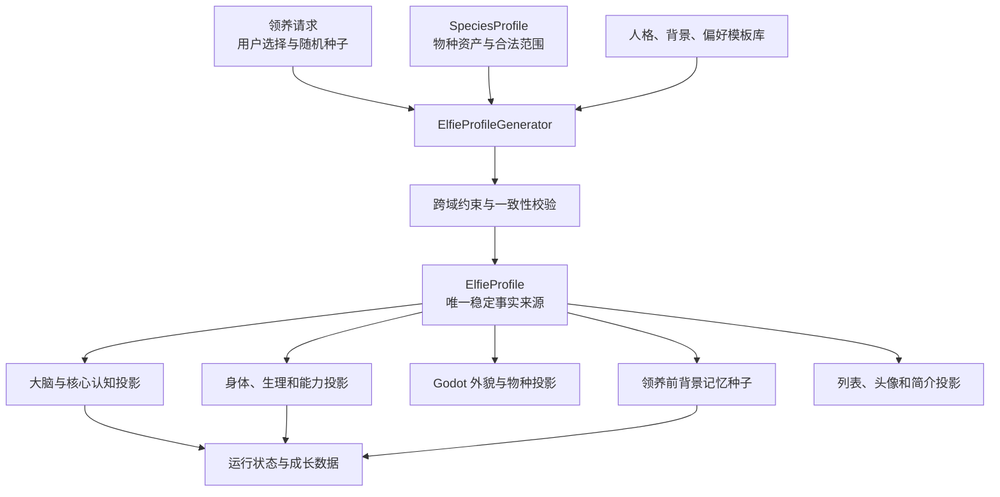

# ElfieNest 精灵个体刻画与初始化体系

本文定义“一个精灵是谁”、领养时如何生成一个完整个体，以及身份、身体、
外貌、人格、背景经历、偏好、能力、记忆和运行状态之间的边界。本文是后续
重构领养流程、`Elfie`、持久化、Godot 外观同步和大脑提示词的
架构依据。

外貌字段和物种母版见
[外貌参数与物种母版规范](../../godot/characters/APPEARANCE_SYSTEM_SPEC.md)。
Blender 母版制作见
[Blender 动物外貌母版制作教程](../../godot/characters/BLENDER_APPEARANCE_AUTHORING_GUIDE.md)。

## 1. 设计结论

一个精灵应由一份版本化的 `ElfieProfile` 完整刻画。它不是三份互相独立的
YAML，也不是 `Elfie` 创建时临时拼起来的若干参数。

`ElfieProfile` 至少包含以下九个部分：

1. 身份：名字、物种、个体 ID、生命阶段和领养时间。
2. 具身：主要运动形态、可用形态、物种身体配置和生理基线。
3. 外貌：稳定的外貌基因、颜色、花纹和装备身份。
4. 人格：Big Five、气质、核心动机和关系倾向。
5. 出身：领养前背景事实、形成性经历和初始世界认知。
6. 偏好：喜欢、厌恶、安抚方式、压力源、习惯和兴趣。
7. 能力倾向：天赋方向、领养前技能和可追溯的初始知识。
8. 表达：说话节奏、口癖、主动性、声音和非语言表达倾向。
9. 生成来源：随机种子、生成器版本、物种配置版本和用户选择记录。

能量、疲劳、当前情绪、姿势、房间位置、与主人的实时关系和领养后的记忆
不属于稳定档案。它们是运行状态或成长数据，必须单独持久化。

## 2. 已识别问题与当前收口状态

### 2.1 物种和运动形态混为一谈

早期领养流程让用户选择 `anatomy_type = biped | quadruped`，页面将它描述为
“动物形态”。但它只能表示双足或四足运动形态，不能表示狐狸、狗、猫或兔。

当前代码已经把正式领养入口收口到 `species_id`，并在 `profile.yaml` 中保存
`embodiment.primary_morphology`。`anatomy_type` 仍保留在数据库、调试平台和旧测试中，
只作为历史读取和兼容字段。

正确边界：

```text
species_id       = fox | dog | cat | rabbit
primary_morphology = biped
supported_morphologies = [biped]
```

未来完成四足资源后，同一只狐狸可以拥有 `biped` 和 `quadruped` 两种运动
形态，但它的 `species_id` 仍然是 `fox`。

### 2.2 个体事实分散且互相重复

当前仍有部分兼容数据分散在：

- SQLite `elfie_registry`：名字、旧 `anatomy_type` 兼容列、`species_id`、性格预设、
  身高和胖瘦。
- `profile.yaml`：当前稳定事实来源，包含身份、外貌、具身形态、人格、能力和系统限制。
- 旧 `personality.yaml`、`capabilities.yaml`、`system_limits.yaml`：迁移期继续双写。
- `Elfie`：新代码优先读取 profile；显式传入的 `anatomy_type` 只作为旧测试和老配置兜底。
- Godot 同步载荷：当前已从 `AppearanceResolver` 获取稳定外貌投影，但骨骼缩放、
  材质参数和精细碰撞仍需后续 Godot 表现层单独实现。

同一事实有多个来源，更新其中一个不会自动更新其他位置。

### 2.3 能力被当成个性随机生成

当前生成器随机挑选 `supported_actions`。但一个动作是否可用，应由物种骨架、
当前运动形态、已安装动画、载体硬件和安全策略共同决定，不能因为随机结果
让同一套模型有时能摇尾巴、有时不能摇尾巴。

### 2.4 人格只停留在标签和提示词

当前性格预设主要生成 Big Five 区间、几句问候语和口癖。虽然情绪模块支持
人格调制，但 `Elfie` 创建 `EmotionSystem()` 时没有注入该个体的
Big Five。大量认知和动作文本仍硬编码“艾菲”“小狐狸”“傲娇”。

### 2.5 核心认知混入了未经证实的事实

当前核心认知会根据精灵自己的尽责性生成“主人总是很可靠，会按时照顾我”。
精灵的人格不能证明主人的行为。刚领养时也不应直接相信“主人是我最信任的
人”。关系认知必须从初始陌生关系和真实互动逐渐发展。

### 2.6 缺少领养前背景和偏好

当前没有稳定的数据结构描述：

- 精灵来自哪里、此前生活在什么环境。
- 它经历过哪些形成性事件。
- 它为什么谨慎、好奇、黏人或独立。
- 它喜欢什么食物、活动、触摸方式、场所和声音。
- 哪些事能安抚它，哪些事会让它紧张。

因此不同精灵虽然 Big Five 数值不同，仍容易说出相似的话、做出相似反应。

### 2.7 原始 YAML 编辑接口缺乏领域约束

当前 API 允许用户直接覆盖三份 YAML 文本。它无法保证名字、物种、人格、
能力、外貌和数据库索引保持一致，也无法为已领养个体执行版本迁移。

## 3. 统一领域模型



`ElfieProfile` 是稳定事实来源。其他模块只能读取它或保存自己的动态状态，
不能在运行时悄悄创造另一份名字、物种或人格配置。

## 4. 术语与边界

| 概念 | 示例 | 是否稳定 | 归属 |
|---|---|---:|---|
| 物种 | `fox`、`dog` | 是 | `identity.species_id` |
| 运动形态 | `biped`、`quadruped` | 支持集合稳定，当前形态可变 | `embodiment` 与运行状态 |
| 外貌基因 | 头宽、眼睛、花纹、身材参数 | 是 | `appearance` |
| 人格 | Big Five、气质、核心动机 | 基本稳定，可小幅成长 | `personality` |
| 出身背景 | 领养前环境和形成性经历 | 是 | `origin` |
| 初始偏好 | 喜欢的食物、活动和安抚方式 | 可成长 | `preferences` |
| 能力 | 能否摇尾巴、行走、游泳 | 由载体和形态派生 | `capability_profile` |
| 生理基线 | 代谢、睡眠、恢复效率 | 稳定 | `physiology` |
| 当前情绪 | 开心、害怕、依恋强度 | 否 | 运行状态 |
| 真实记忆 | 领养后的互动事件 | 否 | 记忆数据库 |
| 当前关系 | 信任、熟悉度、依恋和冲突 | 否 | 关系与记忆系统 |
| 衣服与配件 | 眼镜、帽子、项圈 | 可更换 | 装备状态 |

## 5. `ElfieProfile` 结构

### 5.1 身份 `identity`

```yaml
identity:
  elfie_id: elfie_20260719_ab12
  display_name: 小橘
  species_id: fox
  life_stage: young
  adopted_at: "2026-07-19T08:30:00+08:00"
```

规则：

- `elfie_id` 创建后永不改变。
- `display_name` 允许用户改名，但必须通过领域 API 修改。
- `species_id` 领养确认后冻结，不使用 ID 哈希推断。
- `life_stage` 第一版使用有限枚举，不根据现实日期自动衰老。
- 所有用户称谓属于关系数据，不写死为“主人”。

### 5.2 具身 `embodiment`

```yaml
embodiment:
  species_profile_id: fox_v1
  primary_morphology: biped
  supported_morphologies: [biped]
  skeleton_profile_id: humanoid_mixamo_v1
  capability_profile_id: fox_biped_v1
  physiology_profile_id: fox_standard_v1
```

物种和运动形态共同决定可用模型、骨架、动作、碰撞、尾巴和感知能力。
第一版狗和狐狸都只启用 `biped`。四足形态资源完成前不出现在领养选项中。

### 5.3 外貌 `appearance`

外貌采用
[AppearanceGenome](../../godot/characters/APPEARANCE_SYSTEM_SPEC.md#12-个体-appearancegenome-v1)
定义，包含：

- 宏观身高、骨架粗壮、脂肪和肌肉程度。
- 头、颈、躯干、手臂、腿和手脚比例。
- 胸、腰、腹、臀和四肢局部轮廓。
- 脸型、眼睛、眼皮、口鼻和耳朵。
- 毛发轮廓、色板、花纹和物种私有特征。

外貌种子必须与人格种子独立。禁止形成“胖就温顺”“黑色就凶”“大眼就
胆小”等无业务依据的外貌人格刻板关联。

```yaml
appearance:
  genome_version: 1
  species_profile_version: 1
  seed: 18427
  macro:
    stature_z: 0.32
    frame_size_z: 0.18
    body_fat_z: 1.10
    muscularity_z: -0.20
  proportions: {}
  body_bias: {}
  face: {}
  appendages: {}
  fur: {}
  coat: {}
```

完整外貌参数只保存在档案中。列表页可保存 `short/standard/tall`、
`slim/standard/plump` 等派生标签，但这些标签不能反过来成为事实来源。

### 5.4 人格 `personality`

人格分为基础特质、气质、核心动机和关系倾向四层。

```yaml
personality:
  archetype_id: curious_explorer
  big_five:
    openness: 0.82
    conscientiousness: 0.58
    extraversion: 0.67
    agreeableness: 0.74
    neuroticism: 0.36
  temperament:
    activity_level: 0.70
    novelty_seeking: 0.83
    threat_sensitivity: 0.32
    social_initiative: 0.65
    attachment_need: 0.58
    frustration_tolerance: 0.61
    persistence: 0.56
    sensory_sensitivity: 0.44
  motives:
    belonging: 0.68
    autonomy: 0.45
    exploration: 0.86
    care: 0.62
    mastery: 0.54
    safety: 0.40
  relationship_stance:
    initial_trust: 0.18
    initial_familiarity: 0.05
    approach_to_strangers: cautious_curious
```

Big Five 是稳定人格骨架。气质用于情绪、注意力和行为阈值，核心动机用于
目标选择，关系倾向只定义“如何开始建立关系”，不能提前生成对某个用户的
事实判断。

气质不应完全独立随机。它以 Big Five 为主要来源，再叠加小幅个体偏差：

```text
novelty_seeking 主要由 openness 推导
social_initiative 主要由 extraversion 推导
threat_sensitivity 主要由 neuroticism 推导
persistence 主要由 conscientiousness 推导
attachment_need 由 agreeableness、extraversion 和背景共同影响
```

每个派生气质的小幅独立偏差建议不超过 `±0.12`，避免同一档案内部互相矛盾。

### 5.5 出身 `origin`

出身分成背景事实和形成性经历。背景事实是“这个精灵设定上确实经历过什么”，
不是领养后的实时记忆。

```yaml
origin:
  template_id: greenhouse_wanderer_v1
  origin_summary: 曾在温室照料幼苗，对雨声和植物气味很熟悉。
  environment_tags: [greenhouse, quiet, plants, rain]
  caregiving_context: community_care
  known_facts:
    - 喜欢在植物附近休息
    - 认识常见的雨声和浇水声
  formative_events:
    - event_id: first_storm
      stage: early
      summary: 第一次独自遇到暴雨时躲在花盆后，后来被照料者找到。
      emotional_valence: mixed
      intensity: 0.55
      trait_effects:
        threat_sensitivity: 0.05
      preference_effects:
        comfort_with_rain_when_sheltered: 0.12
```

规则：

- 背景从受控模板和结构化片段生成，LLM 第一版只允许润色摘要。
- 每个形成性事件对单项特质的影响建议不超过 `±0.08`，总影响不超过
  `±0.15`。
- 不生成虐待、严重创伤、疾病或家庭关系等高风险背景，除非产品明确设计并
  提供安全策略。
- 不编造与当前用户已经发生过的互动。
- 背景必须与物种、能力、生命阶段和初始偏好一致。

### 5.6 偏好与习惯 `preferences`

```yaml
preferences:
  foods:
    likes: [sweet_berry, mild_fish]
    dislikes: [very_spicy]
    novelty_tolerance: 0.72
  activities:
    likes: [exploring, gardening, puzzle_play]
    dislikes: [crowded_noise]
  sensory:
    comforting: [light_rain, warm_light, gentle_head_stroke]
    stressful: [sudden_metal_noise, forceful_tail_touch]
  social:
    preferred_distance: near
    affection_style: shared_activity
    conflict_response: pause_then_return
  routines:
    active_period: morning
    sleep_preference: quiet_corner
  interests: [plants, weather, small_mechanisms]
```

偏好来源于物种合法集合、人格、背景和独立个体偏差。偏好是初始倾向，不是
永远不变的事实；真实互动可以逐渐增强、减弱或增加新偏好。

### 5.7 能力倾向与初始知识 `aptitudes`

能力倾向描述“比较容易学会什么”，领养前技能描述“已经练习过什么”，初始
知识描述“确实知道什么”。它们不同于身体能否执行某个动作。

```yaml
aptitudes:
  cognitive:
    observation: 0.76
    spatial_reasoning: 0.58
    verbal_expression: 0.49
    persistence: 0.61
  learned_skills:
    - skill_id: gardening_basic
      proficiency: 0.34
      source_event_id: greenhouse_daily_life
  knowledge_domains:
    - domain_id: common_plants
      familiarity: 0.42
      source: origin
    - domain_id: local_weather
      familiarity: 0.28
      source: origin
```

规则：

- 每项领养前技能和知识必须能追溯到物种配置或背景事件。
- `learned_skills` 不能声明模型和执行器无法完成的身体动作。
- 兴趣不等于知识；喜欢机械不代表已经懂得维修。
- 天赋只影响学习速度和注意力，不直接生成专家能力。
- 领养后的练习和学习进入成长数据，不覆盖初始来源记录。

### 5.8 表达 `expression`

```yaml
expression:
  speech:
    verbal_tick: 呀
    verbosity: 0.46
    initiative: 0.68
    emotional_explicitness: 0.57
    humor_style: curious_observation
    formality: 0.18
    greeting_style: eager_but_not_overfamiliar
  voice:
    voice_profile_id: fox_young_neutral_v1
    pitch_bias: 0.08
    speed_bias: 0.04
    energy_bias: 0.12
  nonverbal:
    gesture_frequency: 0.66
    tail_expression: 0.74
    ear_expression: 0.71
```

表达参数主要从人格和物种能力派生。口癖只是表达细节，不能替代完整人格。
模板中禁止写死“艾菲”“小狐狸”或“傲娇”。

### 5.9 生理基线 `physiology`

```yaml
physiology:
  metabolism: 0.53
  sleep_need: 0.57
  recovery_efficiency: 0.61
  fatigue_sensitivity: 0.48
  circadian_preference: morning
```

生理基线由物种配置提供基础值，再加入小幅个体偏差。外貌只提供有限修正，
例如体型较大时能量消耗略高；不能直接根据 `tall/plump` 标签随机生成一整套
彼此无关的系统阈值。

令牌预算、Provider、联网权限和系统安全限制属于应用策略，不属于精灵个体
生理，必须从 `system_limits.yaml` 的个体随机项中移出。

### 5.10 生成来源 `provenance`

```yaml
provenance:
  schema_version: 1
  generator_version: elfie_profile_v1
  master_seed: 76391842
  domain_seeds:
    appearance: 18427
    personality: 29401
    origin: 48110
    preferences: 55003
    expression: 61082
  user_choices:
    species_id: fox
    personality_direction: curious_explorer
    appearance_direction: soft_round
  generated_at: "2026-07-19T08:30:00+08:00"
```

所有随机结果必须可由版本和种子重现。不同领域使用从 `master_seed` 确定性
派生的独立种子，调整外貌算法时不能意外改变人格或背景。

## 6. 领养时用户选择什么

用户不应手动填写几十个底层参数。第一版领养流程建议只要求：

1. 选择物种：狐狸或狗。
2. 选择候选生成方式：完全随机，或提供外貌/性格方向偏好。
3. 浏览 3 个完整候选，每个候选同时展示头像、体态、性格摘要和背景摘要。
4. 选择其中一个候选。
5. 起名字并确认领养。

可选方向不是最终档案值：

```text
外貌方向：小巧 / 均衡 / 高挑 / 圆润 / 随机
性格方向：活泼 / 温和 / 好奇 / 谨慎 / 独立 / 随机
背景方向：自然 / 家庭 / 工坊 / 旅行 / 随机
```

用户选择“圆润”只改变条件分布，系统仍生成完整的身高、比例、脸型、毛色和
花纹，不能把所有圆润候选做成同一张脸。

`biped/quadruped` 不再作为物种选择项。四足形态只有在该物种资源完成并通过
动画验收后，才作为形态能力出现。

## 7. 完整初始化流水线

### 7.1 输入归一化

把用户选择转换为 `AdoptionIntent`：

```yaml
species_id: fox
appearance_direction: soft_round
personality_direction: curious_explorer
origin_direction: nature
master_seed: 76391842
```

名字可以在候选确认后输入，不参与随机结果，避免改名导致整只精灵换脸。

### 7.2 加载物种配置

读取 `SpeciesProfile`：模型资源、骨架、可用形态、外貌范围、合法色板、能力、
生理基础值、声音范围和背景模板白名单。

### 7.3 生成外貌

使用独立 `appearance_seed`：

1. 采样宏观身高、骨架、脂肪和肌肉潜变量。
2. 条件采样身体局部差异。
3. 采样脸型、五官、耳朵、尾巴和毛发。
4. 采样物种合法毛色与花纹。
5. 执行几何约束和头像辨识度检查。
6. 解析为 Godot 可应用的骨骼、morph 和材质参数。

### 7.4 生成人格

使用独立 `personality_seed`：

1. 根据人格方向选择原型均值和协方差。
2. 采样相关的 Big Five，不逐项完全独立均匀随机。
3. 从 Big Five 推导气质，再加入受限局部偏差。
4. 采样核心动机和初始关系倾向。
5. 检查人格内部一致性和极端值数量。

大部分精灵应位于中间范围。单个个体可以有 1 至 2 个显著特质，但不应五个
维度同时极端。

### 7.5 生成出身背景

使用独立 `origin_seed`，先选结构化背景模板，再选择 1 至 3 个形成性事件。
事件对人格和偏好只产生小幅、可解释的修正。修正后重新执行人格约束。

### 7.6 生成偏好、能力倾向和表达

偏好从物种合法集合中条件采样，并受到人格和背景影响。表达由人格、偏好、
声音资源和可用动作共同解析，不随机声明模型不存在的动作。能力倾向根据
人格生成，领养前技能和知识只能从背景事件与物种基础知识中提取。

### 7.7 跨域验证

必须检查：

- `species_id` 有对应 Godot 场景和物种配置。
- 主要运动形态有对应骨架、动画和碰撞配置。
- 外貌参数位于物种范围内，没有眼睛出脸、比例异常或重复头像。
- 能力是物种、形态、资源和策略的交集。
- 背景没有使用不存在的能力、环境或身体结构。
- 表达模板没有写死其他精灵的名字和物种。
- 背景事实与初始偏好没有直接矛盾。
- 初始关系没有编造当前用户的行为。
- 所有用户明确选择都被保留。

### 7.8 冻结档案与初始化投影

候选确认后：

1. 写入 canonical `profile.yaml`。
2. 将必要索引写入 `elfie_registry`。
3. 生成大脑使用的人格和核心自我投影。
4. 生成身体、生理和能力投影。
5. 将领养前记忆种子写入记忆库并标记来源。
6. 生成 Godot 外貌载荷和标准头像。
7. 创建初始运行状态，注册进房间。

任何一步失败都应整体回滚，不能出现数据库已经有精灵但档案只写了一半。

## 8. 背景经历与真实记忆

经历必须分成三层：

### 8.1 背景事实

稳定保存在 `profile.origin`，描述领养前环境和公认事实。它们不参与艾宾浩斯
遗忘，也不会因为记忆检索失败而消失。

### 8.2 领养前记忆种子

从形成性事件生成少量第一人称记忆节点，写入记忆数据库：

```yaml
memory_source: pre_adoption_seed
origin_event_id: first_storm
canonical: true
occurred_before_adoption: true
```

这些节点可以有情绪强度和关联，但必须能追溯到档案中的形成性事件。

### 8.3 领养后真实记忆

由传感器、对话和行为真实产生，使用 `memory_source: lived_experience`。关系、
信任和新偏好主要从这一层成长。

系统提示词必须区分“我过去的背景”“我模糊记得的经历”和“我与当前用户
真实发生过的事情”，不能把三者拼成同一种事实。

## 9. 核心自我与成长

当前四段核心认知结构可以保留，但应改为档案的派生投影：

| 核心认知 | 初始来源 | 后续更新来源 |
|---|---|---|
| `identity` | 名字、物种、身体、人格和背景 | 改名、重要身份成长 |
| `relation` | 初始关系倾向和刚领养事实 | 真实关系事件和信任变化 |
| `world` | 背景、动机、安全感和兴趣 | 知识、规律与真实经历 |
| `tendency` | 人格、气质、偏好和能力 | 习惯、技能和长期反馈 |

初始 `relation` 应表达“刚认识、愿意逐渐了解”，不能默认高度信任。人格决定
建立关系的速度和方式，不决定用户是否可靠。

`CoreCognition` 是可重建的派生快照，不是唯一事实来源。重建时必须读取
`ElfieProfile` 和已巩固的成长数据，不能只读 `personality.yaml`。

## 10. 稳定数据、成长数据和瞬时状态

### 10.1 领养后冻结

- `elfie_id`
- `species_id`
- 初始外貌基因和物种配置版本
- 出身背景和形成性事件
- 主随机种子和各领域种子

### 10.2 允许受控修改

- 名字
- 衣服和配件
- 对外展示简介
- 用户允许的声音偏好

### 10.3 可以缓慢成长

- 偏好强度和新兴趣
- 技能熟练度
- 核心认知中的世界观和行为倾向
- 对具体用户和其他精灵的关系
- 少量人格适应值；原始 Big Five 基线仍保留

### 10.4 每个 Tick 都可能变化

- 能量、疲劳和睡眠状态
- 当前情绪和表情
- 姿势、位置和当前动作
- 注意力网络和当前目标
- 短期感知缓冲

## 11. 持久化设计

每只精灵目录建议调整为：

```text
<data_home>/elfies/<elfie_id>/
├── profile.yaml            # 唯一稳定档案
├── state.json              # 可恢复的运行状态
├── graph_memory.db         # 记忆、关系和成长数据
├── food_policy.yaml        # 个体食物策略
└── generated/
    ├── portrait.png
    └── profile_summary.json
```

SQLite `elfie_registry` 只保存查询和所有权需要的投影：

```text
elfie_id
owner_user_id
display_name
species_id
primary_morphology
profile_schema_version
profile_revision
config_dir
bed_id
created_at
```

完整人格、外貌和背景不拆成几十个数据库列。列表页需要的头像、体型标签和
人格摘要由 `profile_summary` 生成。

写档案必须使用临时文件加原子替换。数据库插入、档案写入、记忆初始化和
房间注册需要可回滚的创建事务或补偿流程。

## 12. 代码模块边界

建议新增：

```text
elfie/profile/
├── __init__.py
├── models.py               # ElfieProfile 及所有值对象
├── generator.py            # 各领域确定性生成
├── resolver.py             # 派生能力、生理、提示词和 Godot 载荷
├── validation.py           # 字段和跨域约束
├── repository.py           # profile.yaml 原子读写与版本迁移
├── narrative.py            # 简介和核心自我文本投影
└── legacy_adapter.py       # 三份旧 YAML 的兼容投影
```

现有模块调整：

| 现有模块 | 调整方向 |
|---|---|
| `app/features/adoption/generator.py` | 产品侧候选生成编排调用 `elfie/profile` 领域生成器 |
| `app/features/adoption/service.py` | 接收 `AdoptionIntent`、生成候选、确认并事务化保存 |
| `elfie/profile/models.py` | 定义类型化 `ElfieProfile`，不向 Brain 传递松散 YAML |
| `elfie/elfie.py` | 构造时接收完整档案或档案仓库，不再只收 `anatomy_type` |
| `elfie/brain/emotion/emotion_system.py` | 创建时注入个体 Big Five 和气质参数 |
| `elfie/brain/memory/core_cognition.py` | 从完整档案生成初始核心自我，移除硬编码狐狸和主人事实 |
| `elfie/brain/model_context_compiler.py` | 只接收类型化上下文投影，不拼接固定“艾菲、小狐狸、傲娇”设定 |
| `app/orchestration/engine.py` | 从 resolver 获取稳定 Godot 载荷，不解析 YAML metadata |
| `godot/main.gd` | 必须使用明确 `species_id`，迁移完成后删除 ID 哈希兜底 |
| `elfie/nervous_system/*` | 动作、语音和反射文案读取个体身份与表达投影 |
| `app/interfaces/api/user_routes.py` | 删除任意 YAML 覆盖接口，改用类型化档案读取和受限更新 |

## 13. API 与领养页面

建议拆成候选生成与最终确认两个阶段：

```text
POST /api/user/adoption-candidates
  输入：species_id、可选方向和 candidate_count
  输出：candidate_token、候选摘要、头像和可见参数

POST /api/user/adopt
  输入：candidate_token、candidate_id、display_name
  输出：冻结后的 ElfieProfile 摘要
```

候选 token 需要短时有效，并绑定用户、生成器版本、主种子和候选内容哈希，
防止确认阶段偷偷重新随机。

领养页建议改为：

1. 选择狐狸或狗。
2. 选择完全随机或少量方向偏好。
3. 同时查看三个完整候选。
4. 查看候选的外貌、性格、兴趣和两三句背景。
5. 选择候选、命名并确认。

用户不直接编辑 Big Five、背景 JSON 或几十个外貌滑块。开发调试平台可以
暴露完整参数，但必须继续与普通用户产品隔离。

## 14. 生成一致性规则

### 14.1 独立但有关联

- 外貌与人格使用独立种子，默认统计独立。
- Big Five 与气质强相关，但保留小幅个体偏差。
- 人格影响背景模板权重，但背景不能完全由人格反推。
- 背景影响偏好和少量气质，不重写整个人格。
- 物种限制能力、颜色、声音和背景合法集合，不决定道德或性格好坏。

### 14.2 避免模板化

每只精灵至少需要：

- 3 至 5 个外貌身份锚点。
- 1 至 2 个显著人格特质。
- 1 个主要核心动机和 1 个次要动机。
- 1 至 3 个形成性经历。
- 2 至 4 个明确兴趣或偏好。
- 1 个安抚方式和 1 个压力触发点。
- 1 个有辨识度但不过度重复的表达特点。

不能只替换名字和口癖后生成同一个角色。

### 14.3 避免矛盾

- 极度谨慎的精灵可以好奇，但初次接近速度应慢。
- 高独立性不等于不需要关系，只表示更重视自主空间。
- 高神经质不等于持续悲伤，只表示负面刺激敏感和恢复方式不同。
- 背景中害怕巨响时，偏好不能同时声明喜欢突然金属撞击声。
- 不会游泳的形态不能拥有“最喜欢深水潜泳”的初始经历。

## 15. 完整档案示例

以下示例省略外貌的详细子字段，但展示完整边界：

```yaml
schema_version: 1

identity:
  elfie_id: elfie_20260719_ab12
  display_name: 小橘
  species_id: fox
  life_stage: young
  adopted_at: "2026-07-19T08:30:00+08:00"

embodiment:
  species_profile_id: fox_v1
  primary_morphology: biped
  supported_morphologies: [biped]
  skeleton_profile_id: humanoid_mixamo_v1
  capability_profile_id: fox_biped_v1
  physiology_profile_id: fox_standard_v1

appearance:
  genome_version: 1
  species_profile_version: 1
  seed: 18427
  macro:
    stature_z: 0.32
    frame_size_z: 0.18
    body_fat_z: 0.54
    muscularity_z: -0.20
  proportions: {}
  body_bias: {}
  face: {}
  appendages: {}
  fur: {}
  coat:
    palette_id: red
    pattern_id: classic
    eye_color_id: amber

personality:
  archetype_id: curious_explorer
  big_five:
    openness: 0.82
    conscientiousness: 0.58
    extraversion: 0.67
    agreeableness: 0.74
    neuroticism: 0.36
  temperament:
    activity_level: 0.70
    novelty_seeking: 0.83
    threat_sensitivity: 0.32
    social_initiative: 0.65
    attachment_need: 0.58
    frustration_tolerance: 0.61
    persistence: 0.56
    sensory_sensitivity: 0.44
  motives:
    belonging: 0.68
    autonomy: 0.45
    exploration: 0.86
    care: 0.62
    mastery: 0.54
    safety: 0.40
  relationship_stance:
    initial_trust: 0.18
    initial_familiarity: 0.05
    approach_to_strangers: cautious_curious

origin:
  template_id: greenhouse_wanderer_v1
  origin_summary: 曾在温室照料幼苗，对雨声和植物气味很熟悉。
  environment_tags: [greenhouse, quiet, plants, rain]
  caregiving_context: community_care
  known_facts:
    - 喜欢在植物附近休息
    - 认识常见的雨声和浇水声
  formative_events:
    - event_id: first_storm
      stage: early
      summary: 第一次独自遇到暴雨时躲在花盆后，后来被照料者找到。
      emotional_valence: mixed
      intensity: 0.55
      trait_effects:
        threat_sensitivity: 0.05

preferences:
  foods:
    likes: [sweet_berry, mild_fish]
    dislikes: [very_spicy]
    novelty_tolerance: 0.72
  activities:
    likes: [exploring, gardening, puzzle_play]
    dislikes: [crowded_noise]
  sensory:
    comforting: [light_rain, warm_light, gentle_head_stroke]
    stressful: [sudden_metal_noise, forceful_tail_touch]
  social:
    preferred_distance: near
    affection_style: shared_activity
    conflict_response: pause_then_return
  routines:
    active_period: morning
    sleep_preference: quiet_corner
  interests: [plants, weather, small_mechanisms]

aptitudes:
  cognitive:
    observation: 0.76
    spatial_reasoning: 0.58
    verbal_expression: 0.49
    persistence: 0.61
  learned_skills:
    - skill_id: gardening_basic
      proficiency: 0.34
      source_event_id: greenhouse_daily_life
  knowledge_domains:
    - domain_id: common_plants
      familiarity: 0.42
      source: origin

expression:
  speech:
    verbal_tick: 呀
    verbosity: 0.46
    initiative: 0.68
    emotional_explicitness: 0.57
    humor_style: curious_observation
    formality: 0.18
    greeting_style: eager_but_not_overfamiliar
  voice:
    voice_profile_id: fox_young_neutral_v1
    pitch_bias: 0.08
    speed_bias: 0.04
    energy_bias: 0.12
  nonverbal:
    gesture_frequency: 0.66
    tail_expression: 0.74
    ear_expression: 0.71

physiology:
  metabolism: 0.53
  sleep_need: 0.57
  recovery_efficiency: 0.61
  fatigue_sensitivity: 0.48
  circadian_preference: morning

provenance:
  generator_version: elfie_profile_v1
  master_seed: 76391842
  domain_seeds:
    appearance: 18427
    personality: 29401
    origin: 48110
    preferences: 55003
    expression: 61082
  user_choices:
    species_id: fox
    personality_direction: curious_explorer
    appearance_direction: soft_round
    origin_direction: nature
  generated_at: "2026-07-19T08:30:00+08:00"
```

## 16. 迁移方案

### 阶段 1：建立类型化档案，不改变外部行为

1. 新增 `elfie/profile` 模块和 `ElfieProfile` 数据模型。
2. 新领养个体同时写 `profile.yaml` 和旧三份 YAML。
3. 旧 YAML 由 `legacy_adapter` 从档案生成，不再各自随机。
4. 为现有个体提供迁移器：
   - `anatomy_type` 迁入 `primary_morphology`。
   - `height/build` 映射为外貌宏观参数的保守默认值。
   - Big Five 和表达模板迁入人格与表达。
   - 缺失 `species_id` 时使用一次性迁移规则并保存结果，不能继续运行时哈希。

### 阶段 2：所有运行模块改读档案

1. `Elfie` 接收 `ElfieProfile`。
2. Emotion、Brain、Memory、Body 和 Godot payload 从 resolver 获取投影。
3. 移除核心认知和动作文案中的硬编码名字、狐狸和傲娇性格。
4. 能力从物种/形态资源派生，不再随机抽动作。

### 阶段 3：重做领养候选和 API

1. 领养页改为物种选择和完整候选选择。
2. 增加候选生成 API 和候选确认 token。
3. 删除普通用户原始 YAML 编辑接口。
4. 详情页展示档案摘要、背景、偏好和成长状态。

### 阶段 4：移除旧结构

1. 所有存量个体迁移完成后停止写旧三份 YAML。
2. 数据库旧 `anatomy_type/personality_style/height/build` 列降为迁移兼容字段，
   后续 schema 版本再删除。
3. 删除 Godot 的物种哈希兜底。
4. 冻结 `profile schema_version = 1`，后续变更必须显式迁移。

## 17. 测试与验收

### 17.1 生成确定性

- 同一 `generator_version + master_seed + user_choices` 生成完全相同档案。
- 改名字不改变外貌、人格和背景。
- 调整外貌算法不会改变人格和背景种子结果。

### 17.2 数据完整性

- 每个注册精灵都有可解析的 `profile.yaml`。
- `elfie_registry.species_id` 与档案一致。
- 所有配置写入经过类型和值域校验。
- 创建失败不会留下孤立数据库行或半成品目录。

### 17.3 角色一致性

- 不存在外貌决定性格的隐式刻板关联。
- 人格、气质、动机、背景和偏好没有明显矛盾。
- 初始关系没有虚构当前用户的行为。
- 每个精灵至少有足够的外貌、人格、背景和偏好辨识锚点。

### 17.4 运行投影

- EmotionSystem 实际使用个体人格调制。
- Brain prompt 使用正确名字、物种、人格和背景，不包含硬编码艾菲。
- Godot 始终加载档案指定物种和外貌，不按 ID 哈希选择模型。
- 能力只包含当前物种、形态和资源真实支持的动作。
- 领养前背景记忆与领养后真实记忆可以区分和追溯。

### 17.5 兼容迁移

- 旧三份 YAML 能迁移为合法档案。
- 迁移前后名字、Big Five、身高、胖瘦和所有权不丢失。
- 迁移失败时保留备份，不静默生成另一个物种或人格。

## 18. 第一轮实现范围

第一轮先建立正确的数据骨架，不一次实现全部随机内容：

1. 实现类型化 `ElfieProfile`、仓库、校验和版本字段。
2. 明确保存 `species_id`，拆开物种与 `primary_morphology`。
3. 把现有 Big Five、身高、胖瘦和表达字段迁入档案。
4. 增加结构化 `origin`、`preferences` 和 `provenance`，先使用少量受控模板。
5. 让 `Elfie`、Emotion、CoreCognition 和 Godot payload 读取档案。
6. 保留旧 API 和三份 YAML 的兼容投影，先保证现有测试和界面可运行。

完整外貌 genome、三候选领养体验、背景模板扩充和成长型偏好可以在第二轮
接入。第一轮的成功标准是：系统中任何地方询问“这只精灵是谁”，都能从同一
份档案得到一致答案。
