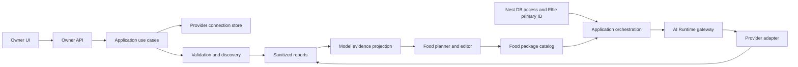
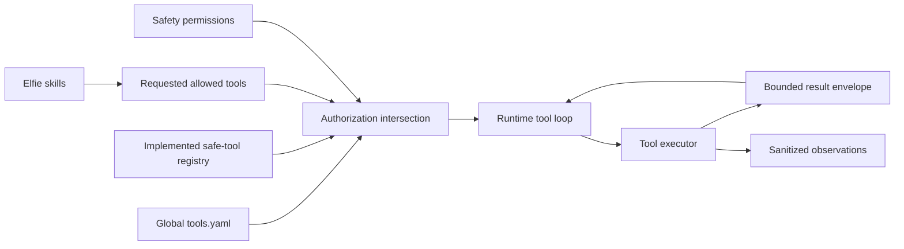

# AI Runtime design contract

**Contract version:** 1.1
**Frozen on:** 2026-07-31

> **Normative authority.** This document is the single design authority for the
> ElfieNest AI Runtime. Code, APIs, UI, persistence and tests must conform to it.
> Other documents may summarize or link to this contract but must not redefine
> Provider, model, food or tool behavior. Current deviations are recorded in
> [AI Runtime conformance](./ai-runtime-conformance).
> The English and Chinese files are synchronized language mirrors of one
> logical contract and must change together.

Implementation work may update code, tests and the conformance register without
changing this contract. A behavior change requires an explicit contract-version
revision before implementation.

## Purpose and boundaries

The AI Runtime gives an Elfie model inference and safe native tools without
owning the Elfie, user accounts, the Nest, Godot or application lifecycle.

| Boundary | Owns |
| --- | --- |
| `ai_runtime/` | Provider products and connections, endpoint models, food definitions and resolution, model execution, tools, permissions, validation and derived reports |
| `elfie/` | One Elfie's brain, memory, emotion and skills; it requests semantic model roles and allowed tools but does not select Providers |
| `app/features/` | Owner use cases, user-to-food access and UI projections |
| `app/infrastructure/` | Nest DB and filesystem adapters |
| `app/orchestration/` | Resolving an Elfie's effective food and composing Elfie requests with the AI Runtime |
| `app/interfaces/` | Owner APIs and visible UI; no independent Runtime facts |
| `app/orchestration/lifecycle/` | Periodic validation scheduling and Runtime process lifecycle |

There is no top-level `runtime/` Python package. Godot, speech, video and future
perception runtimes may be composed by the application later; they do not
change the authority of `ai_runtime/`.

## Two capability planes

The module has two independent planes:

1. **Model plane:** Provider product metadata, configured connections, endpoint
   models, validation evidence, food packages and inference fallback.
2. **Tool plane:** tool definitions, global configuration, request
   authorization, execution safety, bounded results and observations.

Tools are not food roles. Food chooses model capacity; tools provide actions.
Elfie skills decide how a capability is used. In phase one there is no
per-Elfie capability-switch UI.

## Model plane concepts

### Provider product

A Provider product is credential-free metadata such as `openai_api`,
`anthropic_api`, `ollama` or a specific subscription product. It defines:

- official display name and local brand asset;
- API base URL, protocol and authentication mode;
- official model-list endpoint or discovery adapter when the product provides
  one;
- a bundled fallback model list and capability hints;
- whether an implemented OAuth adapter exists;
- product category and search terms used by the Owner UI.

The built-in catalog is the offline baseline. A complete, version-compatible
and schema-valid `${ELFIE_HOME}/configs/provider-catalog.yaml` may replace it on
the next process start. An override containing credentials is rejected. Remote
catalog download is outside phase one, but its source and precedence are
reserved by this contract.

Provider-product discovery and connection-model discovery are related but
different. After a connection is configured, its usable model inventory is
resolved through this ordered source chain:

1. **Official live source:** call the Provider's authenticated model-list
   endpoint or official discovery adapter when one exists.
2. **ElfieNest remote catalog:** if the product has no usable official source,
   use the centrally maintained product/model catalog when that service is
   implemented and reachable.
3. **Bundled local catalog:** if neither remote source is usable, use the
   versioned model list shipped in the installation package.
4. **Manual input:** only after all available indexed sources fail or are empty
   does the UI expand manual model entry.

The first non-empty indexed source seeds endpoint model IDs. Lower-priority
catalogs may enrich missing context, output and capability facts but cannot
override a live Provider result. Manual records are always preserved during
refresh. Remote or bundled catalog entries are candidates, not proof that the
configured account can use them; each must pass validation before food
selection or generation.

### Provider connection

A connection is one configured account, subscription or local endpoint.
Several connections may use the same product. Its backend-generated immutable
ID is readable, for example `openai_api_0001`. Users never edit this ID.

The alias is optional. When omitted, the official product name is used. Editing
the alias never changes references. Credentials are stored separately and the
connection contains only a credential reference.

### Endpoint model

An endpoint model belongs to exactly one connection and stores:

- server-facing `endpoint_model_id`;
- editable display name;
- source: `official`, `remote_catalog`, `bundled_catalog` or `manual`;
- optional context-window and maximum-output overrides;
- optional tools, vision and reasoning capability facts;
- administrator-controlled hidden/retired state.

The UI never asks the user for a canonical model ID. The system may group models
for comparison by catalog identity or normalized display name. Failure to group
models does not prevent their use. Current availability, validation and latency
are observations in the report database, not fields rewritten into Provider
configuration.

### Model reference

Every food role stores an exact
`<connection_id>/<endpoint_model_id>` reference. Display names, product names
and aliases never participate in routing.

Before a food is saved, every reference must resolve to an enabled,
non-archived connection and a present, visible model. Runtime resolves the
reference again for every request. It never guesses a connection or silently
crosses to another subscription.

## Owner workflow

### Provider page

The first section lists configured connections. Each card shows alias, official
product, local/remote status, model count, last validation, latency and health.
Its commands are always:

```text
[Models] [Validate] [Edit] [More]
```

`More` owns enable/disable, archive/restore and delete. Ollama or another
installation-owned connection may be non-deletable but still has health and
model views.

The second section offers five or six common products and one **Add
connection** entry. That entry opens one searchable, categorized chooser.
Custom OpenAI-compatible configuration is the final product option in the same
chooser, not a separate competing flow.

For a known API-key product, the form contains only optional alias and API key.
Base URL, protocol, auth type, internal ID and test-model fields remain hidden.
For an implemented OAuth product, the form starts the official authorization
flow. OAuth is not shown when no adapter exists. Custom products expose alias,
base URL, protocol, authentication and credentials.

The primary action is **Validate and save**:

1. persist the connection and secret atomically enough to preserve correction
   state;
2. validate connectivity and authentication;
3. discover models using the product strategy;
4. merge discovered models without deleting manual records;
5. write sanitized reports and update model evidence;
6. show success, partial success or actionable failure.

A discovery failure does not delete the connection. The dialog expands a
manual-model panel after all supported discovery methods fail.

### Connection model view

The Models command opens that connection's model view. It supports refresh,
single-model validation, hide/show and guarded manual add or edit. Manual input
requires endpoint model ID and display name. Context window, output limit and
capabilities are advanced optional fields; matched catalog defaults are used
when they are omitted.

Refresh merges by endpoint model ID. It preserves manual entries and local
overrides. A previously discovered model that disappears is marked unavailable
instead of being destructively removed. A model referenced by food cannot be
deleted; it can be hidden or retired while retaining diagnostics.

### Cross-connection model matrix

The page-level model matrix is a separate cross-connection comparison view. It
groups equivalent display models while retaining a row for every exact
connection/model pair. Each row includes product and connection, endpoint model
ID, locality, validation state and time, first-token latency, total latency,
context/output limits and capability facts.

**Validate all** runs bounded-concurrency connection and model checks for every
enabled, non-archived connection, then rebuilds one complete comparison
snapshot. A single connection or model validation updates only that cell in the
latest projection. The aggregate records per-cell validation timestamps and
whether the snapshot is `complete` or `partial`, so old and new measurements
are never presented as one simultaneous run.

Atomic Provider/model reports remain the evidence source. The matrix report is
a derived database query and never becomes connection configuration. A
successful Validate-all run is one immutable validation run whose results form
a complete snapshot. A single validation appends one result and therefore
changes only that subject in the latest projection.

### Food page

A clean data home initializes exactly two packages:

- **Emergency food:** the global last-resort package, shown first;
- **Common food:** the global default primary package, shown second.

They may initially be unconfigured and disabled when no valid model exists.
These two system packages can be edited and disabled, but never archived or
deleted. Their immutable IDs and system roles cannot change, while their
display labels may be edited. The page always keeps their two rows.
Administrators use **Add food** to create and rename any number of custom
packages below them. Custom packages can be archived and, after reference
checks, deleted. Compiled fixed food categories do not exist.

The main page is a table with one package per row. It shows package name and
system role, locality (`local`, `remote` or `mixed`), important assigned models,
visibility, effective health, latest evidence time and actions. Health is a
read-time projection from the latest connection/model evidence:

- `unconfigured`: no valid primary model;
- `healthy`: primary and all configured required roles are recently validated;
- `degraded`: primary works but an optional role or internal fallback does not;
- `unavailable`: no executable primary path remains;
- `disabled` or `archived`: excluded by lifecycle state.

Evidence updates recompute affected package rows; a stale stored status is not a
second source of truth.

Each package editor exposes:

- required `primary` model;
- optional `reasoning`, `vision` and `tool` role models;
- an ordered optional `fallback` model or model list;
- locality projection, validation status and source.

Tool permissions are never stored in a food package.

Opening a package shows its role table and two top-level modes: **Automatic
generation** and **Manual edit**, with **Save** as an explicit final action.
Automatic generation first opens a scope dialog where the administrator chooses
one connection, several connections or all connections. Only enabled,
non-archived models whose latest validation is passed and still fresh are
eligible. Explicitly failed, stale or never-validated models cannot be generated
or manually selected until validation succeeds.

Emergency generation defaults to `local first`, then availability and
reliability. The administrator may allow remote candidates, with a warning that
the result cannot protect against network loss. Common-food generation defaults
to balanced quality, latency and availability. Custom packages may choose
either strategy. Rules provide deterministic capability and locality checks; an
optional advisor model may recommend only among the same scoped eligible
candidates.

Generation produces a diff preview, returns to the same editable role table and
never saves automatically. The administrator can adjust every role/model
assignment before saving. Generation never invents a model; when no candidate
exists, the role remains unconfigured with a warning.

The role table uses these rows, in order:

```text
Primary
Reasoning
Vision
Tool
Fallback
```

The food table stays deliberately simple: role, selected model, connection,
local/remote marker and current usable/unusable state. Editing changes only the
model assigned to each role; the Fallback row may open a small ordered-list
editor.

Context size, maximum output, reasoning/tools/vision capabilities, validation
details and latency are model facts. They belong to the connection-model view
and report matrix, not to food configuration. The food model chooser uses those
facts to filter incompatible or unusable models and may link to model details,
but the food page neither edits nor duplicates them. Phase one has no
food-specific context or output budget.

Emergency and Common food are visible to every user. Emergency is reserved for
global fallback and is not selected as an ordinary Elfie primary. Each custom
package has an access action that grants visibility to selected users. Each
Elfie may select Common or one custom primary package from its owner's visible
set.

When an Elfie has no stored primary selection, the global default is considered
if it is enabled and healthy. An explicitly selected primary that becomes
unavailable does not silently switch to another custom package; it proceeds to
Emergency.

### Elfie page

The Elfie UI contains one field labelled **Main food**. Its options are the
enabled, healthy food packages visible to the owning user, excluding Emergency.
Common appears because it is globally visible; a custom package appears only
when that user has been granted access. The UI does not expose an Elfie-specific
emergency package, a second allowed-food editor, Runtime fallback state or
package internals. Runtime health and fallback diagnosis belong to the Owner
food and report views.

## Lifecycle semantics

Provider connections and food packages use the same management meanings:

| Action | Meaning |
| --- | --- |
| Enable | Eligible for new resolution and execution when otherwise healthy |
| Disable | Visible and editable, references preserved, but excluded from new requests |
| Archive | Automatically disabled and removed from normal lists; references, history and reports remain; restore is supported for custom objects |
| Delete | Physical removal only after archive and only when no global, user, Elfie or food reference exists |

Disabling or archiving an assigned primary food makes it unavailable for new
requests and activates emergency resolution. It does not rewrite the Elfie's
stored primary ID. This retained dangling reference is visible in diagnostics.
Emergency and Common are permanent system packages, so archive and delete do
not apply to them.

## Model-plane execution



For every generation:

1. orchestration reads the Elfie's stored primary food ID;
2. it checks user access and the package's enabled, archived and health state;
3. it asks for a semantic role: `primary`, `reasoning`, `vision` or `tool`;
4. a missing optional role falls back to that package's `primary`;
5. execution tries the selected role and then that package's ordered fallback
   models without crossing to an unlisted subscription;
6. only after the primary package is exhausted does Runtime try the global
   emergency package once;
7. if emergency is missing or exhausted, Runtime returns typed
   `no_available_food`;
8. every attempt and fallback reason is recorded without secrets.

The Brain requests semantic roles only. It never imports food, Provider,
credential or Nest DB models. Structured generation uses the same role and
fallback resolver as ordinary generation. A weaker emergency model may use
plain JSON text instead of native schema mode.

## Validation and evidence

Configuration, discovery and validation are distinct facts:

- **configured:** connection metadata and credential reference are present;
- **discovered:** the last discovery attempt and merged endpoint-model list;
- **validated:** an explicit connectivity/model request succeeded;
- **healthy:** a read-time projection of enabled state, recent validation and
  model availability.

Validation and operational reports use the dedicated
`reports/ai-runtime.sqlite` database, not `nest.db` and not one YAML file per
result. `nest.db` remains the authority for accounts, ownership and Nest product
state; report data has a different append rate, retention policy and query
shape.

The report database is append-oriented and owned by one report repository. At
minimum it records:

- `report_runs`: one single, batch, scheduled or benchmark execution, its scope,
  trigger, start/end time and `complete`/`partial`/`failed` status;
- `validation_observations`: immutable sanitized Provider/model result rows
  linked to a run, with stable subject IDs, observed time, status, latency and
  structured error category;
- phase-two Runtime observations and rolling aggregates, without prompt or
  response text.

The **current report** is a query selecting the newest observation for each
subject. An **as-of report** for a historical time selects the newest
observation for each subject whose `observed_at` is not later than that time.
A complete batch report is reproduced by its `run_id`; a single validation
appends only one subject row and naturally changes only that subject in current
projections. There is no need to copy a full daily YAML snapshot.

Model evidence and the cross-connection matrix are query projections that join
configured model inventory with report observations. They are not additional
persisted configuration. Explicit single and bounded batch validation are
phase-one capabilities. Human-readable YAML or JSON may be exported on demand
under `reports/exports/`, but exports are never read back as facts.

The database uses WAL mode, short transactions and indexed stable subject IDs.
Schema migration is explicit. Periodic validation, stale-subscription reminders
and scheduling belong only to the application lifecycle owner.

Phase one stores explicit point-in-time validation. Phase two may add two further
evidence layers in the same database:

- **operational evidence:** sanitized success/error counts, first-token and
  total latency, token totals and quota/auth failures observed from real Runtime
  calls, aggregated over rolling windows without storing prompt or response
  text;
- **scheduled health evidence:** an hourly or daily lifecycle-owned job that
  refreshes configured connections and rebuilds rolling summaries.

Operational evidence may compare latency and reliability for equivalent models
across subscriptions. It must not infer model quality from unrelated private
conversations. Quality comparison requires a later controlled benchmark using
the same prompts, scoring method and execution conditions for every candidate.

## Tool plane



Phase one globally supports:

- web search through a configured search adapter;
- read-only local file access under an explicitly configured root.

Terminal execution, file writes, code execution, task planning, subagents and
skill mutation remain disabled until their isolation and approval contracts are
implemented. Disabled tools are not advertised to a model.

There is one global tool configuration surface in phase one and no per-Elfie
switch UI. The effective tool set is the intersection of globally enabled
tools, the Elfie's internal skill request, the implemented safe-tool registry
and a per-invocation safety permission decision. Skills live
under `elfies/<elfie_id>/skills/`; shared tool implementations live in
`ai_runtime/tools/`. Tools never live in food configuration.

Application orchestration supplies the current Elfie's workspace root with each
request. Read-only file access is confined to that workspace plus explicitly
approved shared asset roots; it cannot read another Elfie's workspace,
credentials, reports or Runtime state.

Every tool defines timeout, item and byte limits. The shared normal/structured
tool loop also enforces one total byte and call budget. The executor wraps output
in a bounded result envelope with `truncated`, original size and retained size.
Secrets, paths outside the allowed root and unsafe command capabilities never
reach the model. Tool calls, decisions, duration and truncation are observed in
sanitized form.

## Persistent data contract

```text
${ELFIE_HOME:-~/.elfienest}/
├── nest.db
├── configs/
│   ├── provider-catalog.yaml
│   ├── providers.yaml
│   ├── runtime.yaml
│   ├── tools.yaml
│   ├── food-packages.yaml
│   ├── food-packages-history/
│   └── credentials/
│       ├── api-keys.env
│       └── oauth/
│           └── <connection_id>.json
├── reports/
│   ├── ai-runtime.sqlite
│   └── exports/                     # optional generated YAML/JSON, never read as facts
├── assets/
│   └── users/<numeric-user-id>/
│       ├── avatar.<ext>
│       └── files/
├── elfies/<8-digit-elfie-id>/
│   ├── assets/
│   ├── godot/
│   ├── profile/profile.yaml
│   ├── conversations/
│   │   ├── history.sqlite
│   │   └── attachments/
│   ├── memory/
│   │   ├── knowledge.sqlite
│   │   ├── daily/
│   │   ├── people/
│   │   └── concepts/
│   └── skills/
├── runtime/
│   ├── runtime.json
│   └── locks/
└── logs/
```

Each file has exactly one typed owner:

| Fact | Source of truth |
| --- | --- |
| Supported Provider products | built-in or validated override `provider-catalog.yaml` |
| Configured connections and endpoint models | `configs/providers.yaml` |
| Provider and tool secrets | `configs/credentials/` |
| Runtime settings | `configs/runtime.yaml` |
| Tool settings | `configs/tools.yaml` |
| Food definitions and global default/emergency IDs | `configs/food-packages.yaml` |
| User-to-food grants | `nest.db.food_package_access` |
| Elfie main-food ID | `nest.db.elfies.main_food_id` |
| Validation runs and immutable observations | `reports/ai-runtime.sqlite` |
| Current, as-of and cross-connection reports | SQL projections from `reports/ai-runtime.sqlite` |
| Derived planner evidence and food health | configured inventory joined with the report database |
| Phase-two rolling Runtime measurements | `reports/ai-runtime.sqlite` |
| Optional human-readable exports | `reports/exports/`, never a fact source |
| Runtime process receipt and locks | `runtime/` |

No writer may deserialize and rewrite a neighboring file as part of an
unrelated setting change. No legacy root file is an implicit fallback source.
Because the product is pre-v0.5, obsolete development schemas are removed and
temporary data homes are rebuilt instead of adding permanent dual-read or
dual-write compatibility.

## Minimal document shapes

`providers.yaml` contains counters and connection instances; credentials are
references only:

```yaml
version: 2
connection_counters:
  openai_api: 2
connections:
  openai_api_0002:
    catalog_id: openai_api
    alias: Work account
    enabled: true
    archived: false
    credential_ref: provider.openai_api_0002
    models:
      - id: gpt-example
        display_name: GPT Example
        source: official
        available: true
```

`food-packages.yaml` contains package definitions and global role IDs:

```yaml
version: 1
global_default_food_id: food_common
global_emergency_food_id: food_emergency
packages:
  food_common:
    display_name: Common food
    enabled: true
    archived: false
    roles:
      primary:
        model: openai_api_0002/gpt-example
      reasoning: null
      vision: null
      tool: null
      fallback: []
```

`tools.yaml` stores only semantic configuration:

```yaml
version: 1
tools:
  web_search:
    enabled: true
    provider: duckduckgo
    max_results: 3
    max_result_bytes: 16000
    timeout_seconds: 5
    max_tool_calls: 3
    max_total_result_bytes: 48000
  local_file:
    enabled: true
    root_policy: elfie_workspace
    max_read_bytes: 65536
    max_items: 200
    max_result_bytes: 16000
    max_tool_calls: 3
    max_total_result_bytes: 48000
```

Schema models in code remain the machine-readable contract. These examples
clarify ownership and must not become a second parser definition.

## Required acceptance flow

A clean temporary `ELFIE_HOME` must prove:

1. initialize permanent Emergency and Common rows in that display order;
2. configure two accounts of one known Provider without editing internal IDs;
3. prove official, remote-catalog, bundled-catalog and manual discovery fallback
   behavior, and preserve a manually added model across refresh;
4. batch-validate all connections, create a complete model-comparison snapshot,
   then single-validate one model and update only its latest cell;
5. generate Emergency with local-first scope and Common with a selected
   connection scope, preview the diff, manually change role/model assignments
   and save;
6. add one custom package, grant it to one user and select it for one Elfie;
7. run primary, reasoning, fallback and one safe tool request through the real
   orchestration path;
8. disable the primary connection and observe Emergency fallback;
9. disable Emergency and receive `no_available_food`;
10. query current, historical as-of and complete-run reports from SQLite,
    including Provider, model, comparison, food, fallback and tool truncation;
11. change system and tool settings without changing Provider or food bytes;
12. prove system foods cannot be archived/deleted, then archive, restore and
    guarded-delete a custom package;
13. pass focused tests, architecture tests and browser interaction checks.

Implementation is conformant only when this flow passes and the conformance
register has no open item.
