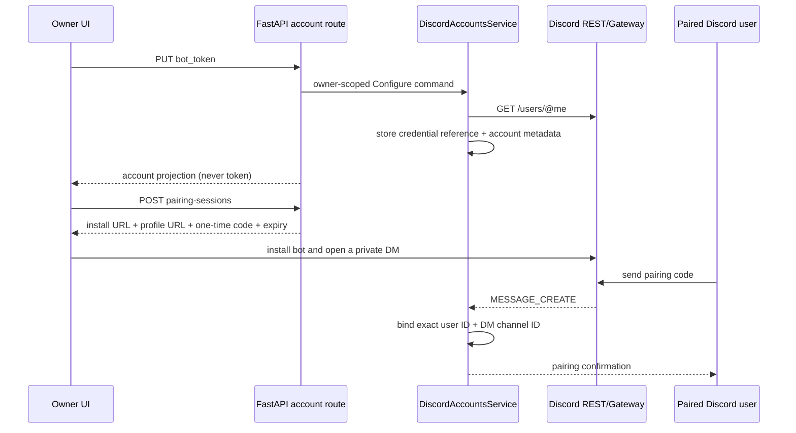

# Communication channels

This page describes the currently verified external-chat implementation. It
covers the Telegram-shaped Discord P0 slice; it is not a proposal for public
servers, group conversations or a shared cloud account.

The ownership and dependency rules remain normative in the [Application
contract](../contracts/application), [Elfie internal contract](../contracts/elfie),
[System contract](../contracts/system) and [Service lifecycle
contract](../contracts/service-lifecycle).

## Discord P0 boundary

The current product model is deliberately small:

- one Elfie owns one Discord Bot Token;
- the local owner configures the token and remains the account owner;
- the bot accepts text from one paired human Discord DM;
- public guild channels, group DMs, attachments, voice, reactions and multi-contact
  management are outside this slice.

The future authorized-contact model extends the same authorization gate with
multiple bindings. It must not bypass the gate or send untrusted messages to the
canonical Elfie message-delivery path.

## Account and pairing flow



Pairing codes are single-use, expire after ten minutes, are stored in memory as
SHA-256 digests, and are invalidated when the account is reconfigured or
disconnected. A successful binding records the external Discord user, the DM
channel, the local owner and the Elfie conversation ID. The account projection
has four states: `unconfigured`, `waiting_pairing`, `active` and `attention`.

The owner API is:

| Method | Route | Purpose |
| --- | --- | --- |
| `GET` | `/api/v1/elfies/{elfie_id}/communication-accounts/discord` | Read the safe account projection |
| `PUT` | `/api/v1/elfies/{elfie_id}/communication-accounts/discord` | Validate and replace the owner Bot Token |
| `DELETE` | `/api/v1/elfies/{elfie_id}/communication-accounts/discord` | Disconnect the bot and revoke the active binding |
| `POST` | `/api/v1/elfies/{elfie_id}/communication-accounts/discord/pairing-sessions` | Create a short-lived pairing session |

Every route requires the authenticated owner of the Elfie. Request DTOs reject
unknown fields, and response DTOs contain bot identity and state only; they do
not contain the token or credential reference.

## Inbound and outbound message path

```text
Discord Gateway MESSAGE_CREATE
        │
        ▼
strict mapper: IDs, author, DM/guild, bot flag, text
        │
        ▼
DiscordGatewayWorker
        ├─ pairing code → one-time binding → confirmation reply
        └─ exact owner + user + DM channel check
                 │ rejected: terminal, no Brain/token use
                 ▼
SubmitUserMessageCommand(channel="discord")
        │
        ▼
existing MessageDelivery → Elfie Brain
        │
        ▼
DiscordChannel → Discord REST POST /channels/{id}/messages
                 └─ record confirmed reply in the existing conversation history
```

The external message ID is deterministic:
`discord:{bot_id}:message:{message_id}`. Replayed Gateway events therefore do
not create a second canonical user message. Bot-authored messages, non-DM
messages, malformed IDs and messages from any user or channel other than the
binding are rejected before `SubmitUserMessageCommand` is called. The outbound
channel also checks the conversation ID, so an Elfie cannot send a reply to an
unrelated Discord conversation.

## Runtime ownership and failure behavior

Bootstrap creates the Feature service, persistence adapters, Discord REST
inspector, message handler and Gateway runtime. `ApplicationRuntimeLifecycle`
starts and stops the Discord runtime together with the existing Telegram
runtime. The Discord runtime reconciles one Gateway worker per active Elfie
account; worker threads are daemonized, stop events are bounded, and channels
are detached on shutdown.

The Gateway adapter uses the direct-message intent, sends heartbeats, handles
Gateway reconnect requests, and resumes a session when the session ID and
sequence are still valid. A new session is used when Discord asks for a reset.
REST sends are limited to text and Discord's 2,000-character message limit.
Credential rejection and transport failures update the account to
`attention`; secrets are not included in logs or error payloads.

Configuration metadata and bindings use the existing per-Elfie
`conversations/history.sqlite` schema. The credential itself stays behind the
existing ignored local secret boundary. No second chat database, cloud relay or
long-lived public HTTPS endpoint is introduced by this P0 implementation.

## Owner-facing interaction

The profile module is a three-step novice flow:

1. create a Discord application and Bot in the Discord Developer Portal;
2. paste the Bot Token once and let ElfieNest validate it;
3. click the install link, open the bot DM, copy the short pairing code and
   wait for the active state.

The UI shares the existing private-channel visual treatment, exposes copy/open
actions, polls the account projection while pairing, never displays a saved
token, and offers reconfigure/disconnect actions. English and Simplified
Chinese strings are maintained together.

## Review conclusions and explicit limits

The precision review covers the following invariants:

- owner authorization is checked at every account operation;
- a token is validated before storage, and is never returned by the API;
- pairing is single-use and bound to exact external identity and DM channel;
- unauthorized input is terminal before canonical delivery and model execution;
- external message IDs make inbound processing idempotent;
- outbound delivery is constrained to the paired conversation;
- Gateway workers belong to the application lifecycle and clean up their channels;
- local history is recorded only after Discord confirms an outbound message.

The P0 deliberately does not claim multi-contact authorization yet. When that is
added, the storage model should become an allowlist of bindings and the same
pre-delivery gate should select the matching conversation. It should not turn on
public guild ingestion by default.

Automated tests cover fake REST/Gateway exchanges, pairing expiry and replay,
identity rejection, history/idempotency, persistence, API contracts, UI states,
type checking and architecture boundaries. A real Discord smoke test still
requires a user-owned Bot Token and an installed bot; no production credential
is stored in the repository or test fixtures.
