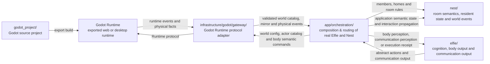

# Current architecture

<script setup>
import { withBase } from "vitepress";
</script>

This document describes the module boundaries and runtime pipeline in the
current ElfieNest code. It is not a historical roadmap, and it does not write
unimplemented designs into the current architecture.

> This is a descriptive current-state map, not a normative target. Final
> ownership and dependency rules live in the [architecture contracts](../contracts/);
> temporary differences between this map and those targets live only in the
> [conformance registers](../conformance/).

## System map


Black arrows are true two-way data or protocol relationships where both arrow
heads are shown. Red arrows identify the concrete internal entrypoints and
control path. In particular, `ElfieFactory` creates or restores an `Elfie`
instance; runtime operations then use the returned `elfie.py` facade.

`app/orchestration` directly composes `elfie`, `nest` and the injected cognition
Runtime. It is not downstream of `app/features`. In the product
use-case plane, Interfaces call concrete Feature use-cases; Features declare
the Ports they need, Infrastructure implements those Ports, and Bootstrap is
the only composition root. Permanent architecture tests enforce these
boundaries directly.

The core source is split by responsibility:

| Module | Current responsibility | Detailed entry |
| --- | --- | --- |
| `elfie/` | One complete creature's profile, brain, nervous system, body, communication and skills | [Elfie README](https://github.com/elfie-univ/ElfieNest/blob/main/elfie/README.md) |
| `nest/` | Activity-space state, environment clock and interaction semantics | [Nest README](https://github.com/elfie-univ/ElfieNest/blob/main/nest/README.md) |
| `infrastructure/godot/gateway/` | Authenticated Godot protocol transport, sessions and bundle inspection | [Module boundaries](./module-boundaries) |
| `app/` | Product use-cases, interfaces, orchestration and Bootstrap composition | [App README](https://github.com/elfie-univ/ElfieNest/blob/main/app/README.md) |
| `infrastructure/` | Model, tool, persistence, Godot, device, communication and platform Adapters | [Module boundaries](./module-boundaries) |
| `app/orchestration/lifecycle/` | Runtime lifecycle, full health, owner leases and authority control | [Runtime & data](./runtime) |
| `infrastructure/godot/lifecycle/` and `artifacts/` | Authority-host selection, exported Runtime launch and artifact metadata | [Runtime & data](./runtime) |
| `app/interfaces/desktop/` | Electron Observer windows and public lifecycle client | [Desktop README](https://github.com/elfie-univ/ElfieNest/blob/main/app/interfaces/desktop/README.md) |
| `app/features/communication/` + `infrastructure/communication/` | Owner-scoped Telegram and Discord account flows, adapters and message routing | [Communication channels](./communication) |
| `godot_project/` | Standalone Godot source project: rooms, geometry, coordinates, collision, characters and rendering | [Godot README](https://github.com/elfie-univ/ElfieNest/blob/main/godot_project/README.md) |
| `devtools/` | Module workbenches isolated from the end-user product | [Devtools README](https://github.com/elfie-univ/ElfieNest/blob/main/devtools/README.md) |

## Module boundaries

`app/orchestration/NestSession` is the only place where real `Elfie` instances
and `Nest` are composed. It routes in-nest events to the corresponding Elfie by
ID, and it injects the cognitive Runtime into the Elfie lifecycle. The public
module entrances are `elfie/elfie.py` (the individual facade),
`elfie/factory.py` (creation and restoration), and `nest/nest.py` (the Nest
facade).

`Nest` itself only maintains resident IDs, in-nest semantic state, the
environment clock and interaction propagation. It does not create or persist
real Elfie objects, nor does it copy 3D spatial facts.

The single source of truth for houses, geometry, world coordinates, motion,
collision shapes, navigation and rendering is the standalone Godot source
project at `godot_project/`. The Python side only stores the semantic state
required by product rules and exchanges events with the exported Godot Runtime
through an explicit protocol.

The dependency direction is continuously checked by `test/architecture/`.
Lower-level domain modules must not depend on `app.interfaces` in reverse to
call product features.

## Elfie, Nest and the Godot Runtime

`godot_project/` is the Godot source project edited at dev time; it is not a
directory Python imports at runtime. The build exports it into the Godot
Runtime; the Python side exchanges semantic commands and world facts with that
running Runtime through the protocol boundary in `infrastructure/godot/gateway/`.



The build phase first exports `godot_project/` into a runnable Godot Runtime.
The connection uses nonce authentication and a single authoritative generation
(v2 only); the orchestration layer first configures the world, waits for the
Runtime to publish the semantic catalog and declare navigation ready, and only
then sends the full actor catalog. During the run, an Elfie outputs abstract
actions or communication content; `app/orchestration/` sends semantic commands
through `infrastructure/godot/gateway/` keyed on the Elfie ID, while the Nest itself does not copy
coordinate or furniture facts. The Runtime runs space, navigation, motion,
collision and rendering, and reports the physical facts that actually happen
back. The return path updates the Nest semantic state through the orchestration
layer and becomes the body perception, communication perception or action
execution receipt of the corresponding Elfie.

Motion uses the granularity of "goal-level command, engine frame-by-frame
execution". The brain issues one
`execute_intent(intent="move_to_anchor")`; Godot handles pathfinding, stepping,
collision and animation; Python only receives decision-relevant facts such as
accepted, started, completed, blocked, cancelled, timed out and tactile. This
fully uses the Godot physical world without involving the model in every-frame
control.

## Typed cognitive information flow

An Elfie's physical perception and digital communication are two independent
input channels:

```text
Body -> NervousSystem --------\
                               -> EventWorkspace
Communication ----------------/          │
                                          ▼
                                  BrainCoordinator
                                          │
                           BrainContext + ReasoningRun
                                          │
                                          ▼
                                    DecisionPlan
                                          │
                                          ▼
                                     OutputRouter
                          ┌───────────────┼───────────────┐
                          ▼               ▼               ▼
                        Body     Communication     Activity request
                          └──────── ExecutionReceipt ─────┘
                                          │
                                          └──> EventWorkspace
```

`ElfieNestEngine.tick_once()` advances the Nest and the Elfie's own clock, then
pumps body events; it does not wait for model inference or output execution to
finish. Each Elfie's `BrainCoordinator` independently encapsulates the
perception frame, the `OutputRouter` atomically receives the complete
`DecisionPlan`, and the execution result flows back into the workspace as a
receipt.

These internal contracts are defined by Pydantic types. Callers that need a JSON
Schema can call `model_json_schema()` on the public model at runtime; the repo
does not maintain a second on-disk Schema.

## Process boundaries

`app/orchestration/lifecycle/RuntimeSupervisor` owns a Runtime generation:

```text
Runtime Supervisor
  ├── Python Core + Gateway
  ├── one selected Godot authority host
  │   ├── graphical Web authority
  │   ├── Bootstrap-hosted Infrastructure Electron authority
  │   └── displayless Linux dedicated authority
  └── public Ollama health (optional; may be degraded)

app/interfaces/desktop/ ──> authenticated Observer + public lifecycle client
```

Desktop never becomes the supervisor or a Godot protocol endpoint. It attaches
to a healthy generation or receives an owner lease when it starts one; an
observer window cannot stop a Runtime it did not create. Observer projections
are semantic and non-video in the first phase. Accounts, adoption, chat, Nest
rules and Elfie cognition remain in the Python product layers, while Godot owns
space, navigation, collision and rendering.

## Data and artifact boundaries

Three categories of paths must not be mixed:

| Content | Single location |
| --- | --- |
| Production configuration, databases, Elfie data and local keys | `${ELFIE_HOME:-~/.elfienest}` |
| Reproducible intermediate build artifacts | root `build/` |
| Final release installers | root `dist/` |

Tests and experiments must use an isolated `ELFIE_HOME`. Generated Godot Web,
Desktop JavaScript and Python Core must not be written back into source
directories; neither `build/` nor `dist/` is committed to Git.

## Implementation scope and extension

The architecture page only describes boundaries that the code, tests and stable
configuration have jointly confirmed. Desktop installers, platform adaptation
and higher-level product capabilities each have to go through implementation,
testing and maintainer review; they cannot be auto-derived from the architecture
diagram.

When a new system capability forms an independent topic with locatable code and
test evidence, it joins the corresponding sidebar as a separate Developer
article; discussion drafts and intermediate designs stay in the private
knowledge area.
