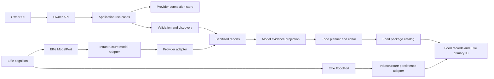
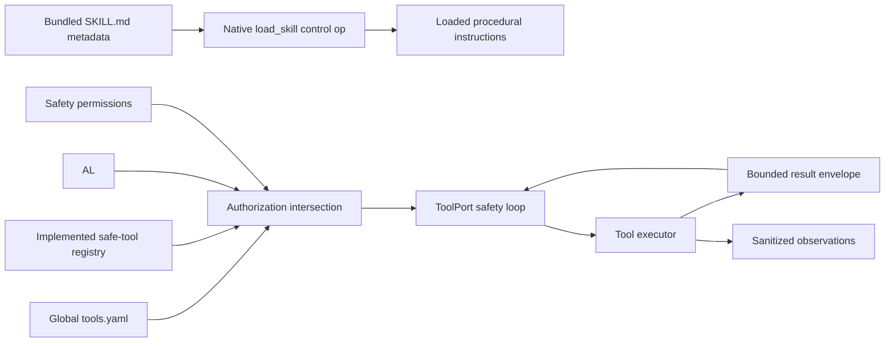

# Model, Food and tool behavior contract

**Contract version:** 1.9
**Revised:** 2026-09-03

> **Behavior authority.** This document defines the accepted Provider, model,
> Food and tool behavior after the retired `ai_runtime/` root was decomposed.
> It does not define a target Runtime module. Current Provider/model availability
> gaps are tracked in the
> [Provider/model availability conformance register](../conformance/provider-model-availability).
> Target ownership, dependencies and physical placement are controlled by the
> [system architecture contract](system).
> The English and Chinese files are synchronized language mirrors of one
> logical contract and must change together.

Implementation work that preserves this behavior updates code and tests without
changing this contract. A behavior change requires an explicit contract-version
revision before implementation. Any future known deviation requires a temporary
registered conformance entry with an exact deletion gate.

The accepted rationale and adversarial analysis behind the Provider/model rules
is retained in the
[Provider and endpoint-model availability design](../designs/provider-model-availability).

The former `ai_runtime/` root was decomposed rather than moved intact.
Provider/model access and Runtime technology live in `infrastructure/models/`;
tool execution lives in `infrastructure/tools/`;
persistence targets Infrastructure adapters; administrator Food configuration,
generation and reports target App Features; Elfie consumes Food, model and tool
capabilities directly through its own injected Ports.

## Purpose and boundaries

The capabilities described here give an Elfie model access and safe native
tools without owning the Elfie, user accounts, the Nest, Godot or application
lifecycle.

| Boundary | Owns |
| --- | --- |
| `infrastructure/models/` | Provider catalog/discovery, connection protocol, endpoint-model observation, technical validation and model-call adapters |
| `infrastructure/tools/` | Search, bounded workspace-file, sandbox and other tool-execution adapters |
| `elfie/` | One Elfie's brain, memory, emotion and skills; it requests semantic model roles and allowed tools but does not select Providers |
| `app/features/` | Provider-connection administration and credential references, Food administration/generation, model-management reports, validation scheduling policy, global tool configuration and UI projections |
| `infrastructure/persistence/` | Nest DB and filesystem adapters |
| Elfie-owned Ports | Direct Food reads, model calls and approved tool execution; Infrastructure implements and Bootstrap injects them |
| `app/interfaces/` | Owner APIs and visible UI; no independent Runtime facts |
| App-owned Scheduler/Runner Port | Executes scheduled validation jobs whose policy belongs to the model-management Feature |
| `app/orchestration/lifecycle/` | Runtime process start, stop, restart and technical readiness only |

There is no target top-level `ai_runtime/` or generic `runtime/` Python package.
Godot, speech, video and future perception runtimes may be composed by the
application later without recreating either package.

## Two capability planes

The module has two independent planes:

1. **Model plane:** Provider product metadata, configured connections, endpoint
   models, validation evidence, food packages and inference fallback.
2. **Tool plane:** tool definitions, global configuration, request
   authorization, execution safety, bounded results and observations.

Tools are not food roles. Food chooses model capacity; tools provide actions.
Elfie skills decide how a capability is used. In phase one there is no
per-Elfie capability-switch UI.

## Model plane concepts

### Provider product

A Provider product is credential-free metadata such as `openai_api`,
`anthropic_api`, `ollama` or a specific subscription product. It defines:

- official display name and local brand asset;
- API base URL, protocol and authentication mode;
- official model-list endpoint or discovery adapter when the product provides
  one;
- a bundled fallback model list and capability hints;
- whether an implemented OAuth adapter exists;
- product category and search terms used by the Owner UI.

The bundled Provider and model catalogs are registered configuration documents
at `config/models/provider-catalog.yaml` and
`config/models/model-catalog.yaml`. Runtime consumers load them through the
typed configuration-document boundary; package-local catalog copies and direct
relative-path reads are forbidden. Installed resolution and the optional,
complete `${ELFIE_HOME}/configs/provider-catalog.yaml` replacement follow the
[Configuration management contract](./configuration-management). An override
containing credentials is rejected.

Provider-product discovery and connection-model discovery are related but
different. After a connection is configured, its usable model inventory is
resolved through this ordered source chain:

1. **Official live source:** use an authenticated, product-specific inventory
   or official discovery adapter when the product declares it authoritative for
   that exact subscription.
2. **ElfieNest remote catalog:** if the product has no usable official source,
   use the centrally maintained product/model catalog when that service is
   implemented and reachable.
3. **Bundled local catalog:** if neither remote source is usable, use the
   versioned model list shipped in the installation package.
4. **Manual input:** provide guarded endpoint IDs when indexed sources are
   unavailable or intentionally incomplete.

A generic `/models` response is authoritative only when the Provider-product
profile explicitly says that it represents this subscription. A broad platform
inventory must not become the normal subscription list. A complete official
response containing zero entitled models is an authoritative empty inventory,
not a discovery failure; lower catalogs may show labelled recommendations but
cannot claim entitlement. Every required page must complete before a refresh
can affect missing-model state.

The highest-priority usable source seeds endpoint IDs. Lower sources may enrich
only product/endpoint-specific missing metadata and cannot replace higher-source
IDs. Canonical model metadata may group rows for display but cannot supply final
capabilities, limits or request parameters for a connection endpoint. Manual
records are always preserved. Remote or bundled entries are candidates, not
proof that the account can use them. Remote catalogs require compatible schema
and integrity validation; discovery responses have explicit byte and record
limits and are rejected rather than silently truncated.

### Provider connection

A connection is one configured account, subscription or local endpoint.
Several connections may use the same product. Its backend-generated immutable
ID is readable, for example `openai_api_0001`. Users never edit this ID.

The alias is optional. When omitted, the official product name is used. Editing
the alias never changes references. Credentials are stored separately and the
connection contains only a credential reference.

### Endpoint model

An endpoint model belongs to exactly one connection and stores:

- server-facing `endpoint_model_id`;
- editable display name;
- source: `official`, `remote_catalog`, `bundled_catalog` or `manual`;
- context-window and maximum-output facts with provenance;
- text, tools, vision, reasoning and structured-output capability channels;
- a typed request-profile ID and version;
- administrator-controlled hidden, retired and source-missing state.

The final capability and availability subject is the exact
`(connection_id, endpoint_model_id)`.

Every capability channel is `supported`, `unsupported` or `unknown` and carries
an evidence level such as `declared`, `accepted` or `verified`. Final support
requires an endpoint-specific authoritative declaration or controlled proof.
A successful text request proves only text; accepting a payload does not prove
the requested tool, image or reasoning feature was used. User input remains a
declaration and cannot silently become verified serving evidence.

Business callers pass semantic options. Provider adapters map those options
through typed request profiles; users do not maintain arbitrary request JSON.
Endpoint overrides are allowed only for a real protocol difference and are
fingerprinted with the evidence they affect.

The UI never asks the user for a canonical model ID. The system may group models
for comparison by catalog identity or normalized display name. Failure to group
models does not prevent their use. Current availability, validation and latency
are observations in the report database, not fields rewritten into Provider
configuration.

### Model reference

Every food role stores an exact
`<connection_id>/<endpoint_model_id>` reference. Display names, product names
and aliases never participate in routing.

Before a food is saved, every reference must resolve to an enabled,
non-archived connection and a present, visible model. Runtime resolves the
reference again for every request. It never guesses a connection or silently
crosses to another subscription.

## Owner workflow

### Provider page

The first section lists configured connections. Each card shows alias, official
product, local/remote status, model count, last validation, latency and health.
Its commands are always:

```text
[Models] [Validate] [Edit] [More]
```

`More` owns enable/disable, archive/restore and delete. Ollama or another
installation-owned connection may be non-deletable but still has health and
model views.

The second section offers five or six common products and one **Add
connection** entry. That entry opens one searchable, categorized chooser.
Custom OpenAI-compatible configuration is the final product option in the same
chooser, not a separate competing flow.

For a known API-key product, the form contains only optional alias and API key.
Base URL, protocol, auth type, internal ID and test-model fields remain hidden.
For an implemented OAuth product, the form starts the official authorization
flow. OAuth is not shown when no adapter exists. Custom products expose alias,
base URL, protocol, authentication and credentials.

The primary action is **Validate and save**:

1. persist the connection and secret atomically enough to preserve correction
   state;
2. validate connectivity and authentication;
3. discover models using the product strategy;
4. merge discovered models without deleting manual records;
5. write sanitized reports and update model evidence;
6. show success, partial success or actionable failure.

A discovery failure does not delete the connection. The dialog expands a
manual-model panel after all supported discovery methods fail.

### Connection model view

The Models command opens that connection's model view. It supports refresh,
single-model validation, hide/show and guarded manual add or edit. Manual input
requires endpoint model ID and display name. Context window, output limit and
capabilities are advanced optional fields; matched catalog defaults are used
when they are omitted.

Refresh merges by endpoint model ID and preserves manual entries and local
overrides. A failed, empty or incomplete refresh never removes inventory. Only
after two consecutive complete successful authoritative refreshes omit a
source-managed model does it become `source_missing` and leave the normal list.
Guarded cleanup additionally requires 30 days of absence, no manual ownership,
no persisted consumer reference and no production use; evidence history remains.
A referenced model cannot be deleted and retains diagnostics.

### Cross-connection model matrix

The page-level model matrix is a separate cross-connection comparison view. It
groups equivalent display models while retaining a row for every exact
connection/model pair. Each row includes product and connection, endpoint model
ID, locality, validation state and time, first-token latency, total latency,
context/output limits and capability facts.

Normal **Validate** reuses fresh evidence and checks only stale curated visible
models with bounded concurrency. Explicit **Force full validation** checks every
enabled visible curated model and is the only ordinary action authorized to pay
that full cost. Scheduled work never validates non-core models. A single model
validation updates only that exact endpoint/capability cell. Every aggregate
records per-cell evidence time and whether the run is `complete` or `partial`,
so old and new measurements are never presented as one simultaneous run.

Atomic Provider/model reports remain the evidence source. The matrix report is
a derived database query and never becomes connection configuration. A
successful Force-full run is one immutable validation run whose results form a
complete snapshot. A single validation appends one result and therefore changes
only that subject in the latest projection.

### Food page

A clean data home initializes exactly two packages:

- **Emergency food:** the global last-resort package, shown first;
- **Common food:** the global default primary package, shown second.

They may initially be unconfigured and disabled when no valid model exists.
These two system packages can be edited and disabled, but never archived or
deleted. Their immutable IDs and system roles cannot change, while their
display labels may be edited. The page always keeps their two rows.
Administrators use **Add food** to create and rename any number of custom
packages below them. Custom packages can be archived and, after reference
checks, deleted. Compiled fixed food categories do not exist.

The main page is a table with one package per row. It shows package name and
system role, locality (`local`, `remote` or `mixed`), important assigned models,
visibility, effective health, latest evidence time and actions. Health is a
read-time projection from the latest connection/model evidence:

- `unconfigured`: no valid primary model;
- `healthy`: primary and all configured required roles are recently validated;
- `degraded`: primary works but an optional role or internal fallback does not;
- `unavailable`: no executable primary path remains;
- `disabled` or `archived`: excluded by lifecycle state.

Evidence updates recompute affected package rows; a stale stored status is not a
second source of truth.

Each package editor exposes:

- required `primary` model;
- optional `reasoning`, `vision` and `tool` role models;
- one optional `fallback` model, represented as an assignment object or `null`;
- locality projection, validation status and source.

Tool permissions are never stored in a food package.

Opening a package shows its role table and two top-level modes: **Automatic
generation** and **Manual edit**, with **Save** as an explicit final action.
Automatic generation first opens a scope dialog where the administrator chooses
one connection, several connections or all connections. Only enabled,
non-archived models whose latest validation is passed and still fresh are
eligible. Explicitly failed, stale or never-validated models cannot be generated
or manually selected until validation succeeds.

Emergency generation defaults to `local first`, then availability and
reliability. The administrator may allow remote candidates, with a warning that
the result cannot protect against network loss. Common-food generation defaults
to balanced quality, latency and availability. Custom packages may choose
either strategy. Rules provide deterministic capability and locality checks; an
optional advisor model may recommend only among the same scoped eligible
candidates.

Generation produces a diff preview, returns to the same editable role table and
never saves automatically. The administrator can adjust every role/model
assignment before saving. Generation never invents a model; when no candidate
exists, the role remains unconfigured with a warning.

The role table uses these rows, in order:

```text
Primary
Reasoning
Vision
Tool
Fallback
```

The food table stays deliberately simple: role, selected model, connection,
local/remote marker and current usable/unusable state. Editing changes only the
model assigned to each role; the optional Fallback role is a single assignment
object or `null`, never an ordered list.

Context size, maximum output, reasoning/tools/vision capabilities, validation
details and latency are model facts. They belong to the connection-model view
and report matrix, not to food configuration. The food model chooser uses those
facts to filter incompatible or unusable models and may link to model details,
but the food page neither edits nor duplicates them. Phase one has no
food-specific context or output budget.

Emergency and Common food are visible to every user. Emergency is reserved for
global fallback and is not selected as an ordinary Elfie primary. Each custom
package has an access action that grants visibility to selected users. Each
Elfie may select Common or one custom primary package from its owner's visible
set.

When an Elfie has no stored primary selection, the global default is considered
if it is enabled and healthy. An explicitly selected primary that becomes
unavailable does not silently switch to another custom package; it proceeds to
Emergency.

### Elfie page

The Elfie UI contains one field labelled **Main food**. Its options are the
enabled, healthy food packages visible to the owning user, excluding Emergency.
Common appears because it is globally visible; a custom package appears only
when that user has been granted access. The UI does not expose an Elfie-specific
emergency package, a second allowed-food editor, Runtime fallback state or
package internals. Runtime health and fallback diagnosis belong to the Owner
food and report views.

## Serving scope and core models

Deletion safety and health scheduling use two different derived projections:

- the **all-reference guard** includes every persisted consumer reference,
  including disabled, archived, unassigned and otherwise inactive Foods; it
  protects models and connections from unsafe edits or deletion;
- `ServingFoodIndex` contains only deployed Foods that can currently receive
  production traffic; it controls scheduled validation and homepage health.

A Food is deployed when it is enabled, not archived and has a resolvable exact
primary reference. It enters `ServingFoodIndex` when the same pure resolver used
by Runtime accepts it as an existing Elfie's requested Food, when Common is the
effective default for an Elfie, when Emergency is the enabled final fallback for
an existing Elfie, or when an authorized production route attempt grants a
24-hour direct-use lease. Preview, validation, benchmark, test and Developer
Tool traffic never grants that lease. Online, away and offline presence does not
change membership.

Requested and actual fallback routes are retained separately. Model failure may
send execution to Emergency but cannot remove the requested Food from serving
scope; otherwise the failed model could never receive recovery evidence. The
index is derived from lifecycle, assignment, visibility and typed production
decisions, may be cached by generation, and is never a manually edited list.

For each serving Food:

- `primary` and configured `fallback` are always core;
- `reasoning`, `vision` and `tool` are core only when policy marks the role
  required or authorized production attempted that role during the last 30 days.

New assignments activate immediately. Removing the route removes its core reason
after any legitimate lease expires. General checks deduplicate by exact
`(connection_id, endpoint_model_id)`; feature checks deduplicate by exact
endpoint and capability channel while preserving every Food/role reason and the
highest criticality. Provider management may show all curated models, but only
this role-sensitive core set affects scheduled health work and homepage health.

## Lifecycle semantics

Provider connections and food packages use the same management meanings:

| Action | Meaning |
| --- | --- |
| Enable | Eligible for new resolution and execution when otherwise healthy |
| Disable | Visible and editable, references preserved, but excluded from new requests |
| Archive | Automatically disabled and removed from normal lists; references, history and reports remain; restore is supported for custom objects |
| Delete | Physical removal only after archive and only when no global, user, Elfie or food reference exists |

Disabling or archiving an assigned primary food makes it unavailable for new
requests and activates emergency resolution. It does not rewrite the Elfie's
stored primary ID. This retained dangling reference is visible in diagnostics.
Emergency and Common are permanent system packages, so archive and delete do
not apply to them.

## Model-plane execution



For every generation:

1. Elfie reads its effective Food projection through the injected `FoodPort`;
2. the persistence Adapter resolves the requested Elfie scope from App-written
   visibility, grant, assignment and package-selection facts; it does not make
   a new authorization decision;
3. Elfie selects a semantic role: `primary`, `reasoning`, `vision` or `tool`;
4. a missing optional role falls back to that package's `primary`;
5. Elfie invokes `ModelPort` for the selected role and then that package's one configured
   fallback model without crossing to an unlisted subscription;
6. only after the primary package is exhausted does Elfie's resolver try the global
   emergency package once;
7. if emergency is missing or exhausted, it returns typed
   `no_available_food`;
8. every attempt and fallback reason is recorded without secrets.

The Brain requests semantic roles only. It never imports food, Provider,
credential or Nest DB models. Structured generation uses the same role and
fallback resolver as ordinary generation. A weaker emergency model may use
plain JSON text instead of native schema mode.

### Owner chat response delivery

Owner chat uses complete-response delivery. The communication path makes one
ordinary model request, waits for the complete model result, persists one Elfie
reply and publishes one normal `message` event to the authorized Web client.
Partial provider output, transient `message_delta` events and stream-specific
identifiers are not part of the product chat contract.

Provider streaming must not be introduced as a presumed performance
optimization. Controlled checks of the configured remote model showed no
material improvement to first-visible or complete-response latency, while a
streaming transport can add connection and chunk-parsing overhead. Latency
observations remain model evidence, but they do not change the complete-response
delivery contract. Any future streaming proposal requires a new contract
revision and a controlled benchmark demonstrating a meaningful user-visible
benefit without changing structured-output, persistence or UI privacy rules.

## Validation, evidence and availability

Configuration, discovery, evidence and availability are separate facts:

- **configured:** connection metadata and credential reference exist;
- **discovered:** one complete refresh and its merged endpoint inventory exist;
- **observed:** a scoped production or controlled check produced immutable evidence;
- **available:** a read-time projection finds fresh successful evidence and no
  newer lifecycle or connection blocker.

Validation and operational reports use the append-oriented
`reports/ai-runtime.sqlite` repository, not `nest.db` and not YAML result files.
`nest.db` remains a physical persistence store for consumer-owned facts, not
their semantic authority.
It stores immutable `report_runs`, endpoint observations and bounded rollups.
Every health-relevant model-call observation contains stable connection and
endpoint IDs, Food ID and semantic role when applicable, workload kind,
start/completion time, status, first-token and total latency, token counts, typed
error category and configuration/catalog fingerprint. It never stores prompt or
response text; Provider fragments, headers and errors are sanitized before
persistence.

Evidence sources, from strongest operational relevance to weakest, are:

1. real production execution for the exact endpoint and capability channel;
2. explicit single, connection or full validation;
3. scheduled serving-core heartbeat;
4. non-generation connectivity/authentication probe;
5. catalog metadata, which never proves current availability.

The current, historical as-of and complete-run reports are database queries.
Model evidence, Provider cards, Food health and the cross-connection matrix join
configured inventory with those observations and never become configuration.
Exports under `reports/exports/` are optional and are never read back as facts.
The database uses WAL, short transactions, indexed stable IDs, explicit schema
migration and bounded retention.

Availability applies these gates in order: lifecycle exclusion; a newer typed
connection-wide blocker; local installation/runtime gates; exact endpoint and
capability-channel evidence with transient hysteresis; freshness. Model-facing
states are mutually exclusive:

- `available`: fresh success and no newer blocker;
- `degraded`: a temporary failure or mixed recent evidence while a usable path remains;
- `unavailable`: a deterministic blocker or a transient-failure threshold was reached;
- `unknown`: never checked, stale or insufficiently scoped evidence.

Provider internals preserve lifecycle, reachability and account state separately.
Owner projections expose `healthy`, `degraded`, `unavailable`, `unknown` or
`disabled`, plus a typed reason and evidence time. Initial freshness is five
minutes for reachability and 24 hours for model success. Capability declarations
remain valid until the endpoint/profile fingerprint changes. A credential,
endpoint, model alias/digest or request-profile change invalidates only matching
evidence.

### Failure scope and hysteresis

Adapters classify structured responses; substring matching alone cannot widen
failure scope.

| Evidence | Required effect |
| --- | --- |
| Invalid/revoked credential, expired subscription, typed billing or account quota blocker | Mark only that connection unavailable immediately, stop its remaining batch and reuse the blocker for its models |
| Invalid base URL, incompatible protocol or deterministic route configuration error | Mark that connection configuration invalid until edited |
| Model missing, retired or not entitled | Mark only that exact endpoint unavailable and continue siblings |
| Rate limit | Degrade the returned scope until `retry_at`; never retire the model |
| Network error, timeout or 5xx | One event degrades; three consecutive failures within ten minutes make the subject unavailable |
| Transient failures on two endpoints, or one endpoint plus a failed transport probe | Promote to a connection outage and stop the remaining batch |
| Context overflow, malformed caller request, safety refusal or caller tool/schema error | Request-specific evidence; general health is unchanged |
| Controlled capability probe proves unsupported | Mark only that capability channel unsupported; text health is unchanged |

A later credible success clears the matching blocker or transient streak. A
product error never blocks another connection of the same brand. Unclassified
errors default to the narrowest request or endpoint scope. A controlled minimal
probe may promote a reproducible adapter-generated protocol error to the exact
request profile or capability channel.

### Cost-aware checks and shared query

Reads are passive. Real model generations are themselves evidence and must not
pay for a duplicate synthetic preflight. Additional model calls follow this
policy:

| Trigger | Required work |
| --- | --- |
| Page/homepage read | Return projection immediately; asynchronously refresh stale no-generation reachability |
| Real production call | Append exact endpoint/role evidence; no extra generation |
| New or materially edited connection | Refresh inventory, probe transport/auth and test one representative model |
| Stale serving core with no traffic | Test a representative first, then only stale core endpoints/channels |
| Normal **Validate** | Reuse fresh evidence; check stale visible curated models only |
| Single-model check | Check only that endpoint and requested capability channel |
| **Force full validation** | Check every enabled visible curated model, with typed early stop |

Controlled text checks use no tools, no retry, a deterministic tiny prompt and
one to eight output tokens. Concurrency defaults to two per connection. Scheduler
workers use leases; callers share one in-flight check per endpoint, capability
channel and fingerprint. Active checks enforce cooldown and rate limits.

In-process consumers use one App-owned availability query Port:

- `get(reference)` and `get_many(references)` read without network access;
- `ensure(reference, max_age, capability, probe_policy)` may start one targeted
  check only with explicit active-probe permission.

Results include exact reference, effective state, reason, Provider state,
evidence source and times, endpoint capabilities, serving roles and fingerprint.
Owner HTTP APIs mirror these queries. Callers cannot force paid checks with an
arbitrarily small `max_age`.

### Provider, homepage and local projections

A Provider card keeps one large semantic background and one status badge. It
never lists every model or draws per-model dots; it shows bounded counts such as
`6/8 available · 2/2 core`. Its curated visible inventory determines one color:
green only when all in-scope models are freshly available; amber when at least
one but not all are available and fresh; red when none are available and fresh
deterministic failure exists; grey when evidence is absent/stale or the
connection is disabled/archived. Lifecycle state remains text, not another
health color.

Homepage model health uses serving role paths, not unused Foods or the full
Provider inventory: green when every required core path is available; amber
when at least one primary works but another required, optional-active or fallback
path is not fresh and available; red when Foods are serving and every serving
primary has a fresh deterministic failure; grey when nothing is serving or
evidence is unknown. It shows compact local/remote totals and an actionable text
reason. Endpoint counts and role-path counts remain distinct.

Local Ollama availability additionally requires a healthy installed service and
the exact installed, enabled model. App lifecycle may attempt one automatic
start with backoff for an enabled existing installation; it must not loop.
Installation, repair and model download remain explicit user actions. No model
shows **Install**; the Provider shows **Install Ollama**, while model rows show
**Download**. A digest or resolved `latest` change invalidates matching evidence.

## Tool plane



Phase one globally supports:

- web search through a configured search adapter;
- read-only local file access under an explicitly configured root.

Terminal execution, file writes, code execution, task planning, subagents and
skill mutation remain disabled until their isolation and approval contracts are
implemented. Disabled tools are not advertised to a model.

There is one global tool configuration surface in phase one and no per-Elfie
switch UI. The effective Tool set is the intersection of globally enabled Tools,
Brain's explicit `allowed_tools` request for a deliberate Run, the implemented
safe-Tool registry and the per-invocation safety permission decision. Skill
instructions are independent: they do not grant Tool permission and are loaded
only through the native `load_skill` control operation. Official bundled sources
use `config/brain/skills/<name>/SKILL.md` (staged as `resources/config/...`);
they are read-only, first-party and not a writable user fact source. Mutable Skill
installation, scripts or durable per-Elfie Skill state is disabled and requires a
separate approved contract. Shared executable Tool implementations live in
`infrastructure/tools/`. Tools never live in Food configuration.

Bootstrap constructs or derives a Tool Adapter view already scoped to the
current Elfie's authorized workspace capability. A `ToolPort` request carries
semantic resource identifiers, not an arbitrary filesystem root. The Adapter
resolves those identifiers inside the injected scope. Read-only file access is
confined to that workspace plus explicitly approved shared asset roots; it
cannot read another Elfie's workspace, credentials, reports or Runtime state.

Every tool defines timeout, item and byte limits. The shared normal/structured
tool loop also enforces one total byte and call budget. The executor wraps output
in a bounded result envelope with `truncated`, original size and retained size.
Secrets, paths outside the allowed root and unsafe command capabilities never
reach the model. Tool calls, decisions, duration and truncation are observed in
sanitized form.

## Persistent data contract

The target physical bundled-default and user-configuration layers are governed
by the [Configuration management contract](./configuration-management); its
current placement and packaging gaps remain in the registered conformance file.
This section defines the behavior-specific user facts.

```text
${ELFIE_HOME:-~/.elfienest}/
├── nest.db
├── configs/
│   ├── provider-catalog.yaml
│   ├── providers.yaml
│   ├── runtime.yaml
│   ├── tools.yaml
│   ├── auth.env
│   └── credentials/
│       └── oauth/
│           └── <connection_id>.json
├── reports/
│   ├── ai-runtime.sqlite
│   └── exports/                     # optional generated YAML/JSON, never read as facts
├── assets/
│   └── users/<numeric-user-id>/
│       ├── avatar.<ext>
│       └── files/
├── elfies/<8-digit-elfie-id>/
│   ├── assets/
│   ├── godot/
│   ├── profile/profile.yaml
│   ├── conversations/
│   │   ├── history.sqlite
│   │   └── attachments/
│   ├── memory/
│   │   ├── knowledge.sqlite
│   │   ├── daily/
│   │   ├── people/
│   │   └── concepts/
├── runtime/
│   ├── runtime.json
│   └── locks/
└── logs/
```

Each file has exactly one typed owner:

| Fact | Source of truth |
| --- | --- |
| Bundled Provider/model products | registered `config/models/provider-catalog.yaml` and `config/models/model-catalog.yaml` documents |
| Optional Provider-product override | validated complete `configs/provider-catalog.yaml` replacement |
| Configured connections and endpoint models | `configs/providers.yaml` |
| Provider and tool API secrets | process environment or `configs/auth.env` |
| OAuth token documents | `configs/credentials/oauth/` |
| Runtime settings | `configs/runtime.yaml` |
| Tool settings | `configs/tools.yaml` |
| Food strategy rows, roles and visibility | `nest.db.food_packages` (single table) |
| Elfie main-food ID | `nest.db.elfies.main_food_id` |
| Validation runs and immutable observations | `reports/ai-runtime.sqlite` |
| Current, as-of and cross-connection reports | SQL projections from `reports/ai-runtime.sqlite` |
| Endpoint capabilities and request-profile selection | connection-scoped model metadata with provenance in `configs/providers.yaml` |
| Serving scope, availability and food health | read-time projections from consumer facts, inventory and report evidence |
| Sanitized production measurements and rollups | `reports/ai-runtime.sqlite` |
| Optional human-readable exports | `reports/exports/`, never a fact source |
| Runtime process receipt and locks | `runtime/` |

No writer may deserialize and rewrite a neighboring file as part of an
unrelated setting change. No legacy root file is an implicit fallback source.
Because the product is pre-v0.5, obsolete development schemas are removed and
temporary data homes are rebuilt instead of adding permanent dual-read or
dual-write compatibility.

## Minimal document shapes

`providers.yaml` contains counters and connection instances; credentials are
references only:

```yaml
version: 2
connection_counters:
  openai_api: 2
connections:
  openai_api_0002:
    catalog_id: openai_api
    alias: Work account
    enabled: true
    archived: false
    credential_ref: provider.openai_api_0002
    models:
      - id: gpt-example
        display_name: GPT Example
        source: official
        request_profile: openai_chat_v1
        capabilities:
          text: { state: supported, evidence: verified }
          vision: { state: unknown, evidence: declared }
```

The shape above is illustrative: schema models in code own exact field names.
Availability, latency, validation status and Provider blockers are deliberately
absent because they are observations and projections, not connection settings.

`nest.db.food_packages` is the single fact source for food strategies. Each row
stores the display name, optional system role, the five model role references,
`visibility_mode` (`global` or `users`), the selected user IDs, lifecycle flags
and timestamps. `global` means every user can see the row; `users` limits it to
the stored IDs. The built-in common and emergency rows are global system rows
and cannot be archived or deleted.

`tools.yaml` stores only semantic configuration:

```yaml
version: 1
tools:
  web_search:
    enabled: true
    provider: duckduckgo
    max_results: 3
    max_result_bytes: 16000
    timeout_seconds: 5
    max_tool_calls: 3
    max_total_result_bytes: 48000
  local_file:
    enabled: true
    root_policy: elfie_workspace
    max_read_bytes: 65536
    max_items: 200
    max_result_bytes: 16000
    max_tool_calls: 3
    max_total_result_bytes: 48000
```

Schema models in code remain the machine-readable contract. These examples
clarify ownership and must not become a second parser definition.

## Required acceptance flow

A clean temporary `ELFIE_HOME` must prove:

1. load Provider/model defaults only through the registered `config/models/`
   documents in source and their one staged installed copy;
2. configure two accounts of one product without editing internal IDs, and
   prove that a connection blocker never crosses between them;
3. preserve a product-specific authoritative empty inventory, reject a broad
   platform `/models` list for a restricted subscription, and preserve manual
   models across failed/incomplete refreshes;
4. keep final capabilities on the exact endpoint, prove text does not imply
   vision/tool/reasoning, and map semantic options through a typed request profile;
5. initialize permanent Emergency and Common Foods, add one custom Food and
   select it for one Elfie;
6. prove an enabled but unused Food causes no scheduled validation or homepage
   impact, while assignment immediately activates primary/fallback core paths;
7. keep an assigned failed Food in serving scope while actual execution uses
   Emergency, and prove preview/test traffic cannot activate core scope;
8. record one real primary, reasoning, fallback and safe-tool production flow as
   endpoint/role evidence without an extra synthetic model call or private text;
9. prove normal Validate reuses fresh evidence, concurrent active checks collapse
   to one request, and Force full validation alone checks the full curated list;
10. prove typed account blockers stop a batch, model failures stay narrow,
    request errors stay neutral and transient failures obey hysteresis;
11. query passive single/batch availability plus current, as-of and complete-run
    reports, then single-check one endpoint without changing sibling cells;
12. require both healthy Ollama service and exact installed model; keep install,
    repair and download explicit while allowing at most one backoff start;
13. hide or clean an omitted source-managed model only after complete-refresh,
    age, reference and production-use gates all pass;
14. pass focused behavior, architecture and replayable browser checks.

Conformance is maintained only while this flow remains covered by focused tests,
architecture tests and replayable browser acceptance.
