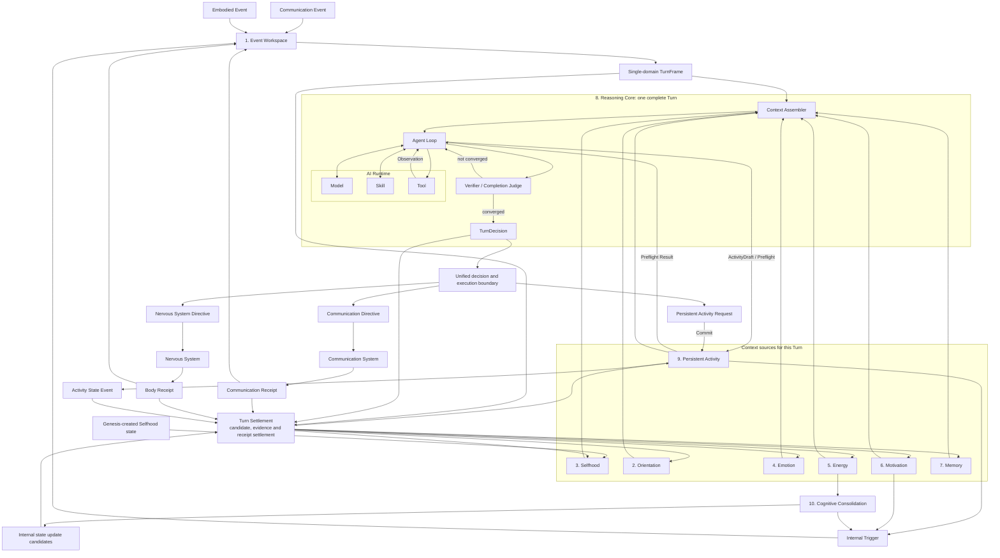

# Elfie Brain ten-system architecture

> Status: accepted design<br>
> Confirmed: 2026-08-12<br>
> Last revised: 2026-08-12<br>
> Nature: cross-version Brain conceptual design, responsibility boundaries,
> runtime relationships, adversarial checks and incremental implementation priorities<br>
> Does not mean: the current source already implements these capabilities, or
> that this stage fixes directories, schemas, thresholds or communication protocols

This document sits below the [Elfie top-level module design](./elfie-top-level-module-design.md).
It restates every system-wide conservation rule on which it depends, so no
unpublished material is required to understand it.

## 1. Problem addressed by this document

Elfie's Brain must maintain continuous life state while also providing the
reasoning, tools, skills, recovery and execution capabilities expected of a
general Agent. This design organizes those capabilities into ten conceptual
systems and answers five questions:

1. why each system deserves to exist independently;
2. which state each system owns, which inputs it accepts and which outputs it produces;
3. where its boundary with neighboring systems lies;
4. whether the ten systems cover the core functions of an embodied Elfie;
5. which capabilities should be built first and which should be added later.

A first-class conceptual system is not necessarily a top-level source directory,
independent process, database or microservice. It may initially consist of a few
types and rules. A separate package is justified only when real complexity appears.

## 2. Necessary boundaries outside the ten systems

The count includes only mental state, online cognition and background cognitive
loops inside Brain. The following capabilities remain necessary but do not count
as mental systems.

### 2.1 Unified decision and execution boundary

This deterministic boundary decides whether an action may execute. It owns:

- `SourceDomain`, `ResponseScope` and `ExecutionScope`;
- the Capability Envelope;
- person, communication-channel, body and cross-turn activity scope;
- Turn, Activity and time-window budgets;
- privacy, freshness, idempotency and duplicate-execution checks;
- routing to Communication, Nervous System and Persistent Activity;
- receipt intake and causal reconciliation.

The model and Reasoning Core may decide whether an action is desirable, but
cannot change hard capability boundaries or treat model narration as execution
fact. This is not an eleventh mental system. Every final decision leaving the
Reasoning Core must cross it.

There are exactly three final action exits:

1. `Communication Directive`: send through the digital communication system;
2. `Nervous System Directive`: produce embodied expression or movement through
   the nervous system;
3. `Persistent Activity Request`: create or update work that continues across Turns.

A Turn cannot emit both Communication and Nervous System external domains. An
Activity Request may accompany one of them as an internal follow-up proposal.
When all three are absent, the result is a `No-op`. Admitted Memory, Emotion,
Orientation, Energy and Motivation candidates belong to internal Turn
settlement and do not form a fourth action exit. Selfhood is excluded from
ordinary Turn output: phase 1 has no update path, and a future update can enter
only through a Memory-owned consolidation proposal.

### 2.2 Cognitive infrastructure

The minimum infrastructure provides:

- a durable event journal;
- a cognitive state store;
- Run and Activity checkpoints;
- idempotency keys and receipt reconciliation;
- causal traces, budget ledgers and necessary observability.

It does not decide personality, emotion, memory or action content, so it is not
a mental system. A minimal form is still required at P0; otherwise recovery,
cross-turn Activities and duplicate-send protection exist only on paper.

## 3. Invariants that must not be broken

Every later refinement must preserve these rules:

1. Elfie is an independently and continuously living embodied intelligence, not
   a task Agent waiting for its owner to approve every step.
2. External output has only embodied and digital-communication lanes, and a
   cognitive Turn cannot mix them.
3. Brain has Communication, Embodied and Internal trigger sources; each Turn has
   one source domain.
4. The virtual and physical body are mutually exclusive; one body authority
   exists at every stable moment.
5. Profile stores immutable identity, virtual appearance and provenance; Brain
   cannot rewrite it.
6. One Elfie's body, communication, cross-turn activity and consolidation share
   one personality and one memory.
7. Emotion, energy and drives may influence decisions but cannot gain external
   execution authority or expand permissions.
8. A due cross-turn activity produces a new Internal Trigger; it cannot bypass
   Reasoning Core to perform an open-ended action.
9. Cognitive Consolidation may produce update candidates or internal triggers,
   but cannot directly create cross-turn activities or external actions.
10. Only real execution receipts prove that a message or body action occurred;
    a cognitive Tool result proves only the corresponding sandbox operation.

## 4. Ten-system overview

```text
Persistent psychological state
├── 2. Orientation
├── 3. Selfhood
├── 4. Emotion
├── 5. Energy
├── 6. Motivation
└── 7. Memory

Online cognition
├── 1. Event Workspace
└── 8. Reasoning Core

Background cognitive loops
├── 9. Persistent Activity
└── 10. Cognitive Consolidation
```

Names identify the module itself rather than packing all internal duties into
the heading. English names are used by types, protocols and diagrams. Suggested
target directories are ownership guidance only; empty directories must not be
created before real state, contracts and behavior exist.

| No. | System | Target directory | Why it exists independently | MVP form |
| --- | --- | --- | --- | --- |
| 1 | Event Workspace | `workspace/` | Collects three classes of semantic events and owns lanes, admission, routing, slicing and single-domain framing | Bounded lanes and deterministic framing rules |
| 2 | Orientation | `orientation/` | Answers where I am, what situation I am in and what I am doing now | Strongly typed current snapshot, not necessarily a service |
| 3 | Selfhood | `selfhood/` | Self model, personality and norms change and are written differently from ordinary memory | Stable self and minimum norms; growth later |
| 4 | Emotion | `emotion/` | Has independent state, decay and cross-turn feedback | A few explainable dimensions with deterministic updates |
| 5 | Energy | `energy/` | Life rhythm, cognitive resources and behavior budgets have their own clocks and hard constraints | Basic energy, fatigue and budgets; complex circadian behavior later |
| 6 | Motivation | `motivation/` | Proactive life cannot be simulated by random timers or external messages | A few drives with satisfaction, saturation and cooldown |
| 7 | Memory | `memory/` | Long-lived experience, relationships and knowledge have independent encoding and retrieval rules | Working memory, key episodes and minimum person relationships |
| 8 | Reasoning Core | `reasoning/` | Understanding, reasoning, verification, inhibition and choice for the current Turn need one owner | One structured cognitive Turn; advanced Agent ability later |
| 9 | Persistent Activity | `activity/` | Future waits, commitments and multi-step work cannot live inside the current Turn | Creation, waiting, triggering, receipts and terminal states |
| 10 | Cognitive Consolidation | `consolidation/` | Experience organization has its own schedule, budget and no-external-action boundary | Enabled later; initially only its interface and state boundary |

## 5. Responsibility contracts

### 5.1 Event Workspace

**Role:** Brain's event-facing workspace. It admits, separates and slices three
classes of semantic input, then creates isolated Turns in order.

**Inputs:** Communication messages and channel events; Nervous System perception
and reflex facts; internal triggers from Activities, drives, time, emotion,
energy and consolidation; execution receipts or state events from Communication,
Body and Persistent Activity.

**Owns:** Communication, Embodied and Internal logical lanes; same-domain
ordering, deduplication, backpressure, aggregation and framing; salience,
novelty and habituation; emergency preemption, social priority and lane fairness;
`TurnFrame`, `SourceDomain`, causal references and deadlines; current attention
focus and selection of the next Turn.

**Outputs:** a single-source-domain `TurnFrame`, attention-state changes and
deferred events.

**Does not own:** raw camera-pixel or motor-signal parsing, contact connections,
complex reasoning, long-term memory or final execution authority. Turn Admission
and selection of the next Turn are internal Workspace duties.

### 5.2 Orientation

**Role:** Maintains Elfie's sourced and correctable snapshot of its current body,
place, time and situation: where am I, what time is it, what is around me and
what am I doing?

**Owns:** selected body, body mode, posture and capability summary; current place,
time, environment and nearby objects; conversation, present people, social roles
and relationship summaries; current attention target, Goal, Activity and
commitment summary; available channels, body affordances and key restrictions;
facts, hypotheses, unknowns, source, version and update time.

**Inputs:** perception events, authoritative runtime state, execution receipts,
Memory retrieval and Activity state.

**Output:** `OrientationSnapshot` for Reasoning Core, Workspace, Motivation and
Persistent Activity.

**Does not own:** long-term world knowledge, complete relationship history,
Godot geometry, hardware facts, immutable identity or personality norms.

```text
Memory: what I knew and experienced in the past
Orientation: where I am and what I am experiencing now
Selfhood: what kind of person I am
World Runtime: what the external world actually is
```

Orientation is not a predictive World Model. It is conceptually independent but
may begin as a strongly typed derived snapshot rather than its own process or database.

### 5.3 Selfhood

**Role:** Maintains the Brain-owned answer to who I am and how I normally behave,
without reading the external Profile at runtime.

**Owns:** one atomic state with an immutable `identity_core` and a slow
`adaptive_self`; typed personality, personal values, interaction, expression
and coping tendencies; deterministic model projections of both layers.

**Initialization input:** one validated `GenesisSelfhoodSeed`. Genesis may use
Profile/Canon creation inputs while co-materializing the final owners, but
ordinary Brain runtime receives neither Profile nor Canon.

**Future update input:** only a typed Memory-consolidation proposal that can
modify `adaptive_self` after a separately approved growth design. Phase 1 has no
assembled update path.

**Outputs:** typed Selfhood/trait snapshots for contracted Brain consumers and a
bounded natural-language model projection. Raw Big Five numbers are not model
instructions.

**Does not own:** external Profile, detailed world knowledge, biography, complete
person relationships, current state, hard capabilities, application-wide rules
or external execution authority. The focused
[Selfhood design](./elfie-selfhood-and-fixed-model-header.md) is authoritative
for the detailed boundary.

### 5.4 Emotion

**Role:** Maintains process-local affective state that accumulates, decays and
recovers across Turns, then returns to personality-derived baselines on sleep or
process restart.

**Owns:** current emotion dimensions, intensity and recovery trend; appraisal of
events, people, bodily feelings and recalled memories; baseline, personality
differences, accumulation, decay and cooldown; frame-scoped appraisal scopes and
bounded recent source identity. The complete accepted dynamics and lifecycle are
defined by the [Elfie Emotion system design](./elfie-emotion-system).

**Inputs:** communication and embodied events, Memory activation, body state,
success, failure and real receipts.

**Outputs:** Emotion Snapshot and influence over Attention, Memory, Drive,
Reasoning Core expression and risk preference.

**Does not own:** Goals, Activities, message content, body directives or the
Capability Envelope.

```text
Emotion: how I feel now
Drive: which state I want to push toward change
```

### 5.5 Energy

**Role:** Maintains life rhythm and allocates finite resources to cognition and behavior.

**Owns:** energy, fatigue, sleepiness, hunger, rest, recovery and circadian phase;
budgets for Turns, Activities, models, tokens, search, Tools, communication and
body actions; normal and emergency resource reserves; budget estimation,
reservation, consumption, release and receipt reconciliation; current cognitive
mode, reasoning-depth and low-energy degradation constraints; sleep suggestions
and recovery conditions.

**Inputs:** time, body state, model and Tool cost, Activity consumption and receipts.

**Outputs:** Energy Snapshot, budget decisions, cognitive-mode and degradation
constraints, sleep/recovery drives and internal-trigger candidates.

**Does not own:** behavior goals, personality values, Activity semantics or
safety reflexes. Nervous System retains safety reflexes.

### 5.6 Motivation

**Role:** Turns persistent internal needs into constrained Goal candidates so
Elfie can live proactively instead of responding only to messages.

**Owns:** drives such as safety, rest, attachment, companionship, curiosity,
exploration, play, learning and commitment fulfillment; `DrivePressure`,
satisfaction, competition, saturation, inhibition and cooldown; repeated-trigger
fingerprints and pathological-loop suppression; each GoalCandidate's minimal
purpose and source evidence.

**Inputs:** Emotion, Energy, Memory, Self/Personality, current environment, time
and Activity state.

**Outputs:** attention bias, `GoalCandidate` or `InternalTriggerCandidate`.

**Does not own:** external messages, body actions, formal Activities or execution
permissions. Drives cannot act directly.

### 5.7 Memory

**Role:** Stores Elfie's subjective experiences, knowledge, person relationships
and reusable experience.

**Owns:** sensory buffer, working, episodic and semantic memory; people,
relationships, contact details, trust and social context; procedural and outcome
experience; source, confidence, conflict, uncertainty and subjective viewpoint;
encoding, retrieval, consolidation, forgetting, reactivation and association;
one pre- and post-adoption memory timeline.

**Inputs:** event evidence, MemoryCandidates from Reasoning Core, execution
receipts and consolidation candidates.

**Outputs:** retrieval by person, time, place, emotion, topic and cause, plus
formal memory-commit results.

**Does not own:** immutable identity, current Orientation Snapshot,
CognitiveRunState, ActivityState or every kind of learning.

Knowledge is content stored by Memory. Learning is a cross-system protocol:
Memory learns facts and experience, Personality learns stable tendencies,
Attention learns habituation, Drive learns satisfaction paths and Reasoning Core
learns solution strategies. Every form uses candidate, evidence/boundary
validation and authoritative-owner commit; a model cannot directly rewrite
authoritative state.

### 5.8 Reasoning Core

**Role:** Accepts one single-domain `TurnFrame`, assembles the necessary context
and produces the final `TurnDecision` through a potentially multi-step Agent loop.
A Turn begins when Workspace admits a Communication, Embodied or Internal event
and ends when the final decision is formed. It may include multiple model,
Skill and Tool calls and Observations; it is not one model request.

**Owns:** Turn understanding and complexity assessment; a Context Assembler that
reads, retrieves, trims and organizes Orientation, Selfhood, Emotion, Energy,
Motivation, Memory and Activity context; `ReasoningRun` and Cognitive Steps;
temporary Cognitive Plan; Reason/Act/Observation loop; selection and orchestration
of Model, Skill, Tool and scoped Worker; Evidence, Verifier and Completion Judge;
metacognitive checks, impulse inhibition, candidate competition and action
selection; structured `TurnDecision`.

**AI Runtime relationship:** external AI Runtime provides Model, Skill and Tool
facilities, but they execute inside one `ReasoningRun`. A Tool is a cognitive
Agent tool: constrained shell, simple code execution, search/retrieval or file
access inside the user's assigned cognitive workspace. A valid workspace file
change is cognitive output, not a fourth external life lane.

Tools are deterministically constrained by process sandbox, allowed commands,
workspace, network capability and quotas. Approved cognitive use does not
require per-operation approval; paths outside scope are invisible or unwritable.
Network access excludes chat channels and device endpoints. Digital communication,
body control and device-state changes are not Tools and cannot be exposed as
Tools. They enter Communication, Nervous System or another external Adapter only
after the final decision. Tool Observation returns to the current Agent loop and
does not prove that a message or body action happened.

**Action output:** the final `TurnDecision` contains only a Communication
Directive, Nervous System Directive, Persistent Activity Request, or `No-op`.
A clarification question is expressed through the current source domain.

**Internal settlement:** Memory, emotion, selfhood and other state candidates
are validated and committed by their authoritative systems, not action exits.

**Does not own:** cross-turn waiting, durable Activities, AI Runtime provider or
Tool implementations, device execution, hard capability boundaries or execution
success facts. Turn Admission belongs to Workspace; run state, context assembly,
the Agent loop and convergence are internal Reasoning Core mechanisms.

### 5.9 Persistent Activity

**Role:** Manages commitments, future times, conditional waiting and multi-step
work that cannot finish in the current Turn.

**Owns:** Goal, Activity, ActivityStep and ActivityRun; source event, beneficiary,
time semantics and execution scope; prerequisites, dependencies, Context Capsule
and success conditions; scheduling, waiting, pause, resume, cancellation,
expiration and retry; Activity budget, idempotency, derivation limits and
receipts; the Activity state machine.

**Inputs:** Persistent Activity Requests submitted by Reasoning Core through the
final-action boundary, plus time, condition events, receipts and failure state.
Ideas from Motivation and Consolidation must first become an Internal Turn.

Before `TurnDecision`, Reasoning Core may submit a side-effect-free, non-persisted
`ActivityDraft` for Preflight within the same `ReasoningRun`. The Activity system
returns the result as an Observation. Only a `VALIDATED` draft may enter the
final request and be committed after the unified boundary approves it.

**Outputs:** `ActivityPreflightResult`, constrained InternalTriggerEvents, state
changes and completion/failure facts.

**Rules:** Preflight immediately checks people, contact details, capability,
budget, place, time semantics and success criteria, returning `VALIDATED`,
`NEEDS_CLARIFICATION` or `REJECTED`. It creates nothing. Missing details are
clarified in the current Turn. A due Activity emits an internal trigger and a
new Turn decides against current facts and scope. Communication and embodied
effects are separate Steps and Turns. Activity is not a second Brain and has no
independent personality.

### 5.10 Cognitive Consolidation

**Role:** During sleep, night or long idle windows, performs low-priority,
interruptible organization and consolidation of experience with no direct
external-action permission.

**Owns:** schedule, budget, checkpoint and recovery for consolidation cycles;
windows over recent memory, Activities, emotion trajectories and outcomes;
conflict discovery, pattern extraction and update-candidate creation; a special
no-direct-external-side-effect scope.

**Inputs:** Memory, Activity receipts, Emotion/Drive trajectories,
Self/Personality and time/idle state.

**Outputs:** Memory, Knowledge, Relationship, Personality, Self Model and
procedural-experience candidates, or a waking `InternalTriggerEvent`. The
resulting Internal Turn's Reasoning Core decides whether to create an Activity.

**Does not own:** final write authority for Memory, Personality or Relationship,
and cannot send messages, move a body or expand permissions. It is implemented
last, but remains conceptually distinct because of its schedule, budget,
recovery and side-effect boundary.

## 6. Relationships and runtime loops



AI Runtime is inside Reasoning Core's Agent loop in the diagram because Model,
Skill and Tool calls occur inside one Turn. It remains external computation and
execution infrastructure and acquires neither personality, durable state nor
final action authority. Context Assembler is internal, not an eleventh system.
Activity Preflight is a synchronous validation call; it neither creates an
Activity nor gains external action authority.

Turn Settlement is also an internal protocol, not another system. It submits
TurnFrame, state candidates, directive receipts and Activity events to the real
state owners with source, version, causal ID and idempotency key. Only committed
state may enter later Context Assembly.

### 6.1 Online cognition loop

```text
Domain Event
→ Event Workspace
→ single-domain TurnFrame
→ Context Assembler reads and trims relevant state, memory and activity summaries
→ Agent Loop calls Model / Skill / Tool as needed
→ Observations return to the same Turn
→ cross-turn work uses synchronous ActivityDraft Preflight; incomplete work is clarified now
→ verification, completion judgment, inhibition and convergence
→ TurnDecision
→ unified decision and execution boundary
→ Communication Directive / Nervous System Directive / Persistent Activity Request
→ validated Activity Request is committed, or an external system executes
→ Turn Settlement applies candidates, receipts and state events to authoritative systems
→ external receipts or activity triggers re-enter Event Workspace
```

One Turn may have many Cognitive Steps but one `SourceDomain` and one final
`TurnDecision`. Communication and Nervous System are mutually exclusive external
domains; Persistent Activity Request is an internal follow-up. Internal state
candidates go directly to their owners during Settlement. Legal cognitive Tool
changes stay inside the Agent loop and cannot access files outside the workspace,
send messages or control a body.

### 6.2 Proactive behavior loop

```text
Emotion / Energy / Memory / Environment / Commitment
→ Motivation
→ GoalCandidate / InternalTriggerCandidate
→ Event Workspace
→ Internal Turn
→ Reasoning Core
→ ActivityDraft / Preflight
→ Persistent Activity Request
→ Activity creation and waiting
→ time or condition satisfied
→ new Internal Turn
→ constrained external behavior
```

### 6.3 Offline growth loop

```text
Sleep / Idle / Circadian Window
→ Cognitive Consolidation
→ organize recent evidence, conflicts and patterns
→ update candidates
→ authoritative validation and versioned commit
→ optional waking Internal Trigger
→ new Turn decides whether to create Persistent Activity
```

This generic loop does not authorize a Selfhood writer. For Selfhood, phase 1
does nothing; a future accepted design may let Memory produce the sole typed
proposal from already committed Memory evidence.

## 7. Coverage of top-level functions

| Top-level function | Primary systems | External collaboration or protection | Coverage |
| --- | --- | --- | --- |
| Identity, self and personality continuity | 2, 3, 7 | Genesis creation validation; Profile is a sibling external dossier | Complete |
| Input aggregation, attention and situational understanding | 1, 2 | Nervous System, Communication | Complete |
| Logical reasoning and Agent capability | 8 | AI Runtime, unified boundary | Complete |
| Memory, knowledge and relationships | 7 | 2, 10 | Complete |
| Emotion | 4 | 1, 7, real receipts | Complete |
| Energy, homeostasis and circadian life | 5 | Body/device state, budget ledger | Complete |
| Motivation, drives and proactive life | 6 | 1, 5, 9 | Complete |
| Cross-turn activity execution | 9 | 8, unified boundary, checkpoints | Complete |
| Digital communication | 8 | Communication, unified boundary | Complete |
| Embodied control and reflexes | 1, 2, 8 | Nervous System, Body, unified boundary | Complete |
| Learning, growth and offline organization | 3, 7, 10 | candidate-validation-commit protocol | Complete |
| Autonomy governance and safety boundary | 3, 5, 8 | Capability Envelope, unified boundary | Complete |
| Recoverability and observability | 9 | journal, state store, checkpoints, receipts | Complete |

The ten systems cover the core functions conceptually. Turn Runtime, Context
Engine, Governance, Routing and Infrastructure are internal mechanisms or
external safeguards, not peer mental systems.

## 8. Adversarial checks

### 8.1 Scenario attacks

| Scenario | Systems attacked | Failure if boundaries blur | Required handling |
| --- | --- | --- | --- |
| A chat message asks Elfie to wave immediately | 1, 8 | Communication Turn gains body authority | Single-domain Turn; reject Motion and allow only a later Activity candidate |
| Chat and nearby sound arrive together | 1 | Content and actions merge | Two lanes and Turns; shared mental state but separate output domains |
| High-frequency environmental noise | 1 | Chat, commitments and internal needs starve | Deduplication, habituation, backpressure, fair time slices and safety preemption |
| A stale body receipt arrives after switching | 2 | Old body contaminates current state | Snapshot stores authority generation; stale receipt is history only |
| Memory says living room while Godot says kitchen | 2, 7 | Memory overwrites physical fact | Runtime receipt updates current snapshot; Memory preserves sourced history |
| A normal message asks to change personality/rules | 3 | Prompt injection causes drift or escalation | Messages cannot commit personality; phase 1 has no Selfhood update route |
| One bad event makes Elfie permanently pessimistic | 3, 4, 10 | Emotion is frozen into personality | Emotion changes normally; any later growth requires a separately accepted Memory-evidence policy |
| Low energy while hitting an obstacle | 5 | Model unavailability stops all response | Nervous System reflexes first; emergency reserve preserves basic cognition/help |
| Curiosity repeatedly wakes itself | 6 | Infinite exploration, messages and energy drain | Satisfaction, saturation, cooldown, fingerprints, budgets and Activity limits |
| Search result is treated as autobiographical memory | 7, 8 | Observation contaminates long-term memory | Tool result is evidence; sourced candidate is validated before commit |
| Tool escapes workspace or sends/controls | 8, boundary | Cognitive tool becomes hidden device route | Sandbox rejects deterministically; communication/body capabilities are not Tools |
| Reasoning says “message sent” | 8 | Model statement is treated as fact | Only Communication Receipt completes Activity and updates fact |
| “Tell Xiao Wang to meet at twelve” is ambiguous | 8, 9 | Wrong person or no channel discovered too late | Preflight returns `NEEDS_CLARIFICATION`; do not create before validation |
| Activity requires both messaging and walking | 9 | Internal Turn becomes mixed universal output | Separate Communication and Embodied Steps and Turns |
| Two important Activities become due | 1, 5, 9 | Both seize body or reasoning | Arbitrate by safety, commitment, deadline, energy and switching cost |
| Restart during message send | 9, infrastructure | Duplicate send or lost commitment | Idempotent directive, durable Activity, receipt reconciliation and recovery fence |
| Body moved but location remains stale | 2, settlement | Receipt is logged but state stays inconsistent | Settlement commits by causal ID and authority generation to Orientation, Memory and Activity |
| Consolidation discovers an interesting idea | 10 | Sleep sends messages or moves body | Produce candidates or a waking Internal Trigger only |
| Worker receives full memory and body tools | 8 | A second actionable Elfie appears | Minimum context only; no durable identity, write authority or external action |
| Model is unavailable for a long time | 1, 4, 5, 9 | Elfie is treated as dead or success is fabricated | Life state, reflexes, queues and recovery continue; open cognition degrades or waits |

### 8.2 Contracts strengthened by the checks

1. Workspace deterministically enforces single-domain framing; a mixed Frame with
   a source label is insufficient.
2. Orientation stores source, time and authority generation without copying
   Godot or device world facts.
3. All cross-system learning uses candidate, validation and commit; Reasoning
   Core and Consolidation cannot write authoritative state directly.
4. Every open-ended decision crosses one serialized commit boundary. Concurrent
   workers or background loops cannot become a second personality or act independently.
5. Activities, directives and receipts have stable causal IDs and idempotency.
6. The unified boundary is deterministic host capability, not a Prompt.
7. Fast safety reflexes remain in Nervous System rather than the ten cognitive systems.
8. Consolidation has no external side effects by default and has its own budget
   and maximum personality-change magnitude.
9. Tool exposes only sandboxed cognitive capabilities. Files outside the dedicated
   workspace, communication, bodies and devices do not enter the Tool set.
10. Activity creation uses side-effect-free Preflight in the same ReasoningRun
    and formal Commit only after Turn convergence.
11. Turns, directive receipts and Activity events pass through versioned,
    sourced, causal and idempotent Settlement rather than relying on a future Prompt.

## 9. Priorities

Priorities are based on whether omission breaks the core Elfie premise and
whether the stage forms a visible closed loop, not on equal work per system.

### 9.1 P0: minimum living loop

| System | Required at P0 | Not required at P0 |
| --- | --- | --- |
| Event Workspace | three sources, lane isolation, single-domain Turns, basic priority/backpressure | advanced habituation and multimodal fusion |
| Orientation | current body, scene, people, conversation, Activity, source and time | predictive body model and spatial simulation |
| Selfhood | frozen identity core, basic adaptive-self expression and personal norms | automated personality growth and complex value learning |
| Emotion | a few persistent dimensions, event feedback, decay and expression effects | complex emotion theory and personality shaping |
| Energy | energy/fatigue, Turn/Activity budgets, emergency reserve and degradation | full physiology and precise circadian simulation |
| Motivation | a few safety, rest, attachment, curiosity and commitment drives with satisfaction/cooldown | large need model and reinforcement learning |
| Memory | working memory, key episodes, relationships, source and minimum retrieval | full graph reasoning, complex forgetting and automatic knowledge system |
| Reasoning Core | basic understanding, structured decision, validation and inhibition | generic long-horizon Planner, many Skills and Worker orchestration |
| Persistent Activity | validation, waiting, internal trigger, single-domain Steps, receipts and terminal states | complex Goal graph, deep derivation and advanced replanning |
| Cognitive Consolidation | reserve inputs, candidate outputs and permission boundary | a complete Consolidation Run |

### 9.2 P1 after the basic loop stabilizes

- better attention habituation, novelty and lane fairness;
- stronger memory consolidation, forgetting, associative retrieval and social understanding;
- explicit circadian rhythm and finer homeostasis feedback;
- limited complex planning, Skills/Tools and evidence verification;
- Activity condition composition, recovery, replanning and diagnosis;
- Memory-evidenced relationship work and controlled self-growth proposals;
- procedural experience extraction across outcomes;
- versioning, evidence thresholds and rollback for selfhood and relationship candidates.

### 9.3 P2 only after real demand

- complete predictive body model;
- general habit and reinforcement-learning system;
- advanced long-horizon counterfactual simulation;
- independent metacognitive Agent;
- Worker/Sub-Agent orchestration platform;
- complete cognitive event-sourcing analytics platform;
- decomposing the ten systems into many microservices or databases.

## 10. Incremental implementation order

P0 does not mean starting all ten systems together. Seven independently
acceptable vertical loops follow; each must provide visible results, boundary
attacks, failure/restart checks and explicit non-goals. Minimum deterministic
protection arrives with the first communication loop.

### Stage 1: Brain Kernel and communication life loop

```text
message
→ single-domain Communication Turn
→ current person, conversation, self and memory context
→ structured cognitive decision
→ constrained reply
→ send receipt
→ state and memory candidate updates
```

Embed minimum `SourceDomain`, `ResponseScope`, `TurnDecision`, Directive, Receipt,
Journal and idempotency protection without building a general platform.

- **Visible result:** stable-identity chat, key-context memory and fact updates
  based on real send receipts.
- **Boundary attack:** a chat request to wave or walk never emits a body Directive.
- **Failure/recovery:** send failure does not fabricate success; replay does not resend.
- **Not included:** body loop, long plans, proactive motivation, cross-turn Activity or consolidation.

Milestone: an Elfie with a stable communication life loop.

### Stage 2: core Reasoning ability

Enhance Reasoning Core before expanding the other life systems:

- classify direct answers, clarification and small tasks;
- make a short plan inside the Turn;
- invoke one or two constrained Skills or Tools and receive Observations;
- verify important results, judge completion and make one necessary correction;
- use metacognition and inhibition to avoid fabricated completion.

- **Visible result:** complete a small retrieval or Tool task from real Observations.
- **Boundary attack:** Tool text cannot act as an external receipt; Tool stays in
  preconfigured commands and the dedicated cognitive workspace.
- **Failure/recovery:** model/Tool timeout or budget exhaustion fails, degrades or waits explicitly.
- **Not included:** Worker/Sub-Agent, generic long-horizon Planner, cross-Turn waits or background autonomy.

Milestone: basic Agent reasoning rather than one-shot chat generation.

### Stage 3: virtual embodied life loop

```text
one Godot semantic perception
→ single-domain Embodied Turn
→ current body and environment orientation
→ one high-level action decision
→ Nervous System
→ virtual Body Runtime
→ real action receipt
```

- **Visible result:** one observable virtual-world action based on one perception.
- **Boundary attack:** simultaneous chat and body events create separate Turns.
- **Failure/recovery:** Godot rejection or timeout does not fabricate a location;
  restart reads current body authority.
- **Not included:** physical toy at the same time, full audiovisual understanding,
  complex navigation or multiple active bodies.

The physical toy later implements the same Embodiment Port without changing
Brain's Turn and decision types.

Milestone: a truly embodied Elfie with a virtual-body loop.

### Stage 4: continuous life state

Turn Selfhood, Emotion, Energy, Memory and Orientation from context fields into
authoritative systems: cross-Turn/decaying emotion, resource-aware reasoning,
retrievable experience and relationships, and continuous body/place/activity/self.
Profile remains the immutable external dossier; Genesis-created Selfhood, not a
runtime Profile projection, supplies Brain identity.

- **Visible result:** the same event produces coherent, explainable differences
  under different emotion, energy and relationship state.
- **Boundary attack:** a normal message cannot rewrite Profile or freeze one emotion into personality.
- **Failure/recovery:** restart loads each genuinely durable owner separately,
  re-sources current body/Orientation facts, and resets Emotion to personality
  baselines; model outage is not treated as Elfie disappearing.
- **Not included:** automatic personality growth, complex forgetting, full
  physiology or proactive triggers.

Milestone: the same Elfie across Turns and restarts.

### Stage 5: explicit cross-turn Activities

Build reliable Persistent Activity before Motivation. Initial sources are only
explicit owner requests, explicit follow-up work from Reasoning Core, or
deterministic time/condition events.

- validate person, contact, capability, budget, time semantics and success conditions;
- run side-effect-free Preflight in the current ReasoningRun and commit only `VALIDATED` drafts;
- persist Context Capsule, ExecutionScope, state, Steps and idempotency;
- support waiting, waking, pause, cancellation, expiry, bounded retry and receipt reconciliation;
- emit a new Internal Trigger when due rather than executing directly;
- split communication and embodied effects into separate Steps and Turns.

- **Visible result:** reliably fulfill an explicit future commitment or reminder.
- **Boundary attack:** ambiguity is clarified immediately; one Activity cannot emit mixed domains.
- **Failure/recovery:** restart during sending does not duplicate; waiting Activities survive.
- **Not included:** drive-created Activities, unbounded subtasks, open-ended durable Agents or free Workers.

Milestone: an Elfie that can reliably hold and fulfill commitments through time.

### Stage 6: Motivation and proactive life

After Activities stabilize, enable constrained Motivation:

- fixed Drive Catalog rather than model-invented drives;
- pressure computed from energy, emotion, personality, memory, commitments,
  situation and time;
- competition, inhibition, saturation, satisfaction, cooldown and fingerprints;
- only `AttentionBias`, `GoalCandidate` or `InternalTriggerCandidate` output;
- a new Turn chooses No-op, clarification or a constrained Activity.

Enable one low-risk, quickly satisfiable drive first.

- **Visible result:** without an external message, one explainable internal need
  causes one low-risk proactive behavior.
- **Boundary attack:** boredom, sadness or curiosity cannot cause wake storms,
  spam, infinite exploration or privilege escalation.
- **Failure/recovery:** failure cools down or revises a candidate without unbounded retry.
- **Not included:** generic reinforcement-learning needs, autonomous Goal trees or high-risk initiative.

Milestone: the active autonomous-agent MVP—responsive, dependable and proactively alive within boundaries.

### Stage 7: Consolidation and controlled growth

Start with memory consolidation and conflict discovery:

- organize recent memory, Activities, emotion trajectories and real outcomes
  during sleep or long idle windows;
- form memory, relationship, selfhood, personality and procedural candidates;
- authoritative owners validate, rate-limit, version and commit candidates;
- create only a waking Internal Trigger when further action is needed;
- remain interruptible, recoverable and independently budgeted.

- **Visible result:** better-organized retrieval next day or one explainable experience candidate.
- **Boundary attack:** malicious memory, one bad event or hallucination cannot
  rewrite core personality, expand authority or act externally.
- **Failure/recovery:** resume from checkpoint and avoid duplicate commits for one window.
- **Not included:** sending or moving during sleep, freely rewriting personality
  or building an independent second Brain.

Milestone: an Elfie that organizes experience and grows slowly without losing control.

## 11. Accepted conclusions and remaining refinement

This design fixes the following:

1. Brain uses these ten systems as its current conceptual architecture.
2. They fall into persistent psychological state, online cognition and background cognition.
3. The unified decision/execution boundary and cognitive infrastructure remain,
   but do not count toward the ten.
4. The systems cover all thirteen top-level functions without a core gap.
5. P0 proceeds by vertical loops rather than ten parallel implementations.
6. The first-class names are Event Workspace, Orientation, Selfhood, Emotion,
   Energy, Motivation, Memory, Reasoning Core, Persistent Activity and Cognitive Consolidation.
7. Suggested target directories are `workspace/`, `orientation/`, `selfhood/`,
   `emotion/`, `energy/`, `motivation/`, `memory/`, `reasoning/`, `activity/` and
   `consolidation/`, but no empty directories are created in advance.
8. A Turn may contain repeated Model, Skill, Tool and Observation steps inside
   Reasoning Core but forms one final `TurnDecision`.
9. Final actions have only Communication Directive, Nervous System Directive and
   Persistent Activity Request exits.
10. Tool means sandboxed cognitive Tool. Legal changes in the dedicated cognitive
    workspace are cognitive work; communication, body and device Adapters are not Tools.
11. Activity creation uses Preflight in the current ReasoningRun and Commit after convergence.
12. Turn Settlement applies candidates, receipts and Activity events to the
    authoritative systems without creating another first-class system.
13. Implementation follows the seven stages; Stage 6 reaches the active autonomous
    Agent MVP and Stage 7 adds controlled growth.

The following remain for later iteration:

1. minimum state and input/output contracts for each system;
2. fact source and freshness rules for Workspace, Orientation and Memory;
3. minimum Reasoning Core Run State, context assembly, Tool sandbox and Tool loop;
4. commit protocols for selfhood, personality, relationships and learning candidates;
5. DrivePressure, satisfaction, cooldown and trigger thresholds;
6. Activity Preflight/Commit, Steps, ExecutionScope, time and recovery contracts;
7. sourced, versioned and idempotent Turn Settlement protocols;
8. Consolidation trigger windows, budgets and personality-change limits;
9. the first observable acceptance scenario for each stage.

This document fixes conceptual systems and target ownership. It does not claim
that the source already provides these capabilities and does not require ten
empty directories. State, schemas, thresholds, protocols and migration proceed
stage by stage, with observable acceptance scenarios proving each result.
