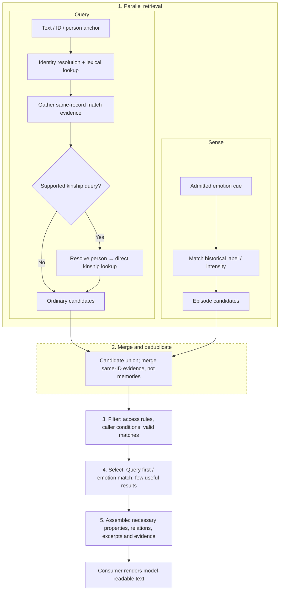

# Elfie Memory Architecture

> Status: target design. This document is the authority for Memory semantics and its typed access contract. Code and the Conformance register describe implementation status.
>
> Scope: durable subjective experiences, sourced personal knowledge and deterministic recall. It does not define Event Workspace or the Reasoning Context Workspace, nor another module's state.
>
> Contract alignment: Brain contract 1.15 (2026-09-26), ADR-0033 and Elfie 2.3. Creation inputs and full Genesis manifests are ephemeral; Memory retains only its final records, evidence and atomic completion markers.

> Design relations: **Owner:** Elfie / Brain / Memory; **Parent:** [Brain
> ten-system architecture](./elfie-brain-ten-system-architecture.md); **Children:**
> none; **Normative contracts:** [Brain contract](../../../contracts/brain.md);
> **Current architecture:** [Cognitive information flow](../../../architecture/cognitive-flow.md);
> **Conformance:** [Memory conformance](../../../conformance/elfie-memory.md);
> **Domain sources:** Genesis owner-state inputs.

## 1. Purpose, boundary and authority

### 1.1 What Memory solves

Memory gives one Elfie a durable, source-grounded personal memory. It keeps a complete, already
processed story unit and a higher-level semantic note built from those units. Both can be recalled
by wording, time, people, emotion, topic and relationships.

The semantic model has exactly two layers:

1. **Episode** — a complete, bounded topic, story or learning unit prepared before it enters Memory.
2. **Node–Assertion** — the knowledge note and relationship graph projected from Episodes. Every
   semantic Genesis seed is first materialized as a source Episode; approved identity/relationship
   skeletons may then be committed directly with Evidence pointing to that Episode. The graph may
   contain typed entities, explicit relations, reusable knowledge and patterns.

Recall searches and combines these two layers. A graph result may be returned directly when the
question asks for a relationship or an abstracted rule; an Episode may be returned for the full
topic context. Evidence explains how either result was derived. Raw conversation logs, videos and
other upstream materials are outside this two-layer Memory surface and are not default Recall
content.

This remains **source-first within Memory**: Node–Assertion is derived from Episode, but it is not
merely a locator and does not have to be replaced by the Episode in every answer.

### 1.2 What Memory does not own

Memory receives an already-closed, already-processed Episode; it does not decide where a topic or
story begins or ends. It does not own Profile, immutable identity, current location, live body
state, live emotion, active plans, commitments, permissions or external actions. It does not
directly read Profile, raw Communication history, raw media, world runtime state or another
module's database. Upstream references may be retained for provenance, but they are not an
additional Memory retrieval layer.

Every semantic state owned by Memory is durable. Memory does not narrate a
reply and owns no transient conversation tail, context summary, Run observation
buffer or complete Reasoning context. It returns bounded, sourced material
through its typed Recall contract; request-local retrieval structures are
protocol payloads or implementation caches, not another memory state.

### 1.3 Memory and Brain / Cognitive Consolidation

Normal Memory capture accepts only a complete, sourced `ClosedEpisode`. The cross-system `Cognitive Consolidation` scheduler is only a background entry point: when its target is Memory, it invokes or budgets `Memory Maintenance`. Memory owns the durable write, graph projection, recall and lifecycle maintenance; no other scheduler or owner creates a second Memory write path.

`Memory Maintenance` is the Memory-owned operation. It is related to, but distinct from, the cross-system `Cognitive Consolidation` scheduler.

### 1.4 Core source rule

For the live Memory model, there are only two input forms:

- normal runtime: a complete, closed `ClosedEpisode` that already represents one topic, story or learning unit;
- one-time initialization: a complete, versioned `ApprovedSeedSource`, treated only as an
  ephemeral input package.

Every durable Node (including a Claim Node) and every Assertion must have Evidence that resolves to a complete,
durable Episode and a span/locator within it. A Genesis package or seed is never the lasting source
of a graph fact: its semantic content is materialized as an Episode before direct identity or
relationship skeletons are committed, and before knowledge is projected by Consolidation. The
package ID/version/hash may remain only as bounded operational commit metadata; no Evidence may
depend on a deleted manifest. A model proposal, summary, cache entry or ungrounded profile value is
not evidence. Execution, reset, initialization and extraction records remain operational data, not
semantic Nodes or Episodes.

## 2. Durable memory model

### 2.1 Episode Timeline

An Episode is one meaningful, bounded, closed topic, story or learning unit—not one chat turn,
raw transcript or keyword summary. The upstream context boundary may group many related turns or
observations, and may compact older turns, before Memory receives it. The Episode itself is the
first-layer memory object and a normal retrieval unit.

An Episode may be a conversation or relationship moment, a learning session, an embodied or environmental experience, a perception with text/audio/video/images, or a meaningful emotional/social event.

It retains:

- stable ID, occurrence range and precision, and a registered `event_kind`; when relevant, a historical `life_stage`/`temporal_label` (for example `childhood` or `before_arrival`), kept separate from write time;
- participants, places, objects and context;
- the original Episode text and durable upstream/media references. Optional `summary_text` is a concise,
  source-grounded synopsis that may be generated during summarization and used as a read-only display
  headline; it is not a separate title, may be empty, and never replaces or truncates original text;
- derived features when available;
- what Elfie observed, was told, inferred or felt, with attribution;
- source references, privacy scope, `importance`, `retention_profile`, `half_life_days`, `detail_level`, `lifecycle`, version and content hash.

`event_kind` is the registered experience kind, rendered with a localized label in user-facing tools.
The initial core vocabulary is `conversation` (a bounded discussion), `activity` (a shared activity
that is not primarily an outing or learning session), `outing` (a trip or visit), `learning` (study,
practice or discovery), `life_event` (a meaningful transition or milestone), `observation` (a
meaningful perception of the world or body), and `reflection` (a bounded reflective or emotional
experience). `unclassified` is a reserved fallback only when the source cannot support a known kind;
it is not an experience category and must not be silently defaulted to `interaction`. Initialization,
reset/reseed, scheduler or extraction state, and provenance labels such as Genesis are not experience
kinds. Genesis provenance is carried by source references and linked Evidence; epistemic attribution
(`observed`, `told`, `inferred` or `felt`) remains a separate dimension. A Genesis `KnowledgeSeed` that
represents knowledge acquired through learning uses `learning`; a personal `EpisodeSeed` is classified
by the experience it describes, never by the fact it was initialized.

Runtime learning is written as a complete Episode before graph projection. For example, learning
Newton's first law stores the explanation, teaching context and any source reference in one
Episode; later maintenance projects reusable knowledge from it. Genesis seed content remains
complete in its approved source, with personal biography seeds represented as complete Episodes.

An Episode has no universal semantic character count. Its boundary is one topic that can be read as
one unit. The implementation still needs a configurable transport/admission ceiling: when a topic
would exceed it, the upstream owner must split at a topic boundary or leave the close pending for a
retry; it must never silently truncate the Episode. Memory does not introduce a third semantic
Segment layer. A later implementation may use an internal text slice for indexing an unusually
large Episode, but that slice is not an independent memory object and never creates its own Node or
Assertion.

The `Topic` in the Reasoning Context Workspace is that upstream boundary and grouping cue; it is not
a third persisted Memory layer.

Later maintenance may change detail from `full` to `compressed` or `digest`, and may archive the record as a separate lifecycle state. A summary never replaces the last auditable source required by the graph.

### 2.2 Personal Knowledge Graph

The graph is Elfie's sourced, subjective understanding. It is not an objective universal database
and does not silently import model knowledge. It is a higher-level knowledge note that can be
rebuilt and reconciled from Episodes and their Evidence. It is also a
valid Recall result: a relationship, reusable fact or Pattern may answer a query without first
returning the whole Episode. A projection revision identifies the Episode versions it reflects.

#### 2.2.1 Nodes and type groups

A type group is a registered semantic category; a slice is the read/filter projection assembled
from that group. They are related but not interchangeable: the registry owns each leaf type's one
primary group, while a slice is a derived view, not another Node type or storage layer. Every
canonical Node has exactly one primary leaf type and therefore exactly one primary type group.
Cross-group facts link the same canonical Node IDs; they never clone an object or assign multiple
primary types/groups.

The primary type group determines a Node's native filter and semantic ownership. A group projection
may include a referenced Node from another group as a contextual endpoint without
changing that Node's primary type or cloning it. For example, Earth remains a `cosmic_entity` in
Space geography, while a General Knowledge Claim about Earth's motion may reference that same Earth Node.
`type_group` is derived from the registered `node_type`; it is not independently written on each
Node. Filters may select a group, a leaf type, or both.

| Type group | Core Node types | Boundary |
| --- | --- | --- |
| Social relations | `elfie`, `person`, `group` | `group` covers families, teams, organizations and communities; family/team are group subtypes or attributes, while parent/friend/member are relations or roles. |
| Entities | `organism`, `object`, `material` | People and Elfies remain in Social relations; physical parts, objects and materials use composition/source relations. |
| Space geography | `cosmic_entity`, `place` | `cosmic_entity` covers universe-scale regions and celestial bodies (universe, galaxy, star, planet, moon); `place` covers geographic regions, towns, homes and rooms. Both use explicit containment and other registered spatial relations; do not split region/place/room or add a separate cosmic-extent type without a demonstrated semantic need. |
| Events | `event` | A referable public, historical or otherwise reusable occurrence may be an Event Node. An Episode is the person's sourced experience/record, not automatically an Event Node; execution, initialization and extraction runs are never Events. Participation, witnessing and learning-about are sourced relations. |
| General knowledge | `concept`, `claim`, `theory_or_model`, `principle_or_law`, `pattern`, `rule_or_guideline`, `method_or_procedure`, `viewpoint` | These types describe semantic form, not school subject. Philosophy and other disciplines use the same types plus a registered domain/facet. `claim` is an ordinary leaf type with the same Node identity, properties and source rules as other types; it has no dedicated payload, table or Evidence model. Time as an abstraction is a concept, while an event's time is a qualifier. |

`claim` is an ordinary general-knowledge leaf type, not a separate object model. It is addressable
through the regular Node ID space; stance or support is represented by normal registered Assertions
to that Node. It has no dedicated payload or Claim-owned Evidence structure. `fact` is not a
separate Node type.

Initialization/reset/reseed runs, extraction jobs, progress, failures and execution audit entries
belong to their owning workflow or operational record store. They are not semantic Nodes, Assertions
or Episodes and never enter graph traversal or Recall. In particular, there is no `technical` type
group and no `genesis_commit_receipt` Node type: Memory may retain only bounded, non-recallable
checkpoints, leases and idempotency receipts needed to operate its own writes.

Self-model is the sixth phase-one slice, but not a sixth Node-type group or a `self_model` Node. It is
an edge-selected projection over the same graph. Start with sourced, outgoing stance Assertions
whose subject is the existing Elfie Node and whose predicate is one of `believes`, `doubts`,
`rejects`, `prefers`, `values`, `has_goal`, `has_trait`, `has_skill` or `has_habit`. Collect the
Elfie anchor and all Node endpoints of those Assertions; then retain every sourced, registered Assertion whose Node endpoints
are both in that selected set. Do not recursively add further Nodes. This includes relevant
knowledge-to-knowledge relations without pulling in every social edge incident to Elfie. The
existing Elfie Node remains the slice anchor: the current design creates no virtual-self Node.
Producing this Memory view is phase-one behavior. Using it to update Selfhood, Orientation or another
owning module is a separate future capability and is not part of this design.

A Node has stable identity, canonical `node_type`, registry-derived `type_group`, canonical label,
scope, identity-resolution state, lifecycle state and bounded structured properties. The type
registry is the only authority for the group, allowed type, attributes, endpoint use and source
requirements; arbitrary non-empty strings are not valid semantic types. Identity-resolution state
is distinct from Memory lifecycle: a mention may be resolved/ambiguous/unresolved, and a stored Node
may be a candidate or canonical identity; lifecycle is active/archived/forgotten. Aliases, sourced
descriptions and user-visible properties are part of the Node's searchable surface. A property
remains a property when it describes the Node itself (for example appearance, personality or
species); it is not converted into an Assertion only to make it searchable. Broad and specific
concepts use typed relations such as `part_of`, `subtype_of` and `generalizes`. Not every word
becomes a Node; reusable semantic units are canonicalized while full wording remains in descriptions
or Episodes.

For a reusable knowledge Node, the canonical label is a source-grounded short title (at most 40
characters). A `claim` Node uses the same label, description, properties and source/Evidence
contracts as every other Node. Its meaning, conditions and scope are expressed through ordinary
registered Assertions and qualifiers; there is no typed proposition payload or special storage
path. Ordinary one-off wording remains searchable through its source Episode, and the deterministic
local fallback does not promote it to a reusable knowledge Node.

The physical semantic store remains one `nodes`/`assertions`/`evidence` substrate. A `claim` is an
ordinary Node type; it creates no parallel entity, payload table or semantic layer. All six slices
are read-only projections over this substrate, and registered Assertions may point to any permitted
Node type. Every durable Node and Assertion follows the same source contract. A presentation anchor
such as the current Elfie is a view reference to the existing `elfie` Node, never a second source
record.

#### 2.2.1.1 Typed attributes and storage ownership

Attributes are a typed Memory capability, not an unbounded JSON escape hatch and not a second
semantic layer. Each registered attribute declares its owner Node types, value type, cardinality,
temporal behavior, source requirement, search visibility and default presentation priority. An
unknown key is rejected from canonical admission or retained only as source wording until a later
registry revision validates it.

Each attribute key has exactly one authoritative storage class:

| Storage class | Use | Examples |
| --- | --- | --- |
| Node property | Stable identity or structural classification; one bounded structured value | `species`, `place_scale`, `object_kind`, `material_kind`, `group_kind` |
| Node description | Sourced human-readable prose, with language/kind/version and Evidence | observed/reported appearance or personality, place introduction, tool usage, family summary |
| Attribute Assertion | A value that is temporal, multi-valued, independently evidenced, conflicting or relational | residence, current object state, a landmark, a typed trait |

`nodes.properties_json` is the validated projection for the first class and bounded searchable
property values approved by the registry; it must not mix technical namespace metadata with user-
visible semantics. `nodes.description` is only the bounded canonical summary. Long or alternate
sourced descriptions belong in `node_descriptions`. Attribute Assertions use the same Assertion /
Evidence contract as relationships and must not be duplicated in `properties_json`. A property is
not converted into an Assertion merely to make it searchable; the registry decides the class, and
the lexical projection indexes only approved user-visible values, descriptions, aliases and
source wording—not IDs, hashes or adapter metadata.

Intrinsic, time-varying and relationship facts therefore remain distinguishable without creating
another fact store. Any Memory description of Elfie's personality is fallible, source-backed evidence,
not a second authority for Selfhood's `adaptive_self`. UI projections may group these records under
“attributes” or “relations”, but a displayed value always points to its authoritative Node property,
Description, Assertion or Episode source.

#### 2.2.2 Assertions / Relations

An Assertion is a sourced, qualified relation record between Node identities and is normally
rendered as a directed graph edge:

```text
Earth --has_shape--> sphere
Owner --helped--> Elfie
```

An Assertion has its own stable record ID and may include a Node or typed literal as object,
polarity, epistemic status, time range, viewpoint, context, validity interval, conflict group,
`importance`, `retention_profile`, `half_life_days` and `confidence`. It is not itself an endpoint
in the current Node-to-Node relation form.

When a reusable proposition must be the target of another relation, use an ordinary registered
knowledge Node (often of type `claim`) and connect it through registered Assertions. For example:

```text
Node C42 (type=claim): “Effort can improve an outcome”
Elfie --believes (conviction=strong)--> Node C42
```

`Node C42` is the ordinary target of `believes`; any additional meaning, condition or scope is
represented by ordinary registered Node–Assertion facts, not a hidden payload or rendered-only
edge. `conviction` remains a registered qualifier on `believes` describing how strongly the subject
holds that stance. Generic Node identity/lifecycle and source-span requirements apply uniformly and
are not defined by a Claim-specific exception.

For a social tie or another domain-specific degree (for example familiarity or trust), the
Assertion may carry a static, sourced `importance` value for registered admission/lifecycle rules; it
is not a phase-one Recall ranking signal. A missing relation means “not recorded”, not “false”.

#### 2.2.2.1 Type and relation registries, direction and multiplicity

Core type groups, leaf Node types, Episode experience kinds, predicates, endpoint constraints,
direction, symmetry/inverse rules, typed qualifiers and source requirements are defined in a
reviewed, versioned YAML registry (initial target: `config/memory/ontology.yaml`). The phase-one
groups and vocabulary in §§2.2.1 and 2.2.2.1 seed that registry; they do not permit model-generated
values. Infrastructure loads and validates it, then injects an immutable typed snapshot; domain
code does not read YAML.
One installation-global additive database extension registry may later add types/predicates as
`candidate`, `active` or `deprecated`. It is shared by every Elfie and workspace under that product
data root; it is never copied into each Elfie's `knowledge.sqlite` or partitioned by workspace.
Candidates cannot be written as canonical facts, extensions cannot shadow core meanings, and each
active entry must satisfy the same endpoint, direction, qualifier and source checks. Dynamic
registration is a bounded vocabulary extension, not model-driven self-registration. The registry
has one shared revisioned authority; isolated product data roots remain isolated by the existing
data-home boundary.
New Node types have a stricter admission bar than predicates because they change filters, attributes
and projections. A stable extension is promoted into core only by a reviewed YAML/version change.
Frequency alone never promotes a vocabulary item: repeated instances are data; only a distinct,
reusable semantic meaning can justify a new type or predicate. A registry revision never silently
changes an existing key's meaning: semantic changes require a new key or an explicit reviewed
reclassification rule.

The following rows are representative examples; the complete vocabulary and constraints are defined by `config/memory/ontology.yaml`:

| Family | Core predicates | Direction rule |
| --- | --- | --- |
| Kinship | `parent_of`, `child_of`, `sibling_of`, `kin_of` | Direction, symmetry and inverses are registered per predicate; coarse `kin_of` is used only when the source does not specify a precise kin role. |
| Social and roles | `friend_of`, `classmate_of`, `colleague_of`, `neighbor_of`, `acquaintance_of`, `guardian_of`, `guarded_by`, `mentor_of`, `mentored_by`, `teacher_of`, `student_of`, `member_of`, `has_member` | Endpoint roles are preserved; direction and symmetry follow each registry entry. |
| Entities | `part_of`, `has_part`, `composed_of`, `made_from`, `produced_by`, `uses`, `used_for`, `owns`, `owned_by` | Directed with explicit inverse only where registered; material/composition and use are not inferred from proximity. |
| Space geography | `spatially_contains`, `within`, `adjacent_to`, `reachable_from`, `reachable_to`, `located_in`, `route_to` | Containment, location, reachability and route are directed; adjacency is symmetric. Distance, travel time, route/path identity or alternatives, and conditions are typed qualifiers on the spatial Assertion, not Node types. `spatially_contains` relates both `cosmic_entity` and `place` hierarchies without conflating conceptual inclusion. |
| Events | `participates_in`, `witnessed`, `learned_about`, `occurred_at`, `before`, `after`, `causes`, `caused_by`, `helped`, `involves` | Directed and time-scoped; participant, witness and learner roles are distinct. |
| Knowledge and self-stance | `subtype_of`, `has_subtype`, `includes_concept`, `prerequisite_for`, `implies`, `supports`, `contradicts`, `derived_from`, `applies_when`, `believes`, `doubts`, `rejects`, `prefers`, `values`, `has_goal`, `has_trait`, `has_skill`, `has_habit` | Direction, allowed endpoint groups/types and source requirements are explicit. Stance predicates may target a `claim` or another registered knowledge Node; they never mean generic `knows`/`about`. These registered stance Assertions seed the phase-one self-model slice. |

The registry defines direction as subject → object and records allowed endpoint types, symmetric
behavior or an exact inverse predicate for every key. Core directional anchors include
`parent_of` (parent → child), `member_of` (member → group), `part_of` (component → whole),
`spatially_contains` (container → contained location), `reachable_to`/`route_to` (origin →
destination), `located_in` (entity → place), `occurred_at` (event → place), and `believes`
(subject → knowledge Node). Their reverse forms are exposed only through an explicitly registered inverse or
a derived symmetric view. `adjacent_to` and `contradicts` are symmetric. Route Assertions own typed
distance, estimated travel time, path/alternative identity and conditions; a general time filter
applies to Episode occurrence time, while relation validity remains an Assertion qualifier.

The stored binary Assertion has one `(subject, predicate, object)` identity. A symmetric relation has
one canonical Assertion and is traversable from either endpoint; a reverse UI view is derived and
does not create a second fact. A directed predicate has an inverse only when the registry defines
one. `kin_of` is valid when the source says “family/relative” but does not identify the exact tie.
No relationship is created from co-occurrence alone. Multiple predicates between the same endpoints
are independent facts and remain visible together. Cross-slice relations connect the original Nodes;
the integrator must not duplicate them into another slice.

`parent_of(parent, child)` renders each endpoint's role correctly. Peer ties such as `friend_of` and
`kin_of` render as mutual relationships. Relation words (`friend`, `family`, `parent`) are predicates
or roles, never Node types.

#### 2.2.3 Evidence

Evidence is a first-class source link. It identifies a persisted Episode and an Episode-local
excerpt/span (plus an optional upstream media locator), modality, capture time,
speaker/viewpoint and extraction run. Evidence follows one generic source-link contract and has no
Claim-specific ownership or interpretation.

An Assertion may have many independent Evidence links. Replaying the same source link is idempotent.
Evidence remains available when a description is compressed or a model proposal is discarded.

#### 2.2.4 Aliases, Descriptions, Episode Mentions

Aliases, descriptions and mentions are separate child records because each Node can have many of them and each can retain its own source/locator, content or span, kind/resolution state and confidence. They have no independent importance score; their availability follows the parent/source retention policy. The Node row keeps only its canonical identity and bounded summary.

`episode_mentions` records semantically meaningful surface mentions, their role/span and resolution state (`resolved`, `ambiguous` or `unresolved`). It does not record every token. Unresolved mentions and Episode wording remain searchable, so a rare term can be found even before it becomes a canonical Node.

The initial implementation bounds semantic mentions per Episode (128 by default) and reports overflow; persisted Episode content is never silently truncated.

#### 2.2.5 Conflicts, viewpoints and knowledge Nodes

Contradictory or perspective-dependent knowledge remains represented by distinct ordinary Nodes or
Assertions when its scope or content differs, with sourced `contradicts` relations where applicable.
Canonicalization merges identity, not disagreement. A named philosophical position is a reusable
`viewpoint` Node; individual philosophical statements use ordinary registered knowledge types, not a
dedicated Claim payload or another slice.

### 2.3 Scores and lifecycle states

#### 2.3.1 importance

`importance` is an optional, bounded source/admission significance attached to an Episode, Node or
Assertion. It is not confidence, truth, freshness or retrieval frequency. In the initial target it is
set only by an explicit sourced input or a fixed registry default; there is no use/outcome feedback,
repeated-use reinforcement, 24-hour score folding or propagation through graph adjacency. The
feedback-driven update policy is deferred as a separate future design.

#### 2.3.2 Retention and freshness

Each Episode, Node and Assertion receives a registered `retention_profile` and policy-owned
`half_life_days` (`H > 0`) at admission. `H` is the time for freshness to fall from `1` to `.5`,
not a remaining-day counter. `H` and its admission anchor do not change from use, retrieval, outcome
or feedback. Current `freshness` (`F`) is derived and never persisted:

```text
t = max(0, now - retention_anchor)
F(t) = 2^(-t / H)
```

Therefore `F(0)=1`, `F(H)=.5` and `F(2H)=.25`. One versioned admission policy maps record kind,
registered Node type or Assertion predicate, source class and bounded static salience to a
policy-owned profile and half-life; callers and models never choose a numeric value. Profiles may
distinguish transient detail, ordinary/salient Episodes, reusable semantic records, stable identity
or authorized Genesis data. Pattern-specific retention is inactive until Pattern generation is
implemented. The selected profile, policy version and admission reason are persisted. Lifecycle
independently owns compression, archive and forgetting; authoritative new Evidence may resolve an
archived, non-forgotten identity under a separately tested write-side rule, but retrieval itself
never changes retention state. Feedback-based strengthening and adaptive scheduling are deferred.

#### 2.3.3 confidence

There is no persisted confidence scalar on a canonical Node. Identity-resolution confidence belongs
to a specific source observation (mention, alias or description) and is used only to resolve that
observation; unresolved/candidate status is not a Node lifecycle state. An Assertion's `confidence`
(`C`) is derived from evidence supporting that exact relation record, not the subject's degree of
belief. `conviction` on a `believes` Assertion represents how strongly the subject holds that
stance. Model/extraction
confidence is transient and is never persisted as semantic truth. Episode attribution and provenance
remain explicit, but an Episode has no confidence score.

The policy recomputes `C` from the complete set of unique Evidence rather than applying arrival-order increments:

```text
C = (prior_weight * initial_confidence + sum(support_weight))
    / (prior_weight + sum(support_weight) + sum(conflict_weight))
```

Evidence weights come from a versioned source policy. Repeated IDs are ignored. Correlated sources share an `independence_key`; within one `(independence_key, stance)` group only the highest source weight contributes, while support and contradiction remain separate stances. `context` Evidence does not affect `C`. Assertion support confidence uses its own `assertion_evidence` and is never propagated through adjacent Assertions. Identity-observation confidence remains attached to the specific alias, description or mention used during resolution. Corrections preserve the older Assertion and its Evidence while adding the sourced replacement/conflict relation; remembering a former belief clearly does not make it true.

Evidence weights and independence groups are versioned. Repeated source links are idempotent; correlated
sources are not counted as independent support. Corrections preserve the older Assertion and its
Evidence while adding the sourced replacement/conflict relation. Any derived support summary is
recomputed from Evidence and is never accepted from an unconstrained model float.

#### 2.3.4 Lifecycle eligibility (no additional score)

Time and the fixed admission half-life produce `F`; the versioned Lifecycle policy exclusively owns
compression, archive and forgetting thresholds. Lifecycle never updates importance, confidence or
the retention anchor. Child aliases, descriptions and mentions follow their parent/source
dependency. Recall uses explicit filters, deterministic content/graph matching and stable tie-breaks;
the initial target does not rank by `importance`, type prior, sourced history, freshness, confidence,
feedback or a composite score. Freshness and rank are never persisted.

#### 2.3.5 detail level

`detail_level` describes Episode content resolution: `full`, `compressed` or `digest`. Episode and Node
`lifecycle` describe availability as `active`, `archived` or `forgotten`; Assertion lifecycle may also
be `superseded`. Identity resolution is a separate axis: mentions can be `resolved`, `ambiguous` or
`unresolved`, while stored Nodes are `candidate` or `canonical`. A merged Node retains an explicit
merge target rather than using a lifecycle value. Archiving is a state transition, not a content
level; an archived Episode may retain a full, compressed or digest representation. No maintenance
may delete the last auditable Evidence for an active semantic fact or a canonical Node still
referenced by Assertions.

## 3. Runtime flows

```text
One-time Genesis
ApprovedSeedSource ──► ephemeral GenesisMemorySubmission
                         └─ atomic commit ──► final Memory outputs + marker

Normal runtime
Workspace closes ClosedEpisode ── capture transaction ──► complete Episode + source references
                                                           │
                                                           ▼
                                                   Memory Maintenance
                                                   ├─ Consolidation Stage
                                                   │  Episode ► typed graph projection
                                                   └─ Lifecycle Stage
                                                      due records ► freshness-driven detail/lifecycle policy

Episodes + Nodes + Assertions + Evidence ──► Hybrid Recall ──► bounded RecallBundle
```

Genesis is a one-time side entrance. The normal path never writes graph facts from an incomplete event, and capture does not wait for maintenance.

### 3.1 Genesis initialization

`ApprovedSeedSource` is an immutable, versioned and hashable creation-time value. An ephemeral `GenesisMemorySubmission` accepts exactly three seed families: `KnowledgeSeed[]`, `EpisodeSeed[]` and `RelationshipSeed[]`. Every seed's semantic content is materialized as a complete, durable source Episode; relationship Assertions may be committed directly from an explicit creation input, but their Evidence points to that Episode and its source span. The Episode records the seeded content, not the act of initializing/resetting or a job receipt. Its experience kind and occurrence time are selected only when supported by the content; otherwise the registered `unclassified` kind and unknown time remain explicit. There is no fourth biography or relationship memory category: biography is represented by Episodes and relationships by explicitly sourced RelationshipSeed projections. Adoption Genesis must create the owner as an independent `person` Node; the “adoption household” may coexist as a separate `group` Node and must not replace the owner through an alias or be typed as a person. Knowledge and episode-derived Nodes/Assertions are deferred to Consolidation; the identity and relationship skeleton may be committed directly because it is an explicit creation input. Final outputs carry Episode-backed Evidence, not a durable dependency on the source-package binding or replay seed.

Genesis uses a submission-level completion contract. A Genesis submission is one complete, immutable set of Memory outputs supplied to Memory for one atomic commit. Genesis may call Memory any number of times; Memory does not choose the number, size, order, grouping, scheduling or meaning of those submissions (for example, core versus enrichment or foreground versus night work). Each submission has its own stable submission/idempotency identity and content hash, even when several submissions belong to one higher-level Genesis operation.

For one valid submission, every expected authoritative and child record—identity/relationship Nodes and Assertions, source Episodes, their creation Evidence, and that submission's completion marker—must be durable and visible as one completed unit. Knowledge and episode-derived graph projections are deliberately not part of this atomic creation set; they are later retryable Consolidation output. Atomicity means “accept only the current submission”: validation happens before any write; the Unit of Work either commits every output and the marker or commits none of them. A failed call returns only a failed or retryable result and never `committed`. Retrying the same submission identity and hash is idempotent; reusing an identity with a different hash is rejected. Previously committed submissions remain valid when a later submission fails.

The Genesis caller owns batching, ordering, retry timing and the decision about when adoption is published. Memory only exposes completed submissions inside the still-unpublished creation workspace; App admission controls final workspace visibility. Memory does not report an overall Genesis operation as complete. A committed Elfie has no Genesis reinitialization path; an approved migration or a real learning event must operate on final-owner state. Cross-owner adoption publication remains its own contract and is not a fictitious cross-store transaction. Genesis accepts only sourced initial importance and registered retention policy; it does not accept Node-wide confidence or unconstrained model confidence. Its authorized admission selects the common `genesis` profile. It does not simulate conversations or manufacture importance with emotion intensity. Direct graph projection is forbidden for normal runtime callers.

Genesis admission is serialized per Elfie. The completion marker is the sole visibility gate for Genesis rows: no reader or maintenance pass may use a row from that submission before its marker is present. Genesis accepts any valid complete submission, including a submission containing only a subset of the approved seed families. It does not require every seed family in every submission and does not infer a caller's batching policy.

After final creation commit or terminal abort, the `ApprovedSeedSource`, submission payload, source-package binding and generation seeds are deleted. The Memory database keeps only final Episodes, Nodes, Assertions, Evidence and the minimal submission completion/idempotency marker required by its own atomicity contract. That marker cannot regenerate the submission and is never Recall content; it is operational audit state, never a Node, Assertion or Episode.

Genesis does not turn its submission or initialization procedure into an Episode experience. Seed
provenance remains on source references/Evidence, the experience kind describes the learned or lived
content, and an acquisition/occurrence time is set only when the source supports it. Bundle creation
and submission timestamps are operational timestamps, not assumed knowledge-acquisition times.

### 3.2 Normal runtime write

The upstream Workspace closes and validates an event, then supplies a complete `ClosedEpisode`. The capture transaction writes the Episode, idempotency key, source references and content hash. It does not call a model and does not update Nodes/Assertions from incomplete content. Graph Evidence links and projection happen later in Consolidation Stage; the text projection is rebuildable and is not a second source.

### 3.3 Memory Maintenance

Memory Maintenance is one bounded operation. It may run in small continuous batches and use idle/sleep time to catch up. It has two ordered stages and one budget policy. Checkpoints, leases and retry attempts are operational control state outside authoritative Memory fact records; they are not a semantic memory type, a recallable queue or a second fact source.

Per-Episode consolidation progress shown by Developer Tools is a read-only projection of the owning
Maintenance operation/checkpoint and its source-version-bound success receipt. Both the receipt and
queued/running/failed state belong to Maintenance operational state, not the Episode fact row. If the
owning projection provides no status, report it as unknown/unobserved rather than inferring it from
`event_kind`, `detail_level` or Memory lifecycle.

#### 3.3.1 Consolidation Stage

For complete Episodes with no success receipt for the current source version/content hash in
Maintenance operational state (including a prior failed attempt), phase 1 runs six slice projections
and then a distinct cross-group relation pass. The five Node-first projections match the five
registered type groups: Social relations, Entities, Space geography, Events and General knowledge.
The sixth projection is the edge-first self-model slice; it uses registered stance predicates, then
selects its Nodes and every sourced registered Assertion among those Nodes. The final cross-group
pass connects selected Nodes whose primary type groups differ. These are ordered responsibilities
within one Consolidation stage, not separate Memory owners, databases or required model calls. The
self-model slice is current phase-one behavior; only using its result to update Selfhood/Orientation
or another owner is deferred. Event extraction creates an `event` Node only for a grounded,
independently referable occurrence; it never creates one for every Episode or for execution activity.

1. The five domain projections select important/reusable canonical Nodes first. Once canonicalized,
   each retains every source-grounded, registered Assertion in the graph whose two Node endpoints
   are both in that projection's selected Node set, including previously stored and cross-group
   edges; there is no second predicate-family filter that drops an otherwise valid edge between
   selected Nodes. A typed-literal attribute Assertion is included only
   by its registered attribute/source rule; it is not an edge between two Nodes.
2. The self-model projection first selects sourced, outgoing Assertions whose subject is the
   existing Elfie Node and whose predicate is one of the nine registered self-stance predicates
   listed above; it then selects the Elfie anchor and their Node endpoints, and retains every
   sourced, registered Assertion in the graph among those Nodes.
   It does not recursively add more Nodes or create a virtual-self Node.
3. A shared resolver canonicalizes Node identity, aliases and coreference across all six slices, then
   validates endpoint types, registered predicates and source Evidence. The final cross-group pass
   extracts and validates any explicitly sourced relation connecting already selected Nodes of
   different primary groups; it never infers a relation from co-occurrence or invents a new Node.
4. Deduplicate only identical canonical facts: merge their independent Evidence, while preserving
   distinct predicates, direction, time, scope, viewpoint and conflicting Claims/Assertions.
5. Recompute Assertion support from unique Evidence, while keeping belief conviction on its
   registered `believes` qualifier. Do not recompute a Node-wide confidence score or emit
   feedback-driven importance/retention events.
6. Commit all validated outputs through the existing Consolidation Unit of Work and record the
   source/projection and global-registry revisions in a Maintenance operational receipt keyed by
   Episode ID, source version and content hash—not on the Episode fact row. Cross-group relation
   outputs are durable Assertions, not mere statistics.

Predicates come from a versioned vocabulary. An unknown predicate stays an unresolved candidate until validated; it is never silently promoted to a fact. Co-occurrence alone is not a relation. A local attribute remains a Node property or typed literal unless it has an independently reusable identity.

A model may propose extraction, disambiguation or a summary outside the write transaction. Deterministic code validates spans, types, scope, predicates, IDs, Evidence and revisions, and performs the final write. Without a model, Episode capture and FTS remain usable; semantic projection waits for a later attempt. There is no keyword gate and no ungrounded fact fallback.

#### 3.3.2 Lifecycle Stage

For any active Episode, Node or Assertion whose derived freshness threshold is due, apply the versioned transitions in §6.3 without mutating `importance`, `retention_profile`, `half_life_days` or Evidence. Node identity-resolution state and `merged_into` are not Lifecycle states. These thresholds are operational Lifecycle parameters, not feedback or Recall constants.

An Episode without a successful projection for its current source version retains enough complete source for projection. Automatic forgetting is logical: a minimal digest, hash and provenance remain; physical deletion is outside `memory.v3`. Low confidence is never a deletion reason. An old record is found by its calculated `next_review_at`, not by the current capture batch, and one unsafe target does not block other bounded records.

### 3.4 Hybrid Recall

Recall associates the present situation with past experience and retrieves experience or knowledge for a question or task. It is deterministic and read-only, calls no generative model, and never reinforces or changes records. Brain/Reasoning owns invocation and consumption.

**Freeze the structure, then improve one data-backed scenario at a time.** This is the narrowed first-version target, not an implementation claim. Existing records provide Episode text/emotion labels/intensity, Nodes/Assertions and kinship predicates; available fields do not prove representative individual data or retrieval quality. Hypothetical cases do not justify a general reasoning engine.

#### 3.4.1 First-version scope and input semantics

| Input | Initial scenario | Result principle |
| --- | --- | --- |
| Query | Find existing experience/knowledge by name, keyword or story detail | Relevant Episodes, Nodes or Assertions |
| Sense | Association using existing historical emotion data | A few emotion-matched Episodes; empty is valid |
| Query + Sense | Find task-related memory with emotional context | Query determines relevance; emotion assists selection, not admission of unrelated stories |
| Query with graph plan | Find a person's parents, children or recorded siblings | Resolve the person, follow supported direct relations, return paths and necessary sources |

Keep Query, Sense and Filters plus bounded limits, without a mode or AND/OR switch. Candidate union is not unconditional result union. At least Query or Sense must be nonempty. Independent question retrieval and spontaneous association may use separate calls, labeled by the caller under one total budget.

Before a model call, reliable salient emotion can trigger Sense-only; do not force greetings or whole incoming messages into Query without a target. After identifying a missing fact or a tool result needing past experience, the model may request focused Query. The caller resolves “last time” from available context; Memory neither reads conversation history nor interprets arbitrary language intent. Initial and follow-up calls are optional; one Run still binds its results to one Memory revision.

#### 3.4.2 Five-stage flow

First-version invocation rule: pre-model admission supplies at most one Sense cue from a `current` EmotionSnapshot, choosing the highest-intensity active canonical channel (channel name breaks ties). With no active channel, skip baseline Recall. Use the existing Emotion activation boundary for the demo; it is not a validated psychological threshold. Do not build baseline Query from the incoming message or its intent regex. The first model may answer immediately or issue one structured `RecallMemory` request containing the supported Query/Sense/Filters. It resolves references from its existing context; an unresolvable “last time” requires clarification, not an invented target.

`DIRECT` normally uses one model call. If Energy/deadline admission can reserve a second call, expose one read-only Recall and reserve final-answer headroom: model → Recall observation → final draft, with at most two model calls and one on-demand Recall. The final schema excludes another Recall. Initial Sense and on-demand Recall share the context budget and pinned Memory revision. No depth switch, plan or external Tool permission is introduced. If headroom is unavailable, omit the Recall action from the supplied schema and allow an honest answer/clarification. `DELIBERATE` retains its existing bounded loop, including focused Recall after an available tool-result observation. This is a planned exception to the current DIRECT guard, not current runtime behavior.

Keep parallel Query and Sense candidate branches. Graph execution follows Query anchor resolution; filtering, selection and supporting association remain separate later steps.



Namespace, privacy and active-lifecycle gates apply at every read, including anchors, traversal and support, not only stage 3. Applicable filters may be pushed down. Count/time budgets bound each step; exhaustion must not look like an exhaustive search or absence of memory.

#### 3.4.3 Query and simple kinship lookup

Ordinary Query reuses stable IDs, canonical names, aliases and existing searchable text. The target is persistent inverted lexical retrieval (BM25-style), not substring `LIKE` alone. Search Episode text/grounded synopsis, Node names/descriptions/approved properties and directed Assertion wording/qualifiers. Rehydrate authoritative records; index text is not another fact source. Compare Chinese short terms, aliases and irrelevant terms on small samples first. Vectors remain a later channel, not a prerequisite for the initial demo.

Local gathering only combines evidence for the same record; do not build layered fusion engines. Exact IDs locate directly; ambiguous names never silently select a person. Demonstrate exact record lookup and text search separately; arbitrary ID-plus-text combinations are not a first-version contract.

Graph retrieval starts with one testable kinship slice: an explicit person ID or uniquely resolvable name, and direct registered `parent_of`, `child_of` or `sibling_of` queries with correct direction, inverse and symmetry semantics. Expose only that slice's supported meanings/predicates to the caller rather than asking a model to guess the whole graph vocabulary. Upstream owns language-to-request conversion; Memory executes supported requests only.

Only positive, nonsuperseded, active-lifecycle relations eligible for this scenario form direct answers. Negation, conflicts, temporal qualifications or uncertain identity must not produce an unjustified certain answer; retain known status or report unresolved. Return matching edges/endpoints and necessary Evidence, not unrelated neighbors. A missing direct relation means “not recorded”, not “no relative”; “all” covers only this direct query within its budget, with explicit truncation.

Shared-parent sibling inference, multi-hop kinship, material/causal/spatial reasoning, literal graph endpoints and arbitrary plans are not promised yet. Ordinary text may still retrieve such existing knowledge; that does not establish structured reasoning support.

#### 3.4.4 Sense: make emotional association useful first

Initially use existing emotion labels/intensity with reliable attribution. The caller selects worthwhile current cues; Memory compares historical Episodes without reading live Emotion/Orientation or inventing historical emotion. Unknown attribution or missing fields are not guessed.

Start with same-category matching; compare intensity proximity when both values exist. Missing historical intensity permits only a label match, not a claim of highly similar intensity. Tune trigger strength, match threshold and count from samples rather than inventing a complex emotion distance or psychological model. Strong current emotion does not justify every same-category Episode; weak or repetitive matches may be omitted.

Return each Episode once, never a synthetic memory. With Query, candidates must also be relevant to Query: retain useful cake-repair experience, not an unrelated sad trip. With Sense only, select a few emotion matches without filling a quota.

Place/entity/activity/environment/sensory combinations and direct scene-to-knowledge association remain extension directions. Do not add multi-lane quotas, strongest-dimension formulas or a general scene schema now. Add a testable channel when reliable historical data for it exists, retaining the same candidate merge/deduplication structure.

Emotion data admission is source-aware. Runtime channels are the six `EmotionType` values; stored Episode emotion is currently free text. Genesis copies `emotional_tone` (including belonging/curiosity/trust/resolve/wonder), while ordinary conversation closure currently supplies no emotion. Neither Episode `attribution=observed` nor the presence of an intensity proves a self-emotion measurement. Initially accept only canonical labels whose source explicitly establishes the Elfie's own emotion; preserve other labels as source data but exclude them from automatic Sense matching. Do not translate tones into channels or backfill missing history. Use sourced examples where available and explicitly synthetic fixtures otherwise; absence of eligible real history leaves real-data quality open. Capturing future conversation emotion is a separate write-side slice.

The deterministic first-version gate is an existing `attribution=felt`, a canonical emotion label and available source references; the producing owner must have supplied `felt` for the Elfie's own experience. Retrieval never infers attribution from prose or rewrites `observed`. Fixtures must explicitly supply these values; a label-only coincidence is insufficient.

#### 3.4.5 Merge, filter and rank

- **Merge:** deduplicate by `(record_kind, record_id)` with match provenance; do not collapse Assertions with different time, polarity or viewpoint. Organize graph results by actual paths.
- **Filter:** first support record kind/registered type, existing Episode occurrence time and emotion conditions, and explicitly requested minimum importance. All branches obey the constraints; unsupported conditions are rejected, not ignored.
- **Rank:** use explainable lexical match for text and emotion match for Sense-only. When both exist, Query remains primary; emotion assists among similarly relevant results. Graph eligibility comes before stable ordering.
- **Select:** return useful results within budget, including none. Do not build one universal score, add incompatible raw scores, or boost by importance, freshness, confidence or feedback.

Values within a Filter family use OR; different conditions use AND. Type constraints apply to the applicable objects. Sourced Episode occurrence ranges match by overlap with the requested range; unknown time is excluded unless explicitly allowed. Timeless Nodes do not inherit Episode-time filtering. Specify record kind when only Episodes are wanted. Additional latest/earliest ordering, complex property Boolean expressions and arbitrary historical-relation time queries wait for concrete cases.

Do not freeze numerical weights, thresholds or budgets here. Implementation compares candidates, final output and prior behavior on the same small samples and adopts a simple explainable, reproducible rule. Rank one does not mean sufficiently relevant, and deterministic retrieval does not claim to judge arbitrary answer completeness.

The first implementation uses one per-Elfie FTS5 corpus containing Episode, Node and Assertion documents, all rehydrated from authoritative records. Documents and queries share Chinese character/bigram pretokenization; lexical Query terms prefer distinct bigrams and fall back to characters only when no meaningful bigram remains. The current incidental-question stop terms are `什么`, `一个`, `问题`, `记得`, `之前`, `以前`, `说过` and `好吗`. Exact normalized Node name/alias matches form the first tier; ordinary candidates must cover at least 0.34 of distinct meaningful Query terms. Empty effective queries return no candidates. The bounded per-kind FTS candidate pool is `max(512, min(4096, top_k * 64))`; truncation is visible. Ordering is exact-name tier, term coverage descending, optional Sense tie-break, BM25 ascending, then `(record_kind, record_id)` ascending. Query+Sense fixes the Query-only top-k pool first; Sense cannot admit or displace a Query candidate and only breaks ties within the same text tier and coverage. There is no raw-score addition or type-priority boost. These thresholds are a demo baseline, not a claim of relevance quality on real individual data.

Sense-only currently matches only source-backed Episodes with `attribution=felt` and the same canonical emotion label, returns at most one Episode, and compares intensity only when both values exist; an intensity difference greater than 0.25 is excluded. Missing historical intensity remains a label-only match, while missing current intensity disables the intensity comparison. The current Bridge admits at most the strongest active canonical emotion from a current snapshot; it does not derive a Query from the incoming user message. Graph answers use relation eligibility then stable endpoint/Assertion IDs and ignore Sense ranking; source Episodes remain support only. A capped candidate pool reports partial output. These first-version constants may be recalibrated from real data without changing the Query-first semantics.

#### 3.4.6 Association and output

After selection, follow stored links only to supply understanding: Episodes carry excerpts/time/relevant participants; Nodes carry names/descriptions/relevant properties; Assertions carry subject/predicate/object/qualifiers and Evidence. Graph answers contain only the matched relation paths and sources, not another story search.

Distinguish primary hits from necessary provenance. Type/time filters select primary results and must not cut indispensable explanatory relations/evidence; out-of-range sources are labeled as provenance, not extra hits. All support still obeys namespace, privacy and lifecycle gates. State missing evidence, conflict, ambiguity and truncation without filling gaps.

Return a bounded typed bundle for deterministic consumer rendering into compact text. Preserve match reasons, useful properties/relations and sources, not just names. Start with simple count/text budgets and avoid repeating an Episode and its derived facts throughout the context; do not build a complex summarizer or context optimizer.

#### 3.4.7 Admission of later extensions

Each extension starts with data and a problem: identify a real or source-traceable scenario, check its fields/relations, specify wanted and unwanted hits, deliver the smallest slice through the existing interface, and compare results before admitting it as routine capability. Synthetic demos prove mechanics and boundaries, not real-individual quality.

Vectors, multidimensional Sense, general graph paths, scene-to-knowledge applicability, complex filtering/time ordering, adaptive feedback weights and Global/community search are not first-version requirements. Preserve their direction without freezing additional fields, query languages or universal formulas.

### 3.5 Deferred Memory Abstraction Loop

This capability is intentionally not implemented in the current baseline. Its complete future loop is:

```text
Node + Assertion → nightly graph-first grouping → model proposal + deterministic validation
                 → Pattern knowledge Node → scene-aware recall → Reasoning application
                 → outcome feedback
```

Grouping starts from related Nodes and sourced Assertions already in the graph. Episodes are consulted only to verify provenance and original context, not as the primary clustering surface. This is a future extension of Consolidation Stage, not a third Memory Maintenance stage or another entry point. An accepted Pattern uses the registered `pattern` Node type and the ordinary Node/Assertion source contract; its derivation must retain references to supporting Nodes, Assertions or lower Patterns and their underlying Evidence. The implementation remains deferred with the capability.

Pattern generation must not ship alone. The same vertical slice must accept a typed current-scene signature from its owner, retrieve applicable Patterns by direct match or upward graph traversal, preserve the rule, conditions, counterexamples and provenance in `RecallBundle`, let Reasoning decide whether to apply it, and capture the outcome as a new Episode that can later support, refute or narrow the Pattern. Until these paths and their evaluation exist together, Pattern abstraction is not a supported Memory behavior.

## 4. Typed access contracts

These contracts freeze semantic inputs, outputs and guarantees, not programming-language method names. Concrete names may change in the implementation and belong in code and Conformance records.

### 4.1 Episode capture

Input is a complete, already-processed `ClosedEpisode` with a stable ID or idempotency key, occurrence range and precision, registered experience `event_kind`, Episode content, attribution, provenance references and hash. An Episode has no separate title field; optional `summary_text` is a source-grounded synopsis, may be empty, and never replaces the original content. The hash covers the persisted Episode payload and referenced-source versions, not a later graph projection. Output is a receipt containing the durable Episode ID and state. The operation is atomic and idempotent; it never creates graph facts from partial content.

### 4.2 Recall

The conceptual contract remains `Recall(Query?, Sense?, Filters?, limits?) -> RecallBundle`. These are semantic responsibilities, not another frozen wire schema. Preserve the existing typed access path when implementing the approved slice; this document does not require a new API framework.

| Part | Initial supported meaning |
| --- | --- |
| Query | Text or exact record ID; an optional graph-plan position for supported direct kinship lookup |
| Sense | Current emotion label and optional intensity with known attribution |
| Filters | Record kind, registered Node type/group, sourced Episode time (including unknown-time policy), historical emotion and explicit minimum importance |
| limits | Bounded candidate/graph/result count and text/time budget; never a target count to fill |
| RecallBundle | Primary records or relation paths, necessary support/evidence, match reasons, uncertainty and truncation |

The kinship plan only needs a person anchor and one supported relation request. Its public vocabulary explains direction and inverse/symmetric behavior; only predicates admitted by the registry and this slice are executable. Do not require callers to generate arbitrary paths, endpoint programs or a generic graph language. Unsupported requests are explicitly rejected. Ordinary ID lookup and a graph anchor remain different purposes.

Query + Sense follows §3.4.1, not an AND/OR switch. Memory is bound to one Elfie namespace; empty input, invalid types and unsupported filters are not silently widened. Filters apply to primary results, while necessary provenance follows §3.4.6; privacy and lifecycle gates cannot be relaxed.

Reuse the typed bundle's Episode, Node, Assertion, path and Evidence records. Ensure selected Node properties/descriptions, directed relationships, qualifiers and provenance survive rendering. Identify which records are primary and which only support them; do not freeze a larger diagnostic schema in advance. Existing importance/freshness/Assertion confidence metadata is not a ranking signal.

Distinguish no qualifying hit, unresolved/ambiguous input, partial/truncated output and unavailable retrieval. A partial “all relatives” result is not exhaustive. The consumer renders compact, faithful text without another model call; it decides the eventual reply or action. Raw conversation/media are not additional Memory retrieval layers.

### 4.3 Deferred feedback and adaptive ranking

Phase 1 does not accept use/outcome feedback receipts, strengthen importance or retention from
feedback, learn an adaptive ranking formula, or rank Recall by importance, type prior, sourced
history, freshness, confidence or a composite score. Feedback collection, outcome authority, durable
receipt delivery, adaptive scheduling and ranking are a separate future design. Ordinary
deterministic text/graph relevance, explicit filters, lifecycle eligibility and stable tie-breaking
remain supported; these are not ranking or feedback learning.

### 4.4 Memory Maintenance

Input is a bounded batch/time budget and an operational maintenance checkpoint. The operation runs Consolidation Stage before Lifecycle Stage, commits only validated source-linked changes, records retryable failures in operational control state without losing the Episode, and returns counts/checkpoint/status. Model inference, if used, happens before the write transaction; it is never the authority for a final fact.

### 4.5 Source inspection

Authorized Memory callers and diagnostics may request one bounded Episode or Evidence record by stable ID, including its source content, detail state and provenance. Inspection is read-only and does not become an implicit chat-history or Profile read.

### 4.6 Idempotence, failure and budget constraints

Every write has a stable idempotency key or fingerprint. A Unit of Work is short, uses one serialized SQLite writer, and never waits for a model, network, device or world runtime. Leases/checkpoints make interrupted maintenance retryable; a failed attempt leaves source content and Evidence intact. Recall enforces limits on text hits, graph hops/neighbors, returned Assertions/Episodes/Evidence and rendered characters, and reports truncation explicitly.

## 5. SQLite physical implementation

### 5.1 Persistent fact and operational tables

SQLite is the first physical implementation. One Memory Adapter/database is bound to one Elfie namespace; a caller cannot query another Elfie's rows. The tables below are per-Elfie semantic facts and operational state; JSON columns are bounded metadata only and never hide graph edges or provenance. Ontology extensions are stored separately in one installation-global registry, not in these per-Elfie databases.

| Table | Required responsibility |
| --- | --- |
| `episodes` | Complete processed Episode content, optional source-grounded `summary_text` synopsis (never a separate title and never a replacement for content), registered experience `event_kind`, occurrence range (nullable when unknown) and occurrence precision, historical `life_stage`/`temporal_label`, separate write time, attributed context/media/upstream references, privacy scope and version, static `importance`, admission `retention_profile`/`half_life_days`, `detail_level`, Memory `lifecycle`, idempotency key and content hash. Episodes have no title, provenance-label, consolidation-progress, successful-projection receipt or confidence column. |
| `memory_maintenance` | Operational work state for Episode consolidation and lifecycle: pending/processing/completed/failed/skipped state, attempts, retry time, lease owner/expiry, error and checkpoint, plus the source version/hash and projection revision that bind a receipt to the exact Episode source. It is not a semantic Node or Episode field. |
| `nodes` | Canonical identity, registered leaf type (group derived from the registry), label, scope, identity-resolution state, separate `lifecycle` (`active`/`archived`/`forgotten`), bounded summary and structured properties, static admission importance/retention policy and merge pointer. No Node-wide confidence or feedback reinforcement score. `claim` uses this same ordinary Node row. |
| `node_aliases` | Many scoped aliases with their own source and confidence. |
| `node_descriptions` | Many language/kind-specific descriptions, content hash and source link. |
| `episode_mentions` | Episode-to-Node links, roles/spans and resolved/ambiguous/unresolved state. |
| `assertions` | Subject, predicate, Node or explicitly typed-literal object (type/value/unit), registered typed qualifiers, polarity, epistemic status, viewpoint/context, validity, optional static admission importance, `retention_profile`, `half_life_days`, Evidence-derived support confidence, conflict group, lifecycle state and fingerprint. `conviction` belongs to the `believes` qualifier, not this support confidence. |
| `evidence` | Mandatory Episode ID/span, source version, optional upstream media locator, modality, speaker/viewpoint, capture time, `independence_key`, source-reliability class/policy version and extraction metadata. Genesis package identity may be origin metadata but never replaces the Episode source. |
| `assertion_evidence` | Many-to-many Assertion/Evidence stance: `supports`, `contradicts` or `context`. |

The reviewed core YAML (`config/memory/ontology.yaml`) is one shared installation resource. Dynamic
extensions live in one application-global registry database at `${ELFIE_HOME}/memory/ontology.sqlite`,
resolved through `infrastructure.persistence.layout.data_home`; every Elfie workspace under that
product data root reads the same registry and revision. This file is not duplicated under
`elfies/<elfie_id>/memory/knowledge.sqlite` and is not placed in Nest's `nest.db`. An isolated
Developer Tools data root remains isolated according to the existing data-root contract.

These dimensions reuse the existing Episode storage concepts: `summary_text`, `event_kind`, occurrence
time/precision and durable source references/Evidence. The current-source projection receipt is kept
in Maintenance operational state, keyed by Episode ID/source version/content hash. No separate title,
provenance-label or consolidation-progress column is added. `event_kind` is narrowed
from an arbitrary non-empty string to a key in the reviewed experience-kind registry, and
`summary_text` is accepted as a display synopsis only when source-grounded. This is a persisted value
contract change. The current implementation baseline is schema v1. It adds ontology-bound type and
predicate validation, one rebuildable FTS5 projection across all three Recall record kinds plus its indexed row-ID map, and rejects non-v1 databases before mutation with the exact path; it does
not add a Claim payload or any Claim-specific table. Generic Node identity/lifecycle and source-span
requirements remain an independent conformance residual. There is no migration or fallback
reinterpretation of old values before 0.5.
Consolidation progress comes from the owning operational read model, outside Episode fact rows.

Each Genesis submission's ID/version/hash and completion marker are durable package metadata owned by the Memory Adapter, not a semantic Node/Assertion or Episode and not a retry queue. The marker lives in the same Memory SQLite database and is committed in the same transaction as that submission; its physical metadata record/table name is adapter-private and is not an additional semantic memory table. The marker is written only after every expected Memory row, including child rows, is ready for the commit. A retryable or interrupted submission is operational state, not recallable memory. Derived FTS/vector indexes and RAM caches are not part of the fact-package completion check and may be rebuilt only after the complete commit. `importance` is a static admission value; Assertion support confidence is derived from Evidence; `retention_profile` and `half_life_days` are admission policy state, while freshness and query match order are derived.

### 5.2 Derived indexes and cache

Structured Episode/Node/Assertion records remain authoritative. Free text is a derived search document, not a replacement database format or a third semantic memory layer. Each Elfie's SQLite database owns its persistent indexes; no shared all-user search corpus, external search service or full in-memory index is required.

The current implementation uses one per-Elfie SQLite FTS5/BM25 index alongside existing ID/name/alias and relation indexes. Its documents identify record kind/ID and contain approved Episode text/synopsis, Node names/descriptions/searchable properties and rendered Assertion wording. All three kinds share the corpus, and returned IDs are rehydrated from their authoritative tables. A small `memory_search_fts_map` B-tree table maps `(record_kind, record_id)` to FTS rowid so updates/deletes use indexed lookups rather than scanning the FTS corpus. Technical IDs, hashes and maintenance state are not ordinary prose.

The persistence adapter maintains the FTS document and row-ID map from committed facts in the same transaction. Updates/rebuilds are idempotent; missing indexes can be rebuilt without changing source data. On retrieval, reread authoritative records and recheck namespace, lifecycle, filters and the Run's source revision. Stale indexes must not resurrect ineligible facts; unavailable or partial retrieval is reported honestly. Name/alias changes must invalidate dependent rendered documents. Keep operational projection receipts in Maintenance state, not Episode facts.

Use ordinary B-tree indexes for demonstrated filter/join needs: occurrence time, existing emotion facets, type, aliases, Episode mentions and both directions of Assertions/Evidence. Several indexes on one table are normal; do not index every possible scene property. RAM holds bounded hot pages/records rather than every Elfie's full index.

Vector embeddings/indexes and richer scene projections remain later derived capabilities. Choose their physical backend, query-embedding boundary and maintenance details only with data and an evaluated retrieval need. They must preserve namespace, provenance and rebuildability, and do not create a second fact source.

#### 5.2.1 Available implementation choices

SQLite [FTS5](https://www.sqlite.org/fts5.html) supplies the persistent full-text virtual table `memory_search_fts`, literal-bound MATCH queries and BM25 ordering inside the existing database. It is not a normal CREATE INDEX on a prose column. The Adapter maintains one derived document per searchable source record and an ordinary `(record_kind, record_id)` → `rowid` B-tree map in the same write boundary; both can be rebuilt from source tables. The map is necessary because the FTS metadata columns are unindexed and should not be used for repeated document replacement. No Elasticsearch service is required. The current FTS5 capability is validated on the development runtime; packaged-platform availability remains a separate acceptance gate.

Normalize Chinese documents and queries consistently before indexing. Default tokenization is not a guarantee of Chinese word segmentation; trigram full-text queries shorter than three characters do not match. Evaluate short names and two-character terms before choosing segmentation/character units. FTS5 BM25 orders better matches first with lower scores; it is not a probability or an absolute relevance threshold.

[sqlite-vec](https://alexgarcia.xyz/sqlite-vec/) is an available SQLite vector-search extension with [Python loading support](https://alexgarcia.xyz/sqlite-vec/python.html) and [KNN queries](https://alexgarcia.xyz/sqlite-vec/features/knn.html). This establishes a candidate integration path, not an approved dependency or tested deployment. Embeddings must be produced separately and kept consistent between documents and queries; evaluate extension loading, fixed Python compatibility, packaged platforms, dimensional/version changes and resource costs before adoption. Do not promise ANN-scale performance merely because KNN is supported.

The implementation evidence and remaining acceptance gates are recorded in the [Memory conformance register](../../../conformance/elfie-memory.md#first-version-recall-implementation-and-remaining-gates-brain-115). A local FTS5 pass does not constitute cross-platform acceptance.

### 5.3 Constraints, uniqueness and conflict preservation

Foreign keys are enabled and deletion is restricted by default. Episode idempotency keys and content hashes prevent duplicate capture. An Assertion fingerprint includes normalized subject, predicate, object, qualifiers, polarity, viewpoint and validity; it does not collapse distinct times, perspectives or conflicts. Evidence identity also includes source version, modality and locator/span, so the same locator in a new source version is a distinct source link. Exact replay is idempotent.

Aliases may be ambiguous across scope. Mentions may remain unresolved. Descriptions deduplicate by Node/language/kind/content hash while retaining separate sourced versions. An Assertion has exactly one Node object or one typed-literal object. Queryable assertion fields and qualifiers are columns or explicit indexed child records; a typed literal uses mutually exclusive node-ID versus type/value/unit fields, and bounded JSON is only non-queryable metadata. Node merges keep the old ID and point to the canonical ID. No bare-triple unique key may overwrite evidence or disagreement.

### 5.4 Transactions and Unit of Work

Genesis applies the completion guarantee in §3.1: it validates one complete submission before opening one submission-scoped transaction, writes every Memory output (Nodes, Assertions, Episode-backed Evidence, Episodes and child records) and that submission's marker in the same commit, and returns success only after the complete set is reconciled. A failed commit is not a completed state; the same immutable submission remains unpublished and can be retried with the same identity and hash. Earlier successful submissions are not rolled back by a later failure. Normal capture commits the complete Episode and its source references together; its derived text index may be updated in that transaction or rebuilt after commit. Maintenance validates model proposals outside the transaction, then commits graph changes, Evidence links, lifecycle and the source-version-bound projection receipt in one short Unit of Work. The receipt belongs to Maintenance operational state, not an Episode fact row; derived indexes are updated or rebuilt only after the fact commit and never decide whether the fact package completed. A transaction never includes model or network calls.

SQLite uses `PRAGMA user_version`, foreign keys, WAL, a bounded busy timeout and one serialized writer. Derived indexes can be deterministically rebuilt from authoritative tables.

### 5.5 Restart recovery

Episodes, Nodes, Assertions and Evidence survive restart. Maintenance claims bounded records with operational leases/checkpoints; an expired lease is reclaimable. A crash before a normal commit leaves the source unchanged; a crash after commit is recognized by the idempotency key/fingerprint. A crash before a Genesis submission commit leaves that submission unpublished; recovery checks the same immutable submission identity/hash and retries that submission. The `committed` state is valid only when every expected output, child record and that submission's completion marker are present. FTS and RAM caches are rebuilt when missing.

## 6. Lifecycle, recovery and fresh-store policy

### 6.1 Episode detail lifecycle

Lifecycle is the detail and availability state of an already stored record, not a new memory type. A due-time scan covers old and new records alike. `next_review_at` is the predicted wall-clock crossing of the next freshness threshold and is derived from the fixed admission anchor and `H`; maintenance frequency therefore cannot change freshness. Crossing a threshold creates due work, not an implicit state mutation: Recall observes the last committed lifecycle state until a bounded, observable maintenance transaction advances it. Lifecycle consumes derived `F` but never updates importance, confidence, `H` or the admission anchor. An Episode without a successful projection for its current source version keeps enough complete source for a future projection; a projected Episode may move from `full` to `compressed` or `digest`, while archiving is a separate availability state. Both changes require source and graph-dependency checks.

### 6.2 Source Evidence protection

An Evidence row that is the last auditable source for an active Assertion cannot be deleted. Compression may shorten an Episode's rendered detail, but it preserves a hash plus an excerpt, locator or digest sufficient to trace the Assertion. The approved Genesis package is ephemeral; its durable semantic content and source span live in the Episode/Evidence record. Any destructive deletion is explicit, reversible during development and reported by ID. An explicit owner correction is a new sourced Episode/Assertion and may supersede an older Assertion; it never mutates the historical source in place.

### 6.3 Compression, archive, digest and forgetting

The initial `memory.v3` Lifecycle policy is:

| Due condition | One committed transition |
| --- | --- |
| `F <= .40` | eligible projected Episode: `full → compressed` |
| `F <= .20` | eligible projected Episode: `compressed → digest` |
| `F < .10` | eligible active record: `active → archived` |
| `F <= .01`, `I <= .10`, archived at least 90 days, dependencies safe | `archived → forgotten` |

These values are versioned operational parameters, not human-memory constants. One transaction advances at most one lifecycle stage per target. Episodes without a successful current projection retain their source. Forgetting keeps a minimal digest, hash, provenance and stable semantic/source fingerprint required by bounded write-side identity resolution; it never removes the last auditable Evidence. Archived and forgotten records are never returned by Recall. An archived, non-forgotten record may be reactivated only by authoritative sourced Evidence; this does not restore discarded detail or automatically change its admission retention policy. A repeated real-world occurrence is captured as a new Episode.

### 6.4 0.x fresh-store policy

Before the 0.5 data-compatibility baseline is frozen, Memory supports only a fresh database created by the current schema. An old or mixed database is rejected before any business write. Runtime does not import, replay, dual-write or fallback-read legacy Memory data. An operator may back up the exact data root and explicitly rebuild it; the application never deletes or overwrites an old database automatically.

The old `entities`, `events`, `entity_edges` and related tables are therefore discarded by policy, not transformed in place. A reset-required result identifies the database path and leaves the rejected file unchanged. Fresh initialization creates only the current Episode, graph, Evidence and operational tables.

## 7. Non-negotiable invariants

1. An Episode is a complete, already-processed topic/story unit before extraction; Genesis semantic input is persisted as complete Episode content before projection.
2. Every durable Node and Assertion follows the same sourced-fact contract; model output or an ephemeral seed manifest alone is never a fact.
3. Canonicalization merges identity, not contradictory viewpoints or unrelated entities.
4. Conflicting Assertions retain polarity, time, perspective and source.
5. Graph knowledge, vectors and scores cannot lose their Episode/Evidence provenance or silently become objective truth.
6. Episode and Node–Assertion are the only semantic Memory layers. `claim` is an ordinary Node type and introduces no payload, table or third layer; registered relations may target it, while an Assertion itself is not an endpoint.
7. Live state, plans, commitments, permissions and actions remain with their owning systems.
8. Memory never directly reads Profile, Communication history or world runtime state.
9. Genesis direct projection is limited to approved submissions and cannot become runtime CRUD.

## 8. Validation and stage gates

Each implementation round closes only with code and replayable evidence. The target design is not proof that the current implementation already conforms.

### 8.1 Source integrity

Verify complete Episode capture, content hashes, idempotency, atomic Genesis submission completion, retry behavior and reopen-after-restart. Gate: 100% of accepted fixtures preserve source hashes, every accepted submission reaches a complete marker with all expected child records, and no uncommitted submission output is visible.

### 8.2 Graph provenance

Verify mention resolution separately from Node lifecycle, canonicalization, registered type-group/leaf-type selection, Assertion/Evidence links and independent descriptions/conflict retention. Include a fixture where `Elfie --believes--> Node(type=claim)` resolves through the ordinary registered Node/Assertion path and preserves the `conviction` qualifier. Gate: unsupported types/predicates/proposals are rejected; generic per-Node identity/lifecycle/source requirements remain separately tracked by Conformance.

### 8.3 Hybrid retrieval

Start with a small replay set built from available records. Synthetic fixtures may demonstrate missing-data and safety boundaries, but are labeled as demos rather than real-individual quality evidence.

| Slice | Minimum cases | Check |
| --- | --- | --- |
| Text | Known name/alias, Chinese story detail, a knowledge property, irrelevant query | Inspect wanted/unwanted hits and rendered facts; compare existing lookup with the proposed lexical method on the same data |
| Emotion | Same emotion with close/different intensity, missing intensity, weak/unrelated match | Strong current emotion does not admit everything; no fabricated intensity/attribution; empty output is allowed |
| Query + emotion | Relevant cake-repair experience with different emotion, unrelated same-emotion trip | Query relevance wins; emotion only assists |
| Direct kinship | Parent/child direction, recorded siblings, unknown person, missing/negative/conflicting edge | Return actual paths and sources; do not infer missing relations or claim a capped result is exhaustive |
| Common boundary | Type/time filters, duplicate hit, inactive/private record, unavailable index, small output budget | Preserve eligibility, evidence and honest partial/empty status |

Inspect final text as well as candidate IDs: executing Recall and returning Top-1 are not quality acceptance. Positive cases must retrieve the expected answer; negative cases must not inject noise, so returning nothing everywhere cannot pass. Do not freeze corpus-wide precision/recall numbers or universal thresholds from a few invented examples. Broader ranking, scale and real-user conclusions require representative data; evaluate each later channel against an explicit new scenario.

### 8.4 Importance, retention, confidence and conflicts

Verify fixed admission importance/retention values, freshness derivation, active-only Recall with archived/forgotten exclusion, explicit time facets over Episode occurrence time, Evidence-order-independent Assertion support confidence, `conviction` separation and every versioned Lifecycle boundary. Node lifecycle changes must not alter mention resolution state; feedback/use alone must not mutate importance or retention; no Node-wide confidence or composite feedback rank is stored. Contradictory Evidence remains visible with its own source and stance.

### 8.5 Performance and capacity

Measure both maintenance stages, bounded RAM, growth/retention behavior and database-only identity/lexical retrieval with bounded local expansion at p95 ≤ 150 ms on a representative 10,000-Episode / 50,000-Node / 200,000-Assertion fixture. These are measured operations, not caller-selectable retrieval modes. The endurance gate must also prove that an old or mixed database is rejected without mutation and that a fresh database can be rebuilt and reopened.

## 9. Resolved implementation decisions

This section closes implementation ambiguities identified during review. It is normative for the Memory implementation, but it does not assign Genesis batching, ordering or scheduling to Memory.

### 9.1 Source shape, namespace and privacy

- The Memory Adapter is constructed for one immutable `elfie_id`; every read, write, maintenance operation and Genesis submission is checked against that namespace. A caller cannot widen it through a request or raw identifier.
- `occurred_from` and `occurred_to` may be unknown. An explicit occurrence-precision value distinguishes an exact instant, a bounded range and an unknown time; unknown time is not replaced with a fake epoch and is excluded from time ranking unless the caller requests an unknown-time facet. For a Genesis knowledge Episode, these fields describe an evidenced learning/acquisition time, not the bundle, creation or submission timestamp; absent evidence remains unknown.
- Episode `event_kind` is a registered experience category and is distinct from both provenance and epistemic attribution. Provenance (for example, Genesis, conversation source or media) is grounded in durable source references and Evidence; `observed`, `told`, `inferred` and `felt` describe how the content is known, not where it originated. Participants, places and objects are represented by bounded `episode_mentions` roles; scene context is retained as bounded source context, not hidden graph edges.
- Source and media references carry version/locator/hash data. Privacy scope is enforced at the Memory boundary and is included in source inspection and Recall filtering; it is never inferred from a display label.
- Corrections create a new sourced Episode/Assertion. The historical source row and its version are not mutated in place.

### 9.2 Scores, review and lifecycle

- `importance` is a static, sourced admission value; no use/outcome feedback or adaptive salience update is part of phase 1. Assertion support confidence is evidence-derived; canonical Nodes have no generic confidence score. `conviction` is a separate registered qualifier on a `believes` Assertion. Episode has no confidence.
- Episodes, Nodes and Assertions receive registered `retention_profile`/`half_life_days` at admission. Freshness is derived from the fixed anchor; feedback, retrieval and repeated use do not extend retention. Ordinary Recall excludes archived/forgotten records. Explicit audit/maintenance inspection is not Recall; only authoritative new Episode-backed Evidence may reactivate an archived, non-forgotten identity under a sourced rule.
- Lifecycle transitions preserve a source that lacks a successful current projection; then allow `full` → `compressed` → `digest`, archive separately, and forget logically only after freshness, static importance, residency and dependency checks. Forgetting never removes the last auditable Evidence for an active Assertion.
- Consolidation leases, retry attempts, checkpoints, source-version projection receipts and rejected proposals are operational control data outside authoritative fact rows. One bounded Memory Maintenance Unit of Work owns the writer transaction; normal capture and Genesis submissions remain separate operations.

### 9.3 Projection and predicate validation

- The reviewed, versioned YAML registry is the core authority for the five type groups, canonical leaf Node types, Episode experience kinds, predicates, endpoint/direction rules, qualifiers and source requirements. Infrastructure loads it and injects a typed snapshot; domain code does not read YAML directly. Episode kind additions require a reviewed registry revision; provenance and operation names are not eligible kinds.
- One additive database extension registry is shared globally across all Elfies/workspaces under the product data root; it does not live in or duplicate across per-Elfie Memory databases. It may hold `candidate`, `active` and `deprecated` types/predicates. Candidates cannot be written as canonical facts; extensions cannot shadow core definitions and must pass endpoint, direction/symmetry, qualifier and source-policy validation. New Node types require stronger review than predicates. Stable core promotion requires a reviewed YAML revision; occurrence frequency alone is not a promotion rule. Its single persistent location is resolved through the existing application data-home resolver, separate from `nest.db` and each Elfie's `knowledge.sqlite`.
- A combined registry revision is recorded with each successful projection. An unknown or inactive predicate/type remains a bounded candidate and is never silently promoted to a fact.
- An unknown or invalid model proposal is retained only as bounded diagnostic/retry data and is never inserted as an active Assertion. It can be retried after the registry or source validation changes.
- Maintenance operational state records `(episode_id, source_version, source_hash, projection_revision)` after a successful projection. Missing or stale receipt means the current source still needs projection; a retry does not create a second Episode, and the receipt is not stored on the Episode row.
- Runtime callers use only the source-first typed path. Legacy `add_edge`/bare-edge writes are removed after their callers are migrated; they are not a runtime or migration API.

### 9.4 Recall semantics

- §3.4 freezes the five-stage structure; §4.2 retains Query/Sense/Filters without a mode switch. Initial slices are text lookup, emotion association and supported direct kinship, not a general graph/scene engine.
- Query + Sense remains directed retrieval. Merge identities and preserve match evidence; do not merge distinct memories or fill quotas with weak matches.
- Filters apply consistently; privacy, namespace and active-lifecycle gates include supporting context. Keep necessary provenance distinguishable from extra hits.
- Deterministic matching and stable ties do not use importance, freshness, confidence or feedback boosts. Negation, conflicts, missing relations and ambiguous identities must not become certain graph answers.
- Indexes are persistent, rebuildable projections of authoritative records. Broader channels and algorithms enter through data-backed slices, not speculative schemas or formulas.

### 9.5 Fresh schema and compatibility boundary

- The current SQLite schema is v1. It validates node and predicate semantics against the injected ontology, owns the rebuildable `memory_search_fts` projection and row-ID map, and rejects non-v1 databases before initialization mutates them. It adds no Claim payload or Claim-specific table. Generic Node identity/lifecycle/source constraints remain an independent conformance residual. No importer, fallback reader, migration or dual write exists before 0.5.
- The reset-required result identifies the exact database path and directs an operator to back up and explicitly rebuild the data root. The application never deletes, overwrites or silently repairs the rejected database.
- Each per-Elfie target schema contains source-first Episodes, ordinary Nodes, Assertions, Evidence and bounded per-Elfie operational tables. The ordinary `claim` leaf type has no owned payload table. Dynamic ontology extensions live in the separate single installation-global registry database. Execution receipts are not graph Nodes. Legacy entity/event tables, legacy edges, `support_score` and `source_type='legacy'` are not accepted inputs.

### 9.6 Verification and observability

- Every write path has failure-injection coverage before and after its commit point, including concurrent duplicate submission, hash mismatch, restart, lease expiry and uncommitted-row visibility.
- Maintenance and Recall tests cover source protection, group/type and Episode-time facet semantics, supersession/conflict visibility, namespace/privacy isolation and hard truncation limits. Fresh-store tests cover old/mixed-schema rejection without mutation, new-schema creation and reopen. Feedback reinforcement and composite ranking tests are deferred until that future capability is approved.
- Performance evidence records cold/warm initialization, per-Unit-of-Work time, SQLite lock wait, row counts, retry latency and Recall p95. The existing representative Recall target remains p95 ≤ 150 ms; Genesis batching policy is chosen from measured startup evidence, not from this Memory contract.
- After schema or transaction changes, rerun the persistence inventory, focused adapter/contract tests, quality checks and `git diff --check`; update the Conformance row with target, inventory, references, verification and residuals.
