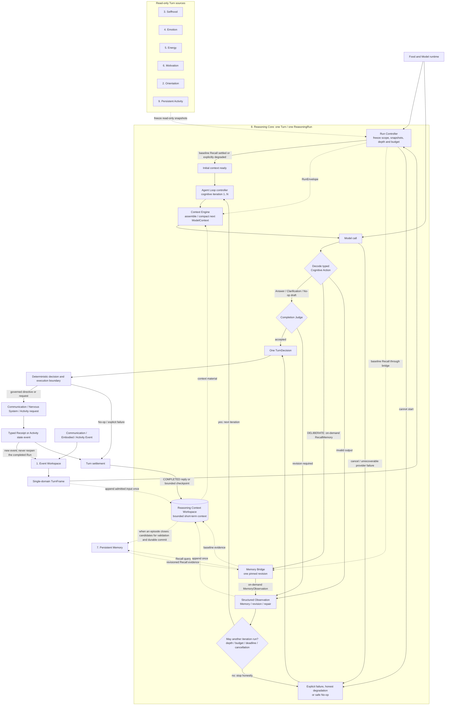

# Elfie Reasoning Core: single-Turn Agent design

> Status: accepted design 
> Confirmed: 2026-08-31 
> Scope: detailed expansion of system 8, `Reasoning Core`, in the
> [Brain ten-system architecture](./elfie-brain-ten-system-architecture.md) 
> Normative boundary: [Brain contract 1.8](../../../contracts/brain.md) 
> Implementation status: P0 owner chat is implemented and protected by focused tests;
> later Skill/Tool stages remain outside P0.

> Design relations: **Owner:** Elfie / Brain / Reasoning Core; **Parent:** [Brain
> ten-system architecture](./elfie-brain-ten-system-architecture.md); **Children:**
> none; **Normative contracts:** [Brain contract](../../../contracts/brain.md);
> **Current architecture:** [Cognitive information flow](../../../architecture/cognitive-flow.md);
> **Conformance:** none; **Domain sources:** Selfhood and Memory projections.

## 1. Core conclusion

Reasoning Core is a **bounded Agent for exactly one Turn**. It receives the
`TurnFrame` admitted by Event Workspace, owns the only
`Reasoning Context Workspace` and the internal Action/Observation loop,
interacts repeatedly with durable Memory when necessary, and finally produces
one `TurnDecision`. Waiting, scheduling, pause/resume and any work that survives
the Turn belong to Persistent Activity.

Three easily confused names are fixed as follows:

- `Event Workspace` is system 1. Its target source package remains
  `workspace/`; it owns event lanes, admission, deduplication, ordering,
  backpressure and single-domain `TurnFrame` construction.
- `Reasoning Context Workspace` is an internal Reasoning Core component. It
  holds short conversational and current-Turn work context; it is neither an
  eleventh system nor a new top-level package.
- `Memory` owns only durable Episodes, knowledge, people, relationships,
  provenance and retrieval. There is no `Memory Working Buffer`, and transient
  context is not a Memory-owned state category.

## 2. Frozen invariants

1. Reasoning is externally triggered by one immutable, single-domain `TurnFrame`, not by a caller-assembled complete Conversation.
2. One Turn has one `ReasoningRun`; the Run may make several model calls but may not wait across Turns.
3. Turn ID, Frame ID, causal IDs, Interaction Scope, Response Scope and deadline are frozen when the Run starts.
4. Only Reasoning reads and writes the `Reasoning Context Workspace`; no other system stores a second transient-context authority.
5. Event Workspace and Reasoning Context Workspace have similar names but different duties, lifecycles and data.
6. Semantic state owned by Memory is durable; Recall requests, results and implementation caches are not a second Memory state.
7. Context Workspace owns the Brain-usable current conversation history; actual messages and delivery receipts remain evidence of what was really said.
8. Orientation, Selfhood, Emotion, Energy, Motivation and Activity projections are read-only and version-frozen within the Turn.
9. Every Turn may perform baseline Memory Recall; a complex Turn may Recall again inside the loop, but all results bind to one Memory revision.
10. Reasoning decides when, why and what to query; Memory owns retrieval, provenance, conflicts, permissions, validation and durable commit.
11. A model may propose Memory or state candidates but cannot write Memory, Selfhood, Emotion, Activity or execution-success facts directly.
12. A `ContextSummary` is a derived, source-ranged context object, not a durable Memory fact that may be committed directly.
13. `DIRECT` and `DELIBERATE` express only reasoning depth for this Turn; Memory is available at both depths.
14. Food chooses model roles and fallback routes; it does not define cognitive modes, and there is no separate `allowed_modes` configuration.
15. Skill, Tool and Worker are stage-gated cognitive capabilities; P0 owner chat disables all three.
16. Timeout, cancellation, exhausted budget, Recall failure or model failure must produce explicit degradation/failure, never fabricated completion.
17. One Run forms one final `TurnDecision`, still constrained by one external domain and the deterministic governance boundary.
18. Journal records structured steps, evidence references, budgets and results, never a model's hidden chain of thought.

## 3. Authorities and state ownership

| Object | Sole owner | Lifetime | Reasoning access |
| --- | --- | --- | --- |
| Pending events, lanes and `TurnFrame` | Event Workspace | Before admission through frame construction | Receives only the final Frame |
| Actual inbound messages and delivery receipts | Communication / Receipt Journal | Durable evidence | Consumes through Frame/Receipt; cannot fabricate |
| `Reasoning Context Workspace` | Reasoning Core | Bounded short-term state across adjacent Turns; may have a Reasoning checkpoint | Sole reader/writer |
| `ReasoningRunState` | Reasoning Core | One Turn | Sole reader/writer |
| Episodes, knowledge, people, relationships and provenance | Memory | Durable | Recall or candidate submission through Memory Bridge |
| Orientation, Selfhood, Emotion, Energy and Motivation | Their respective systems | Owner-defined | One read-only snapshot per Turn |
| Waiting, scheduling and cross-Turn steps | Persistent Activity | Durable across Turns | May submit only a governed request |
| External-action success facts | Communication / Nervous System Receipt | Durable evidence | Receipt consumer only |

Context Workspace may keep a **bounded Reasoning-owned checkpoint** for crash
recovery; that does not turn it into Memory. Recovery reconciles this checkpoint
with real messages and receipts. It must never reconstruct a transient dialogue
from durable Memory by guessing what probably happened.

## 4. Internal logical modules

These are stable logical boundaries, not a requirement for six immediate
processes, services or directories.

| Module | Owns | Does not own |
| --- | --- | --- |
| Context Workspace | recent alternating dialogue, active topic, context summaries, current-Run Observations, pending Memory handoffs and bounded checkpoint | durable knowledge, event admission or model invocation |
| Context Engine | frozen-snapshot reads, material selection, context budget, compaction and assembly before every model call | mutation of another owner's state or external execution approval |
| Memory Bridge | this Turn's Recall revision, baseline/on-demand retrieval, deduplication, provenance checks and candidate/Receipt handoff | a second memory store or direct model access to Memory |
| Run Controller | complexity, `DIRECT/DELIBERATE`, Food role, budgets, deadline, cancellation, concurrency and degradation | reply generation or durable task storage |
| Agent Loop | bounded Model → Cognitive Action → Observation cycles | waiting across Turns or bypassing the Host to call a peripheral |
| Completion & Decision | sufficiency, evidence, conflicts, Scope, honesty and convergence checks; compilation of one `TurnDecision` | claiming a Directive executed or directly committing authoritative state |

### 4.1 Context Workspace

Context Workspace is isolated by `InteractionScope`; P0 Communication Scope
uses `(channel_id, conversation_id)` as its stable partition. Each partition
contains at most four material classes:

1. **Recent Raw Tail** — recent confirmed alternating messages;
2. **Active Topic** — current topic boundary, unresolved references, questions and commitments;
3. **Context Summaries** — bounded summaries of older content, each with covered source/event IDs, time range and version;
4. **Current Run Material** — this Turn's draft state, Memory Recall Observations, Verifier feedback and pending source handoffs.

This partition isolates messages, Receipts, short-term material and writes; it
does not isolate cognition. Partitions never read one another's raw dialogue,
but every Turn still reads frozen Orientation and Activity projections to know
the current attention focus, ongoing work, commitments and key constraints.
Event Workspace continues to own preemption, deferral, rejection and next-Turn
selection. A Topic is a semantic segment and Memory grouping cue inside one
conversation partition, not a replacement for the stable partition key.

An admitted inbound message is appended exactly once. An Elfie reply enters
alternating history only after `ExecutionReceipt=COMPLETED`. Failed, timed-out,
cancelled or uncertain delivery must never be stored as "replied". Each Scope
has one Context Workspace writer.

At Run settlement, only an acknowledged Elfie reply is appended to Recent Raw Tail;
unresolved items update Active Topic, and sourced material with durable value
becomes a pending handoff candidate. Recall results, Verifier feedback, drafts
and complete call traces do not automatically enter the next Turn's
`ModelContext`. This per-Turn finalization is independent from Prompt
compaction below.

### 4.2 Context Engine

Before **every cognitive step**, Context Engine produces a fresh,
provider-neutral `ModelContext`; it does not assemble one Prompt at Run start
and then keep concatenating strings. Logical priority is:

1. the non-trimmable four-block fixed model header and this Turn's protocol;
2. current `TurnFrame`, trusted IDs, Scope, deadline and current message;
3. unresolved items, active summary and recent alternating messages from Context Workspace;
4. relevant, sourced Memory Recall for this Turn;
5. frozen Emotion, Energy, Motivation, Orientation, Selfhood and relevant Activity projections;
6. structured Observations already produced in this Run;
7. Skill/Tool instructions only after those capabilities are enabled in a later stage.

Output budget and headroom for the next step are reserved first. Remaining
material is trimmed by relevance, freshness, source quality and cost. The
current message, trusted Scope, unresolved questions, important conflicts and
Tool/Observation pairs may not be truncated into semantically incomplete
fragments.

The numbering above is semantic retention priority, not physical Provider
message order. Assembly keeps the fixed header and slow-changing history first,
with current state, Recall, Observations and the current message in the dynamic
tail. Provider-specific cache hints are mapped by the Adapter; cache reuse never
justifies retaining Current Run Material that should be discarded.

### 4.3 Memory Bridge

Memory is not an optional "assisted mode"; it is an always-available Reasoning
capability:

1. At Turn start, idempotently hand off any previously closed, unacknowledged `ClosedEpisode`.
2. Pin `memory_revision` and apply the baseline Recall gate. Query only when the current message, people, active topic, references or explicit corrections express a real historical-retrieval intent; otherwise the result may explicitly be `skipped` or empty.
3. If the `DELIBERATE` Agent Loop discovers an unknown person, reference, conflict or missing critical knowledge, it may emit a typed `RecallMemory` Action.
4. Memory Bridge deduplicates equivalent queries, bounds request count and character/token cost, and rejects mixed revisions within one Run.
5. A Recall result returns to Context Workspace as `MemoryObservation`; Context Engine then rebuilds the next context.
6. The Run produces only sourced Memory-use records, `ClosedEpisode` objects or typed candidates; Memory validates and durably commits them.

If the pinned revision can no longer be read, the Run must explicitly choose to
keep existing Recall and mark it stale, rebase the complete Run context onto one
new revision, or degrade as Memory unavailable. It must not silently mix facts
from revisions.

### 4.4 Run Controller and Food

Run Controller creates one immutable `RunEnvelope` containing at least the
Turn/Scope, input versions, reasoning depth, model role, cognitive capabilities,
model/step/Recall budgets, deadline and cancellation state.

Reasoning depth has only two values:

- `DIRECT` — sufficient facts, low risk and no additional exploration; uses only pre-model baseline Recall and is fixed to one cognitive model step.
- `DELIBERATE` — ambiguity, conflicts, a complex explanation, an important correction or additional Memory evidence; allows `1..N` bounded cognitive steps and on-demand Recall.

Upstream circuits may supply salience, urgency and task-kind hints. Run
Controller combines those constraints with request complexity, risk, Energy,
deadline and available model capability to choose the final depth. Mode and
capability are orthogonal: both P0 depths may use baseline Memory Recall, only
`DELIBERATE` may use on-demand Recall, and neither may use a Skill or Tool.

Food routing follows the existing model contract: use the Elfie's selected main
Food, or Common Food only when no selection exists. Reasoning depth and model
role are orthogonal; both depths request `primary` by default. Run Controller
requests an available `reasoning` role for `DELIBERATE` only when task risk,
complexity, model capability and evaluation policy require it. Model failure
first uses the same Food's single `fallback`; only after the current Food is
wholly unusable may the route try Emergency Food once, finally returning typed
`no_available_food`. Requested role, actual model and every fallback reason
enter the redacted Trace.

### 4.5 Agent Loop

P0 uses the common bounded loop with tool capability disabled. Section 5 is the
sole authoritative control flow. Before every cognitive iteration, Context
Engine rebuilds `ModelContext`; the model emits one typed Cognitive Action; the
Host turns Recall, revision feedback or format repair into a structured
Observation. An Observation may trigger another iteration only for
`DELIBERATE` and after budget, deadline and cancellation checks pass.

The model emits a typed Cognitive Action, not a free-text control command. The
P0 Action set contains only `RecallMemory`, `AnswerDraft`,
`ClarificationDraft` and `NoOpDraft`; `RecallMemory` is available only to
`DELIBERATE`. Later stages may add `LoadSkill` and `CallTool` to the same union
without changing the one-Turn, one-Context-Workspace, one-final-decision
skeleton.

The user-visible reply is always ordinary text inside `AnswerDraft` or
`ClarificationDraft`; the Host control plane is what remains typed. When the
model natively supports structured output, the Adapter uses and validates it.
Otherwise `DIRECT` may safely wrap plain text as `AnswerDraft`, while the Host
supplies every trusted ID, Scope and execution field. Unvalidated free text is
never parsed as Recall, Tool or another privileged Action.

The Host stores only auditable structured Trace such as goal, unresolved
questions, evidence references, Action, Observation and judgment outcome. It
does not request or persist hidden chain of thought.

### 4.6 Completion & Decision

Completion Judge checks at least:

- whether the draft answers the current request or asks one clear clarification only when a required fact is genuinely missing;
- whether important claims are grounded in the current Frame, Context Workspace, Recall Evidence or explicitly ordinary knowledge;
- whether Memory conflicts, unknown values and stale state are expressed honestly;
- whether the reply preserves Selfhood, current emotion-expression constraints and Response Scope;
- whether it fabricates search, message delivery, body movement, reminder creation or other external completion;
- whether a current-Turn subproblem remains unresolved and one revision still fits the budget;
- whether the final plan uses no more than one permitted external execution domain.

Failure returns a bounded `RevisionObservation` to the same loop; acceptance
compiles the `TurnDecision`. When budget, deadline or an unrecoverable error is
reached, the only legal outcomes are explicit failure, an honest degraded reply
or a safe `No-op`.

A reply draft may carry separate internal settlement candidates such as emotion
evidence, a Topic update or Memory/Goal candidates. They are not external
Actions and cannot write owner state directly. Later iterations in the same Turn
may only revise or replace the same candidate; only the finally accepted
candidate is validated by its owner and committed at most once during
Settlement.

## 5. Authoritative internal control-flow diagram

The following is the **sole authoritative flowchart** for Reasoning Core's
internal runtime order and loop back edge. The ten-system diagram retains only
the system-level Reasoning boundary and does not duplicate this control flow.

`DIRECT` is fixed to `N=1` and never enters the control back edge. `DELIBERATE`
may finish after its first call, or follow the
`Observation → Guard → Agent Loop → Context Engine` back edge for on-demand
Recall, format repair, an evidence gap or a requested revision. Every control
edge that starts another model call crosses the same Guard;
none may bypass budget, deadline or cancellation state. Solid edges denote control or
interaction; dotted edges are data dependencies or post-Run handoffs and do not
create a hidden cognitive back edge.

The Agent Loop node only schedules the next cognitive iteration; it does not own
Context Engine or Completion Judge. The six logical modules defined in section
4 remain peer boundaries that can evolve independently.

Of the two Workspace names in the diagram, only Event Workspace is a first-class
system. Reasoning Context Workspace, Context Engine, Memory Bridge, Run
Controller, Agent Loop and Completion Judge are all inside Reasoning Core.
Memory and Reasoning interact bidirectionally, but Memory neither enters Agent
Loop nor owns Prompt context.

## 6. The inner loop and its termination point

Section 5 already expresses the complete loop; this section fixes only its
semantics. One Turn creates exactly one `ReasoningRun`. `DIRECT` has exactly one
cognitive iteration; `DELIBERATE` has `1..N`. In P0, only a `DELIBERATE`
structured Observation produced by `RecallMemory`, invalid output repair or a
Judge-requested revision may begin another iteration after the Guard permits
it. When Judge accepts a draft, or the Guard stops for budget, deadline,
cancellation or unrecoverable failure, the Run forms its sole `TurnDecision`
and ends.

External execution, Receipt intake, Context Workspace writeback and Memory
commit happen during subsequent Settlement. They may create a new event or
affect the next Turn, but they never reopen the completed Run.

## 7. Complete order of one Communication Turn

1. Event Workspace deduplicates, orders and admits the current channel/conversation into one `TurnFrame`.
2. Context Workspace idempotently appends the inbound message to the isolated conversation partition.
3. Reasoning freezes all other owner snapshots, Food projection, capabilities and deadline.
4. Run Controller selects `DIRECT` or `DELIBERATE` and freezes capability, budgets and `RunEnvelope`.
5. Memory Bridge hands off previously closed episodes that still await Memory acknowledgement, pins one Memory revision and performs baseline Recall that may be skipped or empty.
6. Context Engine builds the first `ModelContext` within budget.
7. Agent Loop performs one `DIRECT` call, or bounded on-demand Recall, context rebuilds and necessary revisions for `DELIBERATE`.
8. Completion Judge accepts one draft and forms the sole `TurnDecision`.
9. The deterministic governance boundary checks Scope, capability, freshness, idempotency and the single external domain before Communication executes.
10. Only a `COMPLETED` Receipt appends the Elfie reply to Context Workspace and forms a complete interaction source.
11. Only at topic completion/switch, idle timeout or capacity slicing does Context Workspace emit `ClosedEpisode`/candidates; Memory validates, persists and returns a Receipt.
12. Settlement stores bounded Trace/Checkpoint; the next Turn sees only acknowledged Context and Memory state.

## 8. Context compaction and Memory write

Compaction is two independent actions; a summary is not itself memory.

### 8.1 Prompt compaction

When the next model request would exceed its context budget, Context Engine
creates a Reasoning-owned `ContextSummary`. It retains coverage, source/event
IDs, time, unresolved items, corrections, conflicts and confidence boundaries.
The current message, recent alternating dialogue and incomplete Observations
remain raw. This summary only serves later Context Assembly and may be replaced
when better evidence arrives.

### 8.2 Durable Memory handoff

A `COMPLETED` Receipt only appends the real interaction as source material for
the currently open Topic; it does not close an Episode by itself. Context
Workspace creates a complete, sourced `ClosedEpisode` and any required typed
candidates only at explicit topic completion or switch, idle timeout or capacity
slicing; a capacity slice retains the same Topic lineage. Reasoning controls
**when to hand off and which sources to include**; Memory controls **acceptance,
encoding, conflict handling and durable commit**.

Context Workspace clears a pending handoff only after a successful Memory
Receipt. When Memory is unavailable, Reasoning may retain a local summary to fit
the Prompt, but it must keep replayable source material or real-message
references and mark the handoff uncommitted. It may neither lose the source
silently nor present a model summary as a Memory fact.

## 9. Concurrency, recovery and degradation

- Runs for the same conversation/situation Scope serialize updates to one Context Workspace; independent Scopes may compute concurrently, but final commit remains serialized.
- A new urgent event forms a new Turn and is never injected into a running Run; an old Run that loses freshness or Scope ends stale/failed.
- A Reasoning checkpoint contains only bounded Context Workspace, Run terminal state and redacted Trace; it contains neither hidden chain of thought nor a second Memory.
- When Memory Recall is unavailable, ordinary dialogue may degrade using the current message and acknowledged short context with an explicit `memory_unavailable` condition; an answer requiring historical facts must say they are unknown.
- Main-model failure follows the Food fallback contract; total failure returns `no_available_food` and no fabricated reply.
- Delivery failure appends no Elfie reply, produces no complete-interaction Memory candidate and is never represented as completion.
- Work that must wait for the future, an external condition or another Turn cannot stay in the Run; a later stage routes it to Persistent Activity, while P0 states the current capability boundary honestly.

## 10. Frozen P0 slice

P0 completes only the no-tool, high-quality owner-chat loop:

- Communication `TurnFrame`;
- receipt-backed alternating dialogue and Reasoning Context Workspace;
- baseline Memory Recall that may be skipped or empty every Turn, with bounded on-demand Recall for `DELIBERATE` when needed;
- `DIRECT` and tool-free `DELIBERATE`;
- context budget, provenance retention, compaction and Memory handoff;
- one Message/Clarification/No-op decision;
- real delivery, Receipt, Context/Memory writeback and continuation on the next Turn after restart;
- stable treatment of facts, preferences, explicit corrections, conflicts and unknown values.

P0 excludes Skill, Tool, Worker/Sub-Agent, web/file operations, background
autonomy, long Activity execution, automatic personality growth and a cross-
Turn Planner. Enabling those later reuses Context Engine, Memory Bridge, Run
Controller, Action/Observation and Completion interfaces without changing the
ownership skeleton.

## 11. P0 acceptance stories

1. The owner states a preference; alternating history and a complete sourced interaction are written only after the Elfie reply is really delivered, but the Receipt does not close the Topic automatically.
2. The next Turn uses a pronoun or omission and Context Workspace continues from the recent dialogue correctly.
3. After long dialogue triggers compaction, current topic, corrections and unresolved items remain usable and each summary traces back to original messages.
4. The owner explicitly corrects an old fact; after restart, Recall uses the corrected fact while preserving conflict/correction provenance.
5. An ordinary `DIRECT` request performs one cognitive model step; a request that needs more personal history enters `DELIBERATE` and performs one bounded Recall without mixing another Memory revision.
6. A complex question that needs no tool enters `DELIBERATE` and finishes or asks a necessary clarification within budget rather than looping forever.
7. Delivery failure, model failure, Memory unavailability and budget exhaustion produce distinct observable outcomes and never fabricate success.
8. With two conversations in flight, messages, summaries, Recall, replies and Receipts never cross scopes; each Turn may still read a bounded global attention/Activity projection, but never the other conversation's raw text.
9. Model text saying "sent" or "reminder created" never becomes an execution fact.
10. The final Provider request actually contains fixed Selfhood, current message, relevant short context, relevant Memory and current state; existence of an intermediate compiler object is insufficient.

P0 owner-chat closure may be claimed only when all ten stories have source,
focused-test and at least one replayable real-Provider/real-Receipt proof.
