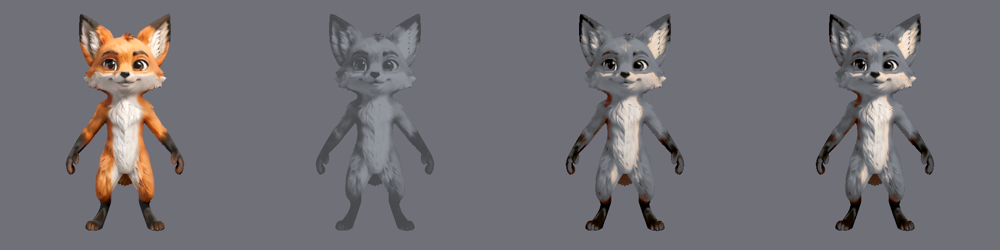
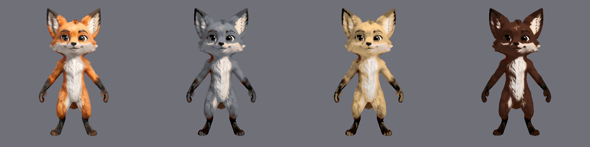
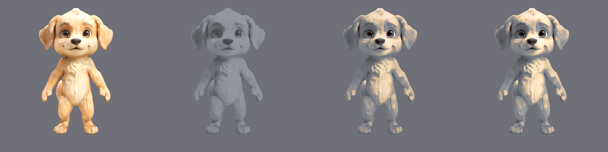
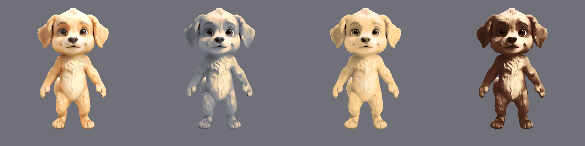
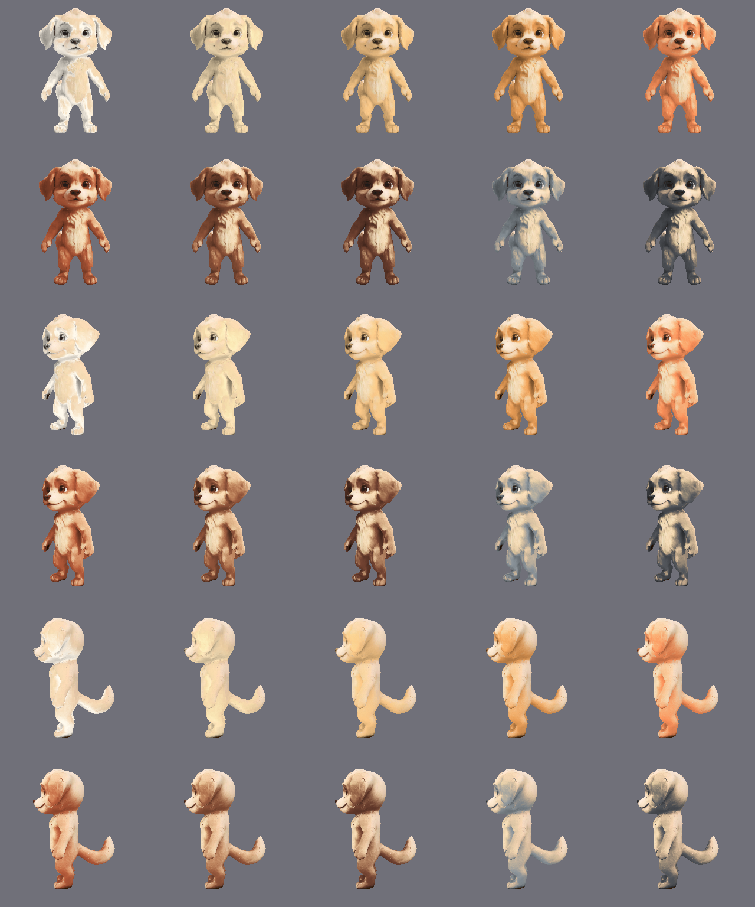
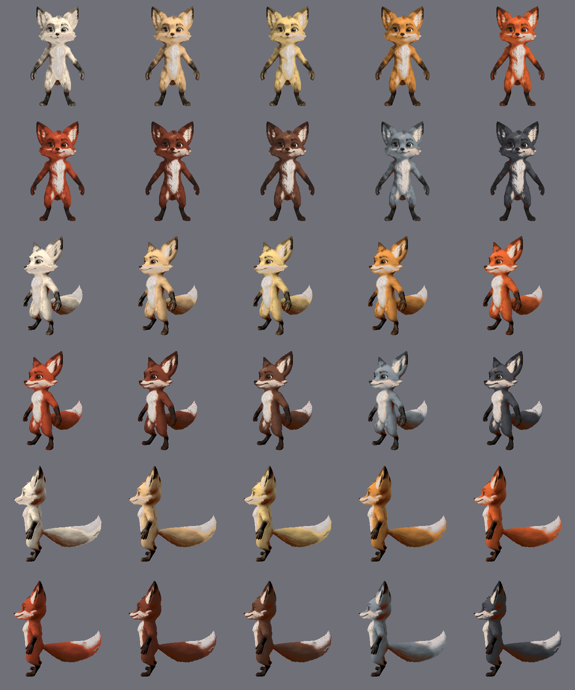

# Appearance Experiment — Phase 1: Material Recoloring

**Status:** validated for fox and dog and integrated into the production 3D material path.

**Date:** 2026-08-17

## Scope

This phase validates only the four items in the first red-boxed group:

- coat color replacement;
- independent light/white regions;
- preservation of fur roots, tips, shadows, and highlights;
- preservation of fur bundles, flow, and fine texture.

Geometry, GLB files, BlendShapes, large patterns, color-slot permutations, local markings,
and marking safety zones are explicitly out of scope.

## Experiment

The experiment used the original Godot fox and dog scenes and their baked source fur textures.
It did not regenerate the models or call an image-generation service.

The temporary shader compared four cases:

1. original material;
2. global recoloring, used as the negative control;
3. recoloring with protected light and dark regions;
4. the final candidate: protected regions plus bounded luminance remapping and mild fur-detail preservation.

The validated direction is:

- sample the real source fur texture, not a translucent overlay or a gray mask;
- treat the selected color as the coat midtone and remap luminance within a bounded range;
- protect light regions using source-texture brightness plus color neutrality, because the dog’s
  light fur is cream rather than pure white;
- preserve dark regions for paws, ear edges, and similar features;
- render the baked source texture without a second broad lighting pass, avoiding the gray/hazy
  appearance seen in the earlier attempt.

## Evidence

### Fox

### Dog

### Ten-color palette review

The ten-color library was rendered directly from the original GLB scenes with the same fur
shader. The first pass exposed two product problems: very dark coats compress eye/nose
readability, and adjacent brown tones are too similar when sampled in the same five-candidate
batch. A second pass lifted the dark targets to smoke-charcoal/smoke-black and kept the fur
luminance/detail transfer intact.

The machine-readable review, exact hex values, algorithm references, and the superseded direct
shader plates are in
[`palette-review-v1-final.json`](../../../public/assets/appearance-experiments/phase-1/palette-review-v1-final.json).
These plates preserve the historical V9 visual-selection evidence. The production implementation
now performs the same accepted relative-tone transfer directly on the animated 3D material in
`ActorAppearance`; it does not post-process the rendered plate. The frozen 13-region evidence is
maintained separately by the production region renderer.

## Review result

| Check | Fox | Dog | Result |
| --- | --- | --- | --- |
| Species identity and silhouette unchanged | Pass | Pass | No GLB/shape change required |
| Coat color becomes visibly different | Pass | Pass | Silver, cream, and sable are distinct |
| Light regions remain independent | Pass | Pass | Requires source-texture mask parameters per species |
| Fur flow and texture remain visible | Pass | Pass | No plastic or broad gray veil in the final candidate |
| Global recolor alone is acceptable | Fail | Fail | It destroys the independent light/dark regions |

Product review scores are visual estimates for this controlled screenshot, not an automated
quality metric: fox approximately **8.8/10**, dog approximately **8.4/10**. The remaining gap
to the AI reference is primarily the GLB’s existing fur density and baked-detail ceiling; the
recolor experiment does not change geometry and does not remove the original fur texture.

## Decision

Phase 1 passes as the visual baseline for both supported species. Production now uses the reusable
source-texture recolor path with species-specific source anchors and protected-feature behavior.
The rejected broad overlay, screenshot recoloring and UV-mask implementations remain removed.

## Follow-up record

The follow-up experiments for large-area patterns, color-slot permutations, local marks, safe
zones, and five-candidate diversity are recorded in
[`phase-2-patterns-and-marks.md`](phase-2-patterns-and-marks.md). The first UV-mask prototype was
also tested there and explicitly rejected for this visual baseline because its front/side edge
quality did not meet the product bar.
