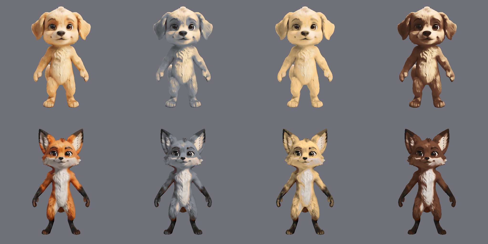
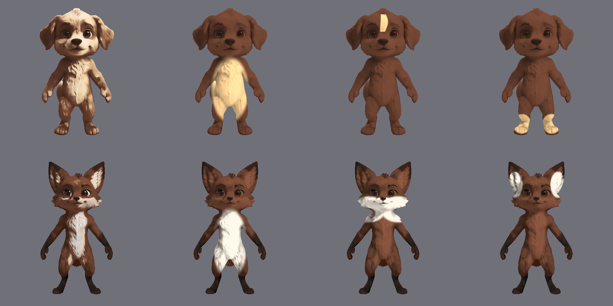
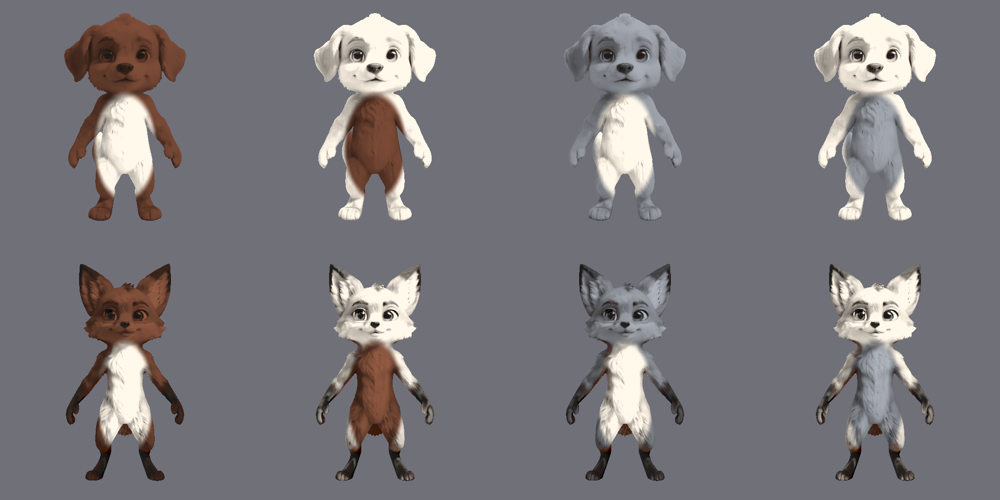
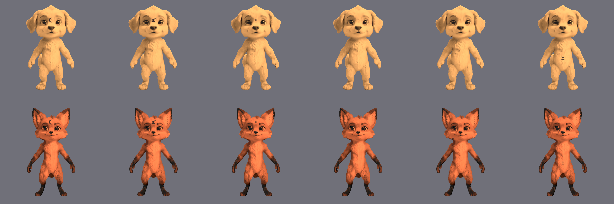
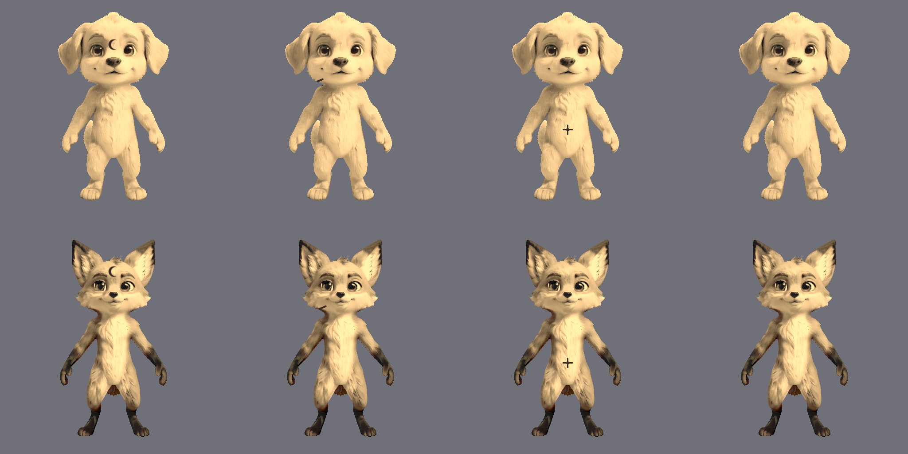
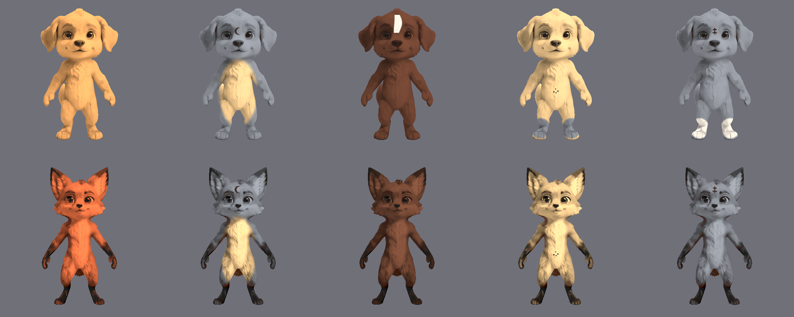

# Appearance Experiment — Phase 2: Patterns, Marks, and Candidate Diversity

**Status:** Local-region and safe-mark feasibility is integrated into production. The later
anatomy-spanning body-motif result is recorded but explicitly deferred.

**Date:** 2026-08-17

## Why this record exists

Phase 1 established the accepted baseline: recolor the original source fur response with bounded
relative-luminance transfer, preserve dark identity details and light regions, and avoid a broad
overlay that creates gray haze. The product review estimate for that baseline was approximately
8.8/10 for fox and 8.4/10 for dog under the controlled comparison.

This record captures the next experiments so the decisions and limits are findable later. It does
not turn the experimental images into a production shader or alter a GLB, scene geometry,
BlendShape, or face shape.

## Important rejected route

An earlier UV-mask prototype was rendered from front and side views. It was rejected as the
current production direction after visual review: the protected eye/nose regions grew too large,
some fox white-region boundaries remained visibly wrong, and the side-view tail/edge result was
not reliable enough. The reviewed images remain as historical evidence, but the rejected render
script was removed so it cannot become a second recoloring path. The default actor appearance path
does not bind the mask assets.

The rejection does not mean texture-space masks are impossible. It means that this particular
hand-authored mask quality was below the product bar and should not be treated as a finished
solution.

## Controlled experiment method

The original dog and fox Godot scenes were rendered with the real Godot OpenGL/Metal renderer at
the fixed 512×512 adoption-card camera. A temporary harness then applied the accepted Phase 1
relative tone transfer and explicit species-specific natural-region masks to the rendered image.
This made the experiments fast and repeatable without starting the service or changing the GLB.

The harness is deliberately a feasibility tool, not a production implementation:

- it proves the parameter combinations and rejection rules can be expressed;
- it preserves the source render’s fur bundles, highlights, and fine detail inside recolored areas;
- its region coordinates are tied to this fixed front camera, so they do not prove multi-angle 3D
  stability;
- production integration still needs semantic/UV region data designed and reviewed per species.

The fixed-camera Phase 2 harness was removed after review to prevent it from becoming a second
recoloring implementation. The checked-in plates below are historical evidence rather than a
current replay target. Current V9 acceptance renders use
`godot_project/scripts/test/render_production_appearance_candidates.gd`, which delegates all tone
transfer to the single production implementation in
`godot_project/runtime/actor/actor_appearance.gd::ActorAppearance.apply`.

## Results

### 1. Accepted baseline

The original source render and the silver, cream, and deep-brown/sable transfers remain visibly
fur-like. The result is the reference starting point for every later plate.

### 2. Large natural-region patterns

The experiment supports different natural-region families per species:

- dog: chest bib, narrow forehead blaze, and paw-sock regions;
- fox: chest, lower face/muzzle, and inner-ear regions.

The source fur detail survives inside the regions, so the mechanism is feasible. The dog forehead
boundary is still only an exploratory fixed-camera mask and is not final art; the final version
needs a region boundary that follows the real fur/UV layout rather than a screen-space shape.

### 3. Color-slot permutations

The same region layout can swap primary and secondary color slots without changing the pattern
geometry. This confirms that a pattern is not merely `pattern_count × color_count`: each pattern
has independently selectable slots, and valid combinations are a product of layout, slot
assignment, palette compatibility, and optional accent choices. Very low-contrast combinations
should be filtered before showing them to a user.

### 4. Local markings

The prototype covers six mark families—crescent, angular glyph, cross, star/dot cluster, short
dash, and a simple alien-like glyph—at forehead, cheek, and chest placements. The mark layer can
be deterministic and can be combined with a color/pattern key. These are control proofs only:
the black glyphs need a later art pass for scale, edge softness, fur-aligned blending, and
species-specific styling.

### 5. Safe-zone validation

Legal forehead, cheek, and chest placements render. An eye/nose placement request is rejected and
produces no mark. This validates the important generation-time rule: choose from an allow-list of
semantic zones and reject forbidden zones before rendering; no screenshot plus large-model
inspection loop is required.

### 6. Five-candidate diversity

Each species produces five visibly different candidates by combining coat colors, region layouts,
slot assignments, and marks. This validates the immediate adoption requirement that the five
cards can be made distinct. It is not a statistical guarantee that thousands of candidates will
never look similar: that later scale requires a visible-key history plus a perceptual similarity
check or stricter palette/layout quotas.

## Decision and next boundary

The experiments pass as a technical feasibility layer for all five requested controls:

1. large natural-region color blocks;
2. color-slot permutations;
3. local marks;
4. generation-time safe zones;
5. five-candidate visible diversity.

The current product-safe boundary is:

- keep Phase 1 source-texture relative recoloring as the accepted visual foundation;
- keep dog and fox on one shared appearance protocol with species-specific region definitions;
- do not adopt the rejected UV-mask assets or the fixed-camera image-space masks as production
  runtime behavior yet;
- production now uses only the reviewed thirteen semantic regions, with automated checks for
  forbidden zones, slot compatibility and deterministic keys; multi-angle rendering remains the
  required visual acceptance evidence.

### Deferred anatomy-spanning body-motif follow-up (2026-08-18 to 2026-08-19)

A later experiment attempted to carry one sparse alien motif continuously over the rear skull,
rear neck, back, upper arms and upper thighs. It used a pre-authored 1:2 atlas, a species-specific
rear-body clip mask, piecewise head/shoulder/hip anchors and an original-UV bake. The best rear view
was directionally useful, but side views showed stretched and abruptly clipped strokes on the
upper arm and thigh. A 2D body projection could not provide the limb-local continuity seen in the
visual references.

Decision: keep the written result and visual direction, but remove the duplicate harness and atlas
so they cannot become a second production Shader. The product generates no body-motif parameters
and `ActorAppearance` does not consume them. Reactivation requires a new anatomical-path or
equivalent 3D-to-UV bake experiment that passes five-view review for both dog and fox. This
deferral does not reopen the frozen V9 tone transfer or the thirteen production regions.

## Evidence inventory

The six individual plates above are checked-in under
`docs/public/assets/appearance-experiments/phase-2/`. The larger combined plate is also retained
as `phase-2-all-stages.png`; the individual plates are the authoritative review artifacts because
their widths match the number of candidates in each experiment.
