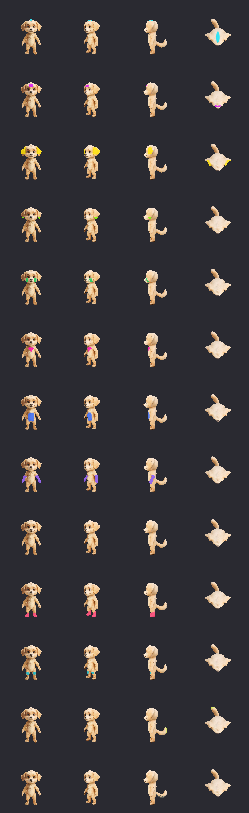
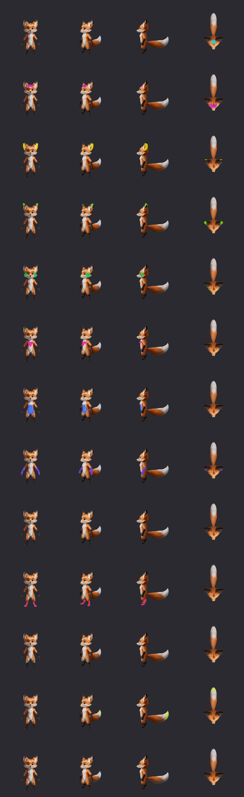

# Appearance Experiment — Phase 3: Production Semantic Regions

**Status:** the thirteen production regions are frozen and integrated.

**Dates:** discovery started 2026-08-17; production baseline accepted 2026-08-19.

## Scope and result

This phase established reusable local regions on the existing dog and fox GLB meshes without
changing either GLB. The accepted result is no longer an independent experiment shader:

- `godot_project/runtime/actor/actor_appearance.gd` owns the production region formulas and the
  V9 relative-tone composition;
- `godot_project/scripts/test/render_production_region_debug.gd` is the sole replayable region
  baseline renderer and delegates classification to `ActorAppearance`;
- dog and fox share one thirteen-region protocol while retaining species-specific geometry
  thresholds;
- at most two color-capable regions are active on one candidate.

The twenty-seven discovery rounds were useful while boundaries were being tuned, but they were
removed after promotion so they cannot act as a second source of truth. Their durable outcome is
the frozen production formula, this decision record, and the compact formal baseline below.

## Replay

From the repository root, with Godot 4.7 and no other Godot instance running:

```text
APPEARANCE_FORMAL_REGION_OUTPUT=/private/tmp/elfienest-formal-regions \
/Applications/Godot.app/Contents/MacOS/Godot --display-driver macos \
  --rendering-method gl_compatibility --path godot_project \
  --script res://scripts/test/render_production_region_debug.gd
```

The renderer writes the dog and fox grids, individual rows and views, and a machine-readable
catalog to the requested temporary directory. Only the two compact grids and catalog are checked
in as release evidence.

## Frozen baseline

[Production baseline manifest](../../../public/assets/appearance-experiments/phase-3/production-region-baseline-v1.json)





Each row is one region. Columns are front, three-quarter, side and top. Bright debug colors show
selection only; product recoloring uses the same local V9 relative-tone transfer as the base coat.

## Region contract

| ID | Key | Allowed operation |
| ---: | --- | --- |
| 0 | `head_tuft` | color |
| 1 | `forehead_mark_zone` | forehead glyph only |
| 2 | `ear_pair` | color |
| 3 | `ear_tip_pair` | color |
| 4 | `cheek_fluff` | blush, freckles or mole only |
| 5 | `chest_tuft` | color or heart |
| 6 | `belly_center` | heart only |
| 7 | `forearm_paw_pair` | color |
| 8 | `elbow_cuff_pair` | rear elbow patch color |
| 9 | `lower_leg_foot_pair` | color |
| 10 | `knee_cuff_pair` | front knee patch color |
| 11 | `tail_tip` | color |
| 12 | `tail_underside` | color |

Color-capable IDs are `0, 2, 3, 5, 7, 8, 9, 10, 11, 12`. The forehead, eyes, eyebrows, nose,
mouth, teeth and claws remain protected except for explicitly allowed safe marks.

## Frozen boundaries

The production implementation uses evaluated 3D model coordinates and source texture sampling;
it is not a screen-space mask and does not post-process a screenshot. Region changes require a
new multi-angle baseline for both species and must not introduce another recoloring or region
classifier. The deferred anatomy-spanning body motif is outside this contract.
