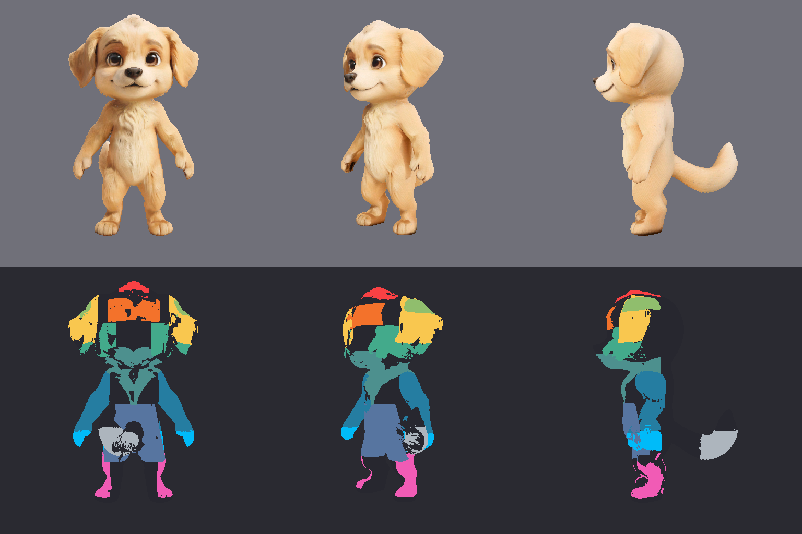
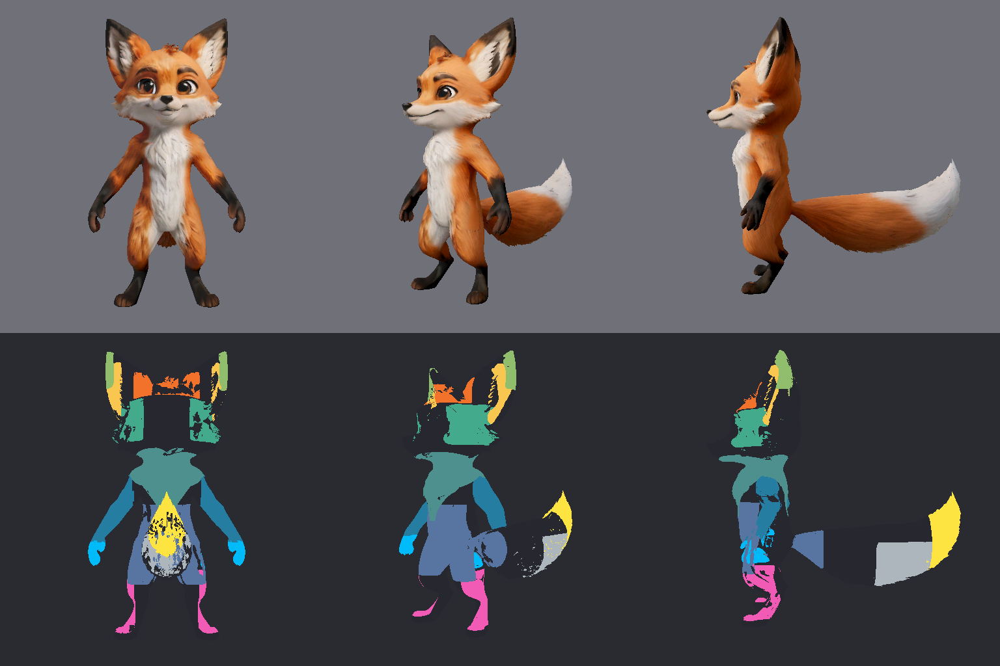
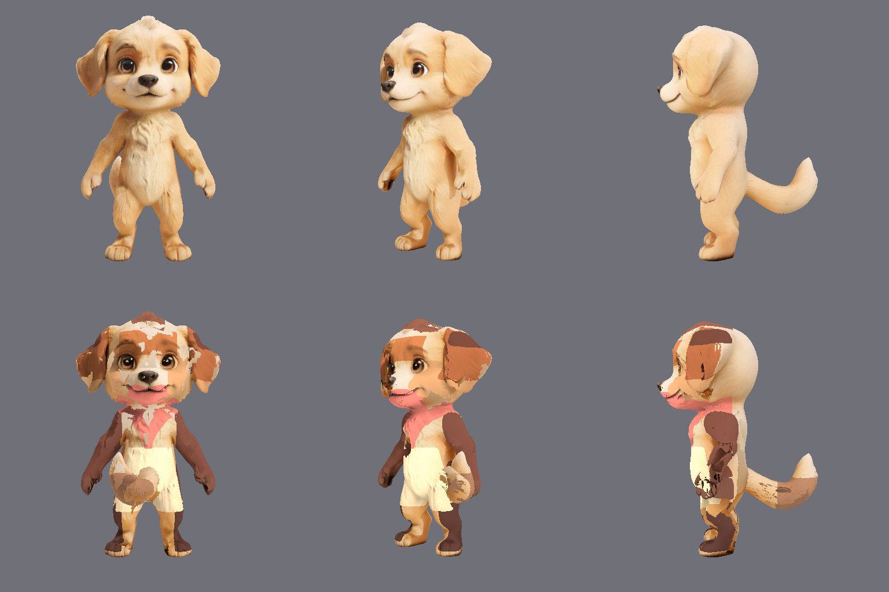
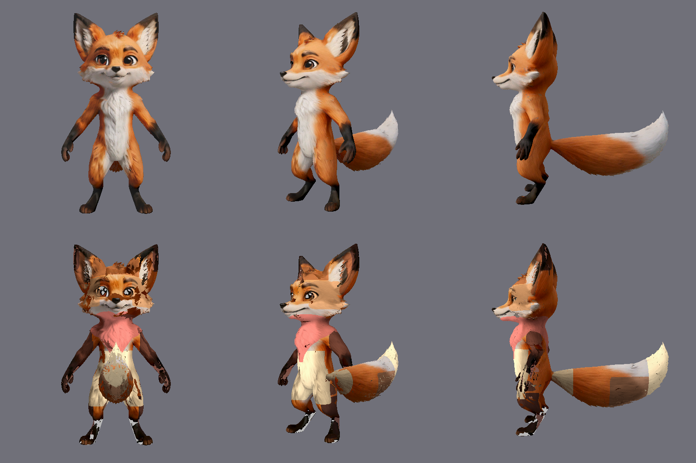
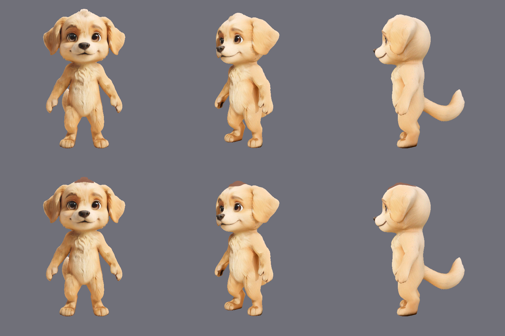
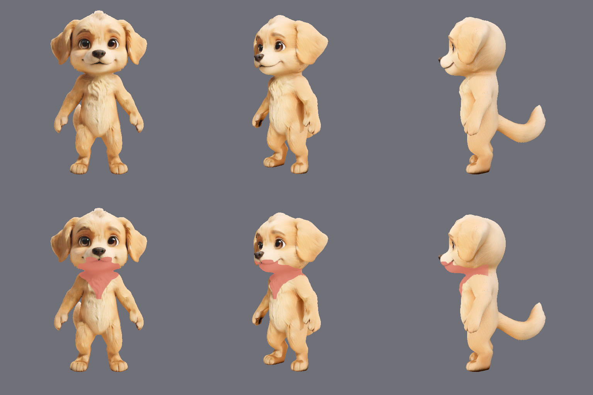
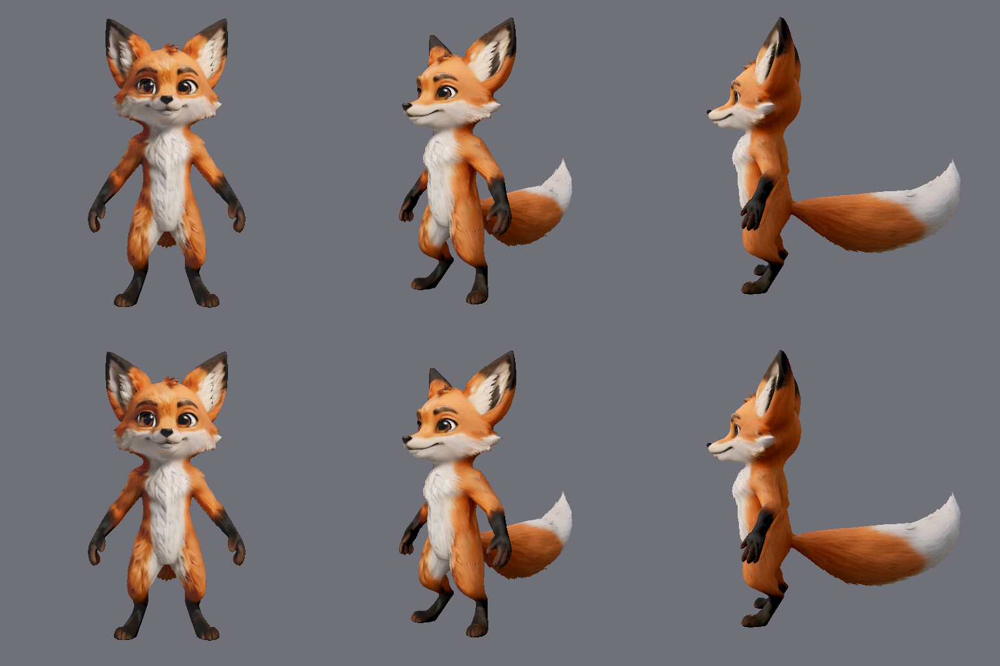
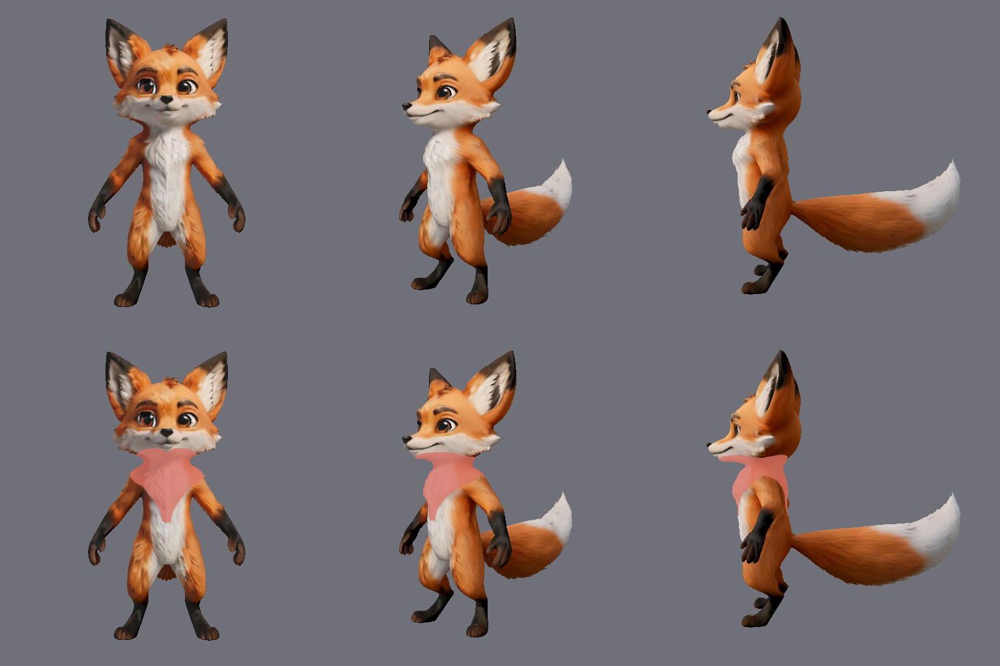

# Appearance Experiment — Phase 3: 3D Region Discovery

**Status:** Implemented as a Godot-only discovery/debug preview; region boundaries are not yet
production-approved.

**Date:** 2026-08-17

## Scope

This phase answers one narrow question: can we identify reusable local regions on the existing dog
and fox GLB meshes before assigning colors or generating combinations?

The answer is **yes for the core regions below**, with species-specific definitions. The experiment
does not change the GLB, scene geometry, BlendShapes, face shape, production shader behavior, or
the adoption service.

## Method

`godot_project/scripts/test/render_appearance_region_debug.gd` renders the original scenes with the
real Godot OpenGL/Metal renderer at four angles: front, three-quarter, side, and top. The top view
specifically checks the head-tuft front/back footprint and tail-root false positives. A temporary debug
shader reads the evaluated model-space position (`MODEL_MATRIX * VERTEX`) so the imported GLB's
centimetre armature coordinates are converted into the visible scene-metre coordinates. It then
colors candidate regions and can isolate one region at a time.

This matters because the old screen-space ellipses moved with the adoption-card camera and could
not prove that a tail, ear, or chest region stayed attached to the model. This preview is a 3D
region-discovery test, not a claim that the current thresholds are final art masks.

Replay from the repository root with a desktop renderer:

```text
APPEARANCE_REGION_OUTPUT=/private/tmp/elfienest-appearance-reference/phase-3 \
/Applications/Godot.app/Contents/MacOS/Godot --display-driver macos \
  --rendering-method gl_compatibility --path godot_project \
  --script res://scripts/test/render_appearance_region_debug.gd
```

Useful inspection switches:

- `APPEARANCE_REGION_SELECTED=0..12` isolates one region in the four views.
- `APPEARANCE_REGION_HEATMAP=1` shows the evaluated local-coordinate ranges instead of the region
  colors.
- `APPEARANCE_REGION_COLOR_PREVIEW=1` keeps the original material and overlays the candidate
  regions with semi-transparent test colors, so boundary holes can be judged against the real fur.

The script also writes `region-catalog.json` with each actual color-coded region's ID, color, target
description, and exclusion description. It is review guidance for the vision model, not a pre-supplied
answer mask.

## Saved baseline and symbol catalog

The accepted working point for the next experiment is round 27. It is saved as an explicit baseline
so later region changes cannot silently replace the reviewed evidence:

[Region baseline manifest](../../../public/assets/appearance-experiments/phase-3/region-baseline-v1.json)

The round-27 grid and its 13 isolated four-view rows are the source of truth for the current
experimental region definitions. This baseline is still not a production approval; it only freezes
which masks the next visual experiment must start from.

The special-mark candidates are kept separate from the region baseline. The visual sheet contains
15 proposed shapes, while the JSON file records their preferred placement and identifies blush and
tail ring as site-specific marks rather than forehead glyphs:

[Special-symbol candidate catalog](../../../public/assets/appearance-experiments/phase-3/special-symbol-catalog.svg)

[Special-symbol catalog data](../../../public/assets/appearance-experiments/phase-3/special-symbol-catalog.json)

## Region decision matrix

| Region key | Dog | Fox | Current decision |
| --- | --- | --- | --- |
| `head_tuft` | the single central tuft protruding above the crown | the single central tuft protruding above the crown | Core candidate; deliberately narrow, not the whole crown. |
| `forehead_mark_zone` | centered hairline-to-brow area | same semantic zone | Core safe-zone candidate; eyes, nose and mouth remain protected. |
| `ear_pair` | whole floppy ear area | visible inner/front ear area | Core candidate, but intentionally species-specific; “ear inner” is not a valid shared meaning. |
| `ear_tip_pair` | lower end of each floppy ear flap | uppermost outer point of each upright ear | Core candidate; review with the ear pair so the two masks remain disjoint. |
| `cheek_fluff` | outer cheek/muzzle fur | cheek ruff/muzzle fur | Core candidate; central eyes, nose and mouth are excluded. |
| `chest_tuft` | the upper heart-shaped chest tuft | the upper heart-shaped chest tuft, shifted down for the fox mesh | Core candidate; the long white belly remains separate. |
| `belly_center` | center belly fur | center belly fur | Core candidate; use as a broad natural area, not a tiny navel dot. |
| `forearm_paw_pair` | forearms and hands | forearms and hands | Core candidate; paired left/right slot by default. |
| `lower_leg_foot_pair` | lower legs and feet | lower legs and feet | Core candidate after lowering the upper cutoff so hand tips are not included. |
| `tail_tip` | small visible tip in side view | clear tail tip in side view | Core candidate, strongest on fox; front view may be occluded by the body. |
| `tail_underside` | exploratory | exploratory | Needs species-specific underside validation; do not use for combinations yet. |
| `elbow_cuff_pair` / `knee_cuff_pair` | overlaps nearby limbs in this single-mesh coordinate test | same | Experimental only; not part of the first color-combination set. |

### Protected identity features

Eyes, eyebrows, nose, mouth, teeth, claws, and other dark identity details are not selectable
appearance regions. They remain source-rendered details. This is the intended protection boundary;
we do not draw hand-painted screen-space circles around them.

## Evidence





Each plate is two rows: the original render in the top row and the color-coded region map in the
bottom row. Columns are front, three-quarter, side, and top. The script prints and writes the stable
numeric IDs, keys, labels, colors, target descriptions, and exclusions. Review starts with anatomical
location, then checks expansion, omission, and cross-region leakage against the original render.

The material-overlay checks are the product-facing validation:





The isolated checks make the two corrected definitions unambiguous:









### Product review of the experiment

- The head-tuft test must change only the small central protruding tuft in all four views; the
  top view is required because a front view can hide a missing rear half.
- The chest test reads as a heart-shaped upper-chest accent, while the belly remains a separate
  region. The fox uses a small vertical offset because its imported neck/chest transition sits
  lower than the dog's.
- The earlier black-looking gaps were caused by replacing the source material and by an overly
  strict normal-facing filter. The validation now overlays the test color on the original
  material and allows the fur's local strand direction; the remaining fine variation is source
  fur texture, not a broad blank hole.
- The all-region preview is intentionally a boundary test, not a final palette. Applying many
  unrelated test colors at once is visually noisy; final combinations should use a small,
  species-appropriate palette after the region boundaries are accepted.

## Boundary and next-step rules

1. Do not assign colors until the core region boundaries are accepted in all four views.
2. Keep dog and fox on the same region protocol, but allow species-specific geometry rules.
3. Treat paired left/right regions as one slot by default; asymmetry is a later controlled option.
4. Use the region masks as semantic inputs to the accepted relative-tone transfer. Do not flatten
   the source fur shading and do not add a broad translucent overlay.
5. After review, promote only the accepted region definitions into the production appearance
   contract. Then test color combinations, transition width, forbidden-feature protection, and
   deterministic candidate keys.

## Current limit

The imported GLBs are each a single body mesh without ready-made ear/chest/tail material IDs. A
pure local-coordinate region can reliably find broad anatomical areas, but it cannot always know
the difference between an inner and outer surface of the same ear, or an elbow band and a nearby
hand, without additional UV/vertex-group data. Those ambiguous areas are intentionally visible in
the debug plate and remain unapproved instead of being silently treated as finished masks.
