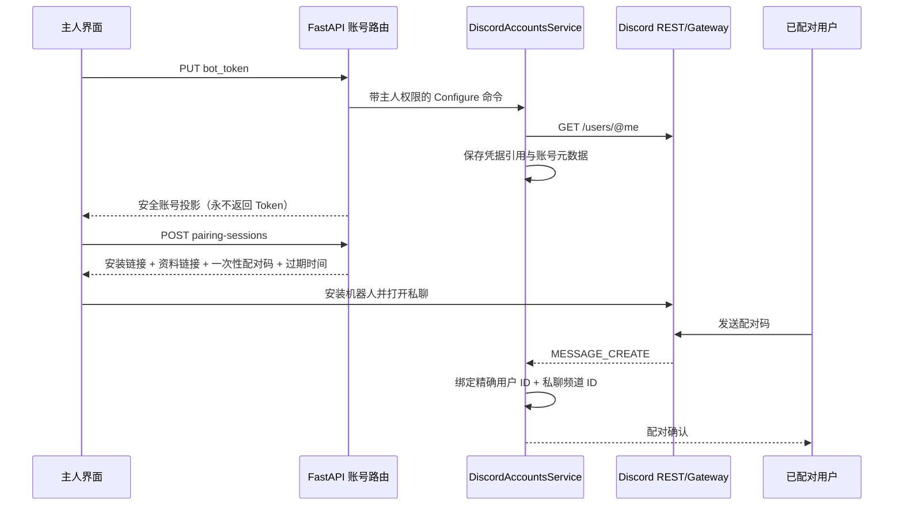

# 通信渠道

本页描述当前已经验证的外部聊天实现，覆盖 Telegram 同款的 Discord P0
切片。它不是公共服务器、群聊或共享云账号方案的提案。

所有权和依赖方向仍以[应用架构契约](../contracts/application)、[Elfie 内部架构契约](../contracts/elfie)、
[系统架构契约](../contracts/system)和[服务生命周期契约](../contracts/service-lifecycle)为规范。

## Discord P0 边界

当前产品模型刻意保持简单：

- 一只 Elfie 拥有一个 Discord Bot Token；
- 由本地主人配置 Token，并且主人始终是账号所有者；
- 机器人只接收一个已配对人类用户的 Discord 私聊文字；
- 公共 guild 频道、群聊、附件、语音、表情反应和多联系人管理不在本切片内。

未来的授权联系人模型可以在同一个授权闸门上扩展多个绑定，但不能绕过
这个闸门，也不能把未授权消息送入 Elfie 的规范消息投递链路。

## 账号与配对流程



配对码一次性使用，十分钟后过期；运行时只保存 SHA-256 摘要。账号重新配置或
断开时，旧配对码立即失效。成功配对后保存 Discord 用户、私聊频道、本地主人和
Elfie conversation ID。账号投影有四种状态：`unconfigured`、`waiting_pairing`、
`active` 和 `attention`。

主人 API 如下：

| 方法 | 路由 | 用途 |
| --- | --- | --- |
| `GET` | `/api/v1/elfies/{elfie_id}/communication-accounts/discord` | 读取安全账号投影 |
| `PUT` | `/api/v1/elfies/{elfie_id}/communication-accounts/discord` | 校验并替换主人 Bot Token |
| `DELETE` | `/api/v1/elfies/{elfie_id}/communication-accounts/discord` | 断开机器人并撤销当前绑定 |
| `POST` | `/api/v1/elfies/{elfie_id}/communication-accounts/discord/pairing-sessions` | 创建短时配对会话 |

所有路由都要求当前用户是该 Elfie 的认证主人。请求 DTO 拒绝未知字段；响应 DTO
只包含机器人身份与状态，不包含 Token 或 credential reference。

## 入站与出站消息链路

```text
Discord Gateway MESSAGE_CREATE
        │
        ▼
严格 mapper：ID、作者、私聊/服务器、机器人标记、文字
        │
        ▼
DiscordGatewayWorker
        ├─ 配对码 → 一次性绑定 → 回复确认
        └─ 精确主人 + 用户 + 私聊频道校验
                 │ 拒绝：终止处理，不调用 Brain/模型
                 ▼
SubmitUserMessageCommand(channel="discord")
        │
        ▼
现有 MessageDelivery → Elfie Brain
        │
        ▼
DiscordChannel → Discord REST POST /channels/{id}/messages
                 └─ 记录已确认发送的回复到现有会话历史
```

外部消息 ID 是确定性的：`discord:{bot_id}:message:{message_id}`。因此 Gateway
事件重放不会产生第二条规范用户消息。机器人自己发出的消息、非私聊消息、格式
错误的 ID，以及来自非绑定用户或非绑定频道的消息，都会在调用
`SubmitUserMessageCommand` 之前被拒绝。出站 Channel 也会检查 conversation ID，
因此 Elfie 不能把回复发到无关 Discord 会话。

## Runtime 所有权与故障行为

Bootstrap 负责创建 Feature service、持久化 Adapter、Discord REST inspector、消息
处理器和 Gateway runtime。`ApplicationRuntimeLifecycle` 会把 Discord runtime 与
现有 Telegram runtime 一起启动和停止。Discord runtime 按每个 active Elfie 账号
协调一个 Gateway worker；worker 使用 daemon 线程和有界停止时间，关闭时会解除
Channel 挂载。

Gateway Adapter 使用私聊 intent，发送 heartbeat，处理 Gateway 的重连请求，并在
session ID 与序列号仍然有效时恢复会话。Discord 要求重置时会新建会话。REST 出站
只支持文字，并限制在 Discord 的 2,000 字符上限内。凭据失效和传输故障会把账号
更新为 `attention`；日志和错误响应不包含 Secret。

配置元数据和绑定使用现有每只 Elfie 的 `conversations/history.sqlite` schema。
真实凭据仍由现有被忽略的本地 Secret 边界管理。本 P0 不引入第二个聊天数据库、
云端中继或长期公开 HTTPS 端点。

## 面向主人的交互

精灵档案中的模块是三步小白流程：

1. 在 Discord Developer Portal 创建 application 和 Bot；
2. 只粘贴一次 Bot Token，由 ElfieNest 负责校验；
3. 点击安装链接，打开机器人私聊，复制短配对码，并等待变为已连接。

界面复用现有私有通信模块的视觉处理，提供复制/打开按钮；配对期间轮询账号
状态；不会再次显示已保存 Token；支持重新配置和断开。中英文文案同步维护。

## 精细化审查结论与明确限制

本轮审查覆盖以下不变量：

- 每个账号操作都检查主人权限；
- Token 入库前先校验，API 永不返回 Token；
- 配对只能使用一次，并绑定精确外部身份与私聊频道；
- 未授权输入在规范消息投递和模型执行前终止；
- 外部消息 ID 保证入站幂等；
- 出站发送限制在已配对 conversation；
- Gateway worker 归应用生命周期管理，并在关闭时清理 Channel；
- 只有 Discord 确认出站消息后，才记录本地历史。

P0 目前明确不声称支持多联系人授权。未来加入时，应把存储模型扩展为绑定
allowlist，再由同一个入站闸门选中匹配会话；默认不应打开公共 guild 消息接收。

自动化测试覆盖伪造 REST/Gateway 交互、配对过期与重放、身份拒绝、历史/幂等、
持久化、API 合约、UI 状态、类型检查和架构边界。真实 Discord 冒烟测试仍需要
用户自己的 Bot Token 和已安装机器人；仓库与测试夹具不会保存生产凭据。
