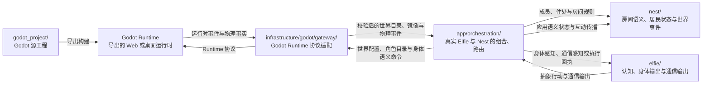

# 当前架构

这份文档描述 ElfieNest 当前代码中的模块边界与运行链路。它不是历史路线图，也
不会把尚未实现的设计写进当前架构。

> 这是说明性的当前状态地图，不是规范目标。最终所有权和依赖规则只在
> [架构契约](../contracts/)中定义；当前状态与目标之间的临时差距只记录在
> [一致性台账](../conformance/)中。

## 系统地图


黑色箭头在两端都画出箭头头部时，表示真实的双向数据或协议关系；红色箭头标出
具体的内部入口与控制路径。特别是，`ElfieFactory` 负责创建或恢复 `Elfie` 实例；
运行期操作随后通过返回的 `elfie.py` facade 进行。

`app/orchestration` 直接组合 `elfie`、`nest` 与注入的认知 Runtime，并不位于
`app/features` 的下游。在产品用例平面，Interface 调用具体
Feature 用例，Feature 声明自己需要的 Port，Infrastructure 实现 Port，Bootstrap 是
唯一组合根；这些边界由永久架构测试直接执行。

核心源码按职责分为：

| 模块 | 当前职责 | 详细入口 |
| --- | --- | --- |
| `elfie/` | 一只完整精灵的档案、大脑、神经系统、身体、通信与技能 | [Elfie README](https://github.com/elfie-univ/ElfieNest/blob/main/elfie/README.md) |
| `nest/` | 活动空间状态、环境时钟与互动语义 | [Nest README](https://github.com/elfie-univ/ElfieNest/blob/main/nest/README.md) |
| `infrastructure/godot/gateway/` | 已认证 Godot 协议传输、Session 与 Bundle 检查 | [模块边界](./module-boundaries) |
| `app/` | 产品用例、接口、编排与 Bootstrap 装配 | [App README](https://github.com/elfie-univ/ElfieNest/blob/main/app/README.md) |
| `infrastructure/` | 模型、工具、持久化、Godot、设备、通信与平台 Adapter | [模块边界](./module-boundaries) |
| `app/orchestration/lifecycle/` | Runtime 生命周期、完整健康、owner lease 与权威控制 | [运行时与数据](./runtime) |
| `infrastructure/godot/lifecycle/` 与 `artifacts/` | 权威宿主选择、已导出 Runtime 启动和产物元数据 | [运行时与数据](./runtime) |
| `app/interfaces/desktop/` | Electron Observer 窗口与公开 lifecycle client | [Desktop README](https://github.com/elfie-univ/ElfieNest/blob/main/app/interfaces/desktop/README.md) |
| `godot_project/` | 独立 Godot 源工程：房间、几何、坐标、碰撞、角色和渲染源码 | [Godot README](https://github.com/elfie-univ/ElfieNest/blob/main/godot_project/README.md) |
| `devtools/` | 与普通用户产品隔离的模块实验台 | [Devtools README](https://github.com/elfie-univ/ElfieNest/blob/main/devtools/README.md) |

## 模块边界

`app/orchestration/NestSession` 是真实 `Elfie` 实例与 `Nest` 的唯一组合位置。
它按 ID 把巢内事件交给对应精灵，也负责把认知 Runtime 注入精灵生命周期。公开的
模块入口分别是 `elfie/elfie.py`（单精灵 facade）、`elfie/factory.py`（创建与恢复）
以及 `nest/nest.py`（Nest facade）。

`Nest` 自己只维护居民 ID、巢内语义状态、环境时钟与互动传播。它不创建或保存
真实 Elfie 对象，也不复制 3D 空间事实。

房屋、几何、世界坐标、移动、碰撞体、导航和渲染的唯一源码来源是独立 Godot 源工程 `godot_project/`。
Python 侧只保存产品规则所需的语义状态，并通过明确协议与导出的 Godot Runtime
交换事件。

依赖方向由 `test/architecture/` 持续检查。底层领域模块不能为了调用产品功能
而反向依赖 `app.interfaces`。

## 精灵、Nest 与 Godot Runtime 的交互

`godot_project/` 是开发时编辑的 Godot 源工程，并不是 Python 在运行时导入的
目录。构建会把它导出为 Godot Runtime；Python 侧通过 `infrastructure/godot/gateway/` 的协议边界
与这个已运行的 Runtime 交换语义命令和世界事实。



构建阶段先把 `godot_project/` 导出为可运行的 Godot Runtime。连接使用仅支持
v2 的 nonce 鉴权和单权威 generation；编排层先配置世界，等待 Runtime 发布语义
目录并声明导航就绪，再发送完整角色目录。运行期间，精灵输出抽象行动或通信内容；
`app/orchestration/` 按精灵 ID 经 `infrastructure/godot/gateway/` 发送语义命令，Nest 自身不复制
坐标和家具事实。Runtime 运行空间、导航、动作、碰撞和渲染，并将发生的物理事实
回传。同一条回程经由编排层更新 Nest 语义状态，并成为对应精灵的身体感知、通信
感知或动作执行回执。

移动采用“目标级命令、引擎逐帧执行”的粒度。大脑发出一次
`execute_intent(intent="move_to_anchor")`，Godot 负责路径、步进、碰撞和动画；Python 只接收接受、开始、
完成、阻塞、取消、超时和触觉等决策相关事实。这样既充分使用 Godot 物理世界，
又不会让模型参与每一帧控制。

## 类型化认知信息流

Elfie 的物理感知与数字通信是两条独立输入通道：

```text
Body -> NervousSystem --------\
                               -> PerceptualWorkspace
Communication ----------------/          │
                                          ▼
                                  BrainCoordinator
                                          │
                              BrainContext + 模型回合
                                          │
                                          ▼
                                    DecisionPlan
                                          │
                                          ▼
                                     OutputRouter
                          ┌───────────────┼───────────────┐
                          ▼               ▼               ▼
                        身体             通信           内部执行器
                          └──────── ExecutionReceipt ─────┘
                                          │
                                          └──> PerceptualWorkspace
```

`ElfieNestEngine.tick_once()` 推进 Nest 和精灵自身时钟，再泵送身体事件；它不会
等待模型推理或输出执行完成。每只精灵的 `BrainCoordinator` 独立封装感知帧，
`OutputRouter` 原子接收完整 `DecisionPlan`，执行结果再作为回执回到工作区。

这些内部契约由 Pydantic 类型定义。需要 JSON Schema 的调用方可以在运行时对
公开模型调用 `model_json_schema()`；仓库不维护第二份磁盘 Schema。

## 进程边界

`app/orchestration/lifecycle/RuntimeSupervisor` 拥有一个 Runtime generation：

```text
Runtime Supervisor
  ├── Python Core + Gateway
  ├── 一个被选中的 Godot 权威宿主
  │   ├── 图形化 Web 权威
  │   ├── Bootstrap 宿主装配的 Infrastructure Electron 权威
  │   └── 无显示 Linux dedicated 权威
  └── 公共 Ollama 健康（可选；可以 degraded）

app/interfaces/desktop/ ──> 已认证 Observer + 公开 lifecycle client
```

Desktop 永远不会成为 supervisor 或 Godot 协议端点。它会挂接健康 generation，或在启动时
取得 owner lease；Observer 窗口不能停止它没有创建的 Runtime。第一阶段的 Observer 是
语义、非视频的。账户、领养、聊天、Nest 规则与 Elfie 认知仍在 Python 产品层；Godot
负责空间、导航、碰撞与渲染。

## 数据与产物边界

三类路径不能混用：

| 内容 | 唯一位置 |
| --- | --- |
| 生产配置、数据库、精灵数据和本地密钥 | `${ELFIE_HOME:-~/.elfienest}` |
| 可再生的中间构建产物 | 根目录 `build/` |
| 最终发行安装包 | 根目录 `dist/` |

测试和实验必须使用隔离的 `ELFIE_HOME`。生成的 Godot Web、Desktop JavaScript
和 Python Core 不能写回源码目录；`build/` 与 `dist/` 都不提交 Git。

## 实现范围与扩展方式

架构页只描述代码、测试和稳定配置已经共同确认的边界。桌面安装包、平台适配和
更高层产品能力需要分别经过实现、测试和负责人审阅，不能从架构图自动推导出来。

当一项新的系统能力形成独立主题，并且有可定位的代码与测试证据时，再以单独的
Developer 文章加入对应侧栏；讨论稿和中间设计留在私有知识区。
