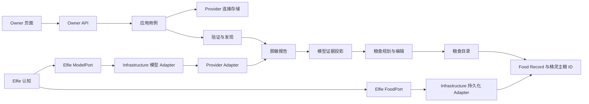
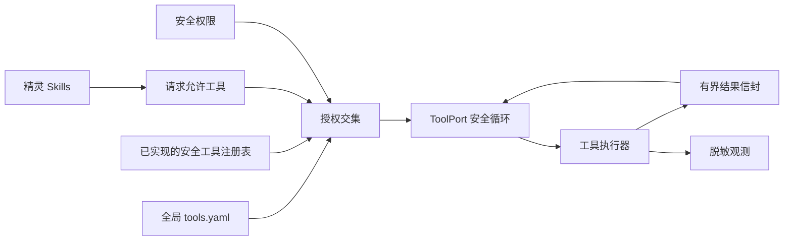

# 模型、Food 与工具行为契约

**契约版本：** 1.6
**修订日期：** 2026-08-12

> **行为权威。** 本文定义已退役 `ai_runtime/` 根目录完成职责拆解后的 Provider、
> 模型、Food 与工具行为，当前实现已经符合本契约。本文不定义目标 Runtime 模块；
> 目标所有权、依赖和物理位置由[系统架构契约](system)统一控制。
> 英文和中文文件是同一份逻辑契约的语言镜像，任何修改都必须同步完成。

保持既有行为的实现工作只更新代码和测试，不修改本文档。确需改变行为时，必须先显式
修订契约版本，再开始实现。未来若出现已知偏差，必须建立带精确删除门的临时注册台账。

原顶层 `ai_runtime/` 已按职责拆解而不是整体移动。Provider/模型访问与 Runtime 技术
位于 `infrastructure/models/`，工具执行位于 `infrastructure/tools/`，持久化进入
Infrastructure Adapter，管理员 Food 配置、生成和报告进入 App Feature，Elfie 通过
自有注入 Port 直接使用 Food、模型和工具能力。

## 目标与边界

本文描述的能力为精灵提供模型访问和安全原生工具，但不持有精灵、用户账号、Nest、
Godot 或应用生命周期。

| 边界 | 负责内容 |
| --- | --- |
| `infrastructure/models/` | Provider 目录/发现、连接协议、Endpoint 模型观测、技术验证和模型调用 Adapter |
| `infrastructure/tools/` | 搜索、受限工作区文件、沙箱及其他工具执行 Adapter |
| `elfie/` | 单只精灵的大脑、记忆、情绪和 Skills；只请求语义模型角色和允许工具，不选择 Provider |
| `app/features/` | Provider 连接管理和凭据引用、Food 管理/生成、模型管理报告、验证调度策略、全局工具配置和页面投影 |
| `infrastructure/persistence/` | Nest 数据库和文件系统适配 |
| Elfie 自有 Port | 直接读取 Food、调用模型和执行已批准工具；Infrastructure 实现，Bootstrap 注入 |
| `app/interfaces/` | Owner API 和可见页面，不持有独立 Runtime 事实 |
| App 自有 Scheduler/Runner Port | 执行由模型管理 Feature 定义策略的定时验证任务 |
| `app/orchestration/lifecycle/` | 只负责 Runtime 进程启动、停止、重启和技术就绪状态 |

目标架构不存在顶层 `ai_runtime/` 或通用 `runtime/` Python 包。Godot、语音、视频和
未来感知 Runtime 可以由应用层继续组合，但不能重新创建这两个包。

## 两个能力平面

模块包含两个相互独立的能力平面：

1. **模型平面：** Provider 产品元数据、已配置连接、endpoint 模型、验证证据、
   粮食套餐和推理回退。
2. **工具平面：** 工具定义、全局配置、请求授权、执行安全、有界结果和观测。

工具不是粮食角色。粮食选择模型能力，工具提供行动能力，精灵 Skills 决定怎样使用
能力。一期不提供按精灵配置能力开关的页面。

## 模型平面概念

### Provider 产品

Provider 产品是不含凭据的元数据，例如 `openai_api`、`anthropic_api`、`ollama`
或某个具体订阅产品。它定义：

- 官方显示名称和本地品牌资源；
- API Base URL、协议和认证方式；
- 产品提供时使用的官方模型列表地址或发现适配器；
- 安装包内置的保底模型列表和能力提示；
- 是否已有真实可用的 OAuth 适配器；
- Owner 页面使用的产品分类和搜索词。

内置目录是离线基线。完整、版本兼容且通过 Schema 校验的
`${ELFIE_HOME}/configs/provider-catalog.yaml` 可以在下次进程启动时整体覆盖
内置目录。包含凭据的覆盖文件必须被拒绝。一期不实现远程目录下载器，但本文档预留
远程来源和固定优先级。

Provider 产品发现与连接下的模型发现有关，但不是同一件事。连接配置完成后，按以下
顺序解析它的可用模型清单：

1. **官方实时来源：** 产品存在模型列表 API 或官方发现适配器时，使用当前连接凭据
   调用。
2. **ElfieNest 远程目录：** 官方没有可用来源时，在中心服务实现且可访问后，使用
   ElfieNest 维护的产品/模型目录。
3. **安装包内置目录：** 两个远程来源都不可用时，使用安装包携带的带版本模型列表。
4. **手工输入：** 所有可用索引都失败或为空后，页面才展开手工模型输入。

第一个非空索引来源提供 endpoint 模型 ID。低优先级目录只能补全缺失的上下文、输出
和能力事实，不能覆盖 Provider 官方实时结果。刷新始终保留手工模型。远程或本地目录
列出的模型只是候选，不代表当前账号一定有权限；通过验证前不能进入粮食选择或自动
生成。

### Provider 连接

连接代表一个已经配置的账号、订阅或本地 endpoint。同一个产品可以创建多个连接。
后端生成可读且不可变的 ID，例如 `openai_api_0001`，用户不能编辑。

别名可选；不填时使用官方产品名。修改别名不会改变外部引用。凭据独立保存，连接中
只保存凭据引用。

### Endpoint 模型

Endpoint 模型只属于一个连接，保存：

- 服务端真实使用的 `endpoint_model_id`；
- 可编辑显示名称；
- 来源：`official`、`remote_catalog`、`bundled_catalog` 或 `manual`；
- 可选的上下文窗口和最大输出覆盖值；
- 可选的工具、视觉、推理能力事实；
- 管理员控制的隐藏/退役状态。

页面不要求用户填写 canonical model ID。系统可以用模型目录身份或规范化显示名进行
对比归组；匹配失败不影响模型正常使用。当前可用性、验证结果和延迟属于报告数据库
中的观测数据，不能反复写回 Provider 配置。

### 模型引用

粮食角色统一保存精确的
`<connection_id>/<endpoint_model_id>`。显示名称、产品名称和别名不参与路由。

保存粮食前，每个引用都必须解析到已启用、未归档的连接和真实、可见的模型。Runtime
每次请求都重新解析，不能猜测连接，也不能静默跨到另一个订阅。

## Owner 操作流程

### Provider 页面

第一部分展示已配置连接。每张卡片显示别名、官方产品、本地/远程、模型数量、最近
验证时间、延迟和健康状态。命令固定为：

```text
[模型] [验证] [修改] [更多]
```

“更多”承载启用/停用、归档/恢复和删除。Ollama 等由安装流程持有的连接可以禁止
删除，但仍然提供健康和模型视图。

第二部分展示五六个常用产品和唯一的“添加连接”入口。该入口打开一个可搜索、有分类
的统一选择器，自定义 OpenAI 兼容配置是同一个选择器中的最后一个产品选项，不再有
相互竞争的独立入口。

已知 API Key 产品的表单只显示可选别名和 API Key。Base URL、协议、认证方式、
内部 ID 和测试模型全部隐藏。已有真实 OAuth 适配器时，表单启动官方授权流程；没有
适配器时不得展示 OAuth。自定义产品才显示别名、Base URL、协议、认证方式和凭据。

主操作是“验证并保存”：

1. 持久化连接和密钥，同时保留失败后的可修改状态；
2. 验证连通性和认证；
3. 按产品策略发现模型；
4. 合并发现结果，不能删除手工模型；
5. 写入脱敏报告并更新模型证据；
6. 页面展示成功、部分成功或可操作的失败原因。

模型发现失败不能删除连接。所有支持的发现方法都失败后，当前对话框展开手工模型
面板。

### 当前连接模型视图

“模型”命令打开当前连接的模型视图，支持刷新、单模型验证、隐藏/显示和受保护的
手工添加或修改。手工输入只要求 endpoint model ID 和显示名称。上下文窗口、最大
输出和能力是高级可选项；没有填写时使用匹配到的系统目录默认值。

刷新按 endpoint model ID 合并，保留手工记录和本地覆盖。以前发现但本次消失的模型
标记为不可用，不能破坏性删除。被粮食引用的模型不能删除，只能在保留诊断信息的
情况下隐藏或退役。

### 跨连接模型矩阵

页面级模型矩阵是独立的跨连接对比视图。它把等价显示模型归组，同时保留每一个真实
连接/模型组合。每行包含产品和连接、endpoint model ID、本地性、验证状态与时间、
首字延迟、总延迟、上下文/输出限制和能力事实。

“全部验证”以有并发上限的方式验证所有已启用、未归档连接及其模型，然后重新生成一份
完整对比快照。单个连接或模型验证只更新 latest 投影中的对应单元。聚合报告必须记录
每个单元自己的验证时间，并标记快照是 `complete` 还是 `partial`，不能把不同时间的
新旧数据伪装成一次同步测试。

Provider/模型原子报告仍是证据源；模型矩阵报告只是派生聚合，不能成为连接配置。
成功的“全部验证”对应一个不可变 validation run，其结果共同组成完整快照。单项验证
只追加一条结果，因此 latest 投影只改变对应对象。

### 粮食页面

干净数据目录只初始化两份粮食：

- **保底粮：** 全局最后回退套餐，固定显示在第一行；
- **常用粮：** 全局默认主粮，固定显示在第二行。

如果没有真实模型，两者可以保持未配置和停用。这两份系统粮食允许编辑和停用，但永远
不能归档或删除；不可变 ID 和系统角色不能改变，显示名称可以修改。页面始终保留这
两行。管理员通过右上角“添加粮食”创建、改名任意数量的自定义粮食，依次显示在下面。
自定义粮食可以归档，并在通过引用检查后删除。代码中不再存在固定粮食类别。

主页面使用一行一份粮食的表格，展示粮食名称和系统角色、本地/远程/混合属性、重要
模型、可见范围、实时健康、最近证据时间和操作。粮食健康根据最新连接/模型证据在读取
时计算：

- `unconfigured`：没有有效主模型；
- `healthy`：主模型和所有已配置必需角色都在有效期内验证通过；
- `degraded`：主模型可用，但可选角色或内部 fallback 不可用；
- `unavailable`：不存在可执行主路径；
- `disabled` 或 `archived`：被生命周期状态排除。

证据更新后必须重新计算受影响的粮食行；落盘的旧状态不能成为第二事实源。

每份粮食编辑器包含：

- 必填 `primary` 主模型；
- 可选 `reasoning`、`vision`、`tool` 角色模型；
- 一个可选的 `fallback` 模型，值为模型绑定对象或 `null`；
- 本地性投影、验证状态和来源。

工具权限绝不能写入粮食。

打开粮食后显示角色表，顶部提供“自动生成”和“手工编辑”两种模式，右上角“保存”是
唯一最终落盘动作。自动生成先打开范围确认框，管理员可以选择一个连接、多个连接或
全部连接。只有已启用、未归档，并且最近一次验证通过且仍在有效期内的模型才是候选；
明确失败、过期或从未验证的模型，在重新验证通过前既不能自动生成，也不能手工选择。

保底粮自动生成默认采用“本地优先”，其次考虑可用性和可靠性。管理员可以允许远程候选，
但必须看到“无法应对断网”的警告。常用粮默认平衡质量、延迟和可用性；自定义粮可以
选择任一策略。规则负责确定性的能力与本地性检查；可选顾问模型只能在相同范围的合格
候选中建议。

生成结果先展示 diff，然后回到同一个可编辑角色表，不能自动保存。管理员可以继续调整
每个角色/模型绑定，再显式保存。生成不能编造模型；没有候选时对应角色保持未配置并
显示警告。

角色表按以下顺序逐行显示：

```text
Primary 主模型
Reasoning 推理模型
Vision 视觉模型
Tool 工具模型
Fallback 回退模型
```

粮食表保持简单，只展示角色、所选模型、连接、本地/远程标记以及当前可用/不可用状态。
编辑时只修改每个角色绑定的模型；备用模型只有一个绑定对象，也可以为 `null`，绝不是有序列表。

上下文大小、最大输出、是否支持推理/工具/视觉、验证细节和延迟都属于模型事实，应在
当前连接模型视图和模型报告矩阵中管理，不能写入粮食配置。粮食模型选择器会利用这些
事实过滤不兼容或不可用模型，也可以链接到模型详情，但粮食页面不编辑、不复制这些
字段。一期不提供粮食级上下文预算或输出预算。

保底粮和常用粮默认对所有用户可见。保底粮只承担全局回退，不作为普通精灵主粮供选择。
每份自定义粮食都有权限操作，用于选择哪些用户可见。每只精灵可以从常用粮和所属用户
可见的自定义粮食中选择一份主粮。

精灵没有保存主粮选择时，只在常用粮已启用且健康时把它作为主粮。已经明确选择的主粮
后来不可用时，不能静默切换到另一份自定义粮，而是直接进入保底粮。

### 精灵页面

精灵页面只有一个名为“主粮”的字段。候选项是所属用户可见、已启用且健康的粮食，
并排除保底粮。常用粮因为全局可见而进入候选；自定义粮只有授权给该用户后才进入。
页面不提供精灵级保底粮、第二套允许粮食编辑器、Runtime 回退状态或粮食内部参数。
Runtime 健康与回退诊断统一放在 Owner 粮食页和报告页。

## 生命周期语义

Provider 连接和粮食套餐统一使用以下管理含义：

| 动作 | 含义 |
| --- | --- |
| 启用 | 在健康等条件满足时，可以参与新请求解析和执行 |
| 停用 | 仍可见、可编辑并保留引用，但不能参与新请求 |
| 归档 | 自动停用并退出普通列表；引用、历史和报告全部保留；自定义对象支持恢复 |
| 删除 | 只有先归档，并且不存在全局、用户、精灵或粮食引用时，才允许物理删除 |

停用或归档精灵当前主粮后，新请求进入保底解析，但不会重写精灵数据库中的主粮 ID。
这个保留的悬空引用必须出现在诊断中。
保底粮和常用粮是永久系统粮食，归档和删除都不适用于它们。

## 模型平面执行链路



每次生成严格执行：

1. Elfie 通过注入的 `FoodPort` 读取当前有效 Food 投影；
2. 持久化 Adapter 根据 App 写入的可见性、授权、分配和套餐选择事实解析请求中的
   Elfie 作用域，不重新作出授权决策；
3. Elfie 选择 `primary`、`reasoning`、`vision` 或 `tool` 语义角色；
4. 可选角色缺失时回到同一粮食的 `primary`；
5. Elfie 通过 `ModelPort` 调用所选角色，然后尝试同一粮食中唯一配置的 fallback
   模型，不能跨到未列出的订阅；
6. 只有主粮全部候选失败后，Elfie 的解析器才尝试一次全局保底粮；
7. 保底缺失或也失败时，返回类型化的 `no_available_food`；
8. 每次尝试和回退原因都脱敏记录。

Brain 只请求语义角色，不能导入粮食、Provider、凭据或 Nest DB 模型。结构化生成与
普通生成使用同一角色和回退解析器。能力较弱的保底模型可以退化为普通 JSON 文本，
不强制原生 Schema。

## 验证与证据

配置、发现和验证是三种独立事实：

- **已配置：** 连接元数据和凭据引用存在；
- **已发现：** 保存最近发现尝试和合并后的 endpoint 模型列表；
- **已验证：** 显式连通或模型请求成功；
- **健康：** 读取时根据启用状态、最近验证和模型可用性计算的投影。

验证与运行报告统一使用独立的 `reports/ai-runtime.sqlite`，不写入 `nest.db`，也不为
每条结果生成一个 YAML 文件。`nest.db` 是多个消费方自有事实的物理持久化存储，不是
这些事实的语义 authority；报告数据的追加频率、保留策略和查询方式都不同。

报告数据库采用追加写入，并由唯一 Report Repository 持有。至少记录：

- `report_runs`：一次单项、批量、定时或基准执行，包含范围、触发来源、开始/结束时间和
  `complete`/`partial`/`failed` 状态；
- `validation_observations`：关联 run 的不可变脱敏 Provider/模型结果行，包含稳定对象
  ID、观测时间、状态、延迟和结构化错误类别；
- 二期 Runtime 观测和滚动聚合，不包含提示词或回复正文。

“当前报告”查询每个对象最新的一条观测；查询历史时点 T 的报告，则取每个对象
`observed_at <= T` 的最新一条。完整批量报告通过 `run_id` 原样还原；单项验证只追加
一个对象，自然只改变当前投影中的对应项，不需要每天复制一份完整 YAML。

模型证据和跨连接矩阵都是“已配置模型清单 + 报告观测”的查询投影，不是额外配置文件。
一期提供显式单项验证和有并发上限的批量验证。需要人工查看或分享时，可以按需导出
YAML/JSON 到 `reports/exports/`，但程序绝不能把导出文件读回事实源。

数据库使用 WAL、短事务和基于稳定对象 ID 的索引，Schema 迁移必须显式执行。定期
验证和订阅过期提醒属于模型管理 Feature 策略，通过 App 自有 Scheduler/Runner Port
执行，不属于 Runtime 进程生命周期决策。

一期保存显式触发的单次验证。二期可以在同一数据库中增加两层证据：

- **运行证据：** 从真实 Runtime 调用中脱敏统计成功/失败次数、首字与总延迟、token
  总量以及配额/认证失败，按滚动时间窗口聚合，不保存提示词或回复正文；
- **定时健康证据：** Scheduler/Runner 根据模型管理 Feature 策略，每小时或每天刷新
  已配置连接，并重建滚动摘要。

运行证据可以比较同一模型在不同订阅中的延迟和可靠性，但不能根据互不相同的私人聊天
推断模型质量。质量对比属于后续受控基准测试，所有候选必须使用相同提示、评分方法和
执行条件。

## 工具平面



一期全局支持：

- 通过已配置搜索适配器进行网页搜索；
- 在明确配置根目录下进行只读本地文件访问。

终端执行、文件写入、代码执行、任务计划、子 Agent 和技能修改，在隔离与审批契约
完成前保持停用。停用工具不能提供给模型。

一期只有一个全局工具配置页面，不提供按精灵开关。实际可用工具是“全局启用工具、
精灵内部 Skill 请求、已实现的安全工具注册表、逐次调用的安全权限决策”四者交集。
Skill 源码所有权目标是 `elfie/brain/skills/`；随源码发布的声明和内存策略不需要可写
Store。可变 Skill 安装或单只 Elfie 持久 Skill 状态保持禁用，并且必须先有单独获批的
契约才能获得任何事实源。共享工具实现位于 `infrastructure/tools/`；工具绝不写入
Food 配置。

Bootstrap 构造或派生一个已经限定到当前 Elfie 获授权工作区能力的 Tool Adapter View。
`ToolPort` 请求只携带语义资源标识，不携带任意文件系统根目录；Adapter 在注入作用域内
解析这些标识。只读文件工具只能访问该工作区和明确获准的共享资源根，不能读取其他精灵
工作区、凭据、报告或 Runtime 状态。

每个工具都必须定义超时、条目和字节限制。普通与结构化生成共用的工具循环还会强制一份
总字节和调用次数预算。执行器用统一有界结果信封包装输出，记录 `truncated`、原始大小和保留大小。密钥、允许根目录外路径和不安全命令能力不能进入
模型。工具调用、权限决策、耗时和裁剪情况使用脱敏观测记录。

## 持久化数据契约

```text
${ELFIE_HOME:-~/.elfienest}/
├── nest.db
├── configs/
│   ├── provider-catalog.yaml
│   ├── providers.yaml
│   ├── runtime.yaml
│   ├── tools.yaml
│   └── credentials/
│       ├── api-keys.env
│       └── oauth/
│           └── <connection_id>.json
├── reports/
│   ├── ai-runtime.sqlite
│   └── exports/                     # 可选生成 YAML/JSON，绝不读回事实源
├── assets/
├── elfies/
├── runtime/
└── logs/
```

每个文件只能有一个类型化写入所有者：

| 事实 | 唯一事实源 |
| --- | --- |
| 系统支持的 Provider 产品 | 内置目录或通过校验的 `provider-catalog.yaml` 覆盖 |
| 已配置连接和 endpoint 模型 | `configs/providers.yaml` |
| Provider 与工具密钥 | `configs/credentials/` |
| Runtime 设置 | `configs/runtime.yaml` |
| 工具设置 | `configs/tools.yaml` |
| 粮食策略、角色和可见性 | `nest.db.food_packages`（单表） |
| 精灵主粮 ID | `nest.db.elfies.main_food_id` |
| 验证 run 与不可变观测 | `reports/ai-runtime.sqlite` |
| 当前、历史时点和跨连接报告 | 基于 `reports/ai-runtime.sqlite` 的 SQL 投影 |
| 规划器证据和粮食健康 | 已配置模型清单与报告数据库的查询组合 |
| 二期 Runtime 滚动测量 | `reports/ai-runtime.sqlite` |
| 可选人工可读导出 | `reports/exports/`，绝不是事实源 |
| Runtime 进程收据和锁 | `runtime/` |

任何写入器都不能因为修改相邻设置而反序列化并重写其他文件。旧根级文件不能成为隐式
回退源。产品仍处于 v0.5 之前，过时开发 Schema 直接移除并重建临时数据目录，不增加
永久双读或双写兼容。

## 最小文档形状

`providers.yaml` 保存计数器和连接实例，凭据只能是引用：

```yaml
version: 2
connection_counters:
  openai_api: 2
connections:
  openai_api_0002:
    catalog_id: openai_api
    alias: 工作账号
    enabled: true
    archived: false
    credential_ref: provider.openai_api_0002
    models:
      - id: gpt-example
        display_name: GPT Example
        source: official
        available: true
```

`nest.db.food_packages` 是粮食策略的唯一事实源。每一行保存显示名称、可选的系统角色、
五个模型角色引用、`visibility_mode`（`global` 或 `users`）、指定用户 ID、生命周期标记和时间戳。
`global` 表示所有用户可见；`users` 只对保存的用户 ID 可见。内置的常用粮和保底粮是全局系统行，
不能归档或删除。

`tools.yaml` 只保存语义配置：

```yaml
version: 1
tools:
  web_search:
    enabled: true
    provider: duckduckgo
    max_results: 3
    max_result_bytes: 16000
    timeout_seconds: 5
    max_tool_calls: 3
    max_total_result_bytes: 48000
  local_file:
    enabled: true
    root_policy: elfie_workspace
    max_read_bytes: 65536
    max_items: 200
    max_result_bytes: 16000
    max_tool_calls: 3
    max_total_result_bytes: 48000
```

代码中的 Schema 模型仍是机器可读契约。这里的示例只说明所有权，不能成为第二套解析
定义。

## 必须通过的验收闭环

干净临时 `ELFIE_HOME` 必须证明：

1. 只初始化永久的保底粮和常用粮，并按该顺序显示；
2. 同一个已知 Provider 配置两个账号，并且用户不填写内部 ID；
3. 证明官方、远程目录、安装包目录和手工输入的发现回退，并确保刷新后手工模型仍在；
4. 批量验证全部连接并生成完整模型对比快照，再单独验证一个模型且只更新对应 latest
   单元；
5. 使用本地优先范围生成保底粮，使用指定连接范围生成常用粮，预览 diff、手工调整
   角色/模型绑定并保存；
6. 新增一份自定义粮食，授权给一个用户，并为一只精灵选择；
7. 通过真实 Elfie Port 链路执行主模型、推理模型、回退模型和一次安全工具调用，且不
   经过 App Orchestration 代理；
8. 停用主连接后观察到保底粮回退；
9. 再停用保底粮后得到 `no_available_food`；
10. 从 SQLite 查询当前、历史时点和完整 run 报告，覆盖 Provider、模型、模型对比、
    粮食、回退和工具裁剪；
11. 修改系统与工具设置时，Provider 和粮食文件字节不变；
12. 证明系统粮食不能归档/删除，再对自定义粮食完成归档、恢复和受保护删除；
13. 通过局部测试、架构测试和浏览器交互验收。

只有局部测试、架构测试和可重放浏览器验收持续覆盖这条闭环，实现才保持符合设计。
