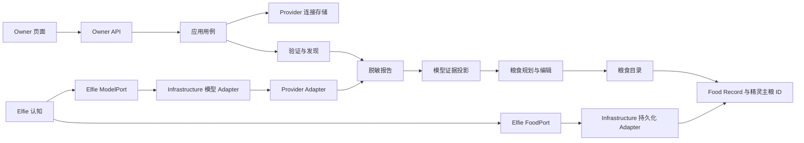
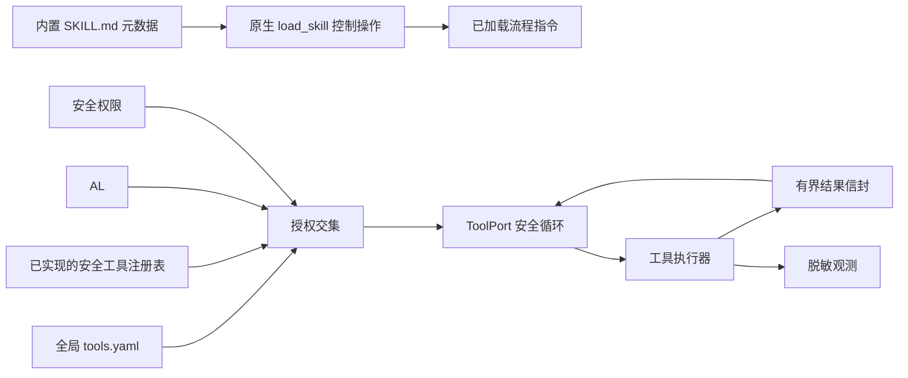

# 模型、Food 与工具行为契约

**契约版本：** 1.9
**修订日期：** 2026-09-03

> **行为权威。** 本文定义已退役 `ai_runtime/` 根目录完成职责拆解后的 Provider、
> 模型、Food 与工具行为。本文不定义目标 Runtime 模块；当前 Provider/模型可用性缺口
> 记录在[Provider/模型可用性一致性台账](../conformance/provider-model-availability)。
> 目标所有权、依赖和物理位置由[系统架构契约](system)统一控制。
> 英文和中文文件是同一份逻辑契约的语言镜像，任何修改都必须同步完成。

保持既有行为的实现工作只更新代码和测试，不修改本文档。确需改变行为时，必须先显式
修订契约版本，再开始实现。未来若出现已知偏差，必须建立带精确删除门的临时注册台账。

Provider/模型规则的已确认取舍与对抗审查保留在
[Provider 与 Endpoint 模型可用性设计](../designs/provider-model-availability)。

原顶层 `ai_runtime/` 已按职责拆解而不是整体移动。Provider/模型访问与 Runtime 技术
位于 `infrastructure/models/`，工具执行位于 `infrastructure/tools/`，持久化进入
Infrastructure Adapter，管理员 Food 配置、生成和报告进入 App Feature，Elfie 通过
自有注入 Port 直接使用 Food、模型和工具能力。

## 目标与边界

本文描述的能力为精灵提供模型访问和安全原生工具，但不持有精灵、用户账号、Nest、
Godot 或应用生命周期。

| 边界 | 负责内容 |
| --- | --- |
| `infrastructure/models/` | Provider 目录/发现、连接协议、Endpoint 模型观测、技术验证和模型调用 Adapter |
| `infrastructure/tools/` | 搜索、受限工作区文件、沙箱及其他工具执行 Adapter |
| `elfie/` | 单只精灵的大脑、记忆、情绪和 Skills；只请求语义模型角色和允许工具，不选择 Provider |
| `app/features/` | Provider 连接管理和凭据引用、Food 管理/生成、模型管理报告、验证调度策略、全局工具配置和页面投影 |
| `infrastructure/persistence/` | Nest 数据库和文件系统适配 |
| Elfie 自有 Port | 直接读取 Food、调用模型和执行已批准工具；Infrastructure 实现，Bootstrap 注入 |
| `app/interfaces/` | Owner API 和可见页面，不持有独立 Runtime 事实 |
| App 自有 Scheduler/Runner Port | 执行由模型管理 Feature 定义策略的定时验证任务 |
| `app/orchestration/lifecycle/` | 只负责 Runtime 进程启动、停止、重启和技术就绪状态 |

目标架构不存在顶层 `ai_runtime/` 或通用 `runtime/` Python 包。Godot、语音、视频和
未来感知 Runtime 可以由应用层继续组合，但不能重新创建这两个包。

## 两个能力平面

模块包含两个相互独立的能力平面：

1. **模型平面：** Provider 产品元数据、已配置连接、endpoint 模型、验证证据、
   粮食套餐和推理回退。
2. **工具平面：** 工具定义、全局配置、请求授权、执行安全、有界结果和观测。

工具不是粮食角色。粮食选择模型能力，工具提供行动能力，精灵 Skills 决定怎样使用
能力。一期不提供按精灵配置能力开关的页面。

## 模型平面概念

### Provider 产品

Provider 产品是不含凭据的元数据，例如 `openai_api`、`anthropic_api`、`ollama`
或某个具体订阅产品。它定义：

- 官方显示名称和本地品牌资源；
- API Base URL、协议和认证方式；
- 产品提供时使用的官方模型列表地址或发现适配器；
- 安装包内置的保底模型列表和能力提示；
- 是否已有真实可用的 OAuth 适配器；
- Owner 页面使用的产品分类和搜索词。

内置 Provider 与模型目录是登记配置文档，固定位置为
`config/models/provider-catalog.yaml` 和 `config/models/model-catalog.yaml`。
Runtime 消费方必须通过类型化配置文档边界加载；禁止恢复包内目录副本或直接拼相对路径。
安装态解析和可选的完整 `${ELFIE_HOME}/configs/provider-catalog.yaml` 覆盖遵循
[配置管理契约](./configuration-management)。包含凭据的覆盖文件必须被拒绝。

Provider 产品发现与连接下的模型发现有关，但不是同一件事。连接配置完成后，按以下
顺序解析它的可用模型清单：

1. **官方实时来源：** 使用带认证的产品专属清单或官方发现 Adapter，且产品配置必须
   明确声明它对当前订阅具有权威性。
2. **ElfieNest 远程目录：** 官方没有可用来源时，在中心服务实现且可访问后，使用
   ElfieNest 维护的产品/模型目录。
3. **安装包内置目录：** 两个远程来源都不可用时，使用安装包携带的带版本模型列表。
4. **手工输入：** 索引来源不可用或明确不完整时，允许受保护地录入 Endpoint ID。

通用 `/models` 只有在 Provider 产品配置明确声明其代表当前订阅时才具有权威性；平台级
大清单不能变成订阅普通模型列表。完整官方响应返回零个有权限模型时，这是权威空清单，
不是发现失败；低优先级目录只能显示明确标注的推荐，不能声称账号已有权限。所有必需分页
完成后，本次刷新才能影响模型缺失状态。

最高优先级可用来源提供 Endpoint ID。低优先级来源只能补充明确属于当前产品/Endpoint
的缺失元数据，不能替换高优先级 ID。Canonical Model 只能帮助页面归组，不能替具体连接
Endpoint 填写最终能力、限制或请求参数。手工记录始终保留；远程或内置目录记录只是候选，
不证明账号可调用。远程目录必须通过兼容 Schema 与完整性校验；发现响应必须限制字节数和
记录数，超限时整体拒绝，不能静默截断后伪装成权威清单。

### Provider 连接

连接代表一个已经配置的账号、订阅或本地 endpoint。同一个产品可以创建多个连接。
后端生成可读且不可变的 ID，例如 `openai_api_0001`，用户不能编辑。

别名可选；不填时使用官方产品名。修改别名不会改变外部引用。凭据独立保存，连接中
只保存凭据引用。

### Endpoint 模型

Endpoint 模型只属于一个连接，保存：

- 服务端真实使用的 `endpoint_model_id`；
- 可编辑显示名称；
- 来源：`official`、`remote_catalog`、`bundled_catalog` 或 `manual`；
- 带来源的上下文窗口和最大输出事实；
- 文本、工具、视觉、推理和结构化输出能力通道；
- 类型化请求配置 ID 与版本；
- 管理员控制的隐藏、退役和来源缺失状态。

最终能力和可用性的对象是精确 `(connection_id, endpoint_model_id)`。

每个能力通道取值为 `supported`、`unsupported` 或 `unknown`，并记录 `declared`、
`accepted`、`verified` 等证据级别。最终支持结论必须来自 Endpoint 专属权威声明或受控
验证。文本请求成功只能证明文本能力；接口接受 Payload 不等于模型实际使用了工具、图片
或推理能力。用户输入只能作为声明，不能静默升级成在用路径依赖的已验证证据。

业务调用方只传语义参数，由 Provider Adapter 通过类型化请求配置映射到真实协议；用户
不能维护任意请求 JSON。只有确实存在协议差异时才允许 Endpoint 覆盖，并纳入相关证据
指纹。

页面不要求用户填写 canonical model ID。系统可以用模型目录身份或规范化显示名进行
对比归组；匹配失败不影响模型正常使用。当前可用性、验证结果和延迟属于报告数据库
中的观测数据，不能反复写回 Provider 配置。

### 模型引用

粮食角色统一保存精确的
`<connection_id>/<endpoint_model_id>`。显示名称、产品名称和别名不参与路由。

保存粮食前，每个引用都必须解析到已启用、未归档的连接和真实、可见的模型。Runtime
每次请求都重新解析，不能猜测连接，也不能静默跨到另一个订阅。

## Owner 操作流程

### Provider 页面

第一部分展示已配置连接。每张卡片显示别名、官方产品、本地/远程、模型数量、最近
验证时间、延迟和健康状态。命令固定为：

```text
[模型] [验证] [修改] [更多]
```

“更多”承载启用/停用、归档/恢复和删除。Ollama 等由安装流程持有的连接可以禁止
删除，但仍然提供健康和模型视图。

第二部分展示五六个常用产品和唯一的“添加连接”入口。该入口打开一个可搜索、有分类
的统一选择器，自定义 OpenAI 兼容配置是同一个选择器中的最后一个产品选项，不再有
相互竞争的独立入口。

已知 API Key 产品的表单只显示可选别名和 API Key。Base URL、协议、认证方式、
内部 ID 和测试模型全部隐藏。已有真实 OAuth 适配器时，表单启动官方授权流程；没有
适配器时不得展示 OAuth。自定义产品才显示别名、Base URL、协议、认证方式和凭据。

主操作是“验证并保存”：

1. 持久化连接和密钥，同时保留失败后的可修改状态；
2. 验证连通性和认证；
3. 按产品策略发现模型；
4. 合并发现结果，不能删除手工模型；
5. 写入脱敏报告并更新模型证据；
6. 页面展示成功、部分成功或可操作的失败原因。

模型发现失败不能删除连接。所有支持的发现方法都失败后，当前对话框展开手工模型
面板。

### 当前连接模型视图

“模型”命令打开当前连接的模型视图，支持刷新、单模型验证、隐藏/显示和受保护的
手工添加或修改。手工输入只要求 endpoint model ID 和显示名称。上下文窗口、最大
输出和能力是高级可选项；没有填写时使用匹配到的系统目录默认值。

刷新按 Endpoint Model ID 合并，保留手工记录和本地覆盖。失败、空或不完整刷新绝不能
删除模型。只有连续两次完整、成功的权威刷新都遗漏某个来源管理模型时，才标记为
`source_missing` 并退出普通列表。受保护清理还要求已缺失 30 天、不是手工模型、不被任何
持久化消费者引用且期间没有生产调用；证据历史继续保留。被引用模型不能删除，并保留诊断。

### 跨连接模型矩阵

页面级模型矩阵是独立的跨连接对比视图。它把等价显示模型归组，同时保留每一个真实
连接/模型组合。每行包含产品和连接、endpoint model ID、本地性、验证状态与时间、
首字延迟、总延迟、上下文/输出限制和能力事实。

普通“验证”复用新鲜证据，只用有界并发验证已过期的精选可见模型；显式“强制全量验证”
才检查全部已启用、可见的精选模型，也是普通操作中唯一获准支付全量成本的入口。定时任务
绝不能验证非核心模型。单模型验证只更新精确 Endpoint/能力通道单元。聚合报告必须记录
每个单元自己的证据时间，并标记 run 是 `complete` 还是 `partial`，不能把不同时间的新旧
数据伪装成一次同步测试。

Provider/模型原子报告仍是证据源；模型矩阵报告只是派生聚合，不能成为连接配置。
成功的“强制全量验证”对应一个不可变 validation run，其结果共同组成完整快照。单项验证
只追加一条结果，因此 latest 投影只改变对应对象。

### 粮食页面

干净数据目录只初始化两份粮食：

- **保底粮：** 全局最后回退套餐，固定显示在第一行；
- **常用粮：** 全局默认主粮，固定显示在第二行。

如果没有真实模型，两者可以保持未配置和停用。这两份系统粮食允许编辑和停用，但永远
不能归档或删除；不可变 ID 和系统角色不能改变，显示名称可以修改。页面始终保留这
两行。管理员通过右上角“添加粮食”创建、改名任意数量的自定义粮食，依次显示在下面。
自定义粮食可以归档，并在通过引用检查后删除。代码中不再存在固定粮食类别。

主页面使用一行一份粮食的表格，展示粮食名称和系统角色、本地/远程/混合属性、重要
模型、可见范围、实时健康、最近证据时间和操作。粮食健康根据最新连接/模型证据在读取
时计算：

- `unconfigured`：没有有效主模型；
- `healthy`：主模型和所有已配置必需角色都在有效期内验证通过；
- `degraded`：主模型可用，但可选角色或内部 fallback 不可用；
- `unavailable`：不存在可执行主路径；
- `disabled` 或 `archived`：被生命周期状态排除。

证据更新后必须重新计算受影响的粮食行；落盘的旧状态不能成为第二事实源。

每份粮食编辑器包含：

- 必填 `primary` 主模型；
- 可选 `reasoning`、`vision`、`tool` 角色模型；
- 一个可选的 `fallback` 模型，值为模型绑定对象或 `null`；
- 本地性投影、验证状态和来源。

工具权限绝不能写入粮食。

打开粮食后显示角色表，顶部提供“自动生成”和“手工编辑”两种模式，右上角“保存”是
唯一最终落盘动作。自动生成先打开范围确认框，管理员可以选择一个连接、多个连接或
全部连接。只有已启用、未归档，并且最近一次验证通过且仍在有效期内的模型才是候选；
明确失败、过期或从未验证的模型，在重新验证通过前既不能自动生成，也不能手工选择。

保底粮自动生成默认采用“本地优先”，其次考虑可用性和可靠性。管理员可以允许远程候选，
但必须看到“无法应对断网”的警告。常用粮默认平衡质量、延迟和可用性；自定义粮可以
选择任一策略。规则负责确定性的能力与本地性检查；可选顾问模型只能在相同范围的合格
候选中建议。

生成结果先展示 diff，然后回到同一个可编辑角色表，不能自动保存。管理员可以继续调整
每个角色/模型绑定，再显式保存。生成不能编造模型；没有候选时对应角色保持未配置并
显示警告。

角色表按以下顺序逐行显示：

```text
Primary 主模型
Reasoning 推理模型
Vision 视觉模型
Tool 工具模型
Fallback 回退模型
```

粮食表保持简单，只展示角色、所选模型、连接、本地/远程标记以及当前可用/不可用状态。
编辑时只修改每个角色绑定的模型；备用模型只有一个绑定对象，也可以为 `null`，绝不是有序列表。

上下文大小、最大输出、是否支持推理/工具/视觉、验证细节和延迟都属于模型事实，应在
当前连接模型视图和模型报告矩阵中管理，不能写入粮食配置。粮食模型选择器会利用这些
事实过滤不兼容或不可用模型，也可以链接到模型详情，但粮食页面不编辑、不复制这些
字段。一期不提供粮食级上下文预算或输出预算。

保底粮和常用粮默认对所有用户可见。保底粮只承担全局回退，不作为普通精灵主粮供选择。
每份自定义粮食都有权限操作，用于选择哪些用户可见。每只精灵可以从常用粮和所属用户
可见的自定义粮食中选择一份主粮。

精灵没有保存主粮选择时，只在常用粮已启用且健康时把它作为主粮。已经明确选择的主粮
后来不可用时，不能静默切换到另一份自定义粮，而是直接进入保底粮。

### 精灵页面

精灵页面只有一个名为“主粮”的字段。候选项是所属用户可见、已启用且健康的粮食，
并排除保底粮。常用粮因为全局可见而进入候选；自定义粮只有授权给该用户后才进入。
页面不提供精灵级保底粮、第二套允许粮食编辑器、Runtime 回退状态或粮食内部参数。
Runtime 健康与回退诊断统一放在 Owner 粮食页和报告页。

## 在用范围与核心模型

删除安全和健康调度使用两个不同的派生投影：

- **全引用保护索引**包含全部持久化消费者引用，包括停用、归档、未分配和其他未上线
  Food；它负责保护模型和连接不被错误修改或删除；
- `ServingFoodIndex` 只包含当前可能获得生产流量的已部署 Food；它负责定时验证和首页健康。

Food 在已启用、未归档且精确主模型引用可解析时才算已部署。以下任一条件成立时进入
`ServingFoodIndex`：Runtime 使用的同一纯解析器接受它作为现有 Elfie 请求的 Food；Common
是某只 Elfie 的有效默认；Emergency 是某只现有 Elfie 的已启用最终回退；或一次获授权生产
路由尝试授予 24 小时直接使用租约。预览、验证、基准、测试和 Developer Tool 流量绝不能
授予租约。在线、离开和离线状态不改变成员资格。

请求路由和实际回退路由必须分别保留。模型失败可以让执行进入 Emergency，但不能把原请求
Food 移出在用范围，否则失败模型永远无法获得恢复证据。该索引由生命周期、分配、可见性和
类型化生产决策派生，可以按代缓存，但绝不是手工维护列表。

对每份在用 Food：

- `primary` 和已配置 `fallback` 始终是核心；
- `reasoning`、`vision`、`tool` 只有在策略声明为必需，或最近 30 天内获授权生产请求尝试
  过该角色时才是核心。

新分配必须立即生效；移除路由后，相关核心原因在合法租约到期时消失。通用检查按精确
`(connection_id, endpoint_model_id)` 去重；能力检查按精确 Endpoint 和能力通道去重，同时
保留全部 Food/角色原因与最高关键级别。Provider 管理页仍可展示所有精选模型，但定时健康
工作和首页健康只使用这套按角色计算的核心集合。

## 生命周期语义

Provider 连接和粮食套餐统一使用以下管理含义：

| 动作 | 含义 |
| --- | --- |
| 启用 | 在健康等条件满足时，可以参与新请求解析和执行 |
| 停用 | 仍可见、可编辑并保留引用，但不能参与新请求 |
| 归档 | 自动停用并退出普通列表；引用、历史和报告全部保留；自定义对象支持恢复 |
| 删除 | 只有先归档，并且不存在全局、用户、精灵或粮食引用时，才允许物理删除 |

停用或归档精灵当前主粮后，新请求进入保底解析，但不会重写精灵数据库中的主粮 ID。
这个保留的悬空引用必须出现在诊断中。
保底粮和常用粮是永久系统粮食，归档和删除都不适用于它们。

## 模型平面执行链路



每次生成严格执行：

1. Elfie 通过注入的 `FoodPort` 读取当前有效 Food 投影；
2. 持久化 Adapter 根据 App 写入的可见性、授权、分配和套餐选择事实解析请求中的
   Elfie 作用域，不重新作出授权决策；
3. Elfie 选择 `primary`、`reasoning`、`vision` 或 `tool` 语义角色；
4. 可选角色缺失时回到同一粮食的 `primary`；
5. Elfie 通过 `ModelPort` 调用所选角色，然后尝试同一粮食中唯一配置的 fallback
   模型，不能跨到未列出的订阅；
6. 只有主粮全部候选失败后，Elfie 的解析器才尝试一次全局保底粮；
7. 保底缺失或也失败时，返回类型化的 `no_available_food`；
8. 每次尝试和回退原因都脱敏记录。

Brain 只请求语义角色，不能导入粮食、Provider、凭据或 Nest DB 模型。结构化生成与
普通生成使用同一角色和回退解析器。能力较弱的保底模型可以退化为普通 JSON 文本，
不强制原生 Schema。

### 主人聊天回复投递

主人聊天采用完整回复投递。通信链路发起一次普通模型请求，等待模型完整返回，持久化
一条精灵回复，然后向已授权的 Web 客户端发布一条普通 `message` 事件。模型的部分输出、
临时 `message_delta` 事件和流式专用标识符都不属于当前产品聊天契约。

不得把 Provider 流式调用作为默认性能优化引入。对当前配置的远程模型进行的受控验证没有
显示首字可见时间或完整回复时间存在有意义的改善，而流式传输还可能增加连接建立和分块
解析开销。延迟仍然属于模型证据，但不改变完整回复投递契约。未来若再次提出流式方案，
必须先修订契约，并用受控基准证明它带来有意义的用户可见收益，同时不改变结构化输出、
持久化或前端隐私原则。

## 验证、证据与可用性

配置、发现、证据和可用性是不同事实：

- **已配置：** 连接元数据和凭据引用存在；
- **已发现：** 存在一次完整刷新及其合并后的 Endpoint 清单；
- **已观测：** 生产调用或受控检查产生了有明确作用域的不可变证据；
- **可用：** 读取时投影发现新鲜成功证据，且没有更新的生命周期或连接阻断。

验证和运行报告统一使用追加写入的 `reports/ai-runtime.sqlite` Repository，不写入
`nest.db`，也不生成 YAML 结果文件。`nest.db` 只是消费方事实的物理持久化存储，不是这些
事实的语义 authority。报告库保存不可变 `report_runs`、Endpoint 观测和有界
聚合。每条影响健康的模型调用观测必须包含稳定连接与 Endpoint ID、适用时的 Food ID 和
语义角色、工作负载类型、开始/完成时间、状态、首字与总延迟、Token 数、类型化错误类别及
配置/目录指纹。绝不保存提示词或回复正文；Provider 片段、Header 和错误落盘前必须脱敏。

证据来源按运行相关性从强到弱排列：

1. 精确 Endpoint 与能力通道上的真实生产执行；
2. 显式单项、连接或全量验证；
3. 在用核心模型定时心跳；
4. 不产生模型输出的连通性/认证探测；
5. 目录元数据，它永远不能证明当前可用。

当前、历史时点和完整 run 报告都是数据库查询。模型证据、Provider 卡片、Food 健康和
跨连接矩阵由配置清单与观测组合得到，绝不能变成配置。`reports/exports/` 下的导出只供
人工使用，程序不得读回。数据库使用 WAL、短事务、稳定 ID 索引、显式 Schema 迁移和有界
保留期。

可用性按以下顺序应用门禁：生命周期排除；更新的类型化连接级阻断；本地安装/服务门禁；
带瞬态迟滞的精确 Endpoint 与能力通道证据；新鲜度。面向模型的状态互斥：

- `available`：有新鲜成功且没有更新阻断；
- `degraded`：临时失败或近期证据混合，但仍有可执行路径；
- `unavailable`：存在确定性阻断或达到瞬态失败阈值；
- `unknown`：从未检查、证据过期或作用域不足。

Provider 内部必须分别保留生命周期、可达性和账号状态。Owner 投影只暴露 `healthy`、
`degraded`、`unavailable`、`unknown` 或 `disabled`，同时返回类型化原因和证据时间。
初始新鲜度为：可达性 5 分钟，模型成功 24 小时；能力声明在 Endpoint/Profile 指纹变化前
有效。凭据、Endpoint、模型别名/Digest 或请求配置变化只失效匹配证据。

### 失败作用域与迟滞

Adapter 必须分类结构化响应；只匹配错误字符串不能扩大失败范围。

| 证据 | 必须产生的效果 |
| --- | --- |
| 凭据无效/撤销、订阅过期、类型化欠费或账号额度阻断 | 立即只把当前连接标为不可用，停止其剩余批次，并让所有模型复用连接阻断 |
| Base URL 无效、协议不兼容或确定性路由配置错误 | 当前连接配置标为无效，修改前不自动恢复 |
| 模型不存在、退役或账号无权限 | 只标记精确 Endpoint 不可用，继续验证兄弟模型 |
| 限流 | 在 `retry_at` 前降低返回作用域状态，绝不能退役模型 |
| 网络错误、超时或 5xx | 单次只降级；十分钟内连续三次才把对象标为不可用 |
| 两个 Endpoint 瞬态失败，或一个 Endpoint 加传输探测失败 | 提升为连接故障并停止剩余批次 |
| 上下文超限、调用方请求格式错误、安全拒绝或调用方工具/Schema 错误 | 只记录请求级证据，不改变通用健康 |
| 受控能力探测证明不支持 | 只把对应能力通道标为不支持，文本健康不变 |

后续可信成功清除匹配的阻断或连续失败。一个产品错误绝不能阻断同品牌其他连接。无法分类
的错误默认使用最窄请求或 Endpoint 作用域。受控最小探测可以把可复现的 Adapter 协议错误
提升到精确请求配置或能力通道。

### 节省资源的检查与统一查询

读取必须是被动的。真实模型生成本身就是证据，不能在同一次生成前再付费做重复合成检查。
额外模型调用遵循：

| 触发 | 必须执行的工作 |
| --- | --- |
| 页面/首页读取 | 立即返回投影；异步刷新过期的免生成可达性 |
| 真实生产调用 | 追加精确 Endpoint/角色证据；不增加生成调用 |
| 新建或实质修改连接 | 刷新清单、探测传输/认证并验证一个代表模型 |
| 在用核心证据过期且没有真实流量 | 先验证代表模型，再只验证过期核心 Endpoint/通道 |
| 普通“验证” | 复用新鲜证据，只验证过期的精选可见模型 |
| 单模型检查 | 只验证该 Endpoint 和请求的能力通道 |
| “强制全量验证” | 验证全部已启用精选可见模型，并支持类型化提前停止 |

受控文本检查不用工具、不重试、使用固定极小提示词，输出一到八个 Token。每连接默认并发
为二。Scheduler Worker 使用租约；调用方按 Endpoint、能力通道和指纹共享一次在途检查。
主动检查必须有冷却和限流。

进程内消费者统一使用 App 自有可用性查询 Port：

- `get(reference)` 和 `get_many(references)` 只读，不访问网络；
- `ensure(reference, max_age, capability, probe_policy)` 只有获得主动探测权限时，才可启动
  一次目标检查。

结果包含精确引用、有效状态、原因、Provider 状态、证据来源与时间、Endpoint 能力、在用
角色和指纹。Owner HTTP API 镜像这些查询。调用方不能通过任意缩小 `max_age` 强制付费检查。

### Provider、首页与本地投影

Provider 卡片保留一个大面积语义背景色和一个状态 Badge。不能列出全部模型，也不能为
每个模型画点，只显示 `6/8 可用 · 核心 2/2` 这类有界计数。颜色由精选可见清单唯一决定：
全部范围内模型都有新鲜可用证据才为绿色；至少一个可用但并非全部新鲜可用为黄色；零个
可用且存在新鲜确定性失败为红色；没有/证据过期，或连接停用/归档为灰色。生命周期用文字
表示，不能叠加另一套健康颜色。

首页模型健康只看在用角色路径，不看未使用 Food 或 Provider 全量清单：全部必需核心路径
可用为绿色；至少一个主路径可用，但另一个必需、近期活跃可选或 Fallback 路径不新鲜可用
为黄色；存在在用 Food 且所有在用主路径都有新鲜确定性失败为红色；没有在用 Food 或证据
未知为灰色。页面只展示本地/远程紧凑总数和可操作文字原因。Endpoint 数与角色路径数不能
混用。

本地 Ollama 可用还要求服务已安装且健康，以及精确模型已下载并启用。对已存在且已启用的
安装，App Lifecycle 可以按退避自动启动一次，但绝不能循环。安装、修复和模型下载始终需要
用户显式操作。模型行不显示“安装”；Provider 显示“安装 Ollama”，模型行显示“下载”。
Digest 或 `latest` 实际目标变化会使匹配证据失效。

## 工具平面



一期全局支持：

- 通过已配置搜索适配器进行网页搜索；
- 在明确配置根目录下进行只读本地文件访问。

终端执行、文件写入、代码执行、任务计划、子 Agent 和技能修改，在隔离与审批契约
完成前保持停用。停用工具不能提供给模型。

一期只有一个全局工具配置页面，不提供按精灵开关。实际可用 Tool 是“全局启用 Tool、
Brain 为 deliberate Run 提供的显式 `allowed_tools`、已实现的安全 Tool 注册表、逐次调用
的安全权限决策”四者交集。Skill 指令独立于 Tool 授权，只能通过原生 `load_skill` 控制
操作按需加载。官方内置源使用 `config/brain/skills/<name>/SKILL.md`（发布时 staging 到
`resources/config/...`）；它们只读、只允许官方来源，不是用户可写事实源。可变 Skill 安装、
脚本或单只 Elfie 持久 Skill 状态保持禁用，并且必须先有单独获批的契约。共享可执行 Tool
实现位于 `infrastructure/tools/`；Tool 绝不写入 Food 配置。

Bootstrap 构造或派生一个已经限定到当前 Elfie 获授权工作区能力的 Tool Adapter View。
`ToolPort` 请求只携带语义资源标识，不携带任意文件系统根目录；Adapter 在注入作用域内
解析这些标识。只读文件工具只能访问该工作区和明确获准的共享资源根，不能读取其他精灵
工作区、凭据、报告或 Runtime 状态。

每个工具都必须定义超时、条目和字节限制。普通与结构化生成共用的工具循环还会强制一份
总字节和调用次数预算。执行器用统一有界结果信封包装输出，记录 `truncated`、原始大小和保留大小。密钥、允许根目录外路径和不安全命令能力不能进入
模型。工具调用、权限决策、耗时和裁剪情况使用脱敏观测记录。

## 持久化数据契约

内置默认配置与用户配置的目标物理分层由
[配置管理契约](./configuration-management)统一管理；当前位置与打包缺口继续记录在
已注册一致性台账中。本节只定义模型、Food 与工具相关的用户事实。

```text
${ELFIE_HOME:-~/.elfienest}/
├── nest.db
├── configs/
│   ├── provider-catalog.yaml
│   ├── providers.yaml
│   ├── runtime.yaml
│   ├── tools.yaml
│   ├── auth.env
│   └── credentials/
│       └── oauth/
│           └── <connection_id>.json
├── reports/
│   ├── ai-runtime.sqlite
│   └── exports/                     # 可选生成 YAML/JSON，绝不读回事实源
├── assets/
├── elfies/
├── runtime/
└── logs/
```

每个文件只能有一个类型化写入所有者：

| 事实 | 唯一事实源 |
| --- | --- |
| 内置 Provider/模型产品 | 已登记的 `config/models/provider-catalog.yaml` 与 `config/models/model-catalog.yaml` 文档 |
| 可选 Provider 产品覆盖 | 通过校验的完整 `configs/provider-catalog.yaml` 替换 |
| 已配置连接和 endpoint 模型 | `configs/providers.yaml` |
| Provider 与工具 API 密钥 | 进程环境或 `configs/auth.env` |
| OAuth Token 文档 | `configs/credentials/oauth/` |
| Runtime 设置 | `configs/runtime.yaml` |
| 工具设置 | `configs/tools.yaml` |
| 粮食策略、角色和可见性 | `nest.db.food_packages`（单表） |
| 精灵主粮 ID | `nest.db.elfies.main_food_id` |
| 验证 run 与不可变观测 | `reports/ai-runtime.sqlite` |
| 当前、历史时点和跨连接报告 | 基于 `reports/ai-runtime.sqlite` 的 SQL 投影 |
| Endpoint 能力与请求配置选择 | `configs/providers.yaml` 中带来源的连接级模型元数据 |
| 在用范围、可用性与 Food 健康 | 消费方事实、清单和报告证据的读取时投影 |
| 脱敏生产测量与滚动聚合 | `reports/ai-runtime.sqlite` |
| 可选人工可读导出 | `reports/exports/`，绝不是事实源 |
| Runtime 进程收据和锁 | `runtime/` |

任何写入器都不能因为修改相邻设置而反序列化并重写其他文件。旧根级文件不能成为隐式
回退源。产品仍处于 v0.5 之前，过时开发 Schema 直接移除并重建临时数据目录，不增加
永久双读或双写兼容。

## 最小文档形状

`providers.yaml` 保存计数器和连接实例，凭据只能是引用：

```yaml
version: 2
connection_counters:
  openai_api: 2
connections:
  openai_api_0002:
    catalog_id: openai_api
    alias: 工作账号
    enabled: true
    archived: false
    credential_ref: provider.openai_api_0002
    models:
      - id: gpt-example
        display_name: GPT Example
        source: official
        request_profile: openai_chat_v1
        capabilities:
          text: { state: supported, evidence: verified }
          vision: { state: unknown, evidence: declared }
```

以上形状只用于说明，精确字段名仍由代码中的 Schema 模型定义。这里故意没有可用性、延迟、
验证状态和 Provider 阻断，因为它们是观测与投影，不是连接设置。

`nest.db.food_packages` 是粮食策略的唯一事实源。每一行保存显示名称、可选的系统角色、
五个模型角色引用、`visibility_mode`（`global` 或 `users`）、指定用户 ID、生命周期标记和时间戳。
`global` 表示所有用户可见；`users` 只对保存的用户 ID 可见。内置的常用粮和保底粮是全局系统行，
不能归档或删除。

`tools.yaml` 只保存语义配置：

```yaml
version: 1
tools:
  web_search:
    enabled: true
    provider: duckduckgo
    max_results: 3
    max_result_bytes: 16000
    timeout_seconds: 5
    max_tool_calls: 3
    max_total_result_bytes: 48000
  local_file:
    enabled: true
    root_policy: elfie_workspace
    max_read_bytes: 65536
    max_items: 200
    max_result_bytes: 16000
    max_tool_calls: 3
    max_total_result_bytes: 48000
```

代码中的 Schema 模型仍是机器可读契约。这里的示例只说明所有权，不能成为第二套解析
定义。

## 必须通过的验收闭环

干净临时 `ELFIE_HOME` 必须证明：

1. 源码态只通过登记的 `config/models/` 文档加载 Provider/模型默认值，安装态只有一份
   Staged 副本；
2. 同一产品配置两个账号且用户不填写内部 ID，并证明连接阻断绝不跨账号传播；
3. 保留产品专属权威空清单，拒绝把平台级 `/models` 大清单用于受限订阅，并在失败/不完整
   刷新后保留手工模型；
4. 最终能力只属于精确 Endpoint，证明文本成功不代表视觉/工具/推理，并通过类型化请求
   配置映射语义参数；
5. 初始化永久 Emergency 与 Common Food，新增一份自定义 Food 并为一只 Elfie 选择；
6. 证明已启用但未使用 Food 不触发定时验证或首页影响，而分配后立即激活主/Fallback
   核心路径；
7. 已分配 Food 失败、实际执行进入 Emergency 时仍留在在用范围，并证明预览/测试流量
   不能激活核心范围；
8. 把一次真实主模型、推理、回退和安全工具生产流程记录为 Endpoint/角色证据，不增加
   合成模型调用，也不保存私密正文；
9. 证明普通验证复用新鲜证据，并发主动检查合并为一次请求，只有强制全量验证才检查完整
   精选列表；
10. 证明类型化账号阻断提前停止批次、模型失败保持窄作用域、请求错误保持中性、瞬态失败
    遵守迟滞；
11. 查询被动单项/批量可用性以及当前、历史时点和完整 run 报告，再单独检查一个 Endpoint
    且不改变兄弟单元；
12. 本地可用必须同时满足 Ollama 服务健康和精确模型已下载；安装、修复和下载保持显式，
    自动启动最多一次并带退避；
13. 只有完整刷新、缺失时长、引用和生产使用门禁全部通过后，才能隐藏或清理来源管理模型；
14. 通过聚焦行为测试、架构测试和可重放浏览器验收。

只有局部测试、架构测试和可重放浏览器验收持续覆盖这条闭环，实现才保持符合设计。
