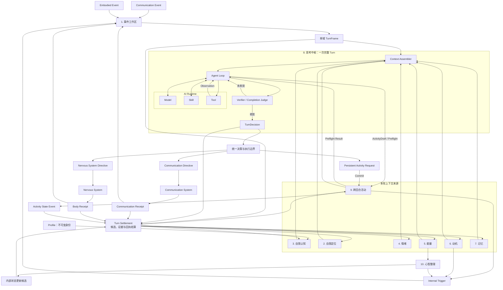

# Elfie 大脑十系统架构

> 状态：已确认设计
> 确认日期：2026-08-12
> 最近修订：2026-08-12
> 性质：跨版本 Brain 概念设计、职责边界、运行关系、对抗检查与渐进实现优先级
> 不代表：当前源码已经实现本文能力，也不在本阶段固定目录、Schema、阈值和通信协议

本文建立在 [Elfie 顶级模块设计](./elfie-top-level-module-design.md)之下，并在文中完整
列出自身依赖的总体守恒规则，不依赖未公开材料才能理解。

## 1. 本文解决什么问题

Elfie 的 Brain 既要维护持续生命状态，也要完成通用 Agent 所需的推理、Tool、Skill、恢复和执行能力。
本文将这些能力组织为十个概念系统，并回答五个问题：

1. 每个系统为什么值得独立存在；
2. 每个系统拥有什么状态、接受什么输入、产生什么输出；
3. 它与相邻系统的边界在哪里；
4. 十系统能否覆盖一只具身 Elfie 的核心功能；
5. 哪些能力先实现，哪些能力以后逐步增加。

“一级概念系统”不等于一级源码目录、独立进程、独立数据库或微服务。一个概念系统可以先由少量
类型和规则实现；只有真实复杂度出现后，才决定是否拆成独立代码包。

## 2. 十系统之外仍然存在的必要边界

十系统只统计 Brain 内部的心智状态、在线认知和后台认知循环。以下两组能力始终存在，但不计入
十个心智系统。

### 2.1 统一决策与执行边界

统一边界负责确定性地保证“能不能执行”，包括：

- `SourceDomain`、`ResponseScope` 和 `ExecutionScope`；
- Capability Envelope；
- 人物、通信渠道、身体和跨回合活动范围；
- Turn、Activity 和时间窗口预算；
- 隐私、时效、幂等和重复执行检查；
- Communication、Nervous System 和 Persistent Activity 路由；
- `ExecutionReceipt` 接收和因果对账。

大模型和思考中枢可以判断“我愿不愿、应不应该”，但不能修改硬能力边界，也不能把模型自述当成
执行事实。统一边界不是第十一个心智系统，而是最终行动决定离开思考中枢时必须经过的确定性宿主边界。

最终行动决定只有三类出口：

1. `Communication Directive`：通过数字通信系统发送消息；
2. `Nervous System Directive`：通过神经系统产生具身表达或身体动作；
3. `Persistent Activity Request`：创建或更新需要跨回合继续的活动。

同一 Turn 不能同时产生 Communication 和 Nervous System 两种外部执行域；Activity Request 可以作为
当前回合的内部后续提案伴随其中一种输出。三类出口都为空时即为 `No-op`。记忆、情绪、自我等状态
更新候选属于 Brain 内部的 Turn 结算，不是第四类行动出口。

### 2.2 认知基础设施

认知基础设施至少提供：

- Durable Event Journal；
- Cognitive State Store；
- Run / Activity Checkpoint；
- 幂等键和 Receipt 对账；
- 因果 Trace、预算账本和必要观测。

它们不决定人格、情绪、记忆或行动内容，因此不计入心智系统；但 P0 就需要最小版本，否则跨回合
Activity、重启恢复和重复发送保护都只是口头设计。

## 3. 不可破坏的守恒规则

十系统的任何后续细化都必须遵守：

1. Elfie 是独立持续运行的具身智慧体，不是等待主人逐步批准的任务 Agent；
2. 对外只有具身线路和数字通信线路，两条线路不能在同一认知回合混合输出；
3. Brain 有 Communication、Embodied、Internal 三类触发来源，每个 Turn 只有一个来源域；
4. 虚拟和实体身体二选一，任何稳定时刻只有一个身体权威；
5. Profile 保存不可变身份、虚拟外貌和生成来源，Brain 不能改写 Profile；
6. 同一个 Elfie 的身体、通信、跨回合活动和心智整理共享同一人格和记忆；
7. 情绪、能量和驱力只能影响决策，不能直接取得外部执行权或扩大权限；
8. 跨回合活动到期后生成新的 Internal Trigger，不能绕过思考中枢直接执行开放行为；
9. 心智整理只能形成更新候选或内部触发，不能直接创建跨回合活动或对外行动；
10. 只有真实执行回执能够证明消息或身体动作已经发生；认知 Tool 的结果只能证明对应沙箱调用的结果。

## 4. 十系统总览

十个系统按性质分为三组。

```text
持续心理状态
├── 2. 自我定位
├── 3. 自我认知
├── 4. 情绪
├── 5. 能量
├── 6. 动机
└── 7. 记忆

在线认知
├── 1. 事件工作区
└── 8. 思考中枢

后台认知循环
├── 9. 跨回合活动
└── 10. 心智整理
```

一级名称只表达模块本体，不把全部内部职责堆进标题。中文名用于产品和架构讨论，英文名用于类型、
协议和图示，目标子目录只保留一个核心单词。目录只是将来的归属建议：没有真实状态、契约和行为时，
不为图示预建空目录。

| 编号 | 中文名 | 英文名 | 目标子目录 | 独立存在的主要理由 | MVP 形态 |
| --- | --- | --- | --- | --- | --- |
| 1 | 事件工作区 | Event Workspace | `workspace/` | 汇总三类语义事件，负责 Lane、准入、分流、切片和单域成帧 | 有界 Lane 与确定性成帧规则 |
| 2 | 自我定位 | Orientation | `orientation/` | 统一回答“我此刻在哪里、身处什么情境、正在做什么” | 强类型当前快照，不必先做复杂服务 |
| 3 | 自我认知 | Selfhood | `selfhood/` | 自我模型、人格和规范的变化速度与写入规则不同于普通记忆 | 稳定自我与最小规范；成长机制后加 |
| 4 | 情绪 | Emotion | `emotion/` | 有独立状态、衰减和跨回合反馈 | 少量可解释维度和确定性更新 |
| 5 | 能量 | Energy | `energy/` | 生命节律、认知资源和行为预算具有独立时钟与硬约束 | 基本能量、疲劳和预算；复杂昼夜后加 |
| 6 | 动机 | Motivation | `motivation/` | 主动生活不能靠随机定时器或外部消息伪造 | 少量驱力、满足、饱和和冷却 |
| 7 | 记忆 | Memory | `memory/` | 长期经历、关系和知识有独立编码与检索规则 | 工作记忆、关键情景和人物关系最小闭环 |
| 8 | 思考中枢 | Reasoning Core | `reasoning/` | 当前 Turn 的理解、推理、验证、抑制和选择需要统一所有者 | 单次结构化认知回合；复杂 Agent 能力后加 |
| 9 | 跨回合活动 | Persistent Activity | `activity/` | 未来等待、承诺和多步工作不能塞进当前 Turn | 基本创建、等待、触发、回执和终态 |
| 10 | 心智整理 | Cognitive Consolidation | `consolidation/` | 经历整理具有独立时机、预算和禁止外部行动的权限边界 | 后期启用；初期只预留接口和状态边界 |

名称只表达各系统的最终职责：事件工作区负责事件准入与成帧；自我定位维护当前处境；自我认知维护
长期自我模型；思考中枢完成当前回合的 Agent 思考；跨回合活动保存当前回合结束后仍需继续的工作；
心智整理在睡眠或空闲窗口巩固和整合经历。

## 5. 系统职责契约

### 5.1 事件工作区（Event Workspace）

**定位**：作为 Brain 面向事件的工作空间，汇总三类语义输入，完成准入、分流、切片，并按顺序形成
彼此隔离的独立 Turn。

**输入**：

- Communication 产生的消息和渠道事件；
- Nervous System 产生的身体感知和反射事实；
- 跨回合活动、驱力、时间、情绪、能量和心智整理产生的内部触发；
- Communication、Body 和 Persistent Activity 产生的执行回执或状态事件。

**拥有**：

- Communication、Embodied、Internal 三个逻辑 Lane；
- 同域保序、去重、背压、聚合和成帧；
- 显著性、新奇性和重复刺激习惯化；
- 紧急抢占、社会优先级和 Lane 公平性；
- `TurnFrame`、`SourceDomain`、因果引用和截止时间；
- 当前注意焦点和下一 Turn 选择。

**输出**：单一来源域的 `TurnFrame`、注意状态变化和被延后事件。

**不拥有**：原始摄像头像素和电机信号解析、联系人连接、复杂推理、长期记忆和最终执行权。

这里的“注意”是工作区选择下一个 Turn 的内部策略。内部触发与其他事件共同经过工作区的统一准入和
调度；Turn Admission 是事件工作区的内部职责。

### 5.2 自我定位（Orientation）

**定位**：维护 Elfie 对当前身体、地点、时间和处境的定位，回答“我此刻在哪里、现在是什么时候、
周围有什么、我正在做什么”，形成带来源、可校正的当前快照。

**拥有**：

- 当前选定身体、身体模式、姿态和可用能力摘要；
- 当前地点、时间、环境和附近对象；
- 当前对话、在场人物、社会角色和关系摘要；
- 当前注意目标、Goal、Activity 和承诺摘要；
- 当前可用通信渠道、身体 Affordance 和关键限制；
- 事实、推测、未知、来源、版本和更新时间。

**输入**：感知事件、权威 Runtime 状态、ExecutionReceipt、Memory 检索、Profile 锚点和 Activity 状态。

**输出**：供 Reasoning Core、Workspace、Motivation 和 Persistent Activity 使用的 `OrientationSnapshot`。

**不拥有**：长期世界知识、完整关系历史、Godot 几何、硬件事实、不可变身份和人格规范。

边界口诀：

```text
Memory：我过去知道和经历了什么
Orientation：我此刻在哪里、正在经历什么
Selfhood：我是怎样的一个人
World Runtime：外部世界实际上是什么
```

这里的 Orientation 采用人对人物、地点、时间和当前情境的定位概念，不是一个能够预测、模拟和反事实
推演的 World Model。英文保留 `Orientation`，中文使用更直观的“自我定位”。它在概念上
独立，但 MVP 可以先实现为强类型派生快照，而不是独立进程或数据库。

### 5.3 自我认知（Selfhood）

**定位**：维护“我怎样理解自己、通常怎样表现、哪些边界不能被单轮输入改写”。

Profile 提供不可变客观身份锚点，自我认知维护可随长期经历缓慢变化的主观 Self Model。

自我定位保存“当前处境”，自我认知维护“长期怎样理解自己”；前者随现场事实快速更新，后者只能
根据跨时间证据缓慢变化。

**拥有**：

- 可修正的 Self Model；
- 稳定但可缓慢成长的人格、兴趣、表达和应对倾向；
- 长期价值偏好、社会规范和承诺原则；
- 人格、自我变化候选的证据、版本、速率和回滚信息。

**输入**：Profile、长期记忆、关系证据、Activity 结果、身体能力变化和心智整理更新候选。

**输出**：Self/Personality/Norms Snapshot、表达偏置、规范判断依据和受控更新结果。

**不拥有**：不可变 Profile、完整人物关系、当前环境事实、硬能力边界和外部执行权。

普通消息、单次失败或一次心智整理不能直接改变稳定人格或规范。

### 5.4 情绪（Emotion）

**定位**：维护进程内跨 Turn 持续、会叠加、衰减和恢复的情感状态；睡眠或进程重启时
回到人格基线。

**拥有**：

- 当前情绪维度、强度和恢复趋势；
- 事件、人物、身体感受和记忆唤起的刺激评估；
- 情绪基线、人格差异、叠加、衰减和冷却；
- 可追溯的情绪变化事件。

**输入**：通信/具身事件、Memory 唤起、身体状态、成功失败和真实回执。

**输出**：Emotion Snapshot，以及对 Attention、Memory、Drive、Reasoning Core 表达和风险偏好的影响。

**不拥有**：Goal、Activity、消息内容、身体指令和 Capability Envelope。

```text
情绪：我现在感受如何
驱力：我想推动什么状态发生变化
```

### 5.5 能量（Energy）

**定位**：维持生命节律，并为认知和行为分配有限资源。

**拥有**：

- 能量、疲劳、困倦、饥饿、休息、恢复和昼夜相位；
- Turn、Activity、模型、Token、搜索、Tool、通信和身体行动预算；
- 时间窗口配额、正常资源和紧急资源预留；
- 预算估算、预留、消费、释放和回执对账；
- 本轮认知模式、思考深度和低能量降级约束；
- 休眠建议和恢复条件。

**输入**：时间、身体状态、模型/工具成本、Activity 消耗和执行回执。

**输出**：Energy Snapshot、预算决定、认知模式约束、降级约束、睡眠/恢复驱力和内部触发候选。

**不拥有**：行为目标、人格价值、Activity 语义和安全反射。安全反射仍由 Nervous System 执行。

### 5.6 动机（Motivation）

**定位**：把持续内部需要转成受约束的 Goal 候选，使 Elfie 能主动生活而不是只被消息驱动。

**拥有**：

- 安全、休息、依恋、陪伴、好奇、探索、玩耍、学习和承诺履行等驱力；
- `DrivePressure`、满足程度、竞争、饱和、抑制和冷却；
- 重复触发指纹和病理循环抑制；
- GoalCandidate 的最小目的和来源证据。

**输入**：Emotion、Energy、Memory、Self/Personality、当前环境、时间和 Activity 状态。

**输出**：注意力偏置、`GoalCandidate` 或 `InternalTriggerCandidate`。

**不拥有**：外部消息、身体动作、正式 Activity 和执行权限。驱力不能直接行动。

### 5.7 记忆（Memory）

**定位**：保存 Elfie 的主观经历、知识、人物关系和可复用经验。

**拥有**：

- 感觉缓冲、工作记忆、情景记忆和语义知识；
- 人物、关系、联系方式、信任和社会语境；
- 程序性经验和结果经验；
- 来源、可信度、冲突、不确定性和主观视角；
- 编码、检索、巩固、遗忘、再激活和关联；
- 领养前后统一的记忆时间线。

**输入**：事件证据、思考中枢产生的 MemoryCandidate、执行回执和心智整理更新候选。

**输出**：面向人物、时间、地点、情绪、主题和因果的检索结果，以及正式记忆提交结果。

**不拥有**：不可变身份、当前 Orientation Snapshot、CognitiveRunState、ActivityState 和所有学习。

知识是 Memory 内部保存的一类内容。学习是跨系统协议：Memory 学事实和经验，Personality 学稳定倾向，
Attention 学习惯化，Drive 学满足路径，Reasoning Core 学解决策略。所有学习都应采用
“候选 → 证据/边界校验 → 权威所有者提交”，不能由模型直接改写权威状态。

### 5.8 思考中枢（Reasoning Core）

**定位**：接收一个单域 `TurnFrame`，组装这一轮所需上下文，并通过可多步迭代的 Agent 思考循环形成
最终 `TurnDecision`。

这里的 Turn 是一次完整认知交互：从一个 Communication、Embodied 或 Internal 事件被事件工作区接纳
开始，到思考中枢形成最终决定结束。一个 Turn 可以包含多次模型调用、多次 Skill/Tool 调用和多轮
Observation，不等于一次大模型请求。

**拥有**：

- Turn 理解和复杂度判断；
- Context Assembler：按本轮事件从自我定位、自我认知、情绪、能量、动机、记忆和跨回合活动中读取、
  检索、裁剪并组织上下文；
- `ReasoningRun` 与内部 Cognitive Step；
- 临时 Cognitive Plan；
- Reason/Act/Observation 循环；
- Model、Skill、Tool 和受限 Worker 的选择与调用编排；
- Evidence、Verifier 和 Completion Judge；
- 元认知检查、冲动抑制、候选竞争和行动选择；
- 结构化 `TurnDecision`。

**输入**：TurnFrame、OrientationSnapshot、Self/Personality/Norms、Emotion、Energy、Motivation、Memory、
Activity 摘要、能力和预算摘要。

**AI Runtime 关系**：Model、Skill 和 Tool 的真实调用设施由外部 AI Runtime 提供，但调用发生在思考
中枢的一次 `ReasoningRun` 内部。这里的 Tool 专指帮助认知的 Agent 工具，例如受限命令行、简单代码
执行、搜索/检索，以及系统分配给当前用户的独立认知工作区内的文件读写。工作区内的文件修改是
允许的认知过程产物，不是第四条外部生命线路。

Tool 由运行前配置的进程沙箱、命令允许范围、工作区边界、网络能力和资源配额确定性约束；在该范围
内自主使用，不逐操作请求人工批准，范围外路径不可见或不可写；网络只开放获准的认知资源，不包含
聊天渠道和设备端点。数字通信、身体控制和设备状态修改从定义上就不是 Tool，也不能作为 Tool 暴露
给思考中枢；它们只能在最终决定后分别进入 Communication、Nervous System 或相应外部 Adapter。
Tool Observation 返回当前 Agent Loop 继续思考，不能被当成消息或身体动作已经发生的回执。

**行动输出**：最终 `TurnDecision` 只包含 Communication Directive、Nervous System Directive、
Persistent Activity Request 三类受限行动候选，或者 `No-op`。澄清问题根据当前来源域落入相应的通信
或具身表达指令。

**内部结算**：MemoryCandidate、情绪证据、自我或其他状态更新候选由各权威系统校验提交，不属于
最终行动出口。

**不拥有**：跨回合等待、长期 Activity、AI Runtime 的 Provider/Tool 实现、设备执行、硬能力边界和
执行成功事实。

Turn Admission 属于事件工作区；Cognitive Run State、Context Assembler、Agent Loop 和验证收敛属于
思考中枢内部机制，不作为额外一级心智系统。

### 5.9 跨回合活动（Persistent Activity）

**定位**：管理不能在当前 Turn 内完成的承诺、未来时间、条件等待和多步工作。

**拥有**：

- Goal、Activity、ActivityStep 和 ActivityRun；
- 来源事件、受益人、时间语义和执行范围；
- 前置条件、依赖、Context Capsule 和成功条件；
- 调度、等待、暂停、恢复、取消、过期和重试；
- Activity 预算、幂等、派生限制和执行回执；
- Activity 状态机。

**输入**：思考中枢通过最终行动边界提交的 Persistent Activity Request，以及时间、条件事件、执行回执
和失败状态。Motivation 和 Cognitive Consolidation 的想法必须先形成 Internal Turn，不能直接创建活动。

在 `TurnDecision` 形成前，思考中枢可以在同一个 `ReasoningRun` 内提交不落库、无外部副作用的
`ActivityDraft` 进行 Preflight；活动系统把检查结果作为 Observation 返回当前 Agent Loop。只有
`VALIDATED` 的 Draft 才能进入最终 `Persistent Activity Request`，并在统一边界通过后正式提交。

**输出**：`ActivityPreflightResult`、受限 InternalTriggerEvent、状态变化和完成/失败事实。

**关键规则**：

- Preflight 当场检查人物、联系方式、能力、预算、地点、时间语义和成功条件，并返回
  `VALIDATED`、`NEEDS_CLARIFICATION` 或 `REJECTED`；
- Preflight 不创建活动；不完整时在当前 Turn 内继续澄清，不能把问题拖到执行时；
- 只有通过 Preflight 的请求才允许在 Turn 收敛后提交为正式 Activity；
- 到期后只生成内部触发，由新 Turn 在当前事实和 ExecutionScope 内重新决定；
- 通信与具身行为拆成不同 Step 和不同 Turn；
- Activity 不是第二个 Brain，也不拥有独立人格。

### 5.10 心智整理（Cognitive Consolidation）

**定位**：在睡眠、夜间或长时间空闲时，对经历进行低优先级、可中断、禁止直接外部行动的整理、
巩固和整合。

**拥有**：

- 整理周期的调度、预算、Checkpoint 和恢复；
- 近期记忆、Activity、情绪轨迹和行为结果的整理窗口；
- 冲突发现、模式提取和更新候选生成；
- 特殊的“无直接外部副作用”执行范围。

**输入**：Memory、Activity/Receipt、Emotion/Drive 轨迹、Self/Personality 和时间/空闲状态。

**输出**：Memory、Knowledge、Relationship、Personality、Self Model 和程序经验候选，或者醒后
`InternalTriggerEvent`。是否创建跨回合活动必须由该 Internal Turn 的思考中枢重新决定。

**不拥有**：Memory、Personality、Relationship 的最终写权，也不能直接发消息、移动身体或扩权。

这是十项中最晚实现的系统，但概念上保留为独立后台循环，因为它具有独立时机、预算、恢复和严格
副作用范围。MVP 不要求一开始建设复杂心智整理。

## 6. 十系统关系与运行回路



图中的 AI Runtime 位于思考中枢的 Agent Loop 内，表示 Model、Skill 和 Tool 调用都发生在同一个 Turn
的内部思考过程中；AI Runtime 仍是外部提供的计算与执行底座，不取得人格、长期状态或最终行动权。
Context Assembler 是思考中枢的内部组件，不是第十一个一级系统。Activity Preflight 只是当前 Agent
Loop 的同步校验调用，不创建 Activity，也不取得外部行动权。

`Turn Settlement` 同样不是新的一级系统，而是在线回合结束和执行回执到达时的内部结算协议。它把
TurnFrame、状态候选、Directive Receipt 和 Activity 状态事件按来源、版本、因果 ID 与幂等键交给
真正拥有状态的系统校验和提交；只有提交成功的状态才能进入以后回合的 Context Assembler。

### 6.1 在线认知回路

```text
Domain Event
→ Event Workspace
→ 单域 TurnFrame
→ Context Assembler 按当前事件读取并裁剪相关状态、记忆和活动摘要
→ Agent Loop 多次调用 Model / Skill / Tool
→ Observation 返回同一 Turn 继续思考
→ 如需跨回合活动，以 ActivityDraft 同步 Preflight；不完整则在本 Turn 澄清
→ 验证、完成判断、抑制和收敛
→ TurnDecision
→ 统一决策与执行边界
→ Communication Directive / Nervous System Directive / Persistent Activity Request
→ 通过 Preflight 的 Activity Request 提交，或外部系统执行
→ Turn Settlement 根据候选、回执和状态事件更新各权威系统
→ 外部执行回执或活动触发事件重新进入 Event Workspace
```

一个 Turn 可以包含多个 Cognitive Step，但始终只有一个 `SourceDomain` 和一个最终 `TurnDecision`。
Communication 与 Nervous System 是互斥的外部执行域；Persistent Activity Request 是内部后续请求。
MemoryCandidate 等内部状态候选在 Turn Settlement 中交给相应权威系统，不经过外部执行路由。
Tool 对认知工作区的合法修改在 Agent Loop 内完成；它既不进入三类最终行动出口，也不能被借用来
访问工作区之外的文件、发送消息或控制身体。

### 6.2 主动行为回路

```text
Emotion / Energy / Memory / Environment / Commitment
→ Motivation
→ GoalCandidate / InternalTriggerCandidate
→ Event Workspace
→ Internal Turn
→ Reasoning Core
→ ActivityDraft / Preflight
→ Persistent Activity Request
→ Activity 创建和等待
→ 到期或条件满足
→ 新 Internal Turn
→ 受限外部行为
```

### 6.3 离线成长回路

```text
Sleep / Idle / Circadian Window
→ Cognitive Consolidation
→ 整理近期证据、冲突和模式
→ 各类更新候选
→ 权威系统校验和版本化提交
→ 必要时形成醒后 Internal Trigger
→ 新 Turn 决定是否创建 Persistent Activity
```

## 7. 对现有顶层功能的覆盖

十系统不是用数量替代需求。它必须完整承载整体故事文档中的十三类功能。

| 顶层功能 | 主要承载系统 | 外部协作或保障 | 覆盖判断 |
| --- | --- | --- | --- |
| 身份、自我与人格连续性 | 2、3、7 | Profile | 完整覆盖 |
| 输入汇总、注意与现场理解 | 1、2 | Nervous System、Communication | 完整覆盖 |
| 逻辑思考与 Agent 能力 | 8 | AI Runtime、统一边界 | 完整覆盖 |
| 记忆、知识与关系 | 7 | 2、10 | 完整覆盖 |
| 情绪 | 4 | 1、7、真实回执 | 完整覆盖 |
| 能量、稳态与昼夜 | 5 | Body/设备状态、预算账本 | 完整覆盖 |
| 动机、驱力与主动生活 | 6 | 1、5、9 | 完整覆盖 |
| 跨回合活动执行 | 9 | 8、统一边界、Checkpoint | 完整覆盖 |
| 数字通信 | 8 | Communication、统一边界 | 完整覆盖 |
| 具身控制与反射 | 1、2、8 | Nervous System、Body、统一边界 | 完整覆盖 |
| 学习、成长与离线整理 | 3、7、10 | 候选—校验—提交协议 | 完整覆盖 |
| 自主治理与安全边界 | 3、5、8 | Capability Envelope、统一边界 | 完整覆盖 |
| 可恢复性与可观察性 | 9 | Journal、State Store、Checkpoint、Receipt | 完整覆盖 |

结论：十系统在概念层能够覆盖核心功能。Turn Runtime、Context Engine、Governance、Routing 和
Infrastructure 分别属于十系统内部机制或外部保障，不是平级心智系统。

## 8. 对抗性检验

### 8.1 场景攻击

| 对抗场景 | 主要受攻击系统 | 若边界不清会发生什么 | 十系统处理 |
| --- | --- | --- | --- |
| 聊天消息要求 Elfie 立即挥手 | 1、8 | Communication Turn 直接取得身体权 | 单域 Turn；统一边界拒绝 Motion，只允许形成后续 Persistent Activity Request |
| 聊天与现场声音同时到达 | 1 | 两边内容和动作混成一个回复 | 两个 Lane、两个 Turn，共享心理状态但不共享输出域 |
| 高频现场噪声持续轰炸 | 1 | 聊天、承诺和内部需求永久饥饿 | 去重、习惯化、背压、公平时间片和安全抢占 |
| 身体刚切换后收到旧身体回执 | 2 | 旧身体重新污染当前状态 | Snapshot 保存权威代次；旧回执只作历史事实 |
| Memory 说在客厅，Godot 已移动到厨房 | 2、7 | 长期记忆覆盖当前物理事实 | World Runtime/Receipt 更新当前快照；Memory 保留过去事实和来源 |
| 普通消息要求修改人格和规则 | 3 | 提示注入导致人格漂移或扩权 | 消息无权直接提交人格；规范和人格走受控候选与慢更新 |
| 一次坏经历让 Elfie 永久悲观 | 3、4、10 | 情绪被错误固化成人格 | 情绪正常变化；人格需要跨时间重复证据和变化速率限制 |
| 低能量时遇到障碍 | 5 | 大模型不可用导致完全停摆 | Nervous System 先反射；Emergency Reserve 保留基本认知和求助 |
| 好奇驱力反复唤醒自己 | 6 | 无限探索、消息轰炸和耗能 | 满足、饱和、冷却、重复指纹、预算和 Activity 数量限制 |
| 搜索结果被模型当成人生记忆 | 7、8 | Observation 直接污染长期记忆 | Tool 结果只是证据；MemoryCandidate 经来源和可信度校验后提交 |
| Tool 尝试越出工作区、发消息或控制设备 | 8、统一边界 | 认知工具成为隐藏的外设控制线路 | 进程沙箱确定性拒绝越界；通信和身体能力不作为 Tool 暴露 |
| 思考中枢说“消息已经发出” | 8 | 模型自述被当成执行成功 | 只有 Communication Receipt 能完成 Activity 和更新事实 |
| “告诉小王十二点见”人物不清 | 8、9 | 到十二点才发现找错人或无渠道 | 当前 Agent Loop 先做 Activity Preflight；同步返回 NEEDS_CLARIFICATION 并立即问清，未校验前不创建 |
| Activity 同时要求发消息和走动 | 9 | Internal Turn 成为万能混合输出 | Activity 拆 Communication Step 与 Embodied Step，分别触发单域 Turn |
| 两个重要 Activity 同时到期 | 1、5、9 | 两边同时抢身体或主思考回合 | 按安全、承诺、截止时间、能量和切换成本仲裁、推迟或沟通 |
| 重启发生在消息发送途中 | 9、基础设施 | 重复发送或丢失承诺 | 幂等 Directive、持久 Activity、Receipt 对账和恢复栅栏 |
| 身体已移动但当前定位仍停在旧地点 | 2、结算协议 | 回执只进日志，状态系统彼此失步 | Turn Settlement 按因果 ID 和权威代次把回执提交给 Orientation、Memory 和 Activity |
| 心智整理发现有趣想法 | 10 | 睡眠时直接发消息或乱动 | 只能产生更新候选或醒后 Internal Trigger |
| Worker 获得完整记忆和身体工具 | 8 | 出现第二个有行动权的 Elfie | Worker 仅获最小上下文，无长期身份、写权和外部行动权 |
| 模型长期不可用 | 1、4、5、9 | Elfie 被错误视为死亡或伪造认知成功 | 生命状态、反射、排队和恢复继续；开放认知延后或确定性降级 |

### 8.2 检验后必须补强的契约

十系统通过核心场景检查，但只有满足以下条件才真正成立：

1. Event Workspace 必须确定性强制单域成帧，不能只给混合 Frame 增加来源标签；
2. Orientation Snapshot 必须保存来源、时间和权威代次，不能复制 Godot 或设备世界事实；
3. 所有跨系统学习采用候选—校验—提交，心智整理和思考中枢不直接改权威状态；
4. 所有开放决策都必须经过唯一、串行的提交边界；即使未来存在并发认知运行，Worker 和后台循环也
   不能成为第二人格或独立取得行动权；
5. Activity、Directive 和 Receipt 必须具有稳定因果 ID 和幂等语义；
6. 统一决策与执行边界必须是确定性宿主能力，不能退化成 Prompt；
7. 快速安全反射仍属于 Nervous System，不能强迫十系统承担毫秒级身体控制；
8. Cognitive Consolidation 默认无外部副作用权限，并受独立预算和最大人格变化幅度限制；
9. Tool 只暴露受进程沙箱保护的认知能力；专属工作区之外的文件、通信、身体和设备能力不进入 Tool 集；
10. Activity 创建必须分成同一 ReasoningRun 内的无副作用 Preflight 和 Turn 收敛后的正式 Commit；
11. Turn、Directive Receipt 和 Activity 状态事件必须经过带来源、版本、因果和幂等语义的 Settlement，
    不能靠下一轮 Prompt 偶然修正权威状态。

这些约束由现有十系统的内部机制和外部确定性边界共同承担。

## 9. 优先级

优先级按“缺失是否会破坏 Elfie 核心设定”和“能否形成可见闭环”判断，不按模块数量平均分配。

### 9.1 P0：形成最小生命闭环

| 系统 | P0 必须具备 | P0 不要求 |
| --- | --- | --- |
| 事件工作区 | 三类来源、两条线路隔离、单域 Turn、基本优先级和背压 | 高级习惯化模型、复杂多模态融合 |
| 自我定位 | 当前身体、场景、人物、会话、Activity 和来源时间 | 完整预测性身体模型、复杂空间推演 |
| 自我认知 | 稳定自我、基本人格表达、核心规范、Profile 锚点 | 自动人格成长、复杂价值学习 |
| 情绪 | 少量持续维度、事件反馈、衰减和表达影响 | 复杂情绪理论和长期人格塑形 |
| 能量 | 基本能量/疲劳、Turn/Activity 预算、紧急储备和低能量降级 | 完整生理仿真和精密昼夜模型 |
| 动机 | 少量安全、休息、依恋、好奇和承诺驱力，带满足与冷却 | 大规模需求模型和强化学习 |
| 记忆 | 工作记忆、关键情景、人物关系、来源和最小检索 | 全图谱推理、复杂遗忘与自动知识体系 |
| 思考中枢 | 基本理解、结构化决定、必要验证和抑制 | 通用长链 Planner、大量 Skills、Worker 编排 |
| 跨回合活动 | 创建校验、等待、内部触发、单域 Step、回执和终态 | 复杂 Goal 图、深层派生和高级重规划 |
| 心智整理 | 只预留输入、候选输出和权限边界 | P0 不启用完整 Consolidation Run |

### 9.2 P1：在基本闭环稳定后增强

- 注意习惯化、新奇性和更成熟的 Lane 公平调度；
- 更强的记忆巩固、遗忘、关联检索和社会心智理解；
- 显式昼夜节律和更细致的稳态反馈；
- 少量复杂计划、Skills/Tools 和证据验证；
- Activity 的条件组合、恢复、重规划和诊断；
- 心智整理的记忆巩固、关系更新和受控自我成长；
- 跨结果的程序性经验提取；
- 人格、自我和关系候选的版本、证据阈值和回滚。

### 9.3 P2：没有真实需求前不建设

- 完整预测性身体模型；
- 通用习惯与强化学习系统；
- 高级长链反事实推演；
- 独立元认知 Agent；
- Worker/Sub-Agent 编排平台；
- 完整认知事件溯源和分析平台；
- 把十系统拆成大量微服务或独立数据库。

## 10. 渐进实现顺序

P0 不代表十个系统同时开工。实现按七个可独立验收的垂直闭环推进；每一阶段都必须同时给出可见
结果、边界攻击、失败或重启检查和明确非目标。最小确定性保障随第一个可用通信闭环一起实现。

### 阶段 1：Brain Kernel 与通信生命闭环

主要涉及事件工作区、自我定位、自我认知、记忆和思考中枢的最小切片，以及 Communication：

```text
消息
→ 单域 Communication Turn
→ 当前人物、会话、自我和记忆上下文
→ 结构化认知决定
→ 受限回复
→ 发送回执
→ 更新状态和记忆候选
```

本阶段内嵌最小 `SourceDomain`、`ResponseScope`、`TurnDecision`、Directive、Receipt、Journal 和幂等
保护，不建设通用平台。

- **可见结果**：Elfie 能以稳定身份聊天，记住关键上下文，并根据真实发送回执更新事实；
- **边界攻击**：聊天中要求挥手或走动，只能回复或形成后续候选，当前 Turn 绝不产生身体 Directive；
- **失败/恢复**：发送失败不伪造成功；同一输入重放不会重复发送；
- **本阶段不做**：身体闭环、长链计划、主动动机、跨回合 Activity 和心智整理。

里程碑：一只具有稳定通信闭环的 Elfie。

### 阶段 2：思考中枢核心能力

在通信闭环上增强思考中枢，而不是先铺开其他生命系统：

- 判断当前请求是直接回答、需要澄清还是小型任务；
- 形成当前 Turn 内的短计划；
- 调用一到两个受限 Skill 或 Tool，接收 Observation；
- 对关键结果做证据验证、完成判断和一次必要修正；
- 通过元认知检查和抑制避免幻觉式“已经完成”。

- **可见结果**：Elfie 能完成一个需要检索或工具调用的小任务，并给出基于真实 Observation 的结果；
- **边界攻击**：Tool 文本声称“消息已发送”或“身体已移动”，不能被当作外部执行回执；Tool 只能在
  预配置命令和独立认知工作区内活动，不能访问范围外文件或取得通信、身体能力；
- **失败/恢复**：模型、Tool 超时或预算耗尽时能明确失败、降级或延后，不无限循环；
- **本阶段不做**：Worker/Sub-Agent、通用长链 Planner、跨 Turn 等待和后台自治。

里程碑：具备基本 Agent 思考能力，而不只是单轮聊天生成器。

### 阶段 3：虚拟具身生命闭环

主要涉及事件工作区、自我定位、思考中枢，以及 Nervous System、Embodiment Port 和虚拟 Body：

```text
一个 Godot 语义感知
→ 单域 Embodied Turn
→ 当前身体与环境定向
→ 一个高层动作决定
→ Nervous System
→ 虚拟 Body Runtime
→ 真实动作回执
```

- **可见结果**：Elfie 能依据一项虚拟世界感知完成一项可观察动作；
- **边界攻击**：聊天和身体事件同时到达时形成两个 Turn，聊天不带动作，具身 Turn 不任意发远程消息；
- **失败/恢复**：Godot 拒绝、超时或返回失败时不伪造位置变化；重启后读取当前身体权威；
- **本阶段不做**：同时建设实体玩具、完整视觉/音频理解、复杂导航和多身体并行。

实体玩具以后实现同一个 Embodiment Port，不改变 Brain 的 Turn 和决策类型。

里程碑：一只真正具有虚拟身体闭环的具身 Elfie。

### 阶段 4：连续生命状态

完善自我认知、情绪、能量、记忆和自我定位，使它们从上下文字段变成有权威状态的系统：

- 情绪跨回合持续、叠加、衰减并影响表达；
- 能量、疲劳和预算影响推理深度与行为选择；
- 关键经历、人物关系和结果经验可被检索；
- 当前身体、地点、会话、活动和自我理解保持连续；
- Profile 仍是不可变锚点，成长只发生在 Brain 的可变自我中。

- **可见结果**：同一事件在不同情绪、能量和关系状态下产生连贯而可解释的差异；
- **边界攻击**：普通消息不能改写 Profile、核心规范或一次性把情绪固化成人格；
- **失败/恢复**：重启后恢复长期状态、当前身体权威和必要记忆，Emotion 回到人格基线，
  不把模型不可用误判为 Elfie 消失；
- **本阶段不做**：自动人格成长、复杂遗忘、完整生理仿真和主动触发。

里程碑：一只跨回合、跨重启仍然是同一个自己的 Elfie。

### 阶段 5：显式跨回合活动

先建立可靠的 Persistent Activity，再开放 Motivation。初始来源只允许主人明确要求、思考中枢明确拆出的
后续工作或确定性时间/条件事件：

- 创建时校验人物、联系方式、能力、预算、时间语义和成功条件；
- 创建前先在当前 ReasoningRun 内完成无副作用 Activity Preflight，只有 `VALIDATED` 才正式提交；
- 保存 Context Capsule、ExecutionScope、状态、步骤和幂等信息；
- 支持等待、唤醒、暂停、取消、过期、有限重试和真实回执对账；
- 到期只产生新的 Internal Trigger，不直接发消息或控制身体；
- 通信和具身后果拆成不同 Step、不同 Turn。

- **可见结果**：Elfie 能接受“现在告诉小王十二点见”或“饭后提醒我”的明确承诺，并在正确时机完成；
- **边界攻击**：目标人物或联系方式不明确时当场澄清；一个 Activity 不能生成混合通信/身体输出；
- **失败/恢复**：发送途中重启不重复发送，等待中的 Activity 不丢失，失败具有可解释终态；
- **本阶段不做**：驱力自动创建 Activity、无限子任务、开放式长期 Agent 和自由派生 Worker。

里程碑：一只能够持有并可靠履行跨时间承诺的 Elfie。

### 阶段 6：动机与主动生活

跨回合活动稳定后再启用受约束的 Motivation：

- 使用固定 Drive Catalog，不让模型自由编造驱力；
- 从能量、情绪、人格、记忆、承诺、情境和时间计算压力；
- 经过竞争、抑制、饱和、满足、冷却和重复指纹限制；
- 只输出 `AttentionBias`、`GoalCandidate` 或 `InternalTriggerCandidate`；
- 由新 Turn 的思考中枢决定 No-op、澄清或创建受限 Activity。

初次只开放一个低风险、可快速满足的驱力，再逐项增加。

- **可见结果**：没有外部消息时，Elfie 能因一个明确内部需要主动发起一次低风险、可解释的行为；
- **边界攻击**：持续无聊、低落或好奇不能造成自唤醒风暴、刷屏、无限探索或越权动作；
- **失败/恢复**：行为失败会进入冷却或调整候选，不形成无界重试；重启后不重复满足同一驱力；
- **本阶段不做**：强化学习式通用需求模型、自由自治 Goal 树和高风险主动行为。

里程碑：核心“活跃自主智能体”MVP——它不仅会回应和履约，也会在边界内主动生活。

### 阶段 7：心智整理与受控成长

最后启用心智整理，并先从记忆巩固和冲突发现开始：

- 在睡眠或长时间空闲窗口整理近期记忆、Activity、情绪轨迹和真实结果；
- 形成记忆关联、冲突、关系、自我、人格和程序经验更新候选；
- 候选由各权威系统校验、限幅、版本化提交；
- 必要时只形成醒后 Internal Trigger；
- 整理运行可中断、可恢复并受独立预算约束。

- **可见结果**：第二天能检索到更整理的经历或得到一条可解释的经验候选；
- **边界攻击**：恶意记忆、一次坏经历或整理过程中的模型幻觉不能改写核心人格、扩权或直接对外行动；
- **失败/恢复**：整理中断后从 Checkpoint 恢复，同一窗口不会重复提交候选；
- **本阶段不做**：睡眠时直接发消息、移动身体、自由重写人格或建设独立第二大脑。

里程碑：一只能够在不失控的前提下整理经历、缓慢成长的 Elfie。

## 11. 定稿结论与后续细化边界

本文定稿：

1. Brain 采用本文十系统作为当前概念架构；
2. 十系统分为持续心理状态、在线认知和后台认知循环三类；
3. 统一决策与执行边界、认知基础设施继续存在，但不计入心智系统数量；
4. 十系统足以覆盖现有十三类顶层功能，没有核心功能硬缺口；
5. P0 按垂直闭环推进，不按十个系统平行建设；
6. 一级命名采用“事件工作区、自我定位、自我认知、情绪、能量、动机、记忆、思考中枢、跨回合活动、
   心智整理”；
7. 目标子目录采用 `workspace/`、`orientation/`、`selfhood/`、`emotion/`、`energy/`、`motivation/`、
   `memory/`、`reasoning/`、`activity/`、`consolidation/`，但不提前创建空目录；
8. 一个 Turn 可以在思考中枢内包含多次 Model、Skill、Tool 和 Observation 循环，但只能形成一个最终
   `TurnDecision`；
9. 最终行动决定只有 Communication Directive、Nervous System Directive 和 Persistent Activity Request
   三类出口；
10. Tool 专指沙箱内的认知工具；独立认知工作区内的合法文件修改属于认知过程，通信、身体和设备
    Adapter 不属于 Tool；
11. Activity 采用当前 ReasoningRun 内的 Preflight 与 Turn 收敛后的 Commit 两阶段创建；
12. Turn Settlement 负责把内部候选、执行回执和 Activity 状态事件提交给各权威系统，但不新增一级系统；
13. 实现采用本文七阶段顺序，阶段 6 达到活跃自主智能体 MVP，阶段 7 再进入受控成长。

后续仍需逐项迭代：

1. 每个系统的最小状态和输入输出契约；
2. Event Workspace、Orientation 和 Memory 的事实来源及新鲜度规则；
3. Reasoning Core 的最小 Run State、上下文组装、认知 Tool 沙箱和 Tool Loop；
4. 自我、人格、关系和学习候选的提交协议；
5. DrivePressure、满足、冷却和触发阈值；
6. Activity Preflight/Commit、Step、ExecutionScope、时间语义和恢复契约；
7. Turn Settlement 的候选、回执、版本和幂等提交协议；
8. Cognitive Consolidation 的触发窗口、预算和人格变化限制；
9. 七个阶段各自的首个可观察验收场景。

本文确定概念系统和目标归属，但不表示源码已经具备这些能力，也不要求预先创建十个空目录。后续按
七阶段逐步细化状态、Schema、阈值、协议和代码迁移，并以每阶段的可观察验收场景证明实现结果。
