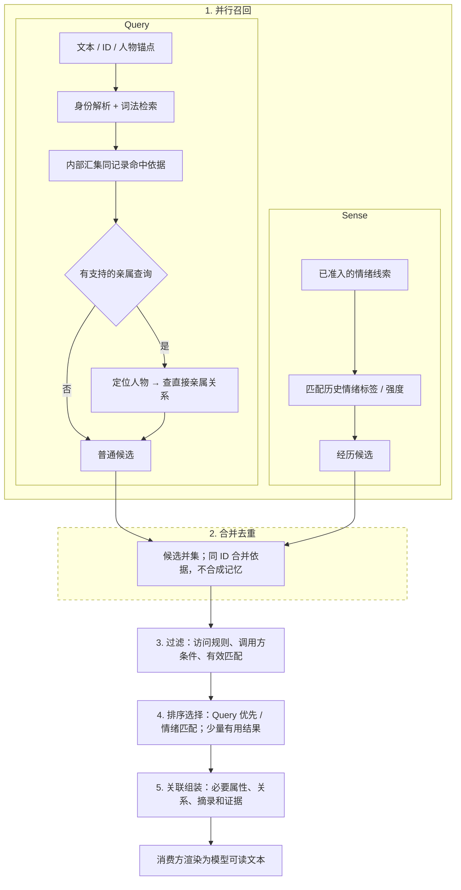

# Elfie Memory 架构

> 状态：目标设计。本文是 Memory 语义和类型化访问契约的权威；代码和一致性台账记录实际实现状态。
>
> 范围：持久化的主观经历、有来源的个人知识和确定性召回。不定义 Event Workspace 或 Reasoning Context Workspace，也不定义其他模块的状态。
>
> 契约对齐：Brain 契约 1.15（2026-09-26）、ADR-0033 与 Elfie 2.3。创建输入和完整 Genesis Manifest 都是临时数据；Memory 只保留自己的最终记录、Evidence 与原子完成标记。

> 设计关系：**所属模块：**Elfie / Brain / Memory；**上级设计：**[Brain 十系统架构](./elfie-brain-ten-system-architecture.md)；
> **下级设计：**无；**规范性契约：**[Brain 契约](../../../contracts/brain.md)；**当前架构：**[认知信息流](../../../architecture/cognitive-flow.md)；
> **一致性台账：**[Memory 一致性](../../../conformance/elfie-memory.md)；**领域资料来源：**Genesis owner 状态输入。

## 1. 目标、边界和所有权

### 1.1 Memory 要解决什么问题

Memory 为一只精灵提供持久、有来源的个人记忆。它保留一个完整、已经加工过的故事单元，
以及基于这些单元整理出的更高层语义笔记；两者都可以按措辞、时间、人物、情绪、主题和
关系召回。

语义模型只有两层：

1. **Episode**：进入 Memory 前已经准备好的、完整且有边界的话题、故事或学习单元。
2. **Node–Assertion**：从 Episode 投影出的知识笔记与关系图。每条 Genesis 语义种子都先
   物化为带来源的 Episode；明确提供的身份/关系骨架随后可以直接提交，但 Evidence 必须回指
   该 Episode。图谱可以包含类型化实体、明确关系、可复用知识和模式。

Recall 会联合搜索这两层。问题询问关系或抽象规律时，可以直接返回图谱结果；需要完整话题
语境时再返回 Episode。Evidence 解释结果如何得到。原始聊天日志、视频和其他上游材料不在
这两层 Memory 表面中，也不是默认 Recall 内容。

这仍然是 Memory 内部的 **source-first（来源优先）**：Node–Assertion 从 Episode 派生，但
图谱不是单纯的定位索引，也不需要在每次回答时被 Episode 替代。

### 1.2 Memory 不负责什么

Memory 接收已经闭合、已经加工好的 Episode，不决定一个话题或故事从哪里开始或结束。它不
拥有 Profile、不可变身份、当前位置、实时身体状态、实时情绪、进行中的计划、承诺、权限或
外部行动。它不直接读取 Profile、原始 Communication 历史、原始媒体、世界运行时状态或
其他模块的数据库。上游引用可以用于来源追踪，但不会形成额外的 Memory 检索层。

Memory 拥有的全部语义状态都是持久状态。Memory 不负责组织回复，也不拥有短期会话 tail、
上下文摘要、Run Observation 缓冲或 Reasoning 完整上下文；它只通过类型化 Recall 契约返回
有界、带来源的材料。请求内检索结构只是协议载荷或实现缓存，不是第二套记忆状态。

### 1.3 Memory 与 Brain / Cognitive Consolidation 的关系

普通 Memory 写入只接受完整、带来源的 `ClosedEpisode`。跨系统的 `Cognitive Consolidation` 调度器只是后台入口：目标是 Memory 时，它调用或分配 `Memory Maintenance` 的预算。Memory 拥有持久化写入、图谱投影、召回和生命周期维护；其他调度器或所有者都不能再创建第二条 Memory 写入路径。

`Memory Maintenance` 是 Memory 所有的操作。它与跨系统的 `Cognitive Consolidation` 调度器有关联，但不是同一个东西。

### 1.4 核心来源规则

对于在线 Memory 模型，输入只有两种：

- 普通运行时：已经代表一个话题、故事或学习单元的完整、已闭合 `ClosedEpisode`；
- 一次性初始化：完整、有版本的 `ApprovedSeedSource`，但它只作为临时输入资料包。

每个持久化 Node 和 Assertion 都遵循同一通用来源契约，并可追溯到已持久化 Episode 及其来源片段/定位。Genesis 资料包或 Seed 不能成为删除之后仍依赖的图谱事实来源：语义内容必须先物化为 Episode，才能直接提交身份/关系骨架或由 Consolidation 投影知识。资料包 ID/版本/hash 只能作为有界操作元数据保留；Evidence 不得依赖已删除的 Manifest。模型提案、摘要、缓存或无来源 Profile 值都不是证据。执行、重置、初始化和抽取记录属于操作数据，不是语义 Node 或 Episode。

## 2. 持久记忆模型

### 2.1 Episode Timeline

Episode 是一个有意义、有边界、已经闭合的话题、故事或学习单元，不是一轮聊天、原始转写
或关键词摘要。上游上下文边界可以先聚合多轮相关对话或观察，也可以压缩较早的回合，再交给
Memory。Episode 本身就是第一层记忆对象，也是默认的检索单元。

Episode 可以是一段对话或关系事件、一次学习过程、一次身体或环境经历、一次包含文字/音频/视频/图片的感知，或一次有意义的情绪/社会事件。

它保留：

- 稳定 ID、发生时间范围与精度，以及注册的 `event_kind`；适用时记录历史 `life_stage`/`temporal_label`（例如 `youth` 或 `before_arrival`），并与写入时间分开；
- 参与者、地点、物品和场景上下文；
- 原始 Episode 正文，以及持久的上游/媒体引用。可选 `summary_text` 是有来源依据的简短内容概括，
  可以由整理/汇总过程生成，并作为只读展示标题；它不是独立标题字段，可以为空，也不能替换或截断原文；
- 可用时的派生特征；
- 精灵观察到、被告知、推断或感受到的内容及其归因；
- 来源引用、隐私范围、`importance`、`retention_profile`、`half_life_days`、`detail_level`、`lifecycle`、版本和内容哈希。

`event_kind` 是注册的经历类型，在面向用户的工具中显示为本地化名称。首批核心词汇为：
`conversation`（有边界的对话/讨论）、`activity`（非外出或学习为主的共同活动）、`outing`
（外出/访问）、`learning`（学习/实践/探索）、`life_event`（有意义的人生变化或节点）、
`observation`（对世界或身体的重要感知）和 `reflection`（有边界的反思或情绪经历）。
`unclassified` 仅在来源不足以支持已知类型时作为保留回退值；它不是经历类别，不能静默默认为
`interaction`。初始化、重置/重新播种、调度/抽取状态及 Genesis 等来源名称都不是经历类型。Genesis
来源通过持久来源引用和关联 Evidence 表达；认识归因（`observed`、`told`、`inferred`、`felt`）是另一维度。
表达通过学习取得的知识的 Genesis `KnowledgeSeed` 使用 `learning`；个人 `EpisodeSeed` 则按其描述的经历分类，
绝不按“被初始化”这一事实分类。

运行时学习必须先作为完整 Episode 写入，再投影图谱。例如学习牛顿第一定律时，解释、教学
上下文和来源引用先作为一个 Episode 保存，后续维护再从中投影可复用知识。Genesis 种子内容
在批准来源中保持完整；属于个人经历的传记种子表示为完整 Episode。

Episode 没有统一的语义固定字数，边界是一个可以作为单个单元阅读的话题。但实现仍需要可配置
的传输/准入上限：如果一个话题会超过上限，上游所有者必须按话题边界拆成多个 Episode，或者
让闭合保持 pending 等待重试，绝不能静默截断 Episode。Memory 不增加第三个语义 Segment 层。
以后若需要，可以为异常大的 Episode 做内部文本切片，但它只是可重建的索引细节，不是独立记忆
对象，也不能生成自己的 Node 或 Assertion。

Reasoning Context Workspace 中的 `Topic` 就是这个上游边界和聚合线索，不是 Memory 持久化的
第三层。

后续维护可以把细节从 `full` 变为 `compressed` 或 `digest`，并把记录作为独立生命周期状态归档。摘要不能替代图谱所需的最后可审计来源。

### 2.2 Personal Knowledge Graph

图谱是精灵自己、带来源的主观理解，不是客观万能数据库，也不会静默导入模型常识。它是从
Episode 及其 Evidence 中整理出的高层知识笔记，可以重建和对账，也可以作为
独立的 Recall 结果：关系、可复用事实或 Pattern 可以直接回答问题，不必先返回完整 Episode。
投影修订号标识它对应的 Episode 来源版本。

#### 2.2.1 节点与类型组

类型组是注册表定义的语义类别；切片是基于类型组构造的读取/筛选投影，两者相关但不等价。注册表为每个叶子 Node 类型指定唯一主类型组；切片是派生视图，不是 Node 类型或第二套存储。每个规范 Node 只有一个主叶类型，因此只有一个主类型组。跨组事实引用同一个规范 Node ID，不复制对象，也不赋予多个主类型/类型组。

主类型组决定 Node 的语义归属和默认筛选；一个组投影仍可把其他组的 Node 作为上下文端点带入视图，不改变其主类型，也不复制实体。例如地球仍是空间地理组中的 `cosmic_entity`；通用知识里的 Node 可以通过普通 Assertion 引用同一个地球 Node。`type_group` 由已注册的 `node_type` 派生，不在每个 Node 上重复写入；筛选可以选择类型组、叶子类型或两者。

| 类型组 | 核心 Node 类型 | 边界 |
| --- | --- | --- |
| 社会关系 | `elfie`、`person`、`group` | `group` 包括家庭、团队、组织和社区；家庭/团队是群体子类型或属性，父母/朋友/成员是关系或角色。 |
| 实体 | `organism`、`object`、`material` | 人和精灵仍属于社会关系；物件组成、来源和用途通过关系表达。 |
| 空间地理 | `cosmic_entity`、`place` | `cosmic_entity` 覆盖宇宙尺度空间和天体（宇宙、星系、恒星、行星、卫星）；`place` 覆盖地区、城镇、住所和房间。两者用明确的包含等空间关系表达层次；没有明确语义需要时，不拆分地区/地点/房间，也不另设宇宙范围类型。 |
| 事件 | `event` | 可被指称的公共、历史或可复用事件可以成为 Event Node。Episode 是个人有来源的经历/记录，不会自动成为 Event Node；执行、初始化和抽取过程绝不是事件 Node。参与、目击、获知等用带来源关系表达。 |
| 通用知识 | `concept`、`claim`、`theory_or_model`、`principle_or_law`、`pattern`、`rule_or_guideline`、`method_or_procedure`、`viewpoint` | 类型表达语义形态，不表达学科。哲学及其他学科复用这些类型并附领域分类；`fact`、`belief` 等不是独立 Node 类型。时间等抽象内容是 `concept`，事件发生时间则是限定信息。可复用、有名称的世界观可为 `viewpoint`，可独立引用的命题可用普通 `claim` Node。 |

`claim` 是通用知识组中的普通叶类型，沿用 Node 身份、属性、来源和 Evidence 规则，不拥有专属载荷、表或 Evidence 模型；文中的 Claim ID 只是普通 Node ID。`fact`、`belief` 等词不构成额外 Node 类型或存储层。可复用命题可按需要表示为普通 `claim` Node，并通过已注册 Assertion 表达其关系、条件和立场；没有独立引用需求的简单关系仍可直接保存为 Assertion。

初始化/重置/重新播种执行、抽取任务、进度、失败及执行审计记录，都属于对应工作流或运行控制记录的所有者。
它们不是语义 Node、Assertion 或 Episode，不进入图遍历和 Recall。尤其不存在 `technical` 类型组或
`genesis_commit_receipt` Node 类型；Memory 只可保留自身写入流程所必需、有界且不可召回的检查点、租约和幂等收据。

自我模型是第一阶段的第六个切片，但不是第六个 Node 类型组，也不创建 `self_model` Node。它是同一图谱上按边选取的投影：先选出现有 Elfie Node 为主语的带来源出边，且谓词只能是 `believes`、`doubts`、`rejects`、`prefers`、`values`、`has_goal`、`has_trait`、`has_skill` 或 `has_habit`；收集 Elfie 锚点及这些 Assertion 两端的所有 Node；随后保留端点都在该节点集合内的全部带来源、已注册 Assertion。不得递归加入更多 Node。这样会带入相关的知识点间关系，但不会把所有连到 Elfie 的社交边带进来。切片仍以现有 Elfie Node 为锚点；当前设计不创建虚拟我 Node。生成 Memory 自我模型视图属于第一阶段；基于该视图更新 Selfhood、Orientation 或其他所有者，是另一个未来能力，本设计暂不包含。

Node 具有稳定身份、规范 `node_type`、注册表派生的 `type_group`、规范名称、作用域、身份解析状态、独立的生命周期状态和有界结构化属性。类型注册表是类型组、允许类型、属性、端点用途和来源要求的唯一权威；任意非空字符串都不能成为规范语义类型。身份解析状态与 Memory 生命周期分离：提及可以是 resolved/ambiguous/unresolved，已存 Node 可以是 candidate/canonical；生命周期为 active/archived/forgotten。别名、带来源描述和面向用户的属性都属于 Node 的可检索表面。外貌、性格、物种等描述 Node 自身的属性仍保持为属性，不会为了可检索而强行转成 Assertion。广义和具体概念通过 `part_of`、`subtype_of`、`generalizes` 等类型关系连接。不把每个词都拆成 Node；只规范化可复用语义单元，完整措辞仍保留在描述或 Episode 中。

可复用知识 Node 的规范名称应有原文依据并保持简洁。`claim` Node 与其他知识 Node 一样，使用普通标签、描述、属性和来源规则；它没有规范化三元组等专属载荷。Node 间引用通过已注册 Assertion 表达，不在 Node 内容中另设隐藏端点。普通一次性措辞继续通过来源 Episode 检索，本地确定性回退提取器不会仅因一段文字就把它提升为可复用知识 Node。

物理语义存储仍只有一套 `nodes`/`assertions`/`evidence` 基础。`claim` 是通用知识组里的普通 Node 类型，不是独立实体、专属载荷或语义层；六个切片都是这套基础上的只读投影。它可以成为普通已注册 Assertion 的端点，例如 `Elfie --believes--> claim Node`。所有类型共用同一 Node 身份和来源契约；当前精灵这样的展示锚点只能引用现有 `elfie` Node，不能再生成第二个来源记录。

#### 2.2.1.1 类型化属性与存储归属

属性是有类型的 Memory 能力，不是无限制的 JSON 逃生口，也不是第二个语义层。每个注册属性都声明允许的
Node 类型、值类型、基数、时间行为、来源要求、是否可搜索和默认展示优先级。未知 key 要么在规范准入时拒绝，
要么只作为来源原文保留，等待后续注册表版本确认。

每个属性 key 只能有一个权威存储类别：

| 存储类别 | 用途 | 示例 |
| --- | --- | --- |
| Node property | 稳定身份或结构分类；一个有界结构化值 | `species`、`place_scale`、`object_kind`、`material_kind`、`group_kind` |
| Node description | 带语言/种类/版本和 Evidence 的来源人类可读文字 | 对外貌或性格的观察/转述、地点介绍、工具用法、家庭概述 |
| Attribute Assertion | 随时间变化、多值、需要独立证据、有冲突或本身是关系的值 | 居住地、物品当前状态、景点、类型化特征 |

`nodes.properties_json` 是第一类属性以及注册表批准的有界可搜索属性值的校验投影；不能把技术命名空间元数据
和面向用户的语义混在一起。`nodes.description` 只保存有界的规范摘要；长文本或有来源的替代描述放入
`node_descriptions`。Attribute Assertion 复用同一套 Assertion/Evidence 契约，不能再复制到
`properties_json`。属性不因为要可搜索就转成 Assertion；类别由注册表决定，词法投影只索引批准的面向用户值、
描述、别名和来源文字，不索引 ID、hash 或 adapter 元数据。

因此，固有属性、随时间变化的事实和关系事实可以保持可区分，同时不创建另一套事实存储。Memory 中关于精灵性格的
描述是可出错的、有来源的证据，不是 Selfhood `adaptive_self` 的第二权威。UI 可以把这些记录归到“属性”或“关系”
分组，但每个显示值都必须指向自己的 Node property、Description、Assertion 或 Episode 来源。

#### 2.2.2 Assertion / 关系

Assertion 是连接 Node 身份的带来源、带限定关系记录，通常在图上显示为有向边：

```text
地球 --has_shape--> 球体
主人 --helped--> 精灵
```

Assertion 有稳定记录 ID，可以包含 Node 或带类型字面量作为对象，以及极性、认识状态、时间范围、视角、
上下文、有效期、冲突组、`importance`、`retention_profile`、`half_life_days` 和 `confidence`。在当前
Node 到 Node 的关系形式中，Assertion 不是另一条边的端点。

当一条可复用命题需要独立寻址，或需要成为其他关系的端点时，可以使用普通 `claim` Node。例如：

```text
Node C42（`node_type=claim`）：努力可以提高结果达成的可能性
Elfie --believes（`conviction=strong`）--> Node C42
```

Node C42 是可以被其他已注册关系引用的普通知识 Node；`believes` 是连接两个 Node 的普通 Assertion。Node 内容不以专属命题载荷保存，关系也不复制为隐藏内容边。`conviction` 可以是 `believes` 谓词允许的限定信息；Assertion 的 `confidence` 表示这条带来源关系本身的证据支持，而不是主体的坚信程度或命题真值。模型/抽取 confidence 是临时提案信号，不是持久语义分数。Node 身份 confidence 属于解析时使用的具体别名/描述/提及观测，不属于规范 Node。

对于社会关系亲密度、信任度等领域专属程度，使用带类型的 Assertion 限定信息。`importance` 是静态准入元数据，
注册的准入/生命周期规则可以读取，但不用于 Recall 排序。没有某条关系表示“尚未记录”，不表示“明确为假”。

#### 2.2.2.1 关系注册表、方向和并存

核心类型组、叶子 Node 类型、Episode 经历类型、谓词、端点约束、方向、对称/逆关系、类型化限定信息和来源要求由经过评审、带版本的 YAML 注册表定义（初始目标：`config/memory/ontology.yaml`）。第 2.2.1 和 2.2.2.1 节列出的类型组与词汇是首阶段注册表种子，不允许模型生成未注册值。Infrastructure 加载并校验它，再注入不可变的类型化快照；领域代码不直接读取 YAML。后续可由一个全局共享的数据库扩展注册表增加 `candidate`、`active` 或 `deprecated` 类型/谓词；它在同一产品数据根下由所有 Elfie 和工作区共用，不按 Elfie 或工作区分片，也不复制到各自的 `knowledge.sqlite`。Candidate 不能写成规范事实，扩展不能覆盖核心含义，active 项必须通过相同端点、方向、限定信息和来源校验。动态注册是受控的全局词汇扩展，不是模型自行注册。Node 类型比谓词更严格，因为它还会改变筛选、属性和投影。稳定扩展只能通过评审后的 YAML/版本升级进入核心。注册表新版本不能静默改变既有键的含义；语义改变必须使用新键或明确评审的重分类规则。出现频率本身不构成晋升理由：重复实例只是数据；只有明确、可复用的新语义才值得新增类型或谓词。

语义关系只能使用注册表中的规范谓词。下表仅列代表性示例；完整词汇和约束以 `config/memory/ontology.yaml` 为准：

| 关系族 | 规范谓词 | 方向规则 |
| --- | --- | --- |
| 亲属 | `parent_of`、`child_of`、`sibling_of`、`kin_of` | 方向、对称性和逆谓词逐项注册；粗粒度 `kin_of` 只用于来源没有说明具体亲属角色的情况。 |
| 社交与角色 | `friend_of`、`classmate_of`、`colleague_of`、`neighbor_of`、`acquaintance_of`、`guardian_of`、`guarded_by`、`mentor_of`、`mentored_by`、`teacher_of`、`student_of`、`member_of`、`has_member` | 同辈关系按注册约束表达；照料、教学、指导和成员归属保留端点角色。 |
| 实体 | `part_of`、`has_part`、`composed_of`、`made_from`、`produced_by`、`uses`、`used_for`、`owns`、`owned_by` | 有方向，只在注册时声明逆谓词；不能从空间邻近推断组成、材料来源或用途。 |
| 空间地理 | `spatially_contains`、`within`、`adjacent_to`、`reachable_from`、`reachable_to`、`located_in`、`route_to` | 包含、位置、可达和路径有方向；相邻对称。距离、通行时间、路径 ID/备选路线和条件是空间 Assertion 上的类型化限定信息，不是 Node 类型。`spatially_contains` 用于 `cosmic_entity` 和 `place` 的空间层级，不与概念包含混淆。 |
| 事件 | `participates_in`、`witnessed`、`learned_about`、`occurred_at`、`before`、`after`、`causes`、`caused_by`、`helped`、`involves` | 有方向并受时间限定；参与者、目击者和获知者角色不同。 |
| 知识与自我立场 | `subtype_of`、`has_subtype`、`includes_concept`、`prerequisite_for`、`implies`、`supports`、`contradicts`、`derived_from`、`applies_when`、`believes`、`doubts`、`rejects`、`prefers`、`values`、`has_goal`、`has_trait`、`has_skill`、`has_habit` | 方向、允许的端点组/类型和来源要求显式注册。立场谓词可指向 `claim` 或其他已注册知识 Node；不能用泛化 `knows`/`about` 代替。这些注册立场 Assertion 是第一阶段自我模型切片的入口。 |

注册表将方向定义为 subject → object，并为每个谓词声明允许的端点类型、对称行为或精确逆谓词。核心方向示例包括：`parent_of`（父→子）、`member_of`（成员→群体）、`part_of`（部件→整体）、`spatially_contains`（容器→被包含地点）、`reachable_to`/`route_to`（起点→终点）、`located_in`（实体→地点）、`occurred_at`（事件→地点）和 `believes`（主体→知识 Node）。反向表达只能来自显式注册的逆谓词或派生对称视图。`adjacent_to` 和 `contradicts` 对称。路径 Assertion 拥有类型化距离、预计通行时间、路径/备选路线标识和条件；普通时间筛选作用于 Episode 的发生时间，关系有效期仍是 Assertion 限定信息。

普通二元关系持久化为一条 `(subject, predicate, object)` Assertion。对称关系只保存一条规范
Assertion，从任一端都可遍历；反向页面视图是派生结果，不创建第二条事实。有方向的谓词只有在注册表
定义了逆谓词时才显示逆向语义。来源只说“家人/亲戚”而没有说明具体关系时，可以保存粗粒度 `kin_of`。
仅仅共同出现不能建边。同一对实体可以同时拥有多个谓词，它们是独立事实，必须同时保留和显示。跨切片
关系连接原有 Node，不得为切片复制节点。

`parent_of(parent, child)` 显示时要准确说明两端角色；反向遍历不改变关系语义。`friend_of` 和
`kin_of` 显示为双方关系。亲属称谓有文化和语境歧义时，保留来源措辞或使用粗粒度关系，不擅自推断。
`person`、`elfie`、`group`、`place`、`object` 是 Node 类型；`friend`、`family`、`parent` 等词是关系谓词、
群体分类属性或角色，不能成为这一层级的核心 Node 类型。

#### 2.2.3 Evidence

Evidence 是一级来源关联。它标识已持久化 Episode 和 Episode 内的摘录/片段（及可选的上游媒体定位）、模态、
捕获时间、说话者/视角和抽取运行。Genesis Manifest 或 Seed 可以作为有界来源元数据，但在资料包删除后
不能作为唯一来源目标。所有 Node 类型共用这一来源关联模型，不为 `claim` 建立独立 Evidence 所有权或解释规则。

Assertion 可以关联多条独立 Evidence；重复写入同一来源关联必须幂等。即使描述被压缩或模型提案被丢弃，Evidence 仍然保留。

#### 2.2.4 Aliases、Descriptions、Episode Mentions

别名、描述和提及单独成子记录，是因为一个 Node 可以有很多条记录，而每条记录都可以保留自己的来源/定位、内容或片段、种类/解析状态和可信度。它们不单独拥有重要性分数，可用状态跟随父记录/来源的保留策略。Node 主表只保留规范身份和有界摘要。

`episode_mentions` 记录有语义意义的表面提及、角色/片段和解析状态（`resolved`、`ambiguous` 或 `unresolved`），不记录每个词。未解析提及和 Episode 中的措辞仍可搜索，因此一个罕见词在还没有成为规范 Node 前也能被召回。

首版实现限制每个 Episode 的语义提及数量（默认 128 条）并报告溢出；已持久化的 Episode 正文不能被静默截断。

#### 2.2.5 冲突、视角和知识 Node

当知识内容或作用域不同，相互矛盾或依赖视角的内容保留为不同普通知识 Node 或 Assertion，并按需用有来源的 `contradicts` 关系连接。规范化只合并身份，不合并分歧。所有类型都遵循同一来源准入规则。具名的哲学立场可为可复用的 `viewpoint` Node；具体陈述使用通用知识组中的相应叶类型，不另外创建“哲学”切片。

### 2.3 分数和生命周期状态

#### 2.3.1 importance

`importance` 是附着于 Episode、Node 或 Assertion 的可选、有界来源准入显著性。它不是 confidence、真实性、鲜度或检索频率。第一阶段只允许显式带来源输入或固定注册表默认值；不根据使用/结果反馈增强，不做重复使用强化、24 小时分数折叠或沿图邻接传播。反馈驱动的更新策略延期到独立的后续设计。

#### 2.3.2 Retention 与 freshness

每个 Episode、Node 和 Assertion 在准入时获得注册的 `retention_profile` 和策略拥有的 `half_life_days`（`H > 0`）。`H` 是 freshness 从 `1` 降到 `.5` 所需时间，不是剩余天数。使用、召回、结果或反馈都不会改变 `H` 和准入时间锚点。当前 `freshness`（`F`）只派生、不持久化：

```text
t = max(0, now - retention_anchor)
F(t) = 2^(-t / H)
```

因此 `F(0)=1`、`F(H)=.5`、`F(2H)=.25`。一套带版本的准入策略按记录种类、已注册 Node 类型或 Assertion predicate、来源类别和静态显著性，解析策略拥有的 profile 与半衰期；调用方和模型不能选择任意数值。Profile 可以区分短暂细节、普通/显著 Episode、可复用语义记录、稳定身份和授权 Genesis 数据。Pattern 专用 Retention 在 Pattern 生成能力实现前不启用。持久化最终 profile、策略版本和准入原因。Lifecycle 独立负责压缩、归档和遗忘；新的权威 Evidence 可以按独立验证的写侧规则重新解析未 forgotten 的归档身份，但 Recall 本身不能改变 Retention。反馈强化和自适应调度延期。

#### 2.3.3 confidence

规范 Node 不持久化通用 confidence 标量。身份解析 confidence 属于具体来源观测（提及、别名或描述），只用于解析该观测；未解析/candidate 不是 Node 生命周期状态。Assertion 的 `confidence`（`C`）是支持这条精确关系记录的 Evidence 派生值，不是主体相信程度或命题真值。`believes` 上的 `conviction` 限定信息表示主体多大程度持有该立场。模型/抽取 confidence 是临时信号，不能持久化为语义事实。Episode 也没有 confidence 分数。

策略依据完整的唯一 Evidence 集合重算 `C`，而不是按到达顺序增减：

```text
C = (prior_weight * initial_confidence + sum(support_weight))
    / (prior_weight + sum(support_weight) + sum(conflict_weight))
```

Evidence 权重来自带版本的来源策略；重复 ID 不计数。相关来源共享 `independence_key`，同一个 `(independence_key, stance)` 组只采用最高来源权重，而支持和冲突仍是不同立场；`context` Evidence 不改变 `C`。Assertion 支持 confidence 使用自己的 `assertion_evidence`，不会沿相邻 Assertion 传播。身份观测 confidence 保留在解析用的具体别名、描述或提及上。纠正时保留旧 Assertion 及其 Evidence，并增加有来源的新版本/冲突关系；记得过去信念不等于它为真。

每条 Assertion 的带来源准入会建立不可变的 `initial_confidence`、`prior_weight` 和 confidence 策略版本元数据；它们只是重放输入，不是额外动态分数。创建来源已经由该先验表示，不能再次进入 support 总和。普通运行时先验由固定来源可靠性类别给出，模型不能提交任意浮点值。策略升级必须显式带版本重算，不能在重开数据库时静默改分。

#### 2.3.4 Lifecycle eligibility（不新增分数）

时间与固定准入半衰期产生 `F`，`F` 驱动 Lifecycle eligibility。带版本的 Lifecycle 策略独占压缩、归档和遗忘阈值；Lifecycle 不改变 importance、confidence 或 Retention 时间锚点。子级别名、描述和提及跟随父记录/来源依赖。Recall 使用显式筛选、确定性的内容/图谱匹配和稳定决胜；第一阶段不按 `importance`、类型先验、来源历史、freshness、confidence、反馈或综合分数排序。Freshness 和 rank 不持久化。

#### 2.3.5 detail level

`detail_level` 只表示 Episode 内容细度：`full`、`compressed` 或 `digest`。Episode 和 Node 的 `lifecycle` 表示 `active`、`archived` 或 `forgotten`；Assertion lifecycle 还可以是 `superseded`。身份解析是独立轴：提及可为 `resolved`、`ambiguous` 或 `unresolved`，已存 Node 可为 `candidate` 或 `canonical`。合并 Node 保留显式合并目标，不用生命周期值表示。归档是状态转换，不是内容细度；归档 Episode 仍可保留 full、compressed 或 digest。维护不能删除活跃语义事实的最后可审计 Evidence，或删除仍被 Assertion 引用的规范 Node。

## 3. 运行流程

```text
一次性 Genesis
ApprovedSeedSource ──► 临时 GenesisMemorySubmission
                         └─ 原子提交 ──► 最终 Memory 输出 + 完成标记

普通运行时
Workspace 闭合 ClosedEpisode ── 捕获事务 ──► 完整 Episode + 来源引用
                                               │
                                               ▼
                                        Memory Maintenance
                                        ├─ Consolidation Stage
                                        │  Episode ► 类型化图谱投影
                                        └─ Lifecycle Stage
                                           到期记录 ► freshness 驱动的细节/生命周期策略

Episodes + Nodes + Assertions + Evidence ──► Hybrid Recall ──► 有界 RecallBundle
```

Genesis 是一次性的侧入口。普通路径不会从不完整事件写入图谱事实，捕获也不会等待维护。

### 3.1 Genesis 初始化

`ApprovedSeedSource` 是创建期不可变、有版本并带哈希的值。临时 `GenesisMemorySubmission` 只接收三类种子：`KnowledgeSeed[]`、`EpisodeSeed[]` 和 `RelationshipSeed[]`。每条 Seed 的语义内容都物化成完整、持久的来源 Episode；关系 Assertion 可以根据明确创建输入直接提交，但其 Evidence 必须指向该 Episode 及来源片段。Episode 记录的是被播种的内容，不是初始化/重置操作或作业回执。经历类型和发生时间只有在内容支持时才填写；否则使用注册的 `unclassified` 和未知时间。不存在第四类传记或关系记忆：传记由 Episode 表达，关系由有明确来源的 RelationshipSeed 投影表达。领养初始化必须为主人建立独立的 `person` Node；“领养家庭”是可并存的 `group` Node，不能用别名代替主人或把家庭标成 `person`。知识和经历派生的 Node/Assertion 延后到 Consolidation；身份和关系骨架因为是明确的创建输入，可以直接提交。最终输出带 Episode-backed Evidence，不依赖已删除的资料包绑定或重放 Seed。

Genesis 使用“单次提交”完成合同。一次 Genesis submission 是调用方交给 Memory、准备在一次原子提交中写入的完整、不可变 Memory 输出集合。Genesis 可以调用 Memory 任意多次；提交次数、大小、顺序、分组、调度以及这些提交代表核心知识还是扩展知识、前台还是夜间任务，都由 Genesis 决定，Memory 不负责决定。即使多个 submission 属于同一次更高层 Genesis 操作，每个 submission 也必须有自己的稳定提交/幂等身份和内容哈希。

对于一次有效 submission，所有预期的权威记录和子记录——身份/关系 Node 与 Assertion、来源 Episode、创建 Evidence——以及本次 submission 的完成标记，必须作为一个完整单元持久化并可见。知识和经历派生的图谱投影有意不在创建原子集合内，而由后续可重试的 Consolidation 产生。原子性就是“只接受当前提交”：写入前完成校验；Unit of Work 要么提交所有输出和标记，要么一个都不提交。失败调用只能返回失败或可重试结果，绝不能返回 `committed`。相同 submission 身份和哈希重放必须幂等；同一身份换用不同哈希必须拒绝。后续 submission 失败不能回滚先前已经成功提交的 submission。

Genesis 调用方负责批次划分、顺序、重试时机以及何时发布领养结果。Memory 只在仍未发布的创建工作区内暴露已完成 submission，最终工作区是否可见由 App admission 决定；Memory 不报告整个 Genesis 操作是否完成。已提交 Elfie 不提供 Genesis 重新初始化入口；获批迁移或真实学习事件只能操作最终 owner 状态。跨所有者领养发布由其自身契约定义，本文不假装存在跨存储的单一事务。Genesis 只接受带来源的初始 `importance` 和注册保留策略；不接受 Node 总体 confidence 或模型任意 confidence。其授权准入统一选择 `genesis` profile，使 Genesis 产生的每条语义记录都获得 `retention_profile=genesis` 和 `half_life_days=3650`。它不模拟对话，也不靠情绪强度制造重要性。普通运行时调用方禁止直接投影图谱。

Genesis 对每只 Elfie 的准入按串行方式执行。完成标记是 Genesis 行的唯一可见性闸门：标记出现前，读取和维护都不能使用该 submission 的任何行。Genesis 可以接受只包含部分批准种子类别的一次完整 submission，不要求每次 submission 都包含所有种子类别，也不会推断调用方的批次策略。

最终创建成功提交或终止失败后，`ApprovedSeedSource`、submission Payload、资料包绑定和生成 Seed 全部删除。Memory 数据库只保留最终 Episode、Node、Assertion、Evidence，以及自身原子合同所需的最小 submission 完成/幂等标记；该标记不能重建 submission，也绝不进入 Recall。它是运行审计状态，不是 Node、Assertion 或 Episode。

Genesis 不会把提交或初始化流程本身变成 Episode 经历。种子来源保留在来源引用/Evidence 中，经历类型描述
被学习或实际发生的内容；只有来源能支持时才写入取得/发生时间。Bundle 创建时间和提交时间是运行时间戳，
不能直接当成知识取得时间。

### 3.2 普通运行时写入

上游 Workspace 闭合并校验事件，然后提供完整 `ClosedEpisode`。捕获事务写入 Episode、幂等键、来源引用和内容哈希。它不调用模型，也不从不完整内容更新 Node/Assertion。图谱 Evidence 关联和投影延后到 Consolidation Stage；文本投影可重建，不是第二个事实源。

### 3.3 Memory Maintenance

Memory Maintenance 是一个有界操作，可以持续小批量运行，也可以利用空闲/睡眠时间追赶。它有两个有序阶段和一套预算规则。检查点、租约和重试次数属于权威 Memory 事实记录之外的运行控制状态；它们不是语义记忆类型、可召回队列或第二个事实源。

Developer Tools 显示的单条 Episode 整理进度，是从所属 Maintenance 操作/检查点及其绑定来源版本的成功回执
派生出的只读投影。成功回执和排队/运行/失败状态都属于 Maintenance 运行记录，不属于 Episode 事实行。
如果所属投影没有提供状态，就显示“未知/未观测”，不能从 `event_kind`、`detail_level` 或 Memory 生命周期推断。

#### 3.3.1 Consolidation Stage

处理 Maintenance 运行状态中、针对当前来源版本/内容哈希尚无成功回执（包括之前尝试失败）的完整 Episode。第一阶段依次运行六个切片投影，再执行独立的跨组关系提取。前五个是节点优先的领域投影，对应五个注册类型组：社会关系、实体、空间地理、事件和通用知识。第六个是边优先的自我模型切片：以已注册的立场谓词选出 Assertion，再取其涉及的 Node，并保留这些 Node 之间的全部边。最后的跨组关系处理连接主类型组不同的已选 Node。它们都属于同一个 Consolidation 阶段，不是新的 Memory 所有者或数据库，也不要求拆成独立模型调用。自我模型切片属于第一阶段；基于其结果更新 Selfhood/Orientation 或其他所有者才是未来能力。事件提取只为有来源、可独立指称的事件建立 `event` Node；不为每条 Episode 或执行过程建立事件 Node。

1. 五个领域投影先选出重要/可复用的规范 Node。完成规范化后，保留图谱中该切片选中 Node 集合内部所有两端均为这些 Node、且有来源并通过注册校验的 Assertion，包括已有边和跨组边；不得再按谓词族做第二轮过滤，把已选 Node 之间的有效边丢掉。带类型字面量的属性 Assertion 按其注册属性/来源规则处理，不视为两个 Node 之间的边。
2. 自我模型投影先选出现有 Elfie Node 为主语、且谓词属于上述九种注册自我立场关系的带来源出边；再选入 Elfie 锚点和这些 Assertion 的 Node 端点，并保留图谱中该集合内部所有带来源、已注册的 Assertion。不能递归扩展新 Node，也不创建虚拟我 Node。
3. 共享解析器跨六个切片规范化 Node 身份、别名和共指，然后校验端点类型、注册谓词和来源 Evidence。最后的跨组步骤提取并校验主类型组不同的已选 Node 之间所有有明确来源的关系；不能从共同出现推断关系，也不能编造 Node。
4. 只合并相同的规范事实并汇总各自 Evidence；不同谓词、方向、时间、作用域、视角以及相互冲突的 Claim/Assertion 都要保留。
5. 根据唯一 Evidence 派生 Assertion 支持度；信念 conviction 保留在注册的 `believes` 限定信息中。不重算 Node 总体 confidence，也不产生反馈驱动的 importance/Retention 事件。
6. 使用现有 Consolidation Unit of Work 一次提交所有校验通过的输出，并在 Maintenance 运行回执中记录来源/投影修订号和全局注册表修订号，键为 Episode ID、来源版本和内容哈希；不能写到 Episode 事实行。跨组关系结果是持久 Assertion，不只是统计。

谓词来自有版本的词汇表。未知谓词在校验前只能保持为未解析候选，不能静默提升为事实。仅
共同出现不能成为关系。局部属性保留为 Node 属性或类型化字面量，只有具有独立复用价值时才
提升为实体。

模型可以在写事务外提出抽取、消歧或摘要建议。确定性代码校验片段、类型、作用域、谓词、ID、Evidence 和版本，并执行最终写入。没有模型时，Episode 捕获和 FTS 仍可用，语义投影等待后续尝试；不能退化成关键词准入，也不能把无来源事实作为回退。

#### 3.3.2 Lifecycle Stage

对任何 active Episode、Node 或 Assertion，只要派生 freshness 到达阈值，就执行第 6.3 节带版本的转换，并且不修改 `importance`、`retention_profile`、`half_life_days` 或 Evidence。Node 身份解析状态和 `merged_into` 都不是生命周期状态。这些阈值是 Lifecycle 运行参数，不是反馈或 Recall 常量。

当前来源版本没有成功投影的 Episode 必须保留足够完整来源。自动遗忘只做逻辑标记并保留最小 digest、哈希和来源链；物理删除不属于 `memory.v3`。低 confidence 不是删除理由。旧记录由计算出的 `next_review_at` 发现，单条不安全目标不会阻塞其他有界记录。

### 3.4 Hybrid Recall

Recall 为当前情境联想过去经历，也为回答问题、解决任务找回经验和知识。它是只读的确定性 Memory 操作，不调用生成式模型，不强化或改变记录；Brain/Reasoning 决定是否调用和如何使用结果。

**先固定结构，再按已有数据逐场景完善。** 本节是收敛后的首版目标，不表示已经实现。当前记录已有 Episode 正文、情绪标签/强度，以及 Node/Assertion 和亲属谓词；字段存在不证明已积累足够的真实个体数据，也不证明检索有效。不以假想场景为理由建设通用推理器。

#### 3.4.1 首版范围与输入语义

| 输入 | 首版场景 | 返回原则 |
| --- | --- | --- |
| Query | 用名字、关键词或故事细节找已有经历/知识 | 返回与目标相关的 Episode、Node 或 Assertion |
| Sense | 用已有历史情绪数据做联想 | 返回少量情绪匹配的 Episode；无可靠匹配可为空 |
| Query + Sense | 带情绪线索查某个问题的经历/知识 | Query 决定是否相关，情绪只辅助选择，不放入仅情绪相似的无关经历 |
| Query 含 graph plan | 查某人的父母、子女或已记录的兄弟姐妹 | 定位人物后查支持的直接关系，返回关系路径与必要来源 |

接口保持 Query、Sense、Filters 三类输入及有界 limits，不增加模式或 AND/OR 参数。候选可以取并集，但不是无条件返回并集。Query/Sense 至少一个非空；独立的问答检索与自发联想可以分两次调用，并由上游分别标注、共用预算。

模型调用前，有可靠显著情绪时可做 Sense-only；没有明确目标时不强行把问候或整段原话塞入 Query。模型发现缺失事实或工具结果需要历史经验时，再提出聚焦 Query。“上次”指什么先由上游上下文解析，Memory 不自行读对话历史，也不负责判断任意自然语言意图。是否首轮调用、是否补充调用不固定；同一 Run 的结果仍绑定同一 Memory 修订。

#### 3.4.2 五步流程

首版调用规则：模型前只从 `freshness=current` 的 EmotionSnapshot 提取至多一个 Sense，选已有 active 通道中强度最高者，同强度按通道名稳定决胜；没有 active 通道则跳过初始检索。Demo 复用 Emotion 已有激活边界，不把它宣称为已验证的心理学阈值。初始 Query 不再由用户原话或意图正则生成。首个模型可直接回答，也可发出一次携带受支持 Query/Sense/Filters 的结构化 `RecallMemory`；指代由已有上下文解析，“上次”目标仍不明时澄清，不编造目标。

`DIRECT` 默认一次模型调用。Energy/截止时间准入能预留第二次调用时，开放一次只读 Recall 并保留最终回答预算：模型 → Recall observation → 最终草稿，最多两次模型调用、一次按需 Recall；最终 schema 排除再次 Recall。初始 Sense 与按需 Recall 共用上下文预算和固定 Memory revision，不切换深度、不创建计划、不扩大外部 Tool 权限。预算不足时从模型 schema 去掉 Recall 动作，允许诚实回答或澄清。`DELIBERATE` 保留已有有界循环，可在收到工具结果 observation 后发起聚焦 Recall。这是对当前 DIRECT 守卫的规划例外，尚非运行事实。

保留 Query 和 Sense 两条并行候选路。图执行在 Query 锚点定位后；过滤、排序和结果关联是后续独立步骤。



Namespace、隐私和 active 生命周期规则在每次读取时强制，包括锚点、遍历与辅助内容，不推迟到图中的第 3 步。适用的过滤可提前下推；数量和耗时预算限制各步，耗尽须说明，不能伪装成完整搜索或没有记忆。

#### 3.4.3 Query 与简单亲属查询

普通 Query 先复用稳定 ID、规范名称、别名和已有可搜索文本；目标是持久倒排词法检索（BM25 类），而非仅靠 `LIKE`。Episode 搜正文/有来源概括，Node 搜名称/描述/获准属性，Assertion 搜有向关系措辞及限定信息。命中回读权威记录，不能把索引文本当成另一份事实。中文短词、别名和无关词的效果先在小样本中比较。向量检索保留为后续通道，不是首版 demo 的前置条件。

分支内部只按同记录汇集匹配依据，不建设多层融合器。精确 ID 可直接定位；歧义名字不能静默选一个人。普通精确记录读取与文本搜索分别演示，首版不定义任意 ID 与文本组合的复杂语义。

图查询先做一个可验证的亲属切片：锚点是明确人物 ID 或能唯一解析的人名，支持注册的 `parent_of`、`child_of`、`sibling_of` 直接查询，正确处理方向、逆关系及对称关系。调用方只看到这个切片支持的含义和谓词，不让模型猜整张图的边；自然语言到请求的转换由上游负责，Memory 只执行已支持的请求。

只把符合该场景的正向、未被替代且生命周期 active 的关系用于直接答案；否定、冲突、时间限定或身份不明时，不硬给确定结论，保留已知状态或提示未解析。返回匹配边、端点及必要 Evidence，不追加无关邻居。直接关系缺失表示“未记录”，不表示没有亲属；“全部”只指该直接查询预算内的结果，截断必须说明。

共同父母推导兄弟姐妹、多跳亲属链、材料/因果/空间推理、字面量图终点及任意图计划暂不承诺。普通文本仍可找到这些已有知识；这不等于支持其结构化推理。

#### 3.4.4 Sense：先把情绪联想做好

首版只使用已有且归因可靠的情绪标签和强度。上游从当前状态中选择值得触发的线索；Memory 比较历史 Episode，不自行读取 Emotion/Orientation，不凭检索结果补造历史情绪。归因不清或字段缺失时不猜测。

先用同类情绪匹配，双方强度都有时比较接近程度；没有历史强度时只表示标签匹配，不声称“高度强度相似”。触发强度、匹配门槛和数量从实际样本调，不现在发明复杂情绪距离或心理模型。情绪很强不等于任何同类经历都值得返回，弱匹配和重复内容允许被舍弃。

一条经历只返回一次，不合成新记忆。有 Query 时，候选还须与 Query 相关；例如查蛋糕补救时保留有用的蛋糕经历，不因悲伤返回无关旅行。仅 Sense 时按已有情绪匹配选少量经历，不保证凑满。

地点、实体、活动、环境/感官联合匹配及场景直接联想知识保留扩展方向，暂不新增多路配额、最强维度公式或场景 schema。以后每加入一类可靠历史数据，再增加一条可验证通道，仍沿用候选合并与去重。

情绪数据按来源准入。当前状态使用六个 `EmotionType`，Episode emotion 却是自由文本；Genesis 写入 `emotional_tone`（包括 belonging/curiosity/trust/resolve/wonder），普通对话闭合当前不写情绪。Episode 的 `attribution=observed` 或存在强度不能证明它记录的是自己的情绪。首版只接受标签属于六类、且来源明确表示精灵自身情绪的记录；其他标签保留为来源数据，暂不参与自动 Sense 匹配。不把故事基调映射成情绪通道，也不回填历史。优先使用有来源样本，缺少时明确使用合成夹具；没有合格真实历史则真实数据质量继续 open。未来对话情绪的捕获属于独立写侧切片。

首版确定性准入条件复用已有字段：`attribution=felt`、规范情绪标签、可用来源引用同时满足；生产端须用 felt 明确表示精灵自身体验。检索不从正文推断归因，不把 observed 改解释为 felt。夹具显式提供这些值，单纯标签碰巧一致不能准入。

#### 3.4.5 合并、过滤与排序

- **合并：**按 `(record_kind, record_id)` 去重并保留命中来源；不同时间、极性、视角的 Assertion 不折叠。图结果按真实路径组织。
- **过滤：**先支持记录种类/已注册类型、已有 Episode 发生时间与情绪条件，以及明确请求的 importance 下限；所有通道同样受约束。未支持的条件明确拒绝，不能默默忽略。
- **排序：**文本检索用可解释的词法匹配；Sense-only 用情绪匹配；二者都有时 Query 优先，情绪只在相关程度接近时辅助；图查询先满足关系条件，再稳定排序。
- **选择：**只返回预算内的有用结果，可以为空；不建设全通道统一大分数，不直接相加不同标尺分数，不按 importance、freshness、confidence 或反馈加权。

Filters 同类多值取 OR、不同条件取 AND；类型只约束适用对象。Episode 时间按有来源的发生范围与请求范围相交判断，未知时间默认排除，可显式允许；无时间概念的 Node 不套 Episode 时间。若只想找经历，应明确指定记录种类。“最近一次/最早一次”的额外排序、复杂属性布尔条件和任意历史关系时间查询待有场景再加。

具体权重、阈值与预算不在这里预定；实现时用同一小样本比较候选、最终输出和旧行为，形成一个能解释、能复现的简单规则。不能把“排第一”当作“足够相关”，也不宣称不用模型就能判断任意答案是否完整。

首版实现使用每精灵一个 FTS5 语料库，覆盖 Episode、Node 和 Assertion；命中 ID 都回读权威记录。文档和 Query 共用中文单字/二元组合预分词；词法 Query 优先使用不同的二字词，只有没有有效二字词时才回退到单字。当前会忽略这些偶然问句词：`什么`、`一个`、`问题`、`记得`、`之前`、`以前`、`说过`、`好吗`。规范化 Node 名称/别名精确匹配优先于普通候选；普通候选至少覆盖 0.34 的有效不同 Query 词，无有效 Query 词时返回空。每种记录的 FTS 候选池上限为 `max(512, min(4096, top_k * 64))`，超过上限会报告截断。排序依次为精确名称档位、词覆盖率降序、可选 Sense 决胜、BM25 升序、`(record_kind, record_id)` 升序。Query+Sense 先固定与 Query-only 相同的 top-k 候选池；Sense 不能放行或挤走 Query 候选，只能在相同文本档位与覆盖率内决胜。不相加原始分数，也不增加类型先验。这些阈值只是 demo 首版基线，不代表已经在真实个体数据上证明相关性质量。

当前 Sense-only 只匹配来源齐全、`attribution=felt` 且规范情绪标签相同的 Episode，最多返回一条；只有输入和历史强度都存在时才比较强度，差值大于 0.25 会排除。历史强度缺失仍只算标签命中，当前强度缺失则不进行强度比较。当前 Bridge 至多从 current 快照中选取最强的 active 规范情绪，不从用户原话生成 Query。图答案按关系资格和端点/Assertion ID 稳定排序，忽略 Sense 排序，来源 Episode 仅作支撑。候选池被截断时报告 partial。真实数据到位后可校准首版常量，但不能改变 Query 优先语义。

#### 3.4.6 结果关联与输出

选中后只沿已存关联补足理解所需内容：Episode 带摘录、时间及有关参与者；Node 带名称、描述、相关属性；Assertion 带主体、谓词、对象、限定信息与 Evidence。图查询只带命中关系路径与来源，不再额外搜索其他故事。

主要命中与必要来源分开标记。类型/时间过滤选择主要结果，不应剪断解释它的必要关系或证据；范围外来源注明出处，不冒充额外命中。所有辅助内容仍受 namespace、隐私和生命周期规则约束。证据不足、冲突、歧义和截断如实表达，不填补缺失事实。

返回有界类型化 bundle，由消费方确定性渲染为紧凑文本；保留匹配原因、必要属性/关系和来源，不只列名字。先使用简单的数量和文本预算，避免一条经历与其派生知识反复占满上下文；不建设复杂自动摘要和上下文优化器。

#### 3.4.7 后续扩展的进入条件

每项扩展先有数据和问题，再有算法：明确一个真实或来源可追踪的场景，检查字段/关系是否齐全，给出预期命中与不应命中，复用现有接口做最小切片，比较效果后再纳入常规能力。合成 demo 只证明流程和边界，不证明真实个体效果。

向量通道、多维 Sense、通用图路径、场景知识适用性、复杂过滤/时间排序、自动反馈调权和 Global/community 检索均不是本轮首版要求。这里保留方向，不为它们冻结额外字段、查询语言或通用评分公式。

### 3.5 延期的 Memory Abstraction Loop

本能力当前明确不实现。未来必须一次交付完整闭环：

```text
Node + Assertion → 夜间图上聚合 → 模型提案 + 确定性校验
                 → Pattern 知识 Node → 按场景召回 → Reasoning 应用
                 → 结果反馈
```

聚合从图中已有的相关 Node 和带来源 Assertion 出发；Episode 只用于核验来源链和原始语境，不作为主要聚类面。它是 Consolidation Stage 的未来扩展，不新增第三个 Memory Maintenance 阶段或另一维护入口。通过校验的 Pattern 是可复用的 Claim/知识 Node，包含规范化规律、适用条件和限制/反例。其推导必须保留对支撑 Node、Assertion 或下层 Pattern 及底层 Evidence 的引用；具体物理表示随该能力一并设计。

不得只生成 Pattern。相同的端到端切片还必须接收事实所有者提供的类型化当前场景特征，通过直接匹配或向上图遍历召回适用 Pattern，在 `RecallBundle` 中完整保留规律、条件、反例和来源链，由 Reasoning 判断是否应用，并把结果写成新的 Episode，供后续强化、反驳或收窄 Pattern。上述路径及评测未同时完成前，Memory 不宣称支持 Pattern 抽象。

## 4. 类型化接口契约

本节固定语义输入、输出和保证，不固定编程语言的方法名。具体方法名可以在实现中调整，并记录在代码和一致性台账中。

### 4.1 Episode 写入

输入是完整、已经加工好的 `ClosedEpisode`，包含稳定 ID 或幂等键、发生时间范围与精度、注册经历类型
`event_kind`、Episode 正文、认识归因、来源引用和哈希。Episode 没有独立标题字段；可选 `summary_text`
是有来源依据的内容概括，可以为空，且不会替代原文。哈希覆盖持久化 Episode 载荷及其引用的来源版本，不覆盖后续
图谱投影。输出是包含持久 Episode ID 与状态的回执。操作必须原子且幂等，不能从部分内容生成
图谱事实。

### 4.2 Recall

概念接口保持 `Recall(Query?, Sense?, Filters?, limits?) -> RecallBundle`。这里定义语义职责，不再冻结另一套详细协议 schema；实现获准切片时沿用现有类型化访问路径，不要求新建 API 框架。

| 部分 | 首版支持含义 |
| --- | --- |
| Query | 文本或精确记录 ID；保留 graph plan 位置，首版用于支持的直接亲属查询 |
| Sense | 归因已知的当前情绪标签及可选强度 |
| Filters | 记录种类、注册 Node 类型/类型组、有来源的 Episode 时间（含未知时间策略）、历史情绪及显式 importance 下限 |
| limits | 有界候选/图/结果数量及文本/耗时预算；不是必须凑满的数量 |
| RecallBundle | 主要记录或关系路径、必要辅助内容/证据、匹配原因、不确定性及截断 |

亲属计划只需人物锚点和一个支持的关系请求。对调用方解释方向及逆/对称关系，只执行注册表与本切片都支持的谓词；不要求调用方生成任意路径、端点程序或通用图语言。不支持的请求明确拒绝。普通 ID 读取与图锚点是不同用途。

Query + Sense 遵循 §3.4.1，不设 AND/OR 开关。Memory 绑定一只 Elfie 的命名空间；空输入、无效类型及不支持的过滤不静默放宽。Filters 选择主要结果，必要来源按 §3.4.6 处理；隐私及生命周期门不可放宽。

复用类型化 bundle 中的 Episode、Node、Assertion、path 和 Evidence。确保选中的 Node 属性/描述、有向关系、限定信息及来源在渲染中保留；区分主要命中与辅助记录，不提前冻结大套诊断 schema。已有 importance/freshness/Assertion confidence 元数据不参与排序。

区分没有合格命中、输入未解析/歧义、部分/截断结果与检索不可用。“全部亲属”的部分结果不能宣称穷尽。消费方无需再次调用模型即可渲染为紧凑、忠实文本，最终回复或行动仍由上层决定；原始对话/媒体不是额外 Memory 检索层。

### 4.3 延期的反馈与自适应排序

第一阶段不接收使用/结果反馈收据，不根据反馈增强 importance/Retention，不学习自适应排序公式，也不按 importance、类型先验、来源历史、freshness、confidence 或综合分数给 Recall 排序。反馈采集、结果权威、耐久收据投递、自适应调度与排序留给单独的后续设计。普通确定性文本/图谱相关性、显式筛选、Lifecycle 准入和稳定决胜仍受支持；它们不是排序学习或反馈学习。

### 4.4 Memory Maintenance

输入是有界批次/时间预算和运行控制用的维护检查点。操作先执行 Consolidation Stage，再执行 Lifecycle Stage；只提交经过校验、带来源的变更；失败信息写入运行控制状态且不能丢失 Episode；输出数量、检查点和状态。若使用模型，推理必须在写事务外完成，模型永远不是最终事实的权威。

### 4.5 来源查看

经过授权的 Memory 调用方和诊断工具可以按稳定 ID 有界读取一个 Episode 或 Evidence，包括来源内容、细节状态和来源链。查看是只读操作，不会隐式变成聊天历史或 Profile 读取。

### 4.6 幂等、失败和预算约束

每次写入都有稳定幂等键或指纹。Unit of Work 必须短小，使用一个串行化 SQLite 写入者，并且不能等待模型、网络、设备或世界运行时。租约/检查点使中断的维护可重试；失败不会破坏来源内容和 Evidence。召回必须限制文本命中数、图跳数/邻居数、返回的 Assertion/Episode/Evidence 数和渲染字符数，并明确报告截断。

## 5. SQLite 物理实现

### 5.1 持久事实表与运行控制表

SQLite 是第一种物理实现。一个 Memory Adapter/数据库只绑定一只 Elfie 的命名空间，调用方不能查询其他 Elfie 的行。下表只列出每只 Elfie 独有的语义事实表和运行控制状态；全局本体扩展存于单独的共享注册表数据库，不重复进入这些库。JSON 列只存有界元数据，不能隐藏图边或来源链。

| 表 | 必须承担的职责 |
| --- | --- |
| `episodes` | 完整的加工后 Episode 正文、可选且有来源依据的 `summary_text` 概括（不是独立标题，也不替代正文）、注册经历类型 `event_kind`、发生时间范围（未知时可为空）及精度、历史 `life_stage`/`temporal_label`、独立写入时间、带认识归因的上下文/媒体/上游引用、隐私范围和版本、静态准入 `importance`、准入 `retention_profile`/`half_life_days`、`detail_level`、Memory `lifecycle`、幂等键和内容哈希。Episode 没有标题、来源标签、整理进度、成功投影回执或 confidence 字段。 |
| `memory_maintenance` | Episode 整理与生命周期维护的运行状态：pending/processing/completed/failed/skipped 状态、尝试次数、重试时间、租约 owner/到期时间、错误与检查点，以及将回执绑定到确切 Episode 来源的版本/哈希和投影修订号。它不是语义 Node 或 Episode 字段。 |
| `nodes` | 规范身份、注册叶子类型（类型组从注册表派生）、名称、作用域、身份解析状态、独立的 `lifecycle`（`active`/`archived`/`forgotten`）、有界摘要和结构化属性、静态准入重要性/保留策略和合并指针。不存 Node 总体 confidence 或反馈强化分数。`claim` 类型本身是可寻址语义 Node，不是 Assertion 行。 |
| `node_aliases` | 多条带作用域的别名及其来源和可信度。 |
| `node_descriptions` | 多条按语言/种类区分的描述、内容哈希和来源关联。 |
| `episode_mentions` | Episode 到 Node 的提及、角色/片段以及已解析/歧义/未解析状态。 |
| `assertions` | 主体、谓词、Node 或显式带类型的字面量对象（type/value/unit）、注册的类型化限定信息、极性、认识状态、视角/上下文、有效期、可选静态准入重要性、`retention_profile`、`half_life_days`、由 Evidence 派生的支持 confidence、冲突组、生命周期状态和指纹。`conviction` 属于 `believes` 限定信息，不属于支持 confidence。 |
| `evidence` | 必须包含 Episode ID/片段、来源版本、可选上游媒体定位、模态、说话者/视角、捕获时间、`independence_key`、来源可靠性类别/策略版本和抽取元数据。Genesis 包身份可以作为来源元数据，但不能替代 Episode 来源。 |
| `assertion_evidence` | Assertion/Evidence 多对多立场：`supports`、`contradicts` 或 `context`。 |

评审后的核心 YAML（`config/memory/ontology.yaml`）是全局共享的安装资源。动态扩展存放于一个应用全局注册表数据库 `${ELFIE_HOME}/memory/ontology.sqlite`，路径经 `infrastructure.persistence.layout.data_home` 解析；同一产品数据根下所有 Elfie 工作区共享同一注册表及修订号。该文件不复制到 `elfies/<elfie_id>/memory/knowledge.sqlite`，也不放入 Nest 的 `nest.db`。Developer Tools 隔离数据根继续遵循现有数据根隔离契约。

这些维度复用 Episode 已有的存储概念：`summary_text`、`event_kind`、发生时间/精度和持久来源引用/Evidence。
当前来源版本的投影成功回执保存在 Maintenance 运行状态中，按 Episode ID/来源版本/内容哈希关联。不新增独立标题、来源标签或整理进度列。`event_kind` 从任意非空字符串收紧为
经过评审的经历类型注册键；只有来源确实支持时，`summary_text` 才能作为展示概括。这是持久化值契约变化：
当前实现基线为 schema v1：节点与谓词语义由注入的本体快照校验，并使用一张可重建的 FTS5 投影索引 Episode、Node 和 Assertion，另有索引化的 FTS row-ID 映射；启动时在任何写入前拒绝非 v1 数据库并报告准确路径，不自动迁移、回退或删除。通用 Node 身份、生命周期和来源片段约束仍是独立的一致性残余，不属于本轮类型体系实现。`claim` 不新增专属载荷或表。
整理进度来自 Episode 事实行之外、由所属流程负责的运行状态投影。

每次 Genesis submission 的 ID/版本/哈希及完成标记是 Memory Adapter 所有的持久化包元数据，不是语义 Node/Assertion、Episode 或重试队列。完成标记位于同一个 Memory SQLite 数据库中，并与本次 submission 在同一事务提交；其物理元数据记录/表名由 Adapter 私有决定，不增加语义记忆表。只有所有预期 Memory 行（包括子记录）准备好并完成本次提交后才能写入完成标记。可重试或中断的 submission 是运行状态，不是可召回记忆。派生的 FTS/向量索引和内存缓存不属于事实包完成检查，只能在完整提交后重建。`importance` 是静态准入值；Assertion 支持 confidence 由 Evidence 派生；`retention_profile` 和 `half_life_days` 是准入策略状态，freshness 和查询匹配顺序只派生。

### 5.2 派生索引和缓存

结构化 Episode/Node/Assertion 仍是权威记录。自由文本是派生搜索文档，不替代数据库格式，也不是第三层语义记忆。每只 Elfie 的 SQLite 拥有持久索引，不要求共享全用户搜索库、外部搜索服务或完整常驻内存索引。

当前实现在现有 ID/名称/别名及关系索引之外，为每只 Elfie 使用一张 SQLite FTS5/BM25 索引表 `memory_search_fts`。文档保留记录 kind/ID，内容是获准的 Episode 正文/概括、Node 名称/描述/可搜索属性及渲染后的 Assertion 措辞；命中后按 ID 回读权威记录。另有小型普通 B-tree 表 `memory_search_fts_map`，把 `(record_kind, record_id)` 映射到 FTS rowid，使更新/删除走索引查找而非扫描 FTS 全表。技术 ID、hash、维护状态不作为普通正文。

持久化 Adapter 在同一事务中根据已提交事实维护 FTS 派生文档和 row-ID 映射，更新/重建幂等；索引缺失可重建，不改变来源。命中后回读权威记录，复查 namespace、生命周期、Filters 和 Run 来源修订；旧索引不能复活不合格事实，部分/不可用检索如实报告。名称/别名变化应使依赖它的关系文档失效；运行投影回执留在 Maintenance 状态，不放回 Episode 事实。

B-tree 只服务已有且确有需要的过滤/关联：发生时间、已有情绪 facet、类型、别名、Episode 提及及 Assertion/Evidence 双向查询。同表多个索引正常，不给所有假想场景属性建索引。内存只保留有界热点页/记录，不加载所有精灵的完整索引。

Embedding/向量索引和更丰富的场景投影仍是后续派生能力。有数据且证实检索需要后，再选择后端、查询向量生成边界及维护细节；它们仍须保持命名空间、来源和可重建性，不成为第二事实源。

#### 5.2.1 可直接采用的技术方案

SQLite [FTS5](https://www.sqlite.org/fts5.html) 通过持久全文虚拟表 `memory_search_fts`、绑定的字面 MATCH 查询和 BM25 排序实现全文检索，不是给正文列普通 CREATE INDEX。Adapter 在同一写入边界维护来源派生文档和 `(record_kind, record_id)` 到 rowid 的普通 B-tree 映射，两者都能从权威表重建。映射不可省略：FTS 中的元数据列未建索引，不能用它们反复定位并替换文档。不需要部署 Elasticsearch。FTS5 已在开发运行时验证，打包平台能力仍是独立验收门。

中文文档和 Query 需使用相同规范化；默认 tokenizer 不保证中文词语分割，trigram 全文查询少于三个字符不命中。先验证短名字和两字词，再选分词/字符单位。FTS5 BM25 越小越靠前，不是概率，也不能直接当绝对相关性门槛。

[sqlite-vec](https://alexgarcia.xyz/sqlite-vec/) 是现成 SQLite 向量搜索扩展，提供 [Python 加载方式](https://alexgarcia.xyz/sqlite-vec/python.html)和 [KNN 查询](https://alexgarcia.xyz/sqlite-vec/features/knn.html)。这证明有可选接入路径，不表示已经批准依赖或验证发行环境。Embedding 需另行产生，文档和查询须保持一致；采用前验证扩展加载、固定 Python 兼容性、发行平台、维度/版本变化及资源成本。不能因支持 KNN 就承诺 ANN 规模性能。

实施顺序和本机 FTS5 探针见 [Memory 执行台账](../../../conformance/elfie-memory.md)，它们不等于产品或跨平台验收。

### 5.3 约束、唯一性和冲突保留

启用外键，默认限制删除。Episode 幂等键和内容哈希防止重复捕获。Assertion 指纹包含规范化主体、谓词、对象、限定信息、极性、视角和有效期，不会把不同时间、视角或冲突折叠成一条。Evidence 身份还必须包含来源版本、模态和定位/片段；同一定位在新来源版本中是不同的来源关联。完全重放必须幂等。

别名在不同作用域中可以有歧义。提及可以保持未解析。描述按 Node/语言/种类/内容哈希去重，同时保留不同来源版本。一个 Assertion 必须且只能有一个 Node 对象或一个带类型字面量对象。需要查询的 Assertion 字段和限定信息使用列或明确建立索引的子记录；带类型字面量使用互斥的 Node ID 或类型/值/单位字段，有界 JSON 只能存不可查询元数据。Node 合并保留旧 ID，并通过 `merged_into` 指向规范 ID。不能用简单的三元组唯一键覆盖证据或分歧。

### 5.4 事务和 Unit of Work

Genesis 按第 3.1 节的完成保证执行：先校验一次完整 submission，再打开限定在本次 submission 范围内的事务，在同一提交中写入全部 Memory 输出（Node、Assertion、Episode-backed Evidence、Episode 及其子记录）和本次标记，并在对账确认完整集合后才返回成功。提交失败不构成完成状态；同一不可变 submission 保持未发布，并可使用相同身份和哈希重试。此前成功的 submission 不因后续失败回滚。普通捕获把完整 Episode 和来源引用一起提交；其派生文本索引可以在同一事务更新，也可以在提交后重建。维护在事务外校验模型提案，再在一个短 Unit of Work 中提交类型化图谱变更、Evidence 关联、生命周期和绑定来源版本的投影回执。回执属于 Maintenance 运行状态，不属于 Episode 事实行；派生索引只能在事实提交成功后更新或重建，不能决定事实包是否完成。事务内不能调用模型或网络。

SQLite 使用 `PRAGMA user_version`、外键、WAL、有界忙等待和一个串行化写入者。派生索引必须能从权威表确定性重建。

### 5.5 重启恢复

Episodes、Nodes、Assertions 和 Evidence 在重启后仍存在。维护以运行控制用的租约/检查点处理有界记录；过期租约可以重新处理。普通提交前崩溃保持来源不变；提交后崩溃通过幂等键/指纹识别。Genesis 在某次 submission 提交前崩溃不会形成可接受的该次初始化结果；恢复时检查相同不可变 submission 身份/哈希，并重试该 submission。只有全部预期输出、子记录和本次完成标记都存在时，`committed` 状态才有效。缺失的 FTS 和内存缓存可以重建。

## 6. 生命周期、恢复和全新库策略

### 6.1 Episode 细节生命周期

生命周期是已经存储记录的细节与可用状态，不是新的记忆类型。到期扫描同时覆盖新旧记录。`next_review_at` 是下一个 freshness 阈值预计被墙钟时间穿越的时刻，`H` 变化时重新计算，因此维护频率不能改变 freshness。穿越阈值只会产生待维护工作，不会隐式改状态；Recall 在有界且可观测的维护事务推进前，只能看到最后已提交状态。Lifecycle 消费派生 `F`，但不更新 `I`、`H`、`C` 或强化锚点。当前来源版本没有成功投影的 Episode 必须保留足够完整来源；已投影 Episode 的细节可以从 `full` 变为 `compressed` 或 `digest`，归档是独立可用状态。两种变化都必须通过来源和图谱依赖检查。

### 6.2 来源证据保护

作为某个 active Assertion 最后一条可审计来源的 Evidence 不能删除。压缩可以缩短 Episode 的展示细节，但必须保留哈希以及足以追溯 Assertion 的摘录、定位或摘要存根。种子来源及其版本保持不可变。任何破坏性删除都必须显式、开发期间可恢复，并按 ID 报告。主人明确纠正时，写入新的带来源 Episode/Assertion，并可将旧 Assertion 标记为 superseded；不能原地改写历史来源。

### 6.3 压缩、归档、摘要存根和遗忘

`memory.v3` 初版 Lifecycle 策略是：

| 到期条件 | 一次提交的转换 |
| --- | --- |
| `F <= .40` | 符合条件且已投影 Episode：`full → compressed` |
| `F <= .20` | 符合条件且已投影 Episode：`compressed → digest` |
| `F < .10` | 符合条件的 active 记录：`active → archived` |
| `F <= .01`、`I <= .10`、已归档至少 90 天且依赖安全 | `archived → forgotten` |

这些数值是带版本的运行参数，不是人类记忆常量。一个事务对每个目标最多推进一个生命周期阶段。当前投影未成功的 Episode 继续保留来源。遗忘保留最小 digest、哈希、来源链、稳定语义/来源指纹，以及有界写侧身份解析和带来源重学所需的 `retention_profile`、`H` 与锚点；它不删除最后一条可审计 Evidence。archived 和 forgotten 永不作为 Recall 结果。未 forgotten 的归档记录只能通过新的权威来源重学事件重新激活：至少保留原 `H`，可接受重新解析出的更高 `H0`，不使用成功回忆倍数，也不能恢复已丢弃的细节。现实世界再次发生的事件写成新 Episode。

### 6.4 0.x 全新库策略

在 0.5 的数据兼容基线冻结前，Memory 只支持由当前 schema 创建的全新数据库。发现旧版或混合数据库时，必须在任何业务写入前拒绝。运行时不导入、不重放、不双写，也不回退读取旧 Memory 数据。操作者可以先备份精确的数据根再显式重建；应用程序不得自动删除或覆盖旧数据库。

因此，旧的 `entities`、`events`、`entity_edges` 及相关表按策略废弃，而不是在原文件上转换。reset-required 结果必须指出数据库路径，并保证被拒绝文件保持不变。全新初始化只创建当前的 Episode、图谱、Evidence 和运行控制表。

## 7. 不可破坏的不变量

1. Episode 在抽取前已经是完整、加工好的话题/故事单元；Genesis 语义输入在投影前已经作为完整 Episode 持久化。
2. 每个持久 Node 和每条 Assertion 的 Evidence 都能追溯到已持久化 Episode 和来源片段；模型输出或临时 Seed Manifest 本身永远不是事实来源。
3. 规范化合并身份，不合并相互矛盾的视角或无关实体。
4. 冲突 Assertion 保留极性、时间、视角和来源。
5. 图谱知识、向量和分数不能丢失 Episode/Evidence 来源链，也不能静默变成客观真理。
6. Episode 和 Node–Assertion 是 Memory 唯一的语义层。`claim` 是普通 Node 叶类型，不引入专属载荷或第三层；`believes` 等已注册关系可以指向该 Node，而 Assertion 本身不能成为关系端点。
7. 实时状态、计划、承诺、权限和行动由其所有者负责。
8. Memory 不直接读取 Profile、Communication 历史或世界运行时状态。
9. Genesis 直接投影只限批准的 submission，不能变成运行时 CRUD。

## 8. 验收和阶段门

每一轮实现只有在代码和可重放证据都具备时才能关闭。本目标设计本身不证明当前实现已经符合。

### 8.1 来源完整性

验证完整 Episode 捕获、内容哈希、幂等、Genesis submission 原子完成、重试和重启复开。门槛：100% 的验收夹具保留来源哈希，每个被接受的 submission 都达到包含全部预期子记录的完整完成标记，且看不到未提交 submission 的输出。

### 8.2 图谱来源链

验证注册类型组/叶子类型选择、Assertion/Evidence 关联、独立描述和冲突保留。必须包含 `Elfie --believes--> Node(type=claim)` 经普通 Node/Assertion 路径校验且保留允许的 `conviction` 限定信息的夹具；不得要求 Claim 专属载荷或 Evidence。门槛：未知类型、谓词和不满足通用来源要求的提案被拒绝；通用 Node 身份/生命周期/来源缺口继续由 Conformance 单独跟踪。

### 8.3 混合检索

先从已有记录选一小组可重放案例。缺失数据和安全边界可用合成夹具演示，但必须标为 demo，不能声称已经证明真实精灵个体效果。

| 切片 | 最少案例 | 检查内容 |
| --- | --- | --- |
| 文本 | 已知名字/别名、中文故事细节、知识属性、无关 Query | 检查应命中/不应命中与渲染事实；同一数据比较现有查找和拟采用的词法方法 |
| 情绪 | 同情绪的相近/不同强度、缺失强度、弱/无关匹配 | 当前强情绪不放入所有经历；不虚构强度/归因；允许空结果 |
| Query + 情绪 | 情绪不同但有用的蛋糕补救经历、同情绪的无关旅行 | Query 相关性优先，情绪只辅助 |
| 直接亲属 | 父母/子女方向、已记录兄弟姐妹、未知人物、缺失/否定/冲突关系 | 返回实际路径及来源，不推导缺失关系，不把受限结果说成全部 |
| 公共边界 | 类型/时间过滤、重复命中、非 active/隐私记录、索引不可用、小输出预算 | 保留资格、证据和诚实的部分/空状态 |

不仅检查候选 ID，也检查最终文本；调用成功、存在 Top-1 不是质量验收。正例须找回预期答案，反例不能注入噪声，全部返回空不能通过。不能从少量自造例子冻结全局 precision/recall 指标或通用阈值。更广泛的排序、规模和真实使用结论须有代表性数据；后续每路新增能力各自对应明确的新场景评测。

### 8.4 Importance、Retention、confidence 和冲突

验证固定准入的 importance/Retention 值、freshness 派生、active-only Recall 并排除 archived/forgotten、只对 Episode 发生时间应用显式时间筛选、与 Evidence 到达顺序无关的 Assertion 支持 confidence、`conviction` 分离和每个带版本 Lifecycle 边界。Node lifecycle 不能改变提及解析状态；单纯使用/反馈不能修改 importance 或 Retention；不存 Node 总体 confidence 或综合反馈排序分数。冲突 Evidence 仍保留各自来源和立场。

### 8.5 性能和容量

测量两个维护阶段、有界内存、增长/保留行为，以及代表性 10,000 Episode / 50,000 Node / 200,000 Assertion 数据集上仅数据库身份/词法检索与有界局部扩展的 p95 ≤ 150 ms。这些是测量操作，不是调用方选择的检索模式。耐久性门还必须证明旧版或混合数据库会在不修改文件的情况下被拒绝，并且全新数据库能够重建和复开。

## 9. 已确定的实现决策

本节关闭审查中发现的实现歧义，是 Memory 实现的规范；但不会把 Genesis 的批次、顺序或调度分配给 Memory。

### 9.1 来源形态、命名空间和隐私

- Memory Adapter 按一只精灵的不可变 `elfie_id` 构造；每次读取、写入、维护和 Genesis submission 都校验该命名空间。调用方不能通过请求或原始 ID 扩大作用域。
- `occurred_from` 和 `occurred_to` 可以未知。使用显式的发生时间精度区分精确时刻、有界范围和未知时间；未知时间不能替换成伪造的 epoch，除非调用方明确请求未知时间 facet，否则不参与时间排序。Genesis 知识 Episode 的时间表示有依据的学习/取得时间，而不是 Bundle、创建或提交时间；没有时间证据就保持未知。
- Episode `event_kind` 是注册的经历类型，与来源归因和认识归因分开。Genesis、对话或媒体来源由持久来源引用和 Evidence 支撑；`observed`、`told`、`inferred`、`felt` 描述内容如何被知道，而不是内容源自哪里。参与者、地点和物品通过带角色的有界 `episode_mentions` 表示；场景上下文保留为有界来源上下文，不能隐藏图谱边。
- 来源和媒体引用携带版本、定位和 hash。隐私范围由 Memory 边界强制执行，并进入来源检查和 Recall 过滤，不能从展示名称推断。
- 修正通过新的带来源 Episode/Assertion 表达，历史来源行及其版本不能原地修改。

### 9.2 分数、复查和生命周期

- `importance` 是静态、带来源的准入值；第一阶段没有使用/结果反馈或自适应显著性更新。Assertion 支持 confidence 从 Evidence 派生；规范 Node 没有通用 confidence。`conviction` 是 `believes` Assertion 上独立注册的限定信息。Episode 没有 confidence。
- Episode、Node 和 Assertion 在准入时获得注册的 `retention_profile`/`half_life_days`。Freshness 由固定时间锚点派生；反馈、检索和重复使用都不延长 Retention。普通 Recall 排除 archived/forgotten。显式维护/审计检查不属于 Recall；只有新的权威 Episode-backed Evidence 可按带来源规则重新激活未 forgotten 身份。
- 生命周期转换受保护且按顺序执行：当前来源没有成功投影时先保留来源；再允许 `full` → `compressed` → `digest`，单独归档；只有通过 freshness、静态 importance、驻留期和来源/Evidence 依赖检查后才能逻辑遗忘。遗忘不能删除 active Assertion 的最后可审计 Evidence。
- Consolidation 租约、重试次数、检查点、来源版本投影回执和被拒绝的提案属于权威事实之外的运行控制数据。一个有界的 Memory Maintenance Unit of Work 拥有写事务；普通捕获和 Genesis submission 仍是独立操作。

### 9.3 投影和 predicate 校验

- 五个类型组、规范叶子 Node 类型、Episode 经历类型、predicate、端点/方向规则、限定信息和来源要求以经过评审、带版本的 YAML 核心注册表为准。Infrastructure 加载并注入类型化快照；领域代码不得直接读取 YAML。新增 Episode 类型必须评审并更新注册表版本；来源标签和操作名称不能注册为经历类型。
- 一个数据库扩展注册表由同一产品数据根下所有 Elfie/工作区全局共享；它不属于、也不复制到各 Elfie 的 Memory 数据库。该表可以容纳 `candidate`、`active`、`deprecated` 类型/谓词。Candidate 不能用于规范写入；扩展不得覆盖核心定义，并必须通过端点、方向/对称性、限定信息和来源策略校验。Node 类型比谓词需要更严格的审查；扩展晋升核心必须评审并升级 YAML 版本，出现频率本身不是晋升条件。唯一持久位置经现有应用 data-home resolver 解析，与 `nest.db` 和各 Elfie 的 `knowledge.sqlite` 分离。
- 每次成功投影都记录合并后的注册表修订号。未知或未激活类型/谓词只能作为有界候选，不得静默晋升为事实。
- 无效模型提案只能保留为有界诊断/重试数据，不能插入为 active Assertion；registry 或来源校验改变后才可重试。
- Maintenance 运行状态在成功投影后记录 `(episode_id, source_version, source_hash, projection_revision)`。缺失或过期的回执表示当前来源仍需投影；重试不能创建第二个 Episode，且回执不能存放在 Episode 行。
- 运行时调用方只使用 source-first 类型化路径。旧的 `add_edge`/裸边写入在调用方迁移后删除，不再是运行时或迁移 API。

### 9.4 Recall 语义

- §3.4 固定五步结构，§4.2 保留 Query/Sense/Filters，不设模式开关；首版切片是文本查找、情绪联想和支持的直接亲属查询，不是通用图/场景引擎。
- Query + Sense 仍为定向检索；合并身份、保留匹配依据，不合成不同记忆，不用弱匹配凑配额。
- Filters 一致生效；隐私、namespace、active 生命周期门覆盖辅助内容。必要来源与额外命中区分。
- 确定性匹配和稳定决胜不使用 importance、freshness、confidence 或反馈加权；否定、冲突、缺失关系和歧义身份不能变成确定图答案。
- 索引是权威记录的持久可重建投影；更多通道与算法由数据支撑的切片引入，不先造 schema 或公式。

### 9.5 全新 schema 和兼容边界

- 当前 SQLite schema 为 v1。它按注入的注册本体验证 Node 类型与谓词，维护可重建的 `memory_search_fts` 投影索引和 row-ID 映射，并在任何写入前拒绝非 v1 库，错误包含准确数据路径；不自动迁移、回退读取或双写。通用 Node 身份/生命周期/来源约束作为独立 Conformance 残余。
- reset-required 结果必须指出精确数据库路径，并指导操作者备份后显式重建数据根。应用程序不得自动删除、覆盖或静默修复被拒绝的数据库。
- 每只 Elfie 的目标 schema 包含 source-first Episode、普通 Node、Assertion、Evidence 和有界的本地运行表；动态本体扩展存于单独的一份安装级全局注册表数据库。`claim` 只是普通 Node 叶类型，不增加载荷表。执行回执不是图谱 Node。旧实体/事件表、旧边、`support_score` 和 `source_type='legacy'` 都不是可接受输入。

### 9.6 验证和可观测性

- 每条写入路径都要覆盖提交点前后的故障注入，包括并发重复提交、哈希不匹配、重启、租约过期和未提交行不可见。
- Maintenance 和 Recall 测试覆盖来源保护、类型组/类型及 Episode 时间 facet 语义、supersedes/冲突可见性、命名空间/隐私隔离和硬截断限制。全新库测试覆盖旧/混合 schema 不修改拒绝、新 schema 创建和复开。反馈强化和综合排序测试延期到该后续能力获批之后。
- 性能证据记录冷/热初始化、每个 Unit of Work 耗时、SQLite 锁等待、行数、重试延迟和 Recall p95。现有代表性 Recall 目标仍为 p95 ≤ 150 ms；Genesis 是否分批由启动实测决定，不由本 Memory 契约决定。
- 每次 schema 或事务变更后，重新运行持久化盘点、聚焦的 Adapter/契约测试、质量检查和 `git diff --check`；并按 `target`、`inventory`、`references`、`verification`、`residuals` 更新 Conformance 台账。
