# Elfie Reasoning Core：单 Turn Agent 详细设计

> 状态：已确认设计 
> 确认日期：2026-08-31 
> 范围：对[大脑十系统架构](./elfie-brain-ten-system-architecture.md)中第 8 系统
> `Reasoning Core` 的内部细化 
> 规范边界：[Brain 1.8 契约](../../../contracts/brain.md) 
> 实现状态：P0 主人聊天已实现并由聚焦测试守护；后续 Skill/Tool 阶段不属于 P0。

> 设计关系：**所属模块：**Elfie / Brain / Reasoning Core；**上级设计：**[Brain 十系统架构](./elfie-brain-ten-system-architecture.md)；
> **下级设计：**无；**规范性契约：**[Brain 契约](../../../contracts/brain.md)；**当前架构：**[认知信息流](../../../architecture/cognitive-flow.md)；
> **一致性台账：**无；**领域资料来源：**Selfhood 与 Memory 投影。

## 1. 核心结论

Reasoning Core 是**只完成一个 Turn 的有界 Agent**：它接收 Event Workspace 已准入的
`TurnFrame`，拥有唯一的 `Reasoning Context Workspace` 和内部
Action/Observation 循环，按需与持久化 Memory 往复交互，最后只产生一个
`TurnDecision`；任何等待、定时、暂停后继续或跨 Turn 工作都属于 Persistent Activity。

三个容易混淆的名称固定如下：

- `Event Workspace` 是十系统中的第 1 系统，源码目标仍是 `workspace/`，只负责事件 Lane、
  准入、去重、排序、背压和单域 `TurnFrame`；
- `Reasoning Context Workspace` 是 Reasoning Core 内部组件，保存短期对话与本 Turn
  工作上下文，不是第十一个系统，也不建立新的顶层目录；
- `Memory` 只拥有持久化 Episode、知识、人物、关系、来源和检索；不存在
  `Memory Working Buffer`，也不再把短期上下文称作 Memory 的 Working Memory。

## 2. 冻结的不变量

1. Reasoning 的外部触发输入是一个不可变、单来源域 `TurnFrame`，不是调用方拼好的完整 Conversation。
2. 一个 Turn 对应一个 `ReasoningRun`；Run 内可有多次模型调用，但不能跨 Turn 等待。
3. Turn ID、Frame ID、因果 ID、Interaction Scope、Response Scope 和截止时间在 Run 开始后冻结。
4. `Reasoning Context Workspace` 只由 Reasoning 读写，其他系统不能保存第二份短期上下文事实源。
5. `Event Workspace` 与 `Reasoning Context Workspace` 名称相近但职责、生命周期和数据完全不同。
6. Memory 拥有的语义状态全部是持久状态；Recall 请求、结果或实现缓存不是第二套 Memory 状态。
7. 当前聊天的 Brain 可用历史由 Context Workspace 维护；实际消息与投递回执仍是“确实说过”的证据。
8. 输入的 Orientation、Selfhood、Emotion、Energy、Motivation 和 Activity 投影在本 Turn 内只读且版本固定。
9. 每个 Turn 都允许基础 Memory Recall；复杂 Turn 可在循环中按需再次 Recall，但所有结果绑定同一 Memory revision。
10. Reasoning 决定何时查、为什么查和查什么；Memory 决定检索、来源、冲突、权限、校验与持久提交。
11. 模型只能提出 Memory/状态候选，不能直接写 Memory、Selfhood、Emotion、Activity 或执行成功事实。
12. `ContextSummary` 是带来源范围的派生上下文，不是可直接写成长期事实的 Memory。
13. `DIRECT` 与 `DELIBERATE` 只表示本 Turn 的推理深度；Memory 在两种深度下都可用。
14. Food 只决定模型角色与回退路线，不定义认知模式，也不存在独立 `allowed_modes` 配置。
15. Skill、Tool、Worker 是可分阶段开启的认知能力；P0 主人聊天明确关闭它们。
16. 超时、取消、预算耗尽、Recall 失败或模型失败必须形成显式降级/失败，不能伪造成完成。
17. 一个 Run 只形成一个最终 `TurnDecision`，并继续受唯一外部域和确定性治理边界约束。
18. Journal 只保留结构化步骤、证据引用、预算和结果，不持久化模型隐藏思维链。

## 3. 事实源与状态归属

| 对象 | 唯一所有者 | 生命周期 | Reasoning 权限 |
| --- | --- | --- | --- |
| Pending events、Lane、`TurnFrame` | Event Workspace | 准入前至 Turn 形成 | 只接收最终 Frame |
| 实际入站消息与投递回执 | Communication / Receipt Journal | 持久证据 | 通过 Frame/Receipt 消费，不能伪造 |
| `Reasoning Context Workspace` | Reasoning Core | 跨相邻 Turn 的有界短期状态，可做 Reasoning checkpoint | 唯一读写者 |
| `ReasoningRunState` | Reasoning Core | 单个 Turn | 唯一读写者 |
| Episode、知识、人物、关系及来源 | Memory | 持久 | 通过 Memory Bridge Recall 或提交候选 |
| Orientation、Selfhood、Emotion、Energy、Motivation | 各自系统 | 各自规则 | 每 Turn 只读快照 |
| 等待、定时、跨 Turn Step | Persistent Activity | 跨 Turn 持久 | 只能提出受治理请求 |
| 外部动作成功事实 | Communication / Nervous System Receipt | 持久证据 | 只消费 Receipt |

Context Workspace 可以为了崩溃恢复保存**由 Reasoning 拥有的有界 checkpoint**；这不把它
变成 Memory。恢复时优先依据该 checkpoint 与真实消息/回执对账，不能从长期 Memory 猜出一段
“好像发生过”的短期对话。

## 4. 内部逻辑模块

这些是稳定的逻辑边界，不要求立即拆成六个进程、服务或目录。

| 模块 | 负责 | 不负责 |
| --- | --- | --- |
| Context Workspace | 最近交替对话、活跃话题、上下文摘要、本 Run Observation、待确认 Memory handoff 和有界 checkpoint | 长期知识、事件准入、模型调用 |
| Context Engine | 读取冻结快照、选择材料、控制上下文预算、压缩、组装每次模型请求 | 修改其他系统状态、决定外部动作是否可执行 |
| Memory Bridge | 建立本 Turn 的 Recall revision、基础/按需检索、去重、来源校验和候选/Receipt 交接 | 保存第二份记忆、让模型直接访问 Memory |
| Run Controller | 复杂度判断、`DIRECT/DELIBERATE`、Food 角色、预算、截止、取消、并发和降级 | 生成回复内容、持久化长期任务 |
| Agent Loop | 执行有界 Model → Cognitive Action → Observation 循环 | 跨 Turn 等待、绕开 Host 调用外设 |
| Completion & Decision | 检查充分性、证据、冲突、Scope、诚实性和收敛，编译一个 `TurnDecision` | 声称 Directive 已执行、直接提交权威状态 |

### 4.1 Context Workspace

Context Workspace 按 `InteractionScope` 隔离；P0 Communication Scope 使用
`(channel_id, conversation_id)` 作为稳定分区。每个分区最多保留四类材料：

1. **Recent Raw Tail**：最近已经确认的交替消息；
2. **Active Topic**：当前话题边界、未解决指代、问题和承诺；
3. **Context Summaries**：旧内容的有界摘要，每块都带覆盖的 source/event ID、时间范围和版本；
4. **Current Run Material**：本 Turn 的草稿状态、Memory Recall Observation、Verifier 反馈和待交接来源。

该分区是消息、回执、短期材料和写入的隔离边界，不是认知隔离。不同分区不得读取彼此的
原始对话，但每个 Turn 仍读取冻结的 Orientation 与 Activity 投影，以知道当前注意焦点、
正在进行的工作、承诺和关键限制；Event Workspace 继续负责抢占、延后、拒绝和下一 Turn
选择。Topic 是 conversation 分区内部的语义分段和 Memory 聚合线索，不能替代稳定分区键。

写入规则是：已准入的入站消息只追加一次；Elfie 回复只有在
`ExecutionReceipt=COMPLETED` 后才能进入交替历史；失败、超时、取消或未知投递结果绝不能写成
“已经回复”。同一 Scope 只有一个 Context Workspace writer。

Run 结算时只把已确认的 Elfie 回复追加到 Recent Raw Tail，把未解决事项更新到 Active Topic，并把有
持久价值且带来源的材料形成待交接候选；Recall 结果、Verifier 反馈、草稿和完整调用过程不会
自动进入下一 Turn 的 `ModelContext`。这个逐 Turn 收尾与后面的 Prompt 压缩是两个独立动作。

### 4.2 Context Engine

Context Engine 在**每次认知步骤前**生成新的 provider-neutral `ModelContext`，而不是只在
Run 开头拼一次 Prompt 后不断字符串追加。逻辑优先级如下：

1. 不可裁剪的四段固定模型头和本 Turn 协议；
2. 当前 `TurnFrame`、可信 ID、Scope、截止时间与当前消息；
3. Context Workspace 中未解决事项、活跃摘要和最近交替消息；
4. 与本 Turn 相关、带来源的 Memory Recall；
5. 冻结的 Emotion、Energy、Motivation、Orientation、Selfhood 与相关 Activity 投影；
6. 本 Run 已发生的结构化 Observation；
7. 后续阶段开启时才加入的 Skill/Tool 说明。

输出预算和下一步所需 headroom 先预留，再按相关性、新鲜度、来源质量和成本裁剪。当前消息、
可信 Scope、未解决问题、关键冲突和 Tool/Observation 配对不能被截断成失去语义的半块。

以上编号表示语义保留优先级，不是 Provider 消息的物理排列顺序。实际组装保持“固定头与慢变
历史在前，当前状态、Recall、Observation 和当前消息在动态尾部”；Provider 专用 Cache 提示
由 Adapter 映射，不能为了命中 Cache 而保留本应丢弃的 Current Run Material。

### 4.3 Memory Bridge

Memory 不是可选“辅助模式”，而是 Reasoning 的常驻认知能力：

1. Turn 开始时先把以前已经闭合但尚未确认的 `ClosedEpisode` 做幂等交接；
2. 然后固定 `memory_revision` 并执行基础 Recall 门控；只有当前消息、人物、活跃话题、指代或
   显式纠正确实提供历史检索意图时才查询，否则结果可以明确为 `skipped` 或空；
3. 如果 `DELIBERATE` Agent Loop 发现未知人物、指代、冲突或缺少关键知识，可发出类型化
   `RecallMemory` Action；
4. Memory Bridge 对相同查询去重，限制次数和字符/Token 预算，并拒绝把不同 revision 的结果混在同一 Run；
5. Recall 结果作为 `MemoryObservation` 回到 Context Workspace，再由 Context Engine 重建下一次上下文；
6. Run 只形成带来源的 Memory 使用记录、`ClosedEpisode` 或类型化候选；Memory 自己校验和持久提交。

如果固定 revision 已不可读取，Run 必须明确选择“保持现有 Recall 并标记陈旧”“整体重新取一个
新 revision”或“Memory 不可用降级”，不能静默混合新旧事实。

### 4.4 Run Controller 与 Food

Run Controller 生成一个不可变 `RunEnvelope`，至少包含 Turn/Scope、输入版本、推理深度、
模型角色、认知能力、模型/步骤/Recall 预算、截止时间和取消状态。

推理深度只分两类：

- `DIRECT`：事实充分、风险低、无需额外探索的普通对话；只使用模型调用前的基础 Recall，并且
  固定为一次认知模型步骤；
- `DELIBERATE`：存在歧义、冲突、复杂解释、重要纠正或需要额外 Memory 取证；允许 `1..N` 次
  有界认知步骤和按需 Recall。

上游电路可以提供显著性、紧急度和任务类型提示；Run Controller 再结合当前请求复杂度、风险、
Energy、截止时间和可用模型能力作最终选择。模式和能力正交：P0 的两种深度都允许基础
Memory Recall，只有 `DELIBERATE` 允许按需 Recall，两者都不允许 Skill/Tool。

Food 路由遵循既有模型契约：优先使用精灵已选 Food，没有选择时才使用常用粮；推理深度与
模型角色正交，两种深度默认请求 `primary`。Run Controller 只有在任务风险、复杂度、模型能力
和评测策略确实要求时，才为 `DELIBERATE` 请求可用的 `reasoning`；模型失败先走同粮唯一
`fallback`，当前 Food 整体不可执行后只尝试一次保底粮，最后返回类型化
`no_available_food`。请求角色、实际模型和每次回退原因都进入脱敏 Trace。

### 4.5 Agent Loop

P0 使用统一但关闭工具能力的有界循环。唯一权威控制流见第 5 节；每次认知迭代都由
Context Engine 重新生成 `ModelContext`，模型产生一个强类型 Cognitive Action，Host 再把
Recall、修正意见或格式修复转成结构化 Observation。只有 `DELIBERATE` 且通过预算、截止时间和
取消检查后，Observation 才能触发下一次迭代。

模型输出的是强类型 Cognitive Action，不是自由文本控制命令。P0 Action 集只包含
`RecallMemory`、`AnswerDraft`、`ClarificationDraft` 和 `NoOpDraft`，其中 `RecallMemory` 只对
`DELIBERATE` 开放。后续可以在同一联合类型上增加 `LoadSkill`、`CallTool`，但不能改变一个
Turn、一个 Context Workspace、一个最终决定的骨架。

用户可见回复始终是 `AnswerDraft` 或 `ClarificationDraft` 内的普通文本；强类型约束的是 Host
控制面。模型原生支持结构化输出时由 Adapter 使用并校验；不支持时，`DIRECT` 可以把纯文本
安全包装成 `AnswerDraft`，可信 ID、Scope 和执行字段全部由 Host 填写。未校验的自由文本绝不
解析为 Recall、Tool 或其他受权限控制的 Action。

Host 只保存“目标、未解决问题、证据引用、Action、Observation 和判断结果”这类可审计的
结构化 Trace；不要求模型输出、也不保存隐藏思维链。

### 4.6 Completion & Decision

Completion Judge 至少检查：

- 是否回应当前请求，或只在确实缺少必要事实时提出一个清楚的澄清问题；
- 关键事实是否来自当前 Frame、Context Workspace、Recall Evidence 或明确的通用知识；
- Memory 冲突、未知值和过期状态是否被诚实表达；
- 回复是否保持 Selfhood、当前情绪表达约束和 Response Scope；
- 是否虚构搜索、消息发送、身体动作、提醒创建或其他外部完成；
- 是否仍有未解决的本 Turn 子问题，以及预算是否允许一次修正；
- 最终计划是否只有一个受允许的外部执行域。

不满足时返回有界 `RevisionObservation` 进入同一循环；满足时才编译 `TurnDecision`。达到预算、
截止或不可恢复错误时，只能返回明确失败、诚实降级回复或安全 `No-op`。

回复草稿可以附带独立的内部结算候选，例如情绪证据、Topic 更新或 Memory/Goal 候选；它们不是
外部 Action，也不能直接写入 owner 状态。同一 Turn 的后续迭代只能修订或替换同一候选，只有
最终被接受的候选在 Settlement 中由对应 owner 校验并至多提交一次。

## 5. 权威内部流程图

下面是 Reasoning Core 内部运行顺序和循环回边的**唯一权威流程图**。十系统总图只保留
Reasoning 的系统级边界，不再复制这套内部控制流。

```mermaid
flowchart TB
    IN[Communication / Embodied / Activity Event] --> EW[1. Event Workspace]
    EW --> TF[Single-domain TurnFrame]

    subgraph OWNERS["Read-only Turn sources"]
        SH[3. Selfhood]
        EM[4. Emotion]
        EN[5. Energy]
        MO[6. Motivation]
        OR[2. Orientation]
        AC[9. Persistent Activity]
    end

    subgraph RC["8. Reasoning Core: one Turn / one ReasoningRun"]
        RUN[Run Controller<br/>freeze scope, snapshots, depth and budget]
        CW[(Reasoning Context Workspace<br/>bounded short-term context)]
        MB[Memory Bridge<br/>one pinned revision]
        READY[Initial context ready]

        LOOP[Agent Loop controller<br/>cognitive iteration 1..N]
        CE[Context Engine<br/>assemble / compact next ModelContext]
        MODEL[Model call]
        ACTION{Decode typed<br/>Cognitive Action}
        OBS[Structured Observation<br/>Memory / revision / repair]
        GUARD{May another iteration run?<br/>depth / budget / deadline / cancellation}
        JUDGE{Completion Judge}
        TERM[Explicit failure, honest degradation<br/>or safe No-op]
        TD[One TurnDecision]

        LOOP --> CE --> MODEL --> ACTION
        ACTION -->|Answer / Clarification / No-op draft| JUDGE
        ACTION -->|DELIBERATE: on-demand RecallMemory| MB
        ACTION -->|invalid output| OBS
        MB -->|on-demand MemoryObservation| OBS
        JUDGE -->|accepted| TD
        JUDGE -->|revision required| OBS
        OBS --> GUARD
        GUARD -->|yes: next iteration| LOOP
        GUARD -->|no: stop honestly| TERM
        MODEL -->|cancel / unrecoverable provider failure| TERM
        TERM --> TD

        RUN -->|baseline Recall settled or explicitly degraded| READY
        READY --> LOOP
        RUN -.->|RunEnvelope| CE
        RUN -.->|baseline Recall through bridge| MB
        MB -.->|baseline evidence| CW
        CW -.->|context material| CE
        OBS -.->|append once| CW
        RUN -->|cannot start| TERM
    end

    MEM[7. Persistent Memory]
    MB -.->|Recall query| MEM
    MEM -.->|revisioned Recall evidence| MB
    FOOD[Food and Model runtime] --> RUN
    FOOD --> MODEL
    TF --> RUN
    TF -.->|append admitted input once| CW
    OWNERS -.->|freeze read-only snapshots| RUN

    SETTLE[Turn settlement]
    TD --> GOV[Deterministic decision and execution boundary]
    GOV -->|governed directive or request| OUT[Communication / Nervous System / Activity request]
    GOV -->|No-op / explicit failure| SETTLE
    OUT --> REC[Typed Receipt or Activity state event]
    REC -->|new event; never reopen the completed Run| EW
    REC --> SETTLE
    SETTLE -->|COMPLETED reply or bounded checkpoint| CW
    CW -.->|when an episode closes: candidates for validation and durable commit| MEM
```

`DIRECT` 固定 `N=1`，不会进入控制回边；`DELIBERATE` 可以在第一次调用后直接完成，也可以因
按需 Recall、格式修复、证据不足或修正沿
`Observation → Guard → Agent Loop → Context Engine` 回边进入下一次迭代。所有重新进入 Model
调用的控制回边都必须经过同一个 Guard，不能绕开
预算、截止时间或取消状态。图中实线表示控制或交互，点线只表示数据依赖或后置交接，不构成
隐藏的认知回边。

Agent Loop 节点只负责调度下一次认知迭代，不拥有 Context Engine 或 Completion Judge；第 4 节
定义的六个逻辑模块仍保持平级边界，可以分别演进。

图中两个 Workspace 名称里，只有 `Event Workspace` 是一级系统；`Reasoning Context Workspace`、
Context Engine、Memory Bridge、Run Controller、Agent Loop 和 Completion Judge 都位于
Reasoning Core 内。Memory 与 Reasoning 双向交互，但 Memory 不进入 Agent Loop，也不拥有
Prompt 上下文。

## 6. 单 Turn 内循环与终止位置

第 5 节主图已经完整表达循环，这里只固定它的语义：一个 Turn 只创建一个 `ReasoningRun`；
`DIRECT` 的认知迭代次数固定为 `1`，`DELIBERATE` 为 `1..N`。P0 中只有 `DELIBERATE` 的
`RecallMemory`、无效输出修复或 Judge 要求修正形成的结构化 Observation，才可能在 Guard
允许后开始下一次迭代。Judge 接受草稿，或 Guard 因预算、截止、取消及不可恢复失败而停止时，
Run 形成唯一 `TurnDecision` 并结束。

外部执行、Receipt、Context Workspace 回写和 Memory 提交属于后续 Settlement；它们可以生成
新事件或影响下一 Turn，但绝不能重新打开已经结束的 Run。

## 7. 一次 Communication Turn 的完整顺序

1. Event Workspace 对当前渠道/会话完成去重、排序和单域准入，生成 `TurnFrame`。
2. Context Workspace 幂等追加本次入站消息，并隔离对应 conversation partition。
3. Reasoning 冻结其他 owner 的只读快照、Food 投影、能力和截止时间。
4. Run Controller 选择 `DIRECT` 或 `DELIBERATE`，冻结能力、预算与 `RunEnvelope`。
5. Memory Bridge 先交接以前已闭合但待 Memory 确认的 ClosedEpisode，再固定本 Turn 的 Memory revision 并执行可跳过、可为空的基础 Recall。
6. Context Engine 按预算生成第一份 `ModelContext`。
7. Agent Loop 执行一次 `DIRECT`，或在 `DELIBERATE` 预算内执行按需 Recall、上下文重建和必要修正。
8. Completion Judge 接受一个草稿并形成唯一 `TurnDecision`。
9. 确定性治理边界校验 Scope、能力、时效、幂等和唯一外部域，再交给 Communication 执行。
10. 只有 `COMPLETED` Receipt 才把 Elfie 回复追加到 Context Workspace，并形成完整交互来源。
11. Context Workspace 只在话题结束/切换、空闲超时或容量切片时生成 `ClosedEpisode`/候选；Memory 校验持久化后返回 Receipt。
12. Settlement 保存有界 Trace/Checkpoint；下一 Turn 只读取已确认的 Context 与 Memory 状态。

## 8. 上下文压缩与 Memory 写入

压缩分成两个独立动作，不能再混成“摘要就是记忆”：

### 8.1 Prompt 压缩

当下一次模型请求将超过上下文预算时，Context Engine 在 Reasoning 内生成
`ContextSummary`。它必须保留覆盖范围、source/event IDs、时间、未解决事项、纠正、冲突和
置信边界；当前消息、最近交替对话和未完成 Observation 不压缩。该摘要只服务后续 Context
Assembly，可以随更多证据被替换。

### 8.2 持久 Memory handoff

`COMPLETED` Receipt 只把真实交互追加为当前开放 Topic 的来源，不单独关闭 Episode。只有话题
明确结束或切换、空闲超时、容量切片时，Context Workspace 才生成完整、带来源的
`ClosedEpisode` 和必要的类型化候选；容量切片必须保留同一 Topic lineage。Reasoning 控制
**何时交接以及交接哪些来源**，Memory 控制**是否接受、怎样编码、怎样处理冲突和何时提交**。

只有 Memory Receipt 成功后，Context Workspace 才能清除相应 pending handoff。Memory 不可用时，
Reasoning 可以为了 Prompt 预算保留本地摘要，但必须保留可重放来源或真实消息引用并标记“尚未持久化”，
不能静默丢失，也不能把模型摘要冒充 Memory 事实。

## 9. 并发、恢复与降级

- 同一 conversation/situation Scope 的 Run 串行更新同一个 Context Workspace；不同 Scope 可以并行计算，但最终提交仍串行。
- 新到达的紧急事件形成新 Turn，不能注入正在运行的 Run；旧 Run 若失去时效或 Scope 则结束为 stale/failure。
- Reasoning checkpoint 只保存有界 Context Workspace、Run 终态和脱敏 Trace；不保存隐藏思维链或第二份 Memory。
- Memory Recall 不可用时，普通对话可在明确 `memory_unavailable` 的前提下依赖当前消息和已确认短期上下文降级；需要历史事实的回答必须表达未知。
- 主模型失败按 Food 契约回退；全部失败返回 `no_available_food`，不生成伪回复。
- 投递失败时不追加 Elfie 回复、不生成“完整交互”Memory 候选，也不把失败当作完成。
- 需要等到未来、外部条件或下一个 Turn 才能继续的工作不能留在 Run 中；后续阶段交给 Persistent Activity，P0 则诚实说明当前能力边界。

## 10. P0 冻结范围

P0 只完成无工具的高质量主人聊天闭环：

- Communication `TurnFrame`；
- Receipt-backed 交替对话与 Reasoning Context Workspace；
- 每 Turn 可跳过、可为空的基础 Memory Recall，`DELIBERATE` 必要时有界按需 Recall；
- `DIRECT` 与无工具 `DELIBERATE`；
- Context 预算、来源保留、压缩与 Memory handoff；
- 一个 Message/Clarification/No-op 决定；
- 真实发送、Receipt、Context/Memory 回写、重启后下一 Turn 继续；
- 对事实、偏好、显式纠正、冲突和未知值的稳定处理。

P0 不包含 Skill、Tool、Worker/Sub-Agent、网页/文件操作、后台自治、长链 Activity 执行、
自动人格成长或跨 Turn Planner。后续开启这些能力时复用本设计的 Context Engine、Memory Bridge、
Run Controller、Action/Observation 和 Completion 接口，不改变所有权骨架。

## 11. P0 验收故事

1. 主人表达一项偏好；Elfie 回复真实投递后，交替历史与来源完整交互才写入，但 Receipt 不自动关闭 Topic。
2. 下一 Turn 使用代词或省略表达，Context Workspace 能从最近上下文正确续接。
3. 长对话触发压缩后，当前话题、纠正和未解决事项仍可用，摘要能追溯到原消息。
4. 主人明确纠正旧事实；重启后再次询问，Recall 使用新事实并保留冲突/纠正来源。
5. 普通 `DIRECT` 只执行一次认知模型步骤；需要更多个人历史的请求进入 `DELIBERATE` 并发起一次有界 Recall，不混入另一个 Memory revision。
6. 一个较复杂但无需工具的问题进入 `DELIBERATE`，在预算内完成或提出必要澄清，而不是无限循环。
7. 发送失败、模型失败、Memory 不可用和预算耗尽分别产生真实可观察结果，均不伪造成功。
8. 两个会话并发时，消息、摘要、Recall、回复与 Receipt 不串线；每个 Turn 仍可读取有界全局注意/Activity 投影，但不能读取另一会话原文。
9. 模型声称“已经发送/已经创建提醒”不能成为执行事实。
10. 最终 Provider 请求确实包含固定 Selfhood、当前消息、相关短期历史、相关 Memory 和当前状态，而不只是中间编译对象存在。

以上十项同时有源码、聚焦测试和至少一条真实 Provider/真实 Receipt 的可重放证据后，才可声称
P0 对话 Agent 闭环完成。
